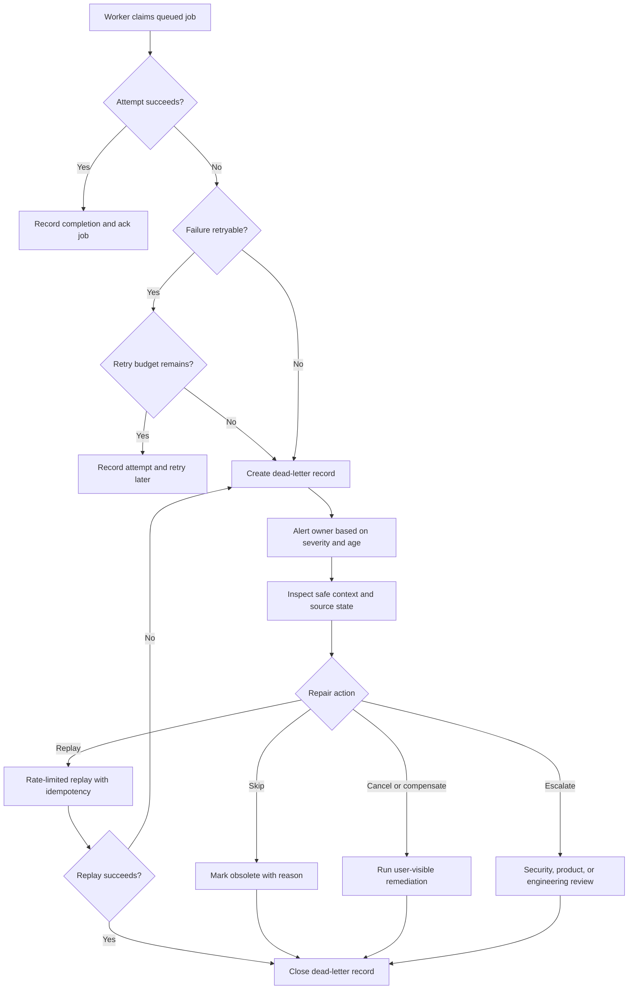

# Dead-Letter Queues

Dead-letter queues capture work that the system accepted but could not process
automatically. They are useful for poison messages, retry exhaustion,
inspection, replay, alerting, and remediation, but only when they are treated as
an owned repair path.

A dead-letter queue is not a garbage bin for inconvenient failures. It is a
holding area for work that needs a decision: fix and replay it, cancel it,
compensate for it, or escalate it.

## Purpose

Use this page to decide:

- which failures should enter a dead-letter queue;
- what context a dead-letter record must keep for inspection;
- when retry exhaustion should stop automatic processing;
- how operators replay or remediate failed work safely;
- which alerts prove dead letters are being reviewed;
- how to avoid turning hidden dead letters into data loss.

For queue basics, start with [Queues](queues.md). This page focuses on what
happens after automatic queue processing cannot finish safely.

## When This Matters

Dead-letter handling matters when:

- workers process durable jobs after a user request returns;
- a message may be invalid, malformed, expired, unauthorized, or impossible to
  apply;
- retries can waste capacity or repeat side effects;
- a dependency rejects a request permanently after the system accepted the work;
- operators need to inspect, repair, replay, cancel, or compensate failed jobs;
- compliance or support teams need evidence for accepted but incomplete work.

It is less useful when the work can simply fail synchronously, the system has no
safe replay path, or no team is willing to own review. A dead-letter queue
without ownership usually means the product has accepted work it cannot explain.

## Questions To Ask

- What message, job, event, or command can become dead-lettered?
- Which source-of-truth record proves the work was accepted?
- Which failures are retryable, and which are permanent?
- How many attempts are allowed before retry exhaustion?
- What is the maximum age for dead-lettered work before it violates a promise?
- What context can be stored without leaking secrets or unnecessary personal
  data?
- Can the message be replayed safely with the same idempotency key?
- What remediation choices exist besides replay?
- Who owns review, and what alert fires when review is late?
- When should a dead letter be deleted, archived, or retained for audit?

## Decision Guidance

### Classify Poison Messages

A poison message is work that repeatedly fails because of the message,
surrounding state, or handler logic rather than a short temporary outage.

Common poison causes:

- malformed payload that the worker cannot parse;
- schema version the worker does not understand;
- missing required source-of-truth record;
- impossible state transition;
- permission or tenant boundary violation;
- expired business window, such as a pickup reminder after the pickup ended;
- handler bug that fails for one shape of data;
- external provider rejection that will not succeed by waiting.

Do not rely only on "same message failed many times" as the definition. Some
temporary failures repeat for a while and should retry with backoff. Some
permanent failures should fail fast after one attempt.

Classify failure by safe error category:

| Error Category | Example | Usual Action | Owner Or First Action |
| --- | --- | --- | --- |
| Transient dependency | Provider timeout | Retry with backoff and jitter | Worker owner watches retry age |
| Rate limited | Provider asks client to slow down | Retry after hint, reduce concurrency | Worker owner tunes concurrency |
| Invalid message | Missing required field | Dead-letter for inspection or cancel | Producer owner fixes input path |
| Impossible state | Reservation already closed | Mark skipped or needs review | Workflow owner confirms skip is safe |
| Unauthorized | Tenant mismatch | Quarantine and alert security owner | Security owner investigates boundary issue |
| Handler bug | Worker crashes on one valid payload | Dead-letter after bounded attempts, fix code, replay | Worker owner patches handler |

The category should be safe to show to operators. Avoid storing raw exception
text if it can include tokens, payload secrets, or personal data.

### Stop Retry Exhaustion Explicitly

Retry exhaustion happens when a job has used its automatic retry budget. At that
point, the system should move to a named state rather than silently dropping the
work or retrying forever.

Define:

- maximum attempts;
- per-attempt timeout;
- backoff and jitter;
- total retry deadline;
- error categories that skip retries;
- state after exhaustion, such as `dead_lettered`, `needs_review`,
  `cancelled`, or `compensating`;
- user or operator visibility for the final state.

Example retry budget:

```text
Job type: send pickup reminder
Retryable: provider timeout, 5xx, temporary rate limit
Fail fast: invalid recipient, reservation cancelled, tenant mismatch
Attempts: 5 over 30 minutes
After exhaustion: dead_lettered with safe provider response class
```

Bounded retries protect workers and dependencies. The dead-letter queue protects
the product promise by making failed accepted work visible.

### Store Inspection Context

A useful dead-letter record tells an operator what happened without forcing them
to reconstruct the failure from unrelated logs.

Store:

- stable message ID and source-of-truth entity ID;
- job type, producer, worker, and owner team;
- idempotency key or dedupe key;
- attempt count and timestamps;
- first failure category and last failure category;
- safe error class and short safe message;
- payload schema version;
- correlation ID or trace ID;
- tenant or partition key when needed for routing;
- replay eligibility and remediation options;
- retention deadline for the dead-letter record.

Avoid storing:

- secrets, raw access tokens, private keys, or provider credentials;
- full personal data when an ID or redacted summary is enough;
- oversized payloads that make review slow or expensive;
- stack traces that expose internals to broad support tools.

If the original payload is needed for replay, store it in a protected location
with clear retention and access rules, then reference it from the dead-letter
record. Keep the source-of-truth entity as the canonical state; the replay
payload is evidence for reattempting work, not a replacement data store.

### Design Replay Before You Need It

Replay takes a dead-lettered message and attempts it again after the cause has
been fixed or approved.

Replay is safe when:

- the handler is idempotent;
- the source-of-truth state is rechecked before applying side effects;
- the original idempotency key is reused when it represents the same business
  action;
- a new idempotency key is used only when the business action is intentionally
  new;
- replay can be scoped by job type, tenant, entity, or time range;
- the replay action records who triggered it and why.

Replay is unsafe when:

- the worker sends emails, charges cards, or grants access without a send,
  charge, or grant record;
- the message is old enough that the business window is gone;
- the dead-letter reason was a security or tenant-boundary violation;
- the original request has been cancelled or superseded;
- operators cannot preview what replay will do.

Replay choices:

| Choice | Use When | Watch For |
| --- | --- | --- |
| Replay same message | The original business action is still valid | Duplicate side effects |
| Replay after patch | Handler bug is fixed and idempotency is present | Large batch can overload dependencies |
| Transform then replay | Schema changed but meaning is still valid | Manual transformation mistakes |
| Skip as obsolete | Work no longer matters | Need evidence that skip is safe |
| Cancel and compensate | Accepted work cannot complete | User communication and audit trail |

Replay should be rate limited. A thousand repaired messages can create a retry
storm if they are released all at once.

### Alert On Repair Risk

Alerting should focus on failed promises, not only raw dead-letter count.

Useful signals:

- new dead-letter count by job type and error category;
- oldest dead-letter age;
- dead-letter review SLA misses;
- retry exhaustion rate;
- replay success and replay failure count;
- repeated dead letters with the same fingerprint;
- dead letters for high-priority tenants or user-visible workflows;
- dead-letter storage approaching retention limits.

Example alert:

```text
Page the owning team when any payment-receipt job is dead-lettered for more
than 15 minutes or when more than 20 receipt jobs dead-letter in 10 minutes.
Create a ticket, not a page, for analytics enrichment dead letters older than
one business day.
```

Tool-library alert:

```text
Page member_notifications when pickup reminder dead letters are older than
30 minutes or when five reminders fail with the same provider_rejected_address
fingerprint in 15 minutes.
```

Alerts should include owner, runbook link, safe error category, sample message
IDs, oldest age, and recommended first action.

### Remediate, Do Not Just Replay

Replay is only one repair action. Good dead-letter handling gives operators a
small set of explicit decisions.

Common remediation actions:

- fix input data and replay;
- deploy a handler fix and replay affected messages;
- skip obsolete work with a reason;
- cancel a user-visible request and notify the user;
- compensate by issuing a refund, reversal, or replacement job;
- quarantine and escalate a security or tenant-isolation concern;
- create a product bug when the accepted workflow has no valid completion path.

Every remediation action should leave an audit trail:

```text
dead_letter_id=dlq_9812 action=replay approved_by=ops_oncall
reason="provider mapping fixed" replay_batch_id=rb_144
```

This trail helps future responders understand whether the system repaired work
or simply moved it out of sight.

## Dead-Letter Flow



The important boundary is after automatic handling ends. At that point, the
system needs an owner and a decision.

## Original Example

A neighborhood tool library sends pickup reminders after a reservation is
approved. The API commits the reservation and a notification job. A worker calls
the email provider.

Failure cases:

| Situation | Classification | Action |
| --- | --- | --- |
| Provider timeout | Transient | Retry with backoff and provider idempotency key |
| Provider rate limit | Transient with hint | Delay and reduce worker concurrency |
| Email address rejected | Permanent input issue | Dead-letter into `needs_review` |
| Reservation cancelled before reminder sends | Obsolete work | Skip and record reason |
| Worker crashes on one valid locale | Handler bug | Dead-letter after bounded attempts, fix, replay |

Dead-letter record:

```text
dead_letter_id: dlq_1042
job_type: pickup_reminder_email
reservation_id: res_8831
recipient_ref: borrower_551
idempotency_key: res_8831:pickup_reminder:borrower_551
attempts: 1
first_error_category: invalid_recipient
last_error_category: invalid_recipient
safe_error: provider_rejected_address
owner: member_notifications
replay_eligible: false until address is corrected
remediation_options: correct_recipient, cancel_notification, contact_member
```

The invalid-recipient case fails fast after one provider rejection. The retry
budget is for temporary failures such as provider timeouts and rate limits, not
for an address the provider has already rejected permanently.

Operator decision:

```text
Support confirms the borrower updated their email address. The operator marks
the dead letter replayable, keeps the original idempotency key because it is the
same reminder, and replays one message. The worker rechecks that the reservation
is still approved before sending.
```

This keeps the accepted reservation workflow visible without sending duplicate
or obsolete reminders.

## Trade-Offs

| Choice | Benefit | Cost Or Risk |
| --- | --- | --- |
| Dead-letter after bounded retries | Prevents infinite poison-message loops | Requires review ownership |
| Fail fast for permanent errors | Saves capacity and shortens repair time | Misclassification can stop recoverable work |
| Store rich context | Makes inspection faster | Can expose sensitive data if not redacted |
| Replay same message | Preserves original business action | Needs idempotency and state checks |
| Manual remediation | Handles ambiguous cases | Slower and needs audit trail |
| Alert on age and severity | Protects user promises | Poor thresholds can page too often |

## Common Mistakes

- Treating the dead-letter queue as a place where failures can be forgotten.
- Retrying every error until exhaustion instead of classifying permanent
  failures.
- Dead-lettering messages without source entity IDs or idempotency keys.
- Storing raw secrets or full sensitive payloads in dead-letter records.
- Replaying batches without rate limits or dependency protection.
- Replaying side effects without checking current source-of-truth state.
- Alerting only on count while old dead letters violate user promises.
- Deleting dead letters before remediation, audit, or retention requirements are
  satisfied.
- Letting one team produce jobs while no team owns dead-letter review.

## Checklist

Before relying on a dead-letter queue, verify:

- [ ] Poison-message categories are named.
- [ ] Retryable and non-retryable failures are classified.
- [ ] Maximum attempts, per-attempt timeout, backoff, jitter, and total retry
      deadline are defined.
- [ ] Retry exhaustion moves to an explicit state.
- [ ] Dead-letter records include message ID, source entity ID, owner, attempts,
      safe error category, timestamps, and idempotency key.
- [ ] Dead-letter records avoid secrets and unnecessary personal data.
- [ ] Operators can inspect dead letters without needing unrelated log access.
- [ ] Replay eligibility rules are explicit.
- [ ] Replay rechecks source-of-truth state and uses idempotency.
- [ ] Replay is rate limited and auditable.
- [ ] Remediation options include replay, skip, cancel, compensate, or escalate
      when appropriate.
- [ ] Alerts cover oldest age, count by job type, retry exhaustion rate, and
      review SLA misses.
- [ ] A named owner reviews dead letters within a defined time window.
- [ ] Retention and deletion rules are documented.

## Related Pages

- [Queues](queues.md)
- [Retries and backoff](retries-and-backoff.md)
- [Idempotency](idempotency.md)
- [Outbox pattern](outbox-pattern.md)
- [Background workers](../components/background-workers.md)
- [Queue component](../components/queue.md)
- [Runbooks](../operations/runbooks.md)
- [Observability basics](../operations/observability-basics.md)
- [Data retention](../data/data-retention.md)
