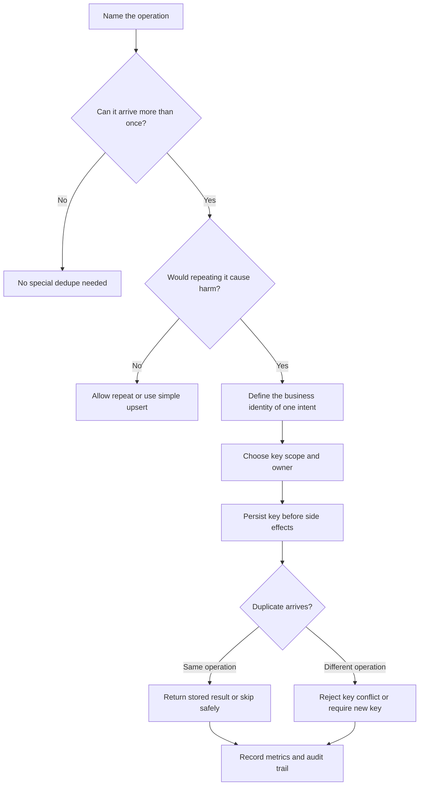

# Idempotency

Idempotency means the same operation can be applied more than once and still
produce the intended result once. It is the design tool that makes retries,
duplicate requests, duplicate events, and manual replay safe.

Do not treat idempotency as a transport feature. It is a product and data
modeling decision: the system must know which repeated attempt is the same
business action and which one is a new action.

## Purpose

Use this guide to answer:

- What makes two requests or events the same operation?
- Which command, event, or side effect needs a stable idempotency key?
- Where is the first result stored so a duplicate can return the same answer?
- Which duplicates should be ignored, merged, rejected, or replayed safely?
- Which side effects must happen at most once?
- How should payment-style workflows handle ambiguous provider results?

The goal is to make repeated attempts harmless without hiding real new work or
losing auditability.

## When This Matters

Idempotency matters when:

- clients retry after timeouts or connection resets;
- users double-click a submit button or refresh a confirmation page;
- queues redeliver jobs after worker crashes;
- pub/sub subscribers receive duplicate events;
- operators replay events or repair failed work;
- external providers return ambiguous results;
- duplicate side effects could charge money, reserve scarce capacity, or send
  repeated notifications.

It matters less for pure reads, but even reads may need request IDs for tracing
or pagination consistency.

## Questions To Ask

Start with the business operation:

- What is the user's intent?
- Can the user intentionally perform the same action twice?
- Which fields identify one intent instead of a new intent?
- How long should the system remember the idempotency decision?
- What response should a duplicate receive?

Then map the implementation boundary:

- Who creates the idempotency key: client, server, message producer, or event
  source?
- Where is the key stored?
- Is the key unique within a user, account, entity, workflow, or globally?
- Is the original response stored, or can it be rebuilt from authoritative
  state?
- Which side effects are guarded by the same key?
- What metrics show duplicate rate, key conflicts, and replay behavior?

## Decision Guidance

### Idempotency Keys

An idempotency key is a stable identifier for one intended operation. Repeating
the same operation with the same key should not create a second business result.

Good keys are tied to intent:

- `client_request_id` for one user command;
- `payment_attempt_id` for one attempt to authorize or capture money;
- `event_id` for one published fact;
- `job_id` for one background unit of work;
- a natural unique key such as `account_id + invoice_month` when that is the
  actual product rule.

Weak keys are tied only to transport details:

- timestamps rounded to seconds;
- random keys generated separately for every retry;
- request body hashes when harmless field ordering or metadata changes;
- user IDs alone when the user can perform several valid operations.

Choose the uniqueness scope deliberately. A key might be unique per user, per
account, per source system, per resource, or globally. The right scope depends
on the product rule being protected.

### Duplicate Requests

Duplicate requests happen when the same command reaches the system more than
once. The common causes are client retries, page refreshes, network timeouts,
mobile reconnects, and users submitting the same form repeatedly.

For command APIs:

- require a client-provided idempotency key for retryable creates or external
  side effects;
- store the key with request status, result, and relevant response fields;
- return the original result when the same key and same operation repeat;
- reject or flag a key if it is reused for a different operation;
- expire old keys only after the workflow can no longer retry safely.

For server-generated commands:

- create the key before calling an unreliable dependency;
- persist it before the first external attempt;
- reuse it on every retry;
- reconcile ambiguous outcomes before starting a new attempt with a new key.

The duplicate response should be boring. A repeated request should not surprise
the caller with a second reservation, second payment, or second notification.

### Duplicate Events

Duplicate events happen when a message broker redelivers, a producer retries
publication, a stream is replayed, or an operator backfills data. Consumers
should assume duplicate delivery unless the complete workflow proves otherwise.

Duplicate-safe event handling patterns:

- store processed-event markers atomically with the derived write, or use
  `pending` and `complete` states when one transaction cannot cover both;
- make derived writes upserts keyed by source entity and version;
- compare event version or timestamp before applying an update;
- dedupe side effects by a stable event ID when the producer guarantees one ID
  per business fact, or by source entity, transition/version, recipient, and
  action when producer retries could emit a second event ID for the same fact;
- make replay rebuild derived state without repeating irreversible side
  effects;
- treat event ID, source entity ID, and source version as part of the event
  contract.

For example, a `reservation.approved` event can update a calendar projection by
upserting `reservation_id` and `status_version`. The email subscriber may also
need a send record keyed by `reservation_id + status_version + recipient_id +
email_type` so producer retries that create a second event record do not send
another message.

### Side Effects

Side effects are actions that leave the source-of-truth database boundary:
email, SMS, webhooks, payment provider calls, file exports, search updates, and
external system changes.

Make side effects idempotent by recording intent and outcome:

- create a durable work item before attempting the side effect;
- give each side effect attempt a stable operation key;
- write a send, call, export, or delivery record;
- check that record before repeating the side effect;
- store provider IDs or response references for reconciliation;
- separate retryable temporary failure from permanent failure.

Some side effects are naturally safe to repeat, such as rebuilding a derived
search document by ID. Others are not, such as sending a customer-facing
notification or charging a card. The less reversible the side effect, the more
important it is to persist the idempotency boundary before the first attempt.

### Payment-Style Workflows

Payment-style workflows are any workflows where an external action is expensive,
hard to reverse, or ambiguous after a timeout. They include payments, refunds,
ticket issuance, shipment creation, entitlement grants, and other provider
calls that should not happen twice.

Design pressure:

- create one internal attempt entity before the provider call;
- use a stable idempotency key with the provider when supported;
- persist provider request and response identifiers;
- treat timeouts as ambiguous, not failed;
- reconcile ambiguous attempts before creating a new attempt;
- expose pending, succeeded, failed, and needs-review states;
- append audit records for each state transition and provider response;
- make retries reuse the same attempt key until the attempt reaches a terminal
  state.

Payment-style idempotency is not just "try again." It is a small state machine
that protects the user from duplicate charges or duplicate grants while still
letting the system recover from provider uncertainty.

### Result Storage

The system needs somewhere to remember the first result.

Common storage options:

| Storage | Use When | Watch For |
| --- | --- | --- |
| Idempotency table | Many APIs need request dedupe | Retention, key scope, response shape |
| Unique constraint | One product rule defines uniqueness | Clear conflict response |
| Attempt entity | External calls need lifecycle and reconciliation | State machine and audit trail |
| Processed event table | Event consumers need replay safety | Storage growth and cleanup |
| Derived upsert target | Rebuildable projections can overwrite by ID | Version checks for stale events |

For a user-facing command, storing the original response can be useful because a
duplicate can receive the same answer. For a background event, storing processed
event IDs or source versions may be enough.

### Retention And Scope

Idempotency keys cannot usually be stored forever without cost. Retention should
match the retry and replay window.

Ask:

- How long can clients retry the command?
- How long can queues redeliver the job?
- How far back can operators replay events?
- Would reusing an expired key create harm?
- Does the key contain sensitive data that should not be retained?

Prefer opaque keys over keys that embed personal or sensitive information. Keep
the stored payload small: enough to detect conflicts, return useful duplicate
responses, and audit decisions.

## Idempotency Decision Flow

## Trade-Offs

Idempotency trades storage and workflow discipline for safer retries.

- Client-provided keys make retries safer, but clients must reuse them
  correctly.
- Server-generated keys reduce client burden, but the server must persist them
  before external calls.
- Storing full responses simplifies duplicate replies, but increases retention
  and privacy concerns.
- Storing only keys and statuses is lighter, but duplicate responses may need
  to be rebuilt from source-of-truth state.
- Deduping by event ID protects replay, but consumers still need version checks
  when older events can arrive late.
- Strict key conflict detection catches client bugs, but can require clearer
  error handling.

Use the smallest idempotency mechanism that protects the side effect or
invariant that would be harmful to repeat.

## Common Mistakes

- Generating a new idempotency key for every retry.
- Treating a timeout as a safe failure instead of an ambiguous result.
- Deduping duplicate requests but forgetting downstream side effects.
- Storing a key after the provider call instead of before it.
- Reusing the same key for different operations.
- Making the key global when the product rule is scoped to one user or account,
  or scoped too narrowly when duplicates can cross that boundary.
- Expiring keys before clients, queues, or operators can finish retries.
- Assuming duplicate event delivery cannot happen.
- Making replay update projections safely while still resending notifications.
- Hiding idempotency conflicts from metrics and support tools.

## Examples

### Duplicate Create Request

A volunteer library lets members reserve a study room. The mobile app may retry
when the network drops after submission.

Design:

| Item | Decision |
| --- | --- |
| Operation | Create one room reservation request |
| Key owner | Mobile client |
| Key scope | Member account |
| Stored result | Reservation request ID, status, and submitted timestamp |
| Duplicate behavior | Return the existing reservation request response |
| Key conflict | Reject if the same key is reused for a different room or time window |

If the first request succeeds but the response is lost, the retry with the same
key returns the same reservation request. If the member intentionally wants a
second room later, the app must create a new key.

### Duplicate Event

A permit system publishes `permit.approved` after a reviewer approves an event
permit. Email, calendar, and audit subscribers may receive the event more than
once during replay or broker redelivery.

Design:

| Subscriber | Idempotency Rule |
| --- | --- |
| Email | Send once per `permit_id + status_version + recipient_id + email_type` |
| Calendar projection | Upsert by `permit_id` and ignore stale `status_version` |
| Audit enrichment | Append once per `permit_id + status_version + enrichment_type` |

The event can be replayed to repair the calendar without sending another email,
because the email side effect has its own dedupe record.

### Payment-Style Attempt

A community market authorizes stall fees after an organizer confirms a vendor's
booth. A later capture may happen when the booth is finalized. The authorization
provider call may time out after the provider received the request.

Design:

| State | Meaning |
| --- | --- |
| `pending` | Internal payment attempt exists, provider result unknown |
| `authorized` | Provider confirmed the authorization |
| `failed` | Provider returned a permanent failure |
| `needs_review` | Timeout or mismatch requires reconciliation |

The system creates `payment_attempt_id` before calling the provider and uses it
as the provider idempotency key. If the first call times out, retries reuse the
same key or reconcile the provider result. The system does not create a second
payment attempt just because the first response was missing.

## Checklist

Before relying on idempotency, confirm:

- The business identity of one operation is clear.
- Idempotency keys are stable across retries.
- Key ownership and uniqueness scope are defined.
- Duplicate requests return the same result or a clear conflict.
- Duplicate events are safe for replay and redelivery.
- Side effects have their own dedupe records when needed.
- Provider or payment-style calls persist an attempt before the first call.
- Ambiguous timeouts lead to retry with the same key or reconciliation.
- Key retention matches client retry, queue redelivery, and replay windows.
- Metrics expose duplicate rate, key conflicts, retry outcomes, and exhausted
  or needs-review states.

## Related Pages

- [Communication overview](./)
- [Retries and backoff](retries-and-backoff.md)
- [Pub/sub](pub-sub.md)
- [Synchronous vs asynchronous processing](sync-vs-async.md)
- [Saga pattern](saga-pattern.md)
- [Transactions](../data/transactions.md)
- [Identifying entities](../data/identifying-entities.md)
- [Read and write patterns](../data/read-write-patterns.md)
- [Schema evolution](../data/schema-evolution.md)
- [Design review checklist](../method/design-review-checklist.md)
