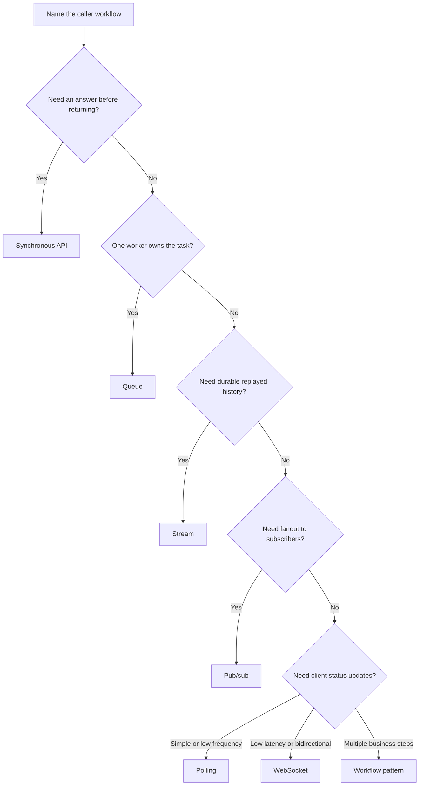

# Communication

Communication patterns decide how parts of a system ask for work, report
events, move data, and coordinate long-running flows. A good choice starts with
the user workflow, delay tolerance, failure mode, and ownership boundary.

Use this section when deciding whether a system should call another service
directly, enqueue work, publish events, stream facts, poll for updates, hold a
live connection, or coordinate a multi-step workflow.

## Purpose

Communication choices answer questions such as:

- Does the user need an answer before the request returns?
- Can the work happen later?
- Who owns retry behavior when another component is unavailable?
- Does one producer need one consumer, many consumers, or an unknown set of
  future consumers?
- Does the system need current state, event history, or live updates?
- Which failures should block the user, retry in the background, or trigger
  compensation?

The goal is to choose the simplest communication style that satisfies the
workflow without hiding reliability or operability costs.

## When This Matters

Communication design matters when:

- a user request crosses service, team, or trust boundaries;
- a slow side effect should not block the user;
- duplicate messages or duplicate requests could cause harm;
- events need fanout to several consumers;
- consumers need replay or ordered processing;
- clients need live status updates;
- a business workflow has several steps and partial failure paths.

## Questions To Ask

Start with the workflow:

- What is the user or caller trying to accomplish?
- What must be true before success is returned?
- What can happen after success is returned?
- Who owns the source of truth?
- What happens if the receiver is slow, unavailable, or returns an ambiguous
  result?
- Can the command, message, or event be processed more than once safely?

Then choose the communication shape:

- Is this request-response, background work, event fanout, durable history,
  polling, live push, or workflow coordination?
- What ordering, freshness, and delivery expectations are real requirements?
- Which path needs backpressure, timeouts, retries, dead-letter handling, or
  compensation?

## Pattern Map

| Pattern | Use When | Watch For |
| --- | --- | --- |
| Synchronous APIs | The caller needs an immediate decision or data read | Timeouts, cascading failures, version compatibility |
| Queues | Work can happen later and each job has an owner | Retries, visibility timeout, poison jobs, backpressure |
| Streams | Consumers need durable event history or replay | Retention, partitioning, ordering, consumer lag |
| Pub/sub | One event should fan out to loosely coupled consumers | Event schema drift, duplicate delivery, hidden consumers |
| Polling | Simplicity beats live connection cost | Stale results, wasted requests, thundering herds |
| WebSockets | Clients need low-latency bidirectional updates | Connection state, fanout, reconnects, backpressure |
| Workflows | A business process spans several steps or services | Partial failure, compensation, observability, ownership |

## Decision Guidance

### Synchronous APIs

Use a synchronous API when the caller needs a response now. Common examples are
reading current state, validating an action, reserving scarce capacity, or
calling an internal service that owns an immediate decision.

Design pressure:

- set timeouts and response contracts;
- avoid long chains of blocking calls;
- make failure states explicit;
- keep compatibility across caller and receiver versions;
- return only after the source-of-truth decision is durable when correctness
  depends on it.

Synchronous calls are simple to reason about, but they couple caller latency and
availability to the receiver.

### Queues

Use a queue when one unit of work can be processed later by one worker or worker
pool. Common examples are sending notifications, generating thumbnails, charging
an eventually processed invoice, or importing a file.

Design pressure:

- define retry limits and backoff;
- make jobs idempotent;
- handle worker crashes and visibility timeouts;
- measure queue depth and age;
- route poison jobs to inspection and repair.

Queues decouple request latency from background work, but they introduce delayed
completion and operational responsibility for stuck jobs.

### Streams

Use a stream when the system needs a durable sequence of events that multiple
consumers can read, replay, or process at their own pace. Common examples are
status-change logs, activity events, telemetry, and data movement to reporting
views.

Design pressure:

- define event schema and ownership;
- choose retention and replay expectations;
- partition by a key that matches ordering needs;
- monitor consumer lag;
- avoid treating stream delivery as exactly-once business correctness.

Streams are useful for history and replay, but they require discipline around
event contracts and consumer behavior.

### Pub/Sub

Use pub/sub when one producer publishes an event and multiple loosely coupled
subscribers may react. Common examples are "reservation approved," "profile
updated," or "document exported" notifications.

Design pressure:

- publish facts, not commands disguised as events;
- version event schemas;
- expect duplicate or out-of-order delivery unless the system proves otherwise;
- decide whether each subscriber failure affects the producer;
- track subscriptions so important consumers are not invisible.

Pub/sub reduces direct coupling, but it can hide dependencies if events become a
silent control plane.

### Polling

Use polling when clients need updates but a live connection is not justified.
Common examples are checking report generation status, refreshable admin lists,
or low-frequency job progress.

Design pressure:

- choose a polling interval that balances freshness and load;
- return stable status and last-updated metadata;
- back off when the server is busy;
- stop polling after terminal states;
- avoid synchronized client spikes.

Polling is often the simplest correct option for version 1.

### WebSockets

Use WebSockets when clients need low-latency or bidirectional updates and the
system can operate long-lived connections. Common examples are chat, live
collaboration, multiplayer presence, and rapidly changing dashboards.

Design pressure:

- manage reconnects and resumed state;
- authenticate and authorize long-lived sessions;
- handle fanout to many connected clients;
- apply backpressure when clients are slow;
- define what happens when messages are missed while offline.

WebSockets improve interactivity, but they add stateful connection operations.

### Workflows

Use workflow patterns when a business process has several steps, each with its
own failure modes. Common examples are payment capture, order fulfillment,
account onboarding, and approval flows.

Design pressure:

- name the state machine;
- decide whether one orchestrator coordinates steps or services react through
  choreography;
- define compensating actions for partial failure;
- make each step idempotent;
- expose progress, stuck states, and repair actions to operators.

Workflows are not just "more async." They are explicit models for progress,
failure, and recovery across steps.

## Trade-Offs

Communication patterns trade simplicity, latency, coupling, and reliability.

- Synchronous APIs are direct, but caller availability depends on receiver
  availability.
- Queues smooth spikes and protect user latency, but hide completion behind
  background processing.
- Streams enable replay and multiple consumers, but event design becomes a
  contract.
- Pub/sub lowers producer awareness, but can make dependencies hard to see.
- Polling is easy to operate, but can waste requests or show stale state.
- WebSockets reduce update latency, but require connection management.
- Workflows make partial failure explicit, but add state and operational
  tooling.

Choose based on the failure mode the workflow can tolerate.

## Common Mistakes

- Making every service call synchronous because it is easy to implement first.
- Using a queue without idempotency, retry limits, or dead-letter handling.
- Publishing events before the source-of-truth write is durable.
- Treating pub/sub as a replacement for clear ownership.
- Choosing WebSockets for low-frequency status updates that polling could
  handle.
- Using streams when no one needs replay or ordered history.
- Hiding a multi-step business process across unrelated callbacks.
- Ignoring backpressure until a slow receiver becomes an incident.

## Example

A neighborhood permit system lets residents apply for event permits, reviewers
approve them, and organizers receive updates.

Communication choices:

| Workflow | Pattern | Reason |
| --- | --- | --- |
| Resident submits permit application | Synchronous API | The user needs an accepted/rejected submission response |
| Virus scan attached documents | Queue | Slow background work should not block submission |
| Permit status history | Stream | Review status changes may feed audit, analytics, and notifications |
| Notify email and SMS services | Pub/sub | Several independent subscribers react to approved permits |
| Application status page | Polling | A simple page can refresh every few seconds while review is pending |
| Reviewer collaboration room | WebSocket | Reviewers need low-latency comments and presence |
| Approval with payment, insurance check, and final notification | Workflow | Several steps can fail and need visible recovery |

Version 1 may start with synchronous APIs, a queue for document scanning, and
polling for status. Streams, pub/sub fanout, and WebSockets become justified
when replay, multiple independent consumers, or live collaboration become real
requirements.

## Communication Pages

Current pages:

- [Communication overview](./)

Planned pages:

- `docs/communication/sync-vs-async.md`
- `docs/communication/rest-vs-grpc.md`
- `docs/communication/polling-vs-websockets-vs-sse.md`
- `docs/communication/queues.md`
- `docs/communication/streams.md`
- `docs/communication/pub-sub.md`
- `docs/communication/retries-and-backoff.md`
- `docs/communication/idempotency.md`
- `docs/communication/dead-letter-queues.md`
- `docs/communication/outbox-pattern.md`
- `docs/communication/saga-pattern.md`
- `docs/communication/workflow-orchestration-vs-choreography.md`

These paths become linked pages as their tickets are completed.

## Checklist

Before choosing a communication pattern, confirm:

- The caller workflow and required response are named.
- User-visible work is separated from background work.
- Delay tolerance and freshness expectations are explicit.
- Source-of-truth writes happen before derived events or side effects.
- Retry, timeout, and duplicate handling are defined.
- Ordering and replay needs are real requirements, not assumptions.
- Backpressure behavior is visible to operators.
- Stuck work has a repair path.
- Version 1 uses the simplest pattern that satisfies the workflow.

## Related Pages

- [System design process](../method/system-design-process.md)
- [Requirement discovery](../method/requirement-discovery.md)
- [Functional vs non-functional requirements](../method/functional-vs-nonfunctional-requirements.md)
- [Trade-off vocabulary](../method/tradeoff-vocabulary.md)
- [Data](../data/)
- [Reliability](../reliability/)
- [Operations](../operations/)
- [Glossary](../glossary.md)
- [Documentation index](../)
