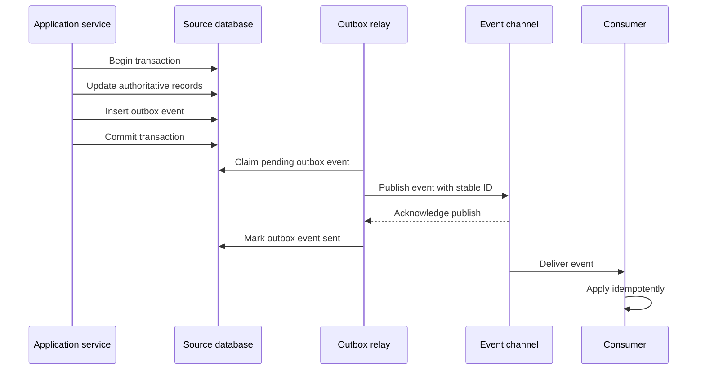

# Outbox Pattern

The transactional outbox pattern records a source-of-truth change and the event
or message that describes it in the same database transaction. A separate relay
worker later publishes the outbox record to a broker, webhook system, or other
consumer-facing channel.

Use an outbox when a database update must not be separated from the event that
other systems rely on. The pattern reduces the chance of "state changed but no
event was published" without pretending that event delivery is exactly once.

## Purpose

Use this guide to answer:

- Which database change creates an event?
- What happens if the database commit succeeds but event publication fails?
- What happens if event publication succeeds but the relay crashes before
  marking the outbox row sent?
- Which worker owns publishing and retrying outbox records?
- How will consumers handle duplicates?
- What ordering does the workflow actually need?

The goal is to keep source-of-truth writes and event intent consistent while
making publication retryable and observable.

## When This Matters

The outbox pattern matters when:

- a committed write must trigger downstream processing;
- losing an event would leave search, notifications, analytics, or other
  projections stale;
- publishing directly inside a request path would couple user success to a
  broker or provider;
- a broker publish can fail after the database commit;
- downstream consumers can tolerate duplicate events but not missing events;
- operators need a place to inspect, retry, pause, or replay publication.

It matters less when the side effect is optional best effort, or when a single
component owns both the write and the derived read model without asynchronous
publication.

## Questions To Ask

Start with the source-of-truth change:

- What entity changed?
- Which committed fact should be published?
- Is the event a fact that happened, not a command disguised as an event?
- Which transaction already protects the source-of-truth invariant?
- Which event fields come from committed state?

Then design the outbox:

- Which table or collection stores outbox records?
- Is the outbox record created in the same transaction as the authoritative
  change?
- Which relay worker claims, publishes, retries, and marks records?
- What idempotency key will consumers use?
- What ordering is required per entity, account, or partition?
- How long are sent records retained for audit or replay?

## Decision Guidance

### Database And Event Consistency

The core problem is the gap between two systems: the database and the event
channel.

Without an outbox, a service may:

1. commit a database change;
2. try to publish an event;
3. crash or lose network access before the publish succeeds.

The database now says the fact happened, but consumers never hear about it.
Reversing the order is not better: publishing before commit can tell consumers
about a fact that later rolls back.

An outbox narrows the gap by storing event intent with the source-of-truth
change:

```text
transaction:
  update authoritative records
  insert outbox event record
commit
```

After commit, the relay can publish from the outbox until it succeeds or reaches
a visible failure state. The outbox record is durable evidence that the event
must be published.

### Transactional Outbox

A transactional outbox record should contain enough information to publish,
dedupe, trace, and inspect the event.

Typical fields:

| Field | Purpose |
| --- | --- |
| `outbox_id` | stable event identity and tracing |
| `aggregate_type` | source entity type, such as `reservation` |
| `aggregate_id` | source entity ID |
| `aggregate_version` | ordering or stale-event detection within the entity |
| `sequence_in_partition` | optional relay order when a real sequencer exists |
| `event_type` | fact name, such as `reservation.approved` |
| `payload` | event data derived from committed state |
| `status` | pending, publishing, sent, failed, or needs review |
| `attempt_count` | retry and alerting context |
| `next_attempt_at` | backoff control |
| `created_at` and `published_at` | audit and lag measurement |

Keep the payload focused on the event contract. Do not copy sensitive data into
outbox records just because it is available in the transaction.

### Relay Workers

A relay worker owns moving outbox records from durable storage to the event
channel.

Relay responsibilities:

- claim a batch of pending records without two workers publishing the same row
  at the same time when avoidable;
- publish each event to the target channel;
- mark records sent after the publish call succeeds;
- retry temporary failures with backoff;
- expose stuck records and repeated failures;
- preserve the ordering that the workflow requires;
- leave enough audit data to debug what was published and when.

Relay workers must be safe to restart. If a relay publishes an event and crashes
before marking the outbox row sent, it may publish the same event again after
restart. That is expected. Consumers still need idempotency.

### Duplicates

The outbox pattern is about reliable intent and retryable publication. It does
not guarantee exactly-once delivery to every consumer.

Duplicate sources include:

- relay crash after publish before marking sent;
- relay timeout where the broker accepted the event but the relay did not see
  the acknowledgment;
- manual replay of outbox records;
- broker redelivery;
- consumer retry after processing partially succeeds.

Duplicate-safe design:

- give each outbox event a stable ID;
- include source entity ID and source version;
- make consumers idempotent by event ID when the ID is stable;
- use source entity, version, recipient, and action keys for side effects where
  producer retries could create multiple event records for one business fact;
- make projections upsert or compare source versions;
- store processed markers atomically with derived writes when possible;
- treat replay as a normal operational action, not an exceptional path.

If a duplicate would harm the product, fix the consumer's idempotency boundary.
Do not assume the outbox removes duplicate delivery.

### Ordering Limits

Outbox ordering is limited. The pattern can make a committed event available for
publication, but it does not automatically impose a global order across all
entities, partitions, services, and consumers.

Usually reasonable:

- order events for one entity by `aggregate_version`;
- publish records from one partition by an explicit sequence only when the
  system has a real sequencer or lease discipline for that partition;
- let consumers ignore stale versions;
- rebuild derived views from source state when ordering was violated.

Usually risky:

- relying on global order across unrelated entities;
- assuming two relay workers will publish in exact commit order without
  coordination;
- treating insert timestamps, generated IDs, or relay pickup time as reliable
  commit order under concurrent transactions;
- assuming broker partitions preserve order for keys that are not aligned with
  the source entity;
- mixing manual replay with live events without version checks;
- treating sent timestamp as the business ordering source.

State the ordering requirement in product terms. "A reservation status
projection must not move from approved back to submitted" is a useful
requirement. "All events are ordered" is not.

### Failure Handling

Outbox failure states should be visible and repairable.

Common states:

| State | Meaning | Operator Action |
| --- | --- | --- |
| `pending` | Ready to publish | Monitor age |
| `publishing` | Claimed by relay | Detect stale claims |
| `sent` | Publish call succeeded | Retain or archive |
| `failed` | Temporary attempts exhausted | Inspect and retry |
| `needs_review` | Payload, schema, or permissions issue | Repair data or mark skipped with reason |

A relay that crashes after claiming a row but before publishing should not leave
that row stuck forever. Use a lease, claim timeout, or heartbeat so another
relay can return stale `publishing` records to `pending` and try again.

Important metrics:

- pending outbox count;
- oldest pending record age;
- relay publish rate;
- publish failure rate;
- retry exhaustion count;
- duplicate publish count when detectable;
- consumer lag or projection freshness downstream.

An outbox that no one monitors is just a quieter failure mode.

## Outbox Flow



If the relay crashes after publishing but before marking the row sent, it may
publish the same event again. The consumer's idempotency rule handles the
duplicate.

## Trade-Offs

The outbox pattern trades lower event-loss risk for more local operational
state.

- It keeps database writes and event intent atomic, but adds an outbox table and
  relay process.
- It removes broker availability from the request's critical path, but events
  publish after commit rather than during the request.
- It makes replay and inspection easier, but sent records need retention and
  cleanup policy.
- It reduces missing-event risk, but does not remove duplicate delivery.
- It can preserve per-entity order when designed for it, but global ordering is
  still expensive and often unnecessary.
- It gives operators a repair point, but that repair point needs metrics,
  alerts, and runbooks.

Use an outbox when missing the event is worse than accepting delayed or
duplicate publication.

## Common Mistakes

- Publishing the event before the database transaction commits.
- Writing the outbox record after commit instead of inside the same
  transaction.
- Treating the outbox as exactly-once delivery.
- Forgetting relay ownership, retry limits, backoff, and stuck-claim handling.
- Omitting source entity ID or version from the event.
- Relying on global ordering when per-entity ordering is all the workflow needs.
- Putting sensitive or unnecessary source data into the payload.
- Deleting sent outbox records before audit, replay, or support needs are
  satisfied.
- Monitoring broker health but not outbox age.

## Example

A community equipment library lets staff approve equipment reservations. When a
reservation is approved, the source system must update the reservation, publish
an approval event, notify the member, update a calendar projection, and feed a
weekly utilization report.

Source transaction:

```text
transaction:
  check equipment availability
  set reservation.status = approved
  increment reservation.status_version
  append reservation status history
  insert outbox event reservation.approved
commit
```

Outbox event:

| Field | Example |
| --- | --- |
| `outbox_id` | `evt_approval_9821` |
| `aggregate_type` | `reservation` |
| `aggregate_id` | `res_742` |
| `aggregate_version` | `4` |
| `event_type` | `reservation.approved` |
| `payload` | reservation ID, member ID, equipment ID, approved timestamp |
| `status` | `pending` |

Relay behavior:

- claim pending reservation events in small batches;
- publish them keyed by reservation ID when per-reservation ordering matters;
- retry temporary broker failures with capped backoff and jitter;
- mark sent only after publish acknowledgement;
- alert if pending age exceeds the notification freshness target.

Consumer behavior:

- email sends once per `reservation_id + status_version + recipient_id +
  email_type`;
- calendar projection upserts by reservation ID and ignores older versions;
- reporting appends facts by `outbox_id`, with repair from reservation history if
  needed.

If the relay publishes `reservation.approved` and crashes before marking the
outbox row sent, it may publish the event again after restart. The email,
calendar, and reporting consumers handle the duplicate without rolling back the
approved reservation.

## Checklist

Before using the outbox pattern, confirm:

- The source-of-truth write and outbox insert happen in the same transaction.
- The event is a committed fact, not a command.
- Outbox records include stable IDs, source entity IDs, versions, event type,
  payload, status, attempts, and timestamps.
- A relay worker owns claiming, publishing, retries, backoff, and sent marking.
- Duplicate publication is expected and consumers are idempotent.
- Ordering needs are scoped, usually per entity or partition.
- Stale or out-of-order events can be ignored, reconciled, or replayed safely.
- Pending age, relay failures, retry exhaustion, and downstream lag are
  observable.
- Sent-record retention and cleanup match audit and replay needs.
- Version 1 has a clear reason why missing an event would be worse than delayed
  publication.

## Related Pages

- [Communication overview](./)
- [Pub/sub](pub-sub.md)
- [Idempotency](idempotency.md)
- [Retries and backoff](retries-and-backoff.md)
- [Synchronous vs asynchronous processing](sync-vs-async.md)
- [Transactions](../data/transactions.md)
- [Read and write patterns](../data/read-write-patterns.md)
- [Operational vs analytical data](../data/operational-vs-analytical-data.md)
- [Design review checklist](../method/design-review-checklist.md)
