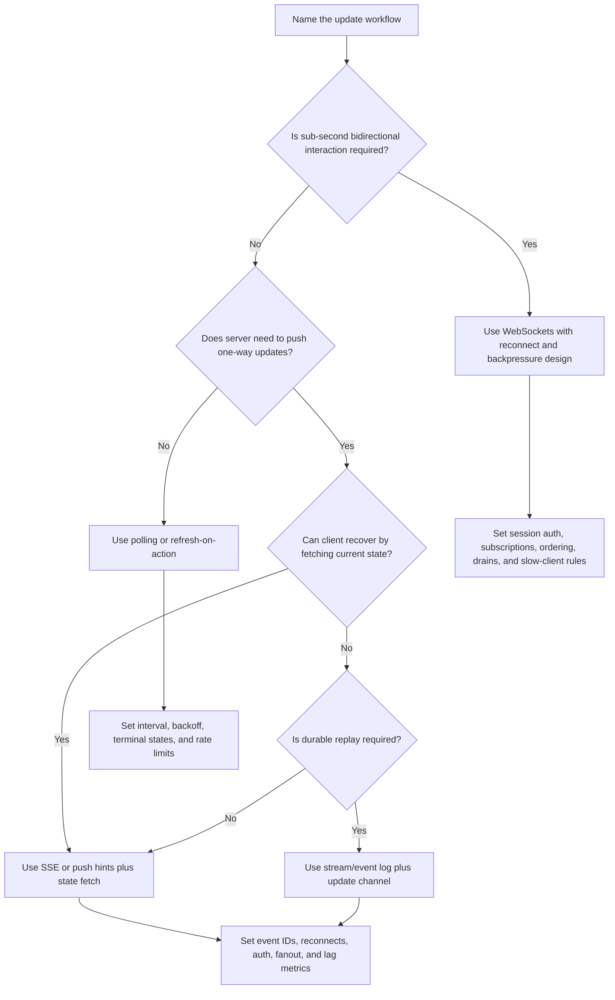

# Polling Vs WebSockets Vs SSE

Polling, WebSockets, and server-sent events (SSE) are ways to keep clients
updated after the first request. The right choice depends on how fresh updates
must be, whether the client needs to send messages back, how many clients are
connected, and what delivery guarantee the product actually needs.

Start with the simplest strategy that satisfies the workflow. Many systems can
use polling for version 1 and move to SSE or WebSockets only when measured
freshness, fanout, or interaction requirements justify long-lived connections.

## Purpose

Use this page to decide:

- whether updates are truly real time or just periodically fresh;
- whether clients need one-way server updates or bidirectional messaging;
- whether connection cost and fanout are acceptable;
- what delivery expectations apply when clients disconnect;
- how to keep version 1 simple without hiding update failures.

The goal is to match the update channel to the user experience and operating
cost.

## When This Matters

This matters when:

- a user watches job, export, payment, delivery, moderation, or review status;
- many clients need to see changing shared state;
- users expect low-latency collaborative or conversational updates;
- the system may fan out one event to many connected clients;
- missed updates need replay, catch-up, or a clear refresh path;
- mobile networks, browser tabs, and reconnects are part of normal operation.

It matters less when the user only needs fresh data after a page reload or the
workflow can show an ordinary "check back later" state.

## Questions To Ask

- How fresh must the client view be: seconds, sub-second, or best effort?
- Does the client need to send messages on the same channel?
- How many concurrent clients may be connected?
- Does one event need to fan out to many clients?
- What happens when a client disconnects or sleeps?
- Can the client recover by fetching current state?
- Are updates commands, facts, progress states, or hints to refresh?
- What backpressure protects the server and slow clients?
- Which metrics show connection count, delivery lag, reconnects, and dropped
  messages?

## Decision Guidance

### Polling

Polling means the client asks the server for current state on an interval or
after user action.

Use polling when:

- updates can be seconds or minutes stale;
- the workflow has clear terminal states;
- the client can fetch current state cheaply;
- version 1 needs simple operations;
- missed updates can be recovered by the next request.

Common examples:

- report generation status;
- import progress;
- admin review queue refresh;
- payment settlement status when the user can wait;
- delivery ETA refresh every few seconds or minutes.

Trade-offs:

- Good: simplest to implement, debug, cache, rate limit, and scale at first.
- Good: clients recover naturally because each request fetches current state.
- Cost: unnecessary requests when nothing changes.
- Cost: synchronized clients can create spikes.
- Cost: not suitable for low-latency bidirectional interaction.

Design details:

- use adaptive intervals or backoff;
- stop polling after terminal states;
- return `updated_at`, status version, or ETag-like information;
- protect expensive status endpoints with caching or rate limits;
- avoid polling every second for workflows that tolerate longer delays.

### SSE

Server-sent events keep one HTTP connection open so the server can push a stream
of events to the client. SSE is one-way: server to client.

Use SSE when:

- the server needs to push updates without client messages on the same channel;
- updates are text/event-style notifications or progress states;
- browser support and simple HTTP operations are useful;
- reconnect and last-event behavior are manageable;
- clients can recover missed state with an event ID or a normal fetch.

Common examples:

- job progress updates;
- dashboard status notifications;
- moderation queue changes;
- deployment or workflow progress logs;
- live read-only event feeds.

Trade-offs:

- Good: simpler than WebSockets for one-way server updates.
- Good: works with ordinary HTTP-style authorization and many debugging tools.
- Cost: still consumes long-lived connections.
- Cost: server fanout and reconnect behavior need design.
- Cost: not a fit when clients need frequent messages to the server on the same
  channel.

Design details:

- include event IDs when clients need catch-up;
- define reconnect and replay windows;
- send heartbeats if intermediaries close idle connections;
- authorize subscriptions by user, tenant, topic, and resource;
- cap fanout and disconnect slow clients when needed.

### WebSockets

WebSockets keep a bidirectional connection open between client and server. They
fit interactive systems where both sides send messages frequently or where
latency is central to the product experience.

Use WebSockets when:

- clients and server exchange low-latency messages in both directions;
- presence, chat, collaboration, multiplayer, or live editing is core;
- the system can operate connection state;
- missed messages, reconnects, and backpressure are designed explicitly.

Common examples:

- chat and typing indicators;
- collaborative document editing;
- live multiplayer game state;
- interactive support sessions;
- real-time operations consoles where users send commands and receive updates.

Trade-offs:

- Good: low-latency bidirectional interaction.
- Good: can reduce request overhead for frequent messages.
- Cost: stateful connection operations, routing, and deploy draining.
- Cost: fanout can become expensive when many clients subscribe to the same
  topic.
- Cost: missed-message recovery is not automatic.
- Cost: slow clients need backpressure or disconnect rules.

Design details:

- authenticate connection setup and revalidate long sessions when needed;
- authorize each subscription or command;
- define reconnect, resume token, and missed-message behavior;
- use heartbeats and idle timeouts;
- track connection count, send queue size, delivery lag, and dropped messages;
- drain connections during deploys.

## Fanout And Connection Cost

Long-lived connections change the scaling problem. A request/response endpoint
mostly pays when a client asks. SSE and WebSockets also pay for open
connections, subscription state, heartbeat traffic, and fanout.

Fanout questions:

- How many clients subscribe to one topic?
- Does one update go to one user, one tenant, one region, or everyone?
- Can updates be coalesced?
- Can clients fetch current state after a hint instead of receiving full data?
- What happens when a subscriber is slow?

Connection-cost questions:

- How many concurrent connections per node are expected?
- How are connections distributed during deploys and failover?
- What load balancer or gateway behavior affects long-lived connections?
- How are mobile sleep, tab suspension, and reconnect storms handled?

For high fanout, consider sending small "state changed" hints and letting
clients fetch current state. This can be simpler than delivering every detailed
event to every client.

## Delivery Expectations

Be precise about delivery promises. Real-time channels usually do not mean every
client receives every event exactly once.

Common promises:

| Promise | Fit | Design Need |
| --- | --- | --- |
| Best-effort refresh | Client can recover with next fetch | Polling or hint events |
| At-least-current state | Client eventually sees latest state | Versioned state endpoint and refresh |
| Ordered per topic | Client sees topic updates in order | Sequence numbers and replay window |
| Durable event history | Client can replay missed events | Stream or event log behind the update channel |
| Bidirectional session | Client and server both send messages | WebSocket protocol and reconnect rules |

If the product requires durable replay, the update channel alone is not enough.
Back it with an authoritative state store, event log, or stream and define how
clients catch up after disconnects.

## Decision Flow

## Original Examples

### Export Status

A staff user requests a monthly compliance export. The export usually finishes
in two minutes.

Good version 1:

- `POST /exports` creates the request and returns `export_id`;
- the browser polls `GET /exports/{export_id}` every 5 to 10 seconds;
- polling stops when status is `ready`, `failed`, or `expired`;
- the response includes `updated_at`, progress state, and retryable error
  information.

Why not WebSockets? The user does not need sub-second updates or two-way
messages. Polling is simpler and recovers from tab sleep naturally.

### Dispatch Board

Dispatchers watch incoming pickup requests. New requests should appear quickly,
but dispatchers can click into current state if an update is missed.

Reasonable approach:

- use SSE to push "request changed" events to authorized dispatchers;
- include an event ID and request ID;
- when the client receives an event, fetch current request details;
- if the SSE connection drops, reconnect and refresh the board.

Why not polling only? Polling every few seconds across many dispatchers may be
wasteful. Why not WebSockets? Dispatchers mostly receive updates; their commands
can remain normal REST requests.

### Chat

Residents and support agents exchange messages in a live support session.

Reasonable approach:

- use WebSockets for message send, delivery acknowledgements, typing state, and
  presence;
- store messages durably before acknowledging delivery;
- use sequence numbers or message IDs for resume;
- fetch missed messages after reconnect;
- disconnect or slow down clients with growing send queues.

Why not SSE? The client needs to send frequent messages on the same live
session. Why not polling? Polling would add latency and waste requests for a
conversation.

## Trade-Offs

| Choice | Benefit | Cost |
| --- | --- | --- |
| Polling | Simple, inspectable, naturally recovers current state | Wasted requests and stale views |
| SSE | Simple one-way push over HTTP-style connection | Long-lived connection and replay design |
| WebSockets | Low-latency bidirectional messaging | Stateful operations, backpressure, reconnect complexity |
| Push hint plus fetch | Lower event payload complexity | Extra read after each hint |
| Durable stream behind updates | Replay and stronger delivery | More storage, retention, and consumer-lag operations |

## Common Mistakes

- Using WebSockets because the page feels real time but only needs refresh.
- Polling too frequently without backoff or terminal states.
- Treating SSE or WebSockets as durable queues.
- Sending full sensitive payloads to every subscriber instead of fetching with
  authorization.
- Ignoring reconnect storms after deploys or network blips.
- Forgetting slow-client backpressure.
- Letting fanout grow without topic, tenant, and connection metrics.

## Checklist

Before choosing an update strategy, verify:

- [ ] The required freshness window is named.
- [ ] The client direction is clear: pull, one-way push, or bidirectional.
- [ ] Polling intervals, backoff, and terminal states are defined if polling is
      used.
- [ ] SSE subscriptions include authorization, event IDs, reconnect behavior,
      and replay or refresh behavior.
- [ ] WebSocket sessions include authentication, authorization, backpressure,
      reconnect, resume, and deploy-drain behavior.
- [ ] Fanout and connection-count limits are estimated.
- [ ] Delivery expectations are explicit and do not imply exactly-once delivery
      unless a durable source supports it.
- [ ] Metrics cover active connections, reconnects, delivery lag, dropped
      messages, slow clients, and polling load.

## Related Pages

- [API layer](../components/api-layer.md)
- [Communication overview](./)
- [REST vs gRPC](rest-vs-grpc.md)
- [Synchronous vs asynchronous processing](sync-vs-async.md)
- [Pub/sub](pub-sub.md)
- [Latency requirements](../requirements/latency.md)
- [Throughput requirements](../requirements/throughput.md)
- [Operability requirements](../requirements/operability.md)
