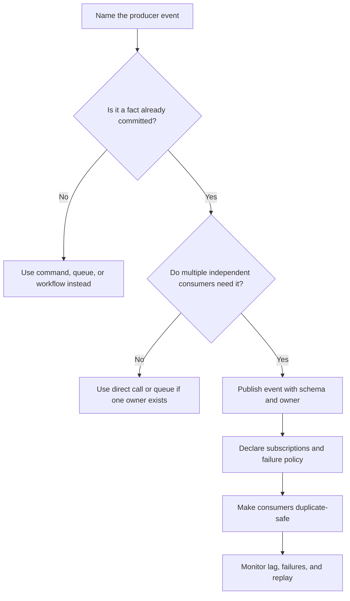

# Pub/Sub

Publish/subscribe is a communication pattern where a producer publishes an
event and one or more subscribers react independently. It is useful when several
parts of a system need to know that something happened, but the producer should
not call each consumer directly.

Use pub/sub for facts that have already happened. Do not use it to hide command
ownership or to make important dependencies invisible.

## Purpose

Use pub/sub design to answer:

- What event happened?
- Who owns the source-of-truth change that created the event?
- Which consumers need to react now?
- Which consumers may be added later?
- What schema will subscribers rely on?
- How will subscribers handle duplicate, late, or missing events?

The goal is to decouple producers and consumers without losing ownership,
observability, or correctness.

## When This Matters

Pub/sub matters when:

- one source-of-truth change should trigger several independent side effects;
- future consumers may need the same event;
- a producer should not know every subscriber;
- subscribers can fail without rolling back the producer;
- event fanout should be observable and retryable;
- duplicate delivery could cause harmful side effects.

It matters less when exactly one worker owns the task. In that case, a queue may
be a clearer model.

## Questions To Ask

Start with the event:

- Is this a fact that already happened or a command someone should perform?
- Who is allowed to publish it?
- What source-of-truth write makes the event valid?
- What fields are required for subscribers to act safely?
- Can subscribers fetch more data from the source of truth if needed?

Then map subscriptions:

- Which subscribers are required for the user workflow?
- Which subscribers are optional side effects?
- What happens if one subscriber fails?
- Can the same event be delivered twice?
- How will a subscriber replay or repair missed work?

## Decision Guidance

### Event Fanout

Event fanout means one event can reach many subscribers.

Good fits:

- a reservation is approved;
- a profile is updated;
- a document export is ready;
- a payment attempt is recorded;
- a user joins an organization;
- a ticket changes status.

Fanout is useful when each subscriber has a separate reason to react. For
example, `permit.approved` might trigger email notification, calendar indexing,
analytics facts, and audit enrichment.

Avoid fanout when the producer needs every consumer to succeed before the user
can see success. That is a workflow or transaction boundary, not simple pub/sub.

### Loosely Coupled Consumers

Pub/sub reduces direct coupling because the producer publishes one event instead
of calling each consumer. Consumers can evolve independently, but only if the
event contract is stable and ownership is clear.

Design pressure:

- consumers should not assume the producer knows their retry state;
- producers should not publish events before the authoritative write is durable;
- critical consumers should be visible in operations and reviews;
- optional consumers should fail without breaking the producer;
- new consumers should not change the event's meaning for existing consumers.

Loosely coupled does not mean unowned. Each subscription needs an owner, failure
policy, and repair path.

### Event Schemas

An event schema defines the event name, meaning, fields, version, and
compatibility rules.

Schema guidance:

- name events as facts, such as `reservation.approved`, not commands like
  `sendReservationEmail`;
- include a stable event ID;
- include source entity IDs and timestamps;
- include enough context for common consumers;
- avoid copying sensitive or unnecessary data;
- version fields in a backward-compatible way;
- document whether consumers should fetch current state before acting.

Events should not be full database snapshots by default. Keep them focused on
the fact and the information subscribers need to process it safely.

### Subscriptions

A subscription is a consumer's declared interest in an event.

Subscription design should state:

- owner and purpose;
- event names or filters consumed;
- retry and dead-letter behavior;
- idempotency strategy;
- lag and failure metrics;
- replay or backfill process;
- access control and privacy boundaries.

Hidden subscriptions are a common source of accidental coupling. If a subscriber
is important for product behavior, include it in design reviews and runbooks.

### Duplicate Delivery

Assume events may be delivered more than once unless the full system proves a
stronger guarantee and the business logic can rely on it.

Duplicate-safe subscriber patterns:

- store processed event IDs;
- use idempotency keys for side effects;
- write derived records with upsert or conditional logic;
- make email or notification sends dedupe by event and recipient;
- compare source version before applying an update;
- tolerate replay without corrupting state.

Duplicate delivery is not only a transport issue. Retries, replay, failover, and
manual repair can all cause the same fact to be processed again.

## Pub/Sub Decision Flow



## Trade-Offs

Pub/sub trades direct coupling for event-contract and operations complexity.

- Producers do not need to call every consumer, but they must publish stable
  facts.
- Consumers can be added later, but hidden subscribers make impact analysis
  harder.
- Fanout can isolate optional side effects, but critical workflows still need
  explicit ownership.
- Duplicate delivery improves retryability, but consumers must be idempotent.
- Event schemas enable reuse, but schema evolution needs compatibility
  discipline.
- Replay can repair missed work, but replay can also repeat side effects if
  consumers are not safe.

Use pub/sub when decoupled reaction is more important than immediate coordinated
success.

## Common Mistakes

- Publishing commands as events.
- Publishing before the source-of-truth write commits.
- Treating event delivery as exactly-once business correctness.
- Adding subscribers without owners or failure policies.
- Putting sensitive data into broadly consumed events.
- Changing event meaning without versioning.
- Assuming subscriber failures are harmless when they affect user promises.
- Forgetting replay and duplicate handling.
- Using pub/sub when a single queue worker owns the job.

## Example

A neighborhood makerspace lets members reserve equipment. When staff approve a
reservation, several parts of the system need to react.

Source event:

```text
equipment_reservation.approved
```

Event fields:

| Field | Purpose |
| --- | --- |
| `event_id` | dedupe and tracing |
| `schema_version` | compatibility and event evolution |
| `reservation_id` | fetch source-of-truth reservation |
| `member_id` | identify recipient and support authorization checks for follow-up reads |
| `equipment_id` | update equipment calendar views |
| `approved_at` | ordering and audit context |
| `status_version` | ignore stale updates |

Subscribers:

| Subscriber | Purpose | Failure Behavior |
| --- | --- | --- |
| Email notification | Tell the member their reservation was approved | Retry, then surface in notification failure queue |
| Calendar projection | Update member and equipment calendars | Retry and replay from events if projection is stale |
| Analytics facts | Count approvals by equipment type | Batch repair from reservation history is acceptable |
| Audit enrichment | Attach reviewer context for support | Alert if missing because support depends on it |

Design consequences:

- The approval transaction persists the authoritative approval and any reliable
  outbox record together; the event is relayed after commit.
- The event says approval happened; it does not command each subscriber.
- Each subscriber stores `event_id` or another idempotency key before side
  effects.
- If email fails, the reservation remains approved. Operators repair the
  notification path without rolling back approval.
- If calendar projection lags, users can still read the source reservation
  detail for the authoritative status.

## Checklist

Before using pub/sub, confirm:

- The event is a committed fact, not a command.
- The producer and source-of-truth owner are named.
- Fanout is justified by multiple independent consumers.
- Required and optional subscribers are distinguished.
- Event schema includes IDs, timestamps, versioning, and privacy boundaries.
- Each subscription has an owner, retry policy, dead-letter or repair path, and
  lag metric.
- Consumers are safe for duplicate delivery and replay.
- Critical user promises do not depend on invisible subscriber success.
- Event publication is tied safely to the source-of-truth write.
- Version 1 is not using pub/sub where one queue worker would be clearer.

## Related Pages

- [Communication overview](./)
- [Synchronous vs asynchronous processing](sync-vs-async.md)
- [Idempotency](idempotency.md)
- [Outbox pattern](outbox-pattern.md)
- [Transactions](../data/transactions.md)
- [Schema evolution](../data/schema-evolution.md)
- [Operational vs analytical data](../data/operational-vs-analytical-data.md)
- [Trade-off vocabulary](../method/tradeoff-vocabulary.md)
- [Design review checklist](../method/design-review-checklist.md)
- [Glossary](../glossary.md)
