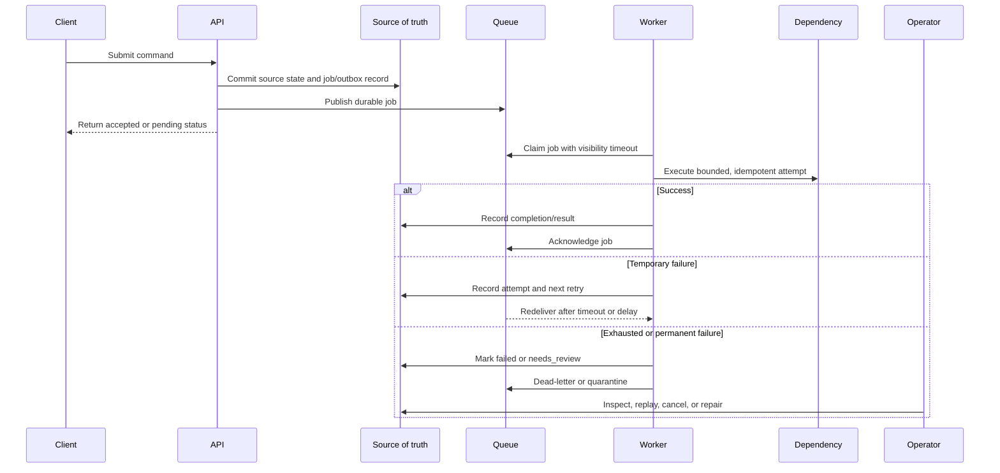

# Queues

Queues let one part of a system accept work and another part process it later.
They are useful for background work, retries, burst smoothing, and slow
dependencies, but they also introduce delayed completion, duplicate delivery,
ordering limits, backpressure decisions, visibility timeouts, and worker
failure modes.

Use a queue when delayed work is acceptable and the system can make pending,
retrying, failed, and repaired work visible. A queue is not a way to make
correctness problems disappear.

## Purpose

Use this page to decide:

- which work can move behind a queue;
- how producers and workers communicate through durable jobs;
- how retries and duplicate delivery stay safe;
- where ordering matters and where it does not;
- what visibility timeout means for worker crashes;
- how backpressure protects workers and dependencies;
- how users and operators see failed or stuck work.

For component-level selection, see [Queue](../components/queue.md) and
[Background workers](../components/background-workers.md). This page focuses on
queue-based asynchronous communication.

## When This Matters

Queues matter when:

- a user request starts slow work that can finish after the response;
- a dependency is flaky, rate limited, or slower than the user path;
- producers create bursts that workers need time to drain;
- retries must survive process failure;
- a worker can crash after receiving a job;
- one entity needs ordered processing;
- operators need a repair path for jobs that cannot complete automatically.

They are a poor fit when the user needs final success immediately, the work is
not safe to retry, the system cannot tolerate duplicate delivery, or no one will
own backlog and dead-letter repair.

## Questions To Ask

- What work is being queued, and who produces it?
- What source-of-truth state proves the work was accepted?
- What can the user do while the work is pending?
- How long may the work wait before it violates the product promise?
- Can the job run more than once without causing harm?
- Which failures should retry, fail fast, or require review?
- Does ordering matter globally or only for one entity, tenant, or key?
- What visibility timeout or lease protects jobs when workers crash?
- What happens when the queue is older or deeper than expected?
- Who reviews, replays, cancels, or compensates failed jobs?

## Decision Guidance

### Background Work

Move work to a queue when the user-visible operation can honestly complete
before the background work finishes.

Good fits:

- send notification after a source-of-truth write commits;
- generate report, export, thumbnail, or preview;
- process import rows;
- call a slow provider with retry;
- rebuild a derived search or analytics view;
- run cleanup or retention tasks.

Poor fits:

- final payment, booking, permission, or quota decision that must be known now;
- a read that must return current state;
- a command that is not idempotent and has no dedupe or repair path;
- a workflow where pending status would confuse users.

Name the user promise:

```text
The export request is accepted now. The file should be ready within 10 minutes
or show a failed state with a support-safe error.
```

If the product cannot explain pending or failed states, keep the work
synchronous or simplify the promise.

### Retries

Retries are one of the main reasons to use queues, but retries are safe only
when the job is idempotent.

Design retry behavior:

- classify retryable errors such as timeouts, temporary provider failures, and
  rate limits;
- classify non-retryable errors such as invalid payload, missing permission, or
  impossible state transition;
- set per-attempt timeout, maximum attempts, backoff, and jitter;
- store attempt count, last safe error category, and next retry time;
- mark exhaustion as `failed`, `needs_review`, `cancelled`, or `dead_lettered`.

Example:

```text
Email provider timeout: retry with backoff.
Recipient address rejected: fail fast and mark needs_review.
Provider accepted request but response timed out: retry with provider
idempotency key so the same message is not sent twice.
```

Retry storms are a real failure mode. Backoff and jitter protect both the queue
and the dependency.

### Ordering

Queues do not automatically give useful ordering. They may preserve enqueue
order in simple cases, but retries, multiple workers, partitions, and redelivery
can break the order a workflow assumed.

Use per-key ordering when:

- all jobs for one reservation, payment, file, tenant, or account must be
  processed serially;
- unrelated keys should still run concurrently;
- the worker can use a partition key or entity lock.

Avoid global ordering unless the product truly needs it. Global ordering can
make one slow or poisoned job block unrelated work.

Often the safer design is to make each job check current source-of-truth state
before applying a change:

```text
Send pickup reminder only if the reservation is still approved and not already
picked up.
```

That state check may be simpler than relying on perfect queue order.

### Visibility Timeout

A visibility timeout, lease, or claim window hides a job from other workers
while one worker attempts it. If the worker succeeds, it acknowledges or marks
the job complete. If the worker crashes or fails to renew the lease, the job
becomes visible again and another worker may retry it.

Design implications:

- the timeout must be longer than normal processing but shorter than the time
  users can tolerate stuck work;
- long jobs may need heartbeat or lease renewal;
- workers must handle duplicate attempts after timeout;
- side effects must be idempotent because a worker can crash after doing work
  but before acknowledging completion;
- stale `running` jobs need detection and recovery.

Failure example:

```text
A worker sends an SMS, then crashes before acknowledging the message job. The
queue redelivers the job after the visibility timeout. Without a message send
record or provider idempotency key, the resident may receive two SMS messages.
```

Visibility timeout is not only a queue setting. It shapes idempotency, job
duration, worker heartbeats, and user-visible stuck-job behavior.

### Backpressure

A queue can absorb bursts, but it should not accept unlimited stale work.
Backpressure defines how the system behaves when producers are faster than
workers or downstream dependencies.

Backpressure options:

- reject new work with a retry hint;
- accept only high-priority or paid-tier work;
- cap queue depth per tenant, key, or job type;
- slow producers with rate limits;
- shed optional jobs such as analytics enrichment;
- reduce worker concurrency to protect a provider;
- switch to manual or degraded mode.

Measure queue depth and oldest job age. Depth says how much work exists; age
says whether the user promise is being violated.

Do not scale workers blindly. More workers can overload the database, provider,
lock, or hot key that caused the backlog.

### Worker Failures

Workers fail in normal systems. They crash, time out, deploy, lose network
access, hit provider errors, run out of memory, or receive poison jobs.

Design responses:

- claim jobs with a timeout or lease;
- record attempts and safe error categories;
- make side effects idempotent;
- use bounded retries;
- dead-letter or quarantine exhausted jobs;
- expose operator repair actions;
- alert on old running jobs, retry spikes, dead-letter age, and worker health.

Worker failure is acceptable when the job can be retried or repaired without
lying to the user about completion.

## Queue Flow



The source of truth should know enough about the job to explain status after
the queue message is gone.

## Original Example

A community meal program lets residents request grocery delivery. The API must
create the request immediately, then assign a volunteer, send notifications,
and update an operations dashboard.

Queue choices:

| Work | Queue Fit | Reason |
| --- | --- | --- |
| Create delivery request | No | User needs a request ID and durable source-of-truth state now |
| Send resident confirmation | Yes | Can happen after request creation and retry safely |
| Assign volunteer | Maybe | Queue if assignment can be pending; keep sync if confirmation depends on assignment |
| Update search/dashboard view | Yes | Derived view can lag if source state is correct |
| Charge payment | Usually no for final decision | User-facing payment success should be authoritative before confirmation |

Version 1:

- API commits the delivery request and a notification job in one durable
  boundary or reconciles from an outbox;
- worker sends confirmation using idempotency key
  `delivery_request_id + message_type + recipient_id`;
- provider timeouts retry with backoff and jitter;
- invalid phone numbers fail fast into `needs_review`;
- jobs for one delivery request check current request state before sending;
- queue age over two minutes pages the owning team because confirmations are
  expected quickly;
- dead-lettered notifications show request ID, message type, safe error class,
  attempts, and replay/cancel actions.

The queue improves request latency without pretending notification delivery is
instant or guaranteed without repair.

## Trade-Offs

| Choice | Benefit | Cost |
| --- | --- | --- |
| Queue background work | Protects user latency and absorbs bursts | Delayed completion and pending states |
| Automatic retries | Recovers temporary failures | Duplicate side effects unless idempotent |
| Per-key ordering | Protects one entity's sequence | Hot keys and lower concurrency |
| Visibility timeout | Recovers jobs from crashed workers | Redelivery requires idempotency |
| Backpressure | Protects dependencies and freshness promises | Rejects or delays some work |
| Dead-letter queue | Makes exhausted work inspectable | Requires ownership and safe replay process |

## Common Mistakes

- Returning success when only background work was accepted.
- Queueing a decision that must be final before the user continues.
- Retrying jobs without idempotency keys or side-effect records.
- Depending on queue order instead of checking current source-of-truth state.
- Setting visibility timeout longer than the user can tolerate stuck work.
- Counting queue depth but not oldest job age.
- Scaling workers until the provider, database, or hot key fails.
- Treating dead-letter queues as hidden failure storage.

## Checklist

Before using a queue, verify:

- [ ] The queued work, producer, worker, and source of truth are named.
- [ ] The user-visible state distinguishes accepted, pending, retrying, failed,
      needs-review, and complete work.
- [ ] Delay tolerance is explicit and tied to oldest-job-age alerts.
- [ ] Retryable and non-retryable failures are classified.
- [ ] Each retryable job has an idempotency key or duplicate-safe side effect.
- [ ] Ordering requirements are scoped by key, not assumed globally.
- [ ] Visibility timeout, lease renewal, and stale running job recovery are
      defined.
- [ ] Backpressure says when to reject, slow, shed, prioritize, or degrade.
- [ ] Worker crash, timeout, deploy, and provider failure behavior is explicit.
- [ ] Dead-lettered work has context, owner, alert, and replay/cancel rules.
- [ ] Metrics cover enqueue rate, dequeue rate, depth, oldest age, attempts,
      retries, dead letters, worker health, and dependency errors.

## Related Pages

- [Queue component](../components/queue.md)
- [Background workers](../components/background-workers.md)
- [Synchronous vs asynchronous processing](sync-vs-async.md)
- [Retries and backoff](retries-and-backoff.md)
- [Idempotency](idempotency.md)
- [Outbox pattern](outbox-pattern.md)
- [Polling vs WebSockets vs SSE](polling-vs-websockets-vs-sse.md)
- [Throughput requirements](../requirements/throughput.md)
- [Availability requirements](../requirements/availability.md)
- [Observability basics](../operations/observability-basics.md)
