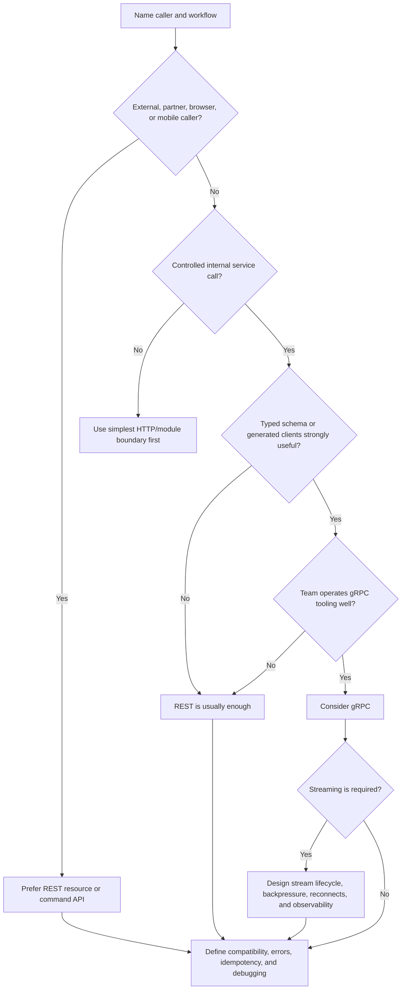

# REST Vs gRPC

REST and gRPC are both ways to define API contracts. The useful question is not
which one is more modern. The useful question is which contract fits the caller,
workflow, deployment boundary, compatibility promise, and debugging needs.

Use REST when resource-oriented request/response APIs need broad client support
and easy inspection. Use gRPC when controlled services benefit from typed
contracts, generated clients, and efficient service-to-service calls.

## Purpose

Use this page to decide:

- whether the API is a resource API, command API, or service-to-service call;
- whether typed contracts and generated clients are worth the operational cost;
- whether browser, partner, admin, worker, or internal service clients are the
  primary callers;
- whether streaming is a real requirement;
- how compatibility, debugging, retries, and observability will work.

The goal is to choose the simplest protocol that makes the caller contract
clear.

## When This Matters

REST versus gRPC matters when:

- clients deploy independently from the service;
- teams need a stable public or partner API;
- internal services call each other frequently;
- strict request and response schemas reduce integration mistakes;
- streaming request or response data is a core workflow;
- operators need to debug failures across service boundaries;
- compatibility promises affect rollout speed.

It matters less when version 1 is one process with one trusted caller. In that
case, a clear module boundary may be enough until an actual API boundary exists.

## Questions To Ask

- Who is the caller: browser, mobile app, partner, admin tool, worker, or
  internal service?
- Can both caller and receiver deploy together, or independently?
- Is the workflow naturally resource-oriented, action-oriented, or RPC-style?
- Does the API need bidirectional or long-lived streaming?
- How will clients inspect, retry, and debug failed calls?
- How will compatibility be handled when fields, meanings, or methods change?
- Does the team operate the tooling for schemas, generated clients, load
  balancing, timeouts, and observability?
- What is the simplest interface that satisfies the user-facing requirement?

## Decision Guidance

### Resource APIs

REST fits resource APIs well because it maps common product objects and actions
to URLs, methods, status codes, and JSON-style payloads that many clients and
tools understand.

Use REST when:

- browser, mobile, partner, admin, or public clients need the API;
- the workflow is mostly create, read, update, delete, list, approve, cancel, or
  export around resources;
- humans need to inspect requests with ordinary HTTP tooling;
- compatibility can be handled with additive fields, stable semantics, and
  versioned routes when needed;
- caching, proxying, logging, and rate limiting benefit from ordinary HTTP
  conventions.

Example REST shape:

```text
POST /reservations
GET /reservations/{reservation_id}
POST /reservations/{reservation_id}/cancel
GET /rooms/{room_id}/availability?date=2026-06-01
```

REST is not automatically simple. Vague endpoints, inconsistent error shapes,
and hidden state transitions can make REST harder to operate than a typed
internal RPC. The resource and command names still need product-level clarity.

### Typed Contracts

gRPC fits calls where both sides value an explicit schema and generated clients.
The schema makes request and response shapes visible before runtime, which can
reduce integration drift between services.

Use gRPC when:

- callers are controlled services, workers, or internal platforms;
- both sides can share protobuf schemas and generated client libraries;
- strict request and response shapes matter more than manual HTTP inspection;
- high-volume service-to-service calls need efficient binary encoding;
- deadlines, cancellation, and typed errors are part of the team’s normal
  service tooling.

Example gRPC-style shape:

```text
ReservationService.CreateReservation(CreateReservationRequest)
ReservationService.GetReservation(GetReservationRequest)
ReservationService.CancelReservation(CancelReservationRequest)
```

Typed contracts do not remove design work. They make the wire shape explicit,
but the team still needs idempotency, authorization, compatibility rules,
timeouts, retries, and observable errors.

### Service-To-Service Calls

Service-to-service calls usually favor the protocol the organization can
operate consistently.

REST is often enough when:

- the call volume is moderate;
- debugging with logs, curl-like tools, and HTTP traces is valuable;
- services are owned by different teams with uneven tooling maturity;
- the contract is resource-oriented or public-adjacent.

gRPC is often useful when:

- both services are internal and controlled;
- generated clients are standard in the codebase;
- deadlines and cancellation are enforced consistently;
- call volume or payload shape benefits from gRPC behavior;
- streaming or typed schemas are first-class requirements.

Avoid using protocol choice to hide an unclear service boundary. If one service
must synchronously call five others to answer a user request, the main risk may
be latency and availability coupling, not REST versus gRPC.

### Streaming

Streaming is a separate requirement from "service call."

REST request/response can handle ordinary reads and commands. It can also pair
with polling or server-sent events for simple status updates.

gRPC supports streaming patterns that can fit internal workflows such as:

- server streaming progress updates to a worker or internal client;
- client streaming batches of telemetry or records;
- bidirectional streaming for controlled, low-latency service interactions.

Use streaming only when the workflow needs it. For version 1, a create request
plus polling status endpoint is often easier to reason about than a long-lived
stream.

### Compatibility

Compatibility is about independent change.

REST compatibility usually relies on:

- additive response fields;
- stable meaning for existing fields;
- route or media-type versions for breaking semantic changes;
- clear deprecation windows;
- clients tolerating unknown fields and explicit error shapes.

gRPC compatibility usually relies on:

- preserving field numbers and meanings;
- adding optional fields instead of reusing old fields;
- avoiding breaking changes to service and method contracts;
- generating and testing clients from shared schemas;
- coordinating rollout when semantics change.

Both styles can break clients if the team changes meaning without changing the
contract. Compatibility rules should be written before the first breaking
change, not during an incident.

### Debugging And Operations

REST is usually easier to inspect manually because requests and responses often
look like ordinary HTTP and JSON. That helps during partner integration,
browser debugging, support reproduction, and incident triage.

gRPC can be very operable when the organization has the right tooling, but it
needs that tooling: schema-aware clients, request logging policy, deadline and
retry conventions, load balancing support, tracing, and error translation.

For either style, define:

- request IDs and trace propagation;
- timeout and retry behavior;
- idempotency for unsafe commands;
- authentication and authorization context;
- structured error codes;
- metrics by method, status, latency, and caller;
- safe logging that avoids secrets and unnecessary payloads.

Debugging should be part of the protocol decision. A fast protocol that the
team cannot inspect during failures is not a simple protocol.

## Decision Flow



## Original Example

A city recreation platform supports class search, class registration, partner
roster import, and internal schedule synchronization.

API choices:

| Workflow | Caller | Better Fit | Why |
| --- | --- | --- | --- |
| Search classes | Browser and mobile app | REST | Resource list with filters, easy caching and inspection |
| Register for class | Browser and mobile app | REST command | User-facing command needs idempotency and clear errors |
| Partner roster import | External partner system | REST | Partner debugging and compatibility matter more than internal typing |
| Internal schedule sync | Controlled worker to schedule service | gRPC or REST | gRPC can fit if generated clients and deadlines are standard |
| Export generation status | Admin tool | REST plus polling | Long-running work does not require streaming for version 1 |

Version 1:

- REST for user, admin, and partner APIs;
- idempotency keys for registration commands;
- route-level versioning only when semantics break;
- request IDs, structured errors, and rate limits at the application boundary;
- defer gRPC until there are multiple internal services with typed call
  pressure and operational tooling.

Later:

- use gRPC for schedule synchronization if internal services split, generated
  clients are standard, and deadline/cancellation behavior is enforced;
- keep public APIs REST so partners and browser clients remain easy to debug.

This design chooses by caller and workflow, not by protocol preference.

## Trade-Offs

| Choice | Benefit | Cost |
| --- | --- | --- |
| REST for public APIs | Broad client/tool support and easy inspection | Schema discipline is mostly convention unless added |
| REST for internal calls | Simple operational model | Can drift without contract tests or shared types |
| gRPC for internal calls | Typed contracts and generated clients | Requires protobuf, client generation, and gRPC-aware operations |
| gRPC streaming | Efficient controlled streams | Stream lifecycle, backpressure, and debugging complexity |
| One protocol everywhere | Consistent tooling | May force poor fit for some callers |
| Protocol per workflow | Better fit | More operational patterns to support |

## Common Mistakes

- Choosing gRPC to make an architecture sound sophisticated.
- Designing REST endpoints as vague RPC tunnels with unclear resources or
  commands.
- Assuming typed schemas solve authorization, idempotency, or compatibility by
  themselves.
- Using gRPC for public browser or partner APIs without a strong reason and
  support tooling.
- Adding streaming before the workflow needs a stream.
- Ignoring deadline, retry, and cancellation behavior in service-to-service
  calls.
- Choosing a protocol the team cannot debug during incidents.

## Checklist

Before choosing REST or gRPC, verify:

- [ ] The caller type and deployment independence are known.
- [ ] The workflow is classified as resource read, command, service call, or
      stream.
- [ ] Public, partner, browser, and mobile callers default to inspectable REST
      unless a specific requirement says otherwise.
- [ ] gRPC is used only when typed contracts, generated clients, or streaming
      justify the tooling.
- [ ] Compatibility rules are explicit for fields, methods, versions, and
      semantics.
- [ ] Debugging and operations cover request IDs, traces, timeouts, errors,
      retries, and safe logs.
- [ ] Unsafe commands have idempotency and clear retry behavior.
- [ ] The chosen protocol fits version 1 without hiding service-boundary
      complexity.

## Related Pages

- [API layer](../components/api-layer.md)
- [Communication overview](./)
- [Synchronous vs asynchronous processing](sync-vs-async.md)
- [Idempotency](idempotency.md)
- [Retries and backoff](retries-and-backoff.md)
- [Latency requirements](../requirements/latency.md)
- [Operability requirements](../requirements/operability.md)
