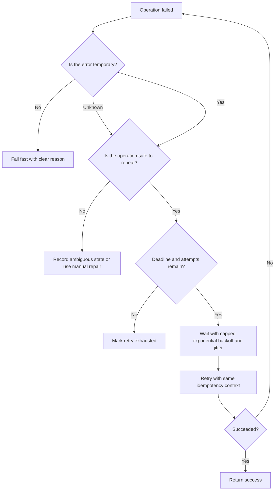

# Retries And Backoff

Retries let a caller try again after a temporary failure. Backoff controls how
quickly those retries happen. Together they can make transient failures
invisible to users, but they can also multiply load, duplicate side effects, and
turn a small outage into a larger incident.

Use retries only when the operation is safe to repeat or when the system has a
deduplication rule that makes repeated attempts harmless.

## Purpose

Use this guide to answer:

- Which failures are worth retrying?
- Is the operation safe if it runs more than once?
- How long should each attempt wait before timing out?
- How should retries spread out over time?
- When should the caller stop retrying and surface failure?
- How will operators see retry pressure before it becomes a storm?

The goal is to improve recovery from temporary failures without hiding
permanent failures or overwhelming a struggling dependency.

## When This Matters

Retry design matters when:

- a synchronous call crosses a service, network, or provider boundary;
- background work may fail because a dependency is briefly unavailable;
- clients or workers could retry the same command at the same time;
- duplicate requests could send extra notifications, reserve capacity twice, or
  charge a user twice;
- timeouts are unclear and callers may wait forever;
- an outage could trigger many queued retries at once.

Retries matter less when the failure is clearly permanent, such as invalid
input, unauthorized access, or a business rule rejection.

## Questions To Ask

Start with the operation:

- Is this a read, a command, an event handler, or a side effect?
- If it executes twice, what changes twice?
- Is there an idempotency key, unique constraint, processed-event table, or
  other dedupe guard?
- Which errors are temporary, and which errors should fail immediately?
- Does the caller have a total deadline from the user or workflow?

Then define the retry policy:

- How long can one attempt run before timing out?
- How many attempts are allowed?
- What delay happens before each retry?
- Is jitter used so callers do not retry at the same instant?
- What happens after retries are exhausted?
- Which metrics show attempts, timeouts, retry exhaustion, and dependency
  pressure?

## Decision Guidance

### Safe Retries

A retry is safe when repeating the same request cannot corrupt state or repeat a
harmful side effect.

Safe retry patterns include:

- read requests that do not mutate state;
- create or update commands with an idempotency key;
- writes protected by a unique business key;
- event handlers that record processed event IDs;
- side effects that dedupe by recipient and event;
- conditional updates that verify the expected version before applying a
  change.

Unsafe retry examples include:

- retrying a payment capture without a stable payment idempotency key;
- retrying an inventory decrement that is not tied to one reservation;
- sending an email on every attempt without a send record;
- appending audit rows without a stable event ID when duplicates matter.

If the operation is not safe to repeat, do not add automatic retries first. Add
a dedupe rule, change the operation boundary, or surface a manual repair path.

### Retryable Errors

Retry only errors that are likely to change with time.

Usually retryable when the operation is safe to repeat:

- connection reset before the caller knows whether work happened, as long as
  the request has idempotency or reconciliation;
- timeout from a dependency that is normally reliable, as long as duplicate
  completion is harmless;
- temporary rate limit when the server asks the caller to slow down;
- service unavailable or overloaded response;
- optimistic concurrency conflict when the command can be rebuilt safely.

Usually not retryable:

- validation error;
- authentication or authorization failure;
- not found for a stable resource the caller must own;
- request too large;
- business rule rejection;
- schema or contract mismatch.

Ambiguous failures need special care. A timeout may mean the receiver never saw
the request, or it may mean the receiver completed the work but failed to send a
response. Ambiguous command failures require idempotency or reconciliation
before retrying.

### Timeouts

Every attempt needs a timeout. Without one, a retry policy is incomplete because
the caller may wait forever and never reach the retry path.

Timeout design should include:

- per-attempt timeout: the maximum time one try can spend waiting;
- total deadline: the maximum time the caller or workflow can spend across all
  attempts;
- connection and read timeouts when the client library separates them;
- shorter timeouts for optional side effects than for critical decisions;
- cancellation when the user request or workflow deadline is gone.

For synchronous user requests, the total deadline should fit inside the user
experience. For background workers, the deadline can be longer, but it still
needs a limit so stuck work can fail, retry, or move to repair.

### Exponential Backoff

Exponential backoff increases the delay after each failed attempt. It gives the
dependency time to recover and reduces immediate retry pressure.

Example policy:

| Attempt | Delay Before Attempt |
| --- | --- |
| 1 | no delay |
| 2 | 250 ms |
| 3 | 500 ms |
| 4 | 1 second |
| 5 | 2 seconds |

Cap the delay so retries do not grow beyond the workflow's useful window. A
background job might cap at minutes. A user request might only have room for one
short retry before returning a clear error.

Backoff should be chosen from the caller's deadline and dependency capacity, not
from a default copied across all clients.

### Jitter

Jitter adds randomness to retry delays. Without jitter, many callers that fail
at the same time may retry at the same time, creating a synchronized spike.

Common jitter approaches:

- full jitter: choose a random delay between zero and the current backoff cap;
- equal jitter: keep part of the delay fixed and randomize the rest;
- decorrelated jitter: base the next delay partly on the previous delay and a
  random factor.

The exact formula matters less than the outcome: retry attempts should spread
out enough that the dependency can recover instead of receiving another burst.

### Maximum Attempts

Set a maximum attempt count. Infinite retries hide permanent failures, waste
capacity, and make repair harder.

Use fewer attempts when:

- the request is user-facing;
- the operation is expensive;
- the dependency is already overloaded;
- the error is likely permanent;
- duplicate side effects are hard to repair.

Use more attempts when:

- the work is background and durable;
- the operation is idempotent;
- the dependency commonly has short transient failures;
- the workflow can tolerate delayed completion;
- exhausted work has a clear dead-letter or manual repair path.

Retry exhaustion should become an explicit state, not a silent drop. Store the
last error, attempt count, timestamps, and enough context to inspect or replay
the work safely.

### Retry Storms

A retry storm happens when many clients retry during the same failure and create
more traffic than the original workload.

Common causes:

- no backoff or no jitter;
- all clients using the same retry schedule;
- retries at several layers, such as browser, API gateway, service client, and
  worker;
- retrying while a dependency is rate limiting or overloaded;
- queues releasing a large backlog without concurrency limits;
- clients ignoring server retry hints.

Storm protection includes:

- timeouts and total deadlines;
- exponential backoff with jitter;
- maximum attempts;
- concurrency limits and queue rate limits;
- respecting retry-after or overload signals;
- circuit breakers or temporary fail-fast behavior for known unhealthy
  dependencies;
- metrics for retry rate, dependency error rate, queue age, and saturation.

Retries should reduce user-visible failure when a dependency is recovering. They
should not become a second workload that competes with normal traffic.

## Retry Decision Flow

## Trade-Offs

Retries trade latency, load, and recovery.

- A short retry can mask a temporary network failure, but it adds latency to the
  caller.
- More attempts increase the chance of success, but consume capacity and may
  delay clear failure.
- Backoff protects dependencies, but delays completion.
- Jitter reduces synchronized spikes, but makes individual retry timing less
  predictable.
- Retrying in clients can improve resilience, but hidden retries across several
  layers can multiply traffic.
- Background retries improve eventual completion, but require durable job state,
  dead-letter handling, and operator visibility.

Use retries to handle temporary uncertainty, not to avoid designing failure
states.

## Common Mistakes

- Retrying every error instead of classifying retryable and permanent failures.
- Retrying commands without idempotency or deduplication.
- Setting per-attempt timeouts but no total deadline.
- Using exponential backoff without jitter.
- Allowing infinite retries.
- Retrying at several layers without a shared retry budget.
- Ignoring rate-limit or overload signals from the receiver.
- Returning success while a required side effect is still retrying invisibly.
- Dropping exhausted work without an inspection or repair path.
- Measuring only final failures and missing the retry rate that preceded them.

## Example

A community clinic lets patients request appointment reminders by text message.
The source-of-truth appointment record is updated synchronously, and reminder
sending happens in a background worker.

Retry policy:

| Design Choice | Decision |
| --- | --- |
| Safe retry rule | Each reminder send uses `appointment_id + reminder_type + scheduled_for` as a dedupe key |
| Retryable errors | Provider timeout, temporary service unavailable, rate limit with retry hint |
| Non-retryable errors | Invalid phone number, opted-out recipient, malformed request |
| Per-attempt timeout | Short enough that one provider call cannot block the worker thread indefinitely |
| Backoff | Capped exponential backoff so provider recovery gets time |
| Jitter | Random delay added so many reminders do not retry together |
| Maximum attempts | Stop after a small fixed number for near-term reminders |
| Exhausted state | Store final failure with provider response, attempts, and repair action |

If the provider times out after receiving the request, the worker retries with
the same dedupe key. If the provider later reports that the number is invalid,
the worker stops retrying and marks the reminder as permanently failed. If many
messages receive temporary rate limits, workers slow down and spread retries
instead of pushing the whole backlog again immediately.

Version 1 can start with one retry policy for background notification work. As
traffic grows, separate policies may be needed for user-facing calls, slow batch
work, provider rate limits, and high-cost side effects.

## Checklist

Before adding retries, confirm:

- The operation is safe to repeat or has a dedupe guard.
- Retryable and non-retryable errors are listed.
- Ambiguous timeout behavior is handled.
- Each attempt has a timeout.
- The full workflow has a total deadline.
- Backoff grows between attempts and has a cap.
- Jitter spreads retries across callers or workers.
- Maximum attempts are defined.
- Retry exhaustion creates an inspectable state.
- Retry metrics and alerts include attempts, exhaustion, timeout rate, and
  dependency saturation.
- Multiple layers do not accidentally multiply retries beyond the intended
  retry budget.

## Related Pages

- [Communication overview](./)
- [Synchronous vs asynchronous processing](sync-vs-async.md)
- [Idempotency](idempotency.md)
- [Pub/sub](pub-sub.md)
- [Transactions](../data/transactions.md)
- [Identifying entities](../data/identifying-entities.md)
- [Read and write patterns](../data/read-write-patterns.md)
- [Operational vs analytical data](../data/operational-vs-analytical-data.md)
- [Design review checklist](../method/design-review-checklist.md)
