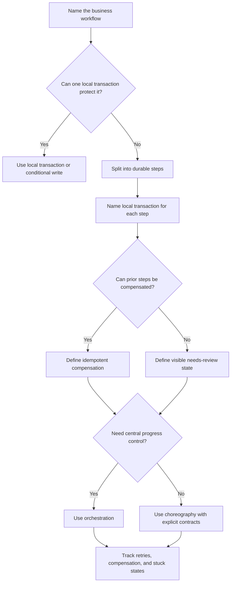

# Saga Pattern

A saga is a way to run a multi-step business workflow when one database
transaction cannot safely or practically cover every step. Each step commits its
own local change. If a later step fails, the system runs compensating actions or
moves the workflow into a visible repair state.

Use sagas for business processes with partial failure, not as a way to avoid
naming ownership, state, or rollback behavior.

## Purpose

Use this guide to answer:

- Which workflow spans several services, providers, or transaction boundaries?
- What local transaction happens at each step?
- What can fail after earlier steps already committed?
- Which compensating actions are available?
- Which failures need retry, compensation, or manual repair?
- Should one orchestrator coordinate progress, or should services react through
  choreography?

The goal is to make progress, failure, and recovery explicit across a workflow
that cannot be all-or-nothing in one local transaction.

## When This Matters

Saga design matters when:

- a user-visible workflow has several durable steps;
- each step has a different owner, database, provider, or failure mode;
- one step can succeed before a later step fails;
- external side effects cannot be rolled back by a database transaction;
- compensating action is possible but not automatic;
- operators need to see stuck, failed, compensating, or needs-review workflows.

It matters less when one small transaction can protect the whole invariant, or
when later side effects are optional best effort and can fail independently.

## Questions To Ask

Start with the workflow:

- What does success mean to the user?
- Which steps must complete before success is shown?
- Which steps can happen later with a pending state?
- Which service or component owns each step?
- What state is authoritative for the workflow's progress?

Then map failure and recovery:

- What happens if step 2 fails after step 1 commits?
- Which steps can be retried safely?
- Which steps need idempotency keys?
- Which compensating actions exist, and what do they actually undo?
- Which failures cannot be compensated and need manual review?
- What should users and operators see while the saga is in progress?

## Decision Guidance

### Multi-Step Workflows

A multi-step workflow is more than a chain of calls. It has product state,
ownership, and recovery rules.

Good saga candidates:

- order placement with inventory hold, payment authorization, fulfillment, and
  notification;
- account onboarding with identity verification, workspace creation, billing
  setup, and entitlement grant;
- permit approval with fee authorization, insurance verification, calendar
  reservation, and final notice;
- refund processing with provider refund, ledger adjustment, entitlement
  removal, and customer communication.

For each step, name:

- command or event that starts it;
- local transaction or provider action;
- success state;
- retry policy;
- compensation or repair action;
- owner and observability.

If a team cannot name these, the workflow is not ready to be hidden behind
events or background jobs.

### Local Transactions

Each saga step should commit a local, understandable change. The saga itself is
not one distributed database transaction.

Local step guidance:

- protect each step's invariant with a local transaction or conditional write;
- persist workflow state before starting external side effects;
- use idempotency keys for retryable commands and provider calls;
- record enough state to resume after a worker crash;
- expose terminal and non-terminal states clearly.

For example, a payment authorization step may create an internal payment attempt
and call a provider with a stable key. A later fulfillment step should not rely
on memory from the request that started the saga; it should read durable saga
state.

### Compensating Actions

A compensating action is a business action that reduces or reverses the effect
of a previous step. It is not always a perfect rollback.

Examples:

| Step That Succeeded | Later Failure | Possible Compensation |
| --- | --- | --- |
| Inventory was held | Payment authorization failed | Release the hold |
| Fee was authorized | Eligibility check failed | Void or reverse the authorization |
| Workspace was created | Billing setup failed | Suspend the workspace and mark onboarding incomplete |
| Notification was sent | Final approval was cancelled | Send a correction, not an unsend |

Compensation guidance:

- make compensation idempotent;
- record compensation attempts and outcomes;
- avoid promising reversal when only mitigation is possible;
- distinguish automated compensation from manual review;
- consider whether compensation can fail and what happens next.

Some actions cannot be undone cleanly. A saga should make that visible instead
of pretending every step has an exact inverse.

### Partial Failure

Partial failure is the main reason to design a saga. Earlier steps can be
committed while later steps fail, time out, or become ambiguous.

Useful saga states:

| State | Meaning |
| --- | --- |
| `started` | Workflow exists and has not reached a terminal state |
| `waiting` | A step is waiting on a provider, user, worker, or schedule |
| `retrying` | Temporary failure is being retried |
| `compensating` | The workflow is undoing or mitigating prior steps |
| `completed` | The business workflow succeeded |
| `failed` | The workflow reached a known terminal failure |
| `needs_review` | Automation cannot safely decide the next action |

Partial failure design should answer:

- Which step failed?
- Was the outcome known, failed, or ambiguous?
- Which previous steps already committed?
- Which compensation has started or completed?
- Can the user retry, cancel, wait, or contact support?
- Which metric or alert shows stuck workflows?

Avoid returning a simple "success" if the workflow still has required steps that
can fail invisibly.

### Orchestration

In orchestration, one coordinator decides the next step and records workflow
state. Services perform commands and report outcomes.

Use orchestration when:

- the workflow has clear central state;
- operators need one place to inspect progress;
- step order and compensation rules are complex;
- the product needs explicit pause, retry, cancel, or repair actions;
- debugging hidden event chains would be expensive.

Design pressure:

- keep the orchestrator focused on workflow state, not every service's internal
  implementation;
- make commands idempotent;
- persist state transitions before and after risky steps;
- expose stuck or ambiguous states;
- avoid turning one orchestrator into an unbounded business-rule pile.

Orchestration is easier to inspect, but it creates a central workflow owner and
couples steps to that workflow model.

### Choreography

In choreography, services publish and react to events. No single component tells
every participant what to do next.

Use choreography when:

- the workflow is simple and event reactions are naturally independent;
- each participant owns its reaction and failure policy;
- adding or removing optional reactions should not change the producer;
- event contracts and observability are mature enough for debugging.

Design pressure:

- publish committed facts, not hidden commands;
- document required subscribers, not only optional ones;
- make event handlers idempotent;
- include correlation IDs so one business workflow can be traced;
- define what happens when one required reaction fails.

Choreography lowers direct coupling, but it can hide the actual workflow if
events become the only place where the process is described.

## Saga Decision Flow

## Trade-Offs

Sagas trade all-or-nothing simplicity for explicit long-running recovery.

- Local transactions keep each step understandable, but the whole workflow can
  be partially complete.
- Compensation can recover from later failure, but may not restore the exact
  original state.
- Orchestration improves visibility and control, but creates a central workflow
  component.
- Choreography reduces direct coordination, but can make debugging and ownership
  harder.
- Retrying steps improves resilience, but requires idempotency and retry limits.
- Manual review protects correctness for ambiguous cases, but adds operational
  work.

Use a saga when partial failure is real and should be modeled directly.

## Common Mistakes

- Calling any asynchronous chain a saga without defining workflow state.
- Treating compensation as a perfect rollback.
- Sending irreversible side effects before the workflow has enough durable
  state.
- Retrying steps without idempotency keys.
- Hiding required subscribers behind event choreography.
- Building a central orchestrator without stuck-state metrics or repair tools.
- Forgetting that compensation can fail.
- Showing users success while required saga steps are still unresolved.
- Leaving ambiguous provider timeouts outside the workflow state machine.

## Example

A neighborhood festival platform lets organizers reserve a public plaza and pay
a small permit fee. The approval workflow spans several steps:

1. persist the permit application;
2. hold the plaza time slot;
3. verify insurance;
4. authorize the permit fee;
5. mark the permit approved;
6. notify the organizer and update the public calendar.

Saga steps:

| Step | Local Success | Failure Handling |
| --- | --- | --- |
| Create application | Application is `submitted` | Reject invalid input before saga starts |
| Hold plaza slot | Slot hold is recorded with expiry | Release hold if later required step fails |
| Verify insurance | Insurance status is `verified` | Move to `needs_review` if ambiguous |
| Authorize fee | Payment attempt is `authorized` | Retry with same attempt key or mark review |
| Approve permit | Permit status becomes `approved` | Use local transaction with status version |
| Publish side effects | Outbox event is recorded | Relay retries; consumers handle duplicates |

Compensations:

- If insurance fails after the slot is held, release the slot hold.
- If fee authorization succeeds but final approval cannot be completed, void or
  reverse the authorization when possible.
- If notification was already sent and approval is later cancelled, send a
  correction instead of pretending the first message can be unsent.

Orchestrated version:

- a `permit_approval_saga` record stores current step, attempts, correlation ID,
  and compensation state;
- the orchestrator sends commands such as `hold_slot`, `verify_insurance`, and
  `authorize_fee`;
- operators can inspect and retry stuck workflows from one place.

Choreographed version:

- `permit.submitted` starts a slot-hold handler;
- `slot.held` starts insurance verification;
- `insurance.verified` starts fee authorization;
- `fee.authorized` lets the permit service approve the permit;
- every event carries a correlation ID and each required handler has an owner.

The orchestrated version is easier to inspect and repair. The choreographed
version can reduce direct coupling, but only if required event reactions are
documented and observable. In either version, the design must say what happens
when a step is retried, compensated, or left for manual review.

## Checklist

Before using a saga, confirm:

- The multi-step workflow and user-visible success condition are named.
- One local transaction cannot reasonably cover the full workflow.
- Each step has an owner, local transaction, retry policy, and durable state.
- Compensating actions are defined and are safe to repeat.
- Non-compensatable failures move to visible review or repair states.
- Partial failure states are exposed to users or operators where needed.
- Orchestration or choreography is chosen deliberately.
- Event contracts include correlation IDs and idempotency keys.
- Required side effects are not hidden as optional event reactions.
- Metrics cover in-progress age, step failures, retries, compensation failures,
  and needs-review count.

## Related Pages

- [Communication overview](./)
- [Synchronous vs asynchronous processing](sync-vs-async.md)
- [Idempotency](idempotency.md)
- [Retries and backoff](retries-and-backoff.md)
- [Pub/sub](pub-sub.md)
- [Outbox pattern](outbox-pattern.md)
- [Transactions](../data/transactions.md)
- [Operational vs analytical data](../data/operational-vs-analytical-data.md)
- [Design review checklist](../method/design-review-checklist.md)
