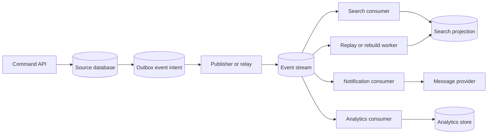

# Streams

Streams store an ordered history of events so consumers can process facts after
they happen. They are useful when several consumers need the same event log,
when derived views need replay, or when event-driven pipelines need retention
and lag visibility.

A stream is not just a bigger queue. A queue delivers work to workers. A stream
keeps event history for consumers that may process, replay, and catch up at
different speeds.

## Purpose

Use this page to decide:

- when an event log is justified;
- how replay and retention shape the design;
- how consumer lag affects user-visible freshness;
- how partitioning controls ordering and scale;
- how multiple consumers share the same facts safely;
- what checklist must exist before relying on event-driven pipelines.

For component selection, see [Stream](../components/stream.md). This page
focuses on durable event streams as a communication pattern.

## When This Matters

Streams matter when:

- several independent consumers need the same committed facts;
- a derived view must be rebuilt after a bug or schema change;
- a new consumer may start from historical events;
- event order matters within an entity, tenant, account, or resource;
- lag in one consumer changes product freshness or operational safety;
- retention and replay are requirements, not incidental storage.

Use a queue instead when one worker group only needs to process tasks once and
event history does not matter after delivery.

## Questions To Ask

- What fact does each event represent?
- Which source-of-truth write proves the fact happened?
- Who owns the event contract and compatibility rules?
- Which consumers need the event, and why?
- Do consumers need replay, rebuild, or backfill?
- How long must events be retained?
- Which fields should not be copied into the log?
- What ordering is required, and by which key?
- How much consumer lag is acceptable for each workflow?
- Which consumers create side effects that must not repeat during replay?

## Decision Guidance

### Event Logs

An event log records facts that already happened. It should not be a vague
command bus where consumers guess what the producer meant.

Good event:

```text
delivery.request_approved
Source: delivery request version 8 committed in the source database.
Meaning: the request is approved and may be assigned.
```

Weak event:

```text
handleDelivery
Source: unclear.
Meaning: consumer decides what to do.
```

Publish facts after the authoritative write commits. A transactional outbox or
durable event intent can keep source writes and event publication repairable
when the process crashes between commit and publish.

### Replay

Replay lets a consumer process old events again. It is useful for rebuilding
projections, recovering from consumer bugs, onboarding new consumers, and
backfilling derived stores.

Replay design should define:

- replay start point: beginning, timestamp, offset, event ID, or source version;
- replay mode: rebuild from scratch or catch up from checkpoint;
- rate limit so replay does not harm live traffic;
- processed-event markers or source-version checks;
- side effects that are disabled, deduped, or manually approved;
- validation that proves replay produced expected state.

Safe replay:

```text
Rebuild search projection by upserting rows by source ID and version.
Start from checkpoint reservation_events:offset=184220 and verify that the
projection reaches source_version=93211 before serving reads without a stale
label.
```

Unsafe replay:

```text
Replay every old notification event and send emails again.
```

Replay is an operational workflow. It needs metrics, runbooks, and safeguards,
not just retained bytes.

### Retention

Retention says how long events stay available. Longer retention supports
debugging, new consumers, replay, and audits. It also increases storage,
privacy, deletion, and schema-evolution work.

Set retention from the use case:

- minutes or hours for transient buffering when the source can rebuild state;
- days or weeks for projection replay and consumer outage recovery;
- months or longer only when audit, analytics, or product requirements justify
  the cost;
- archive or summarize older events when hot replay is no longer needed.

Keep event payloads focused. If events contain private, regulated, or expensive
data, retention becomes a privacy and cost decision. Prefer stable IDs,
versions, and minimal facts when consumers can fetch current details from the
source of truth.

### Consumer Lag

Consumer lag is how far a consumer is behind the producer. It can be measured by
offset distance, source-version gap, or oldest unprocessed event age. The most
useful lag measure is the one tied to a product promise.

Examples:

- search projection lag over two minutes means users may see old availability;
- notification lag over ten minutes means residents may miss pickup reminders;
- analytics lag until morning may be acceptable;
- access-control projection lag may be unsafe, so commands should recheck the
  source of truth.

For each consumer, define:

```text
Consumer: search projection
Freshness target: under 2 minutes
Lag metric: oldest unprocessed event age
User behavior: show stale label or read source for final decision
Backpressure response: slow optional reindexing and protect command writes
Repair path: replay from event ID or rebuild from source records
```

Lag is not only a broker metric. It is a freshness and operations promise.

### Partitioning

Partitioning spreads events across parallel lanes. It also defines where order
can be guaranteed.

Partition by the key that matches the required ordering:

- reservation ID when one reservation's state transitions must stay ordered;
- tenant ID when tenant-local processing and isolation matter;
- account ID when account events must apply in sequence;
- resource ID when one hot resource needs careful handling.

Avoid claiming global order unless the product truly needs it. Global order
reduces parallelism and can let one slow event or hot key delay unrelated work.

Partitioning trade-offs:

- a good key keeps related events ordered and spreads load;
- a hot key can create one lagging partition;
- changing partition strategy later can require replay and consumer changes;
- consumers need source versions to ignore stale or duplicate events.

### Multiple Consumers

Streams are valuable when consumers can process the same fact independently.

Common consumers:

- search projection;
- notification worker;
- analytics pipeline;
- audit or compliance projection;
- partner integration;
- cache invalidation or derived view update.

Each consumer needs its own:

- owner and purpose;
- lag target;
- idempotency rule;
- replay behavior;
- failure handling;
- privacy and payload policy;
- operational dashboard.

Do not let hidden consumers accumulate without ownership. An event contract is a
public interface inside the system.

## Stream Flow



This shape keeps the source write authoritative, makes publication retryable,
and lets consumers progress independently.

## Original Example

A neighborhood lending library manages tool reservations. The primary database
stores tools, members, reservations, and reservation status changes.

The team considers a stream after three consumers need the same facts:

- search needs `reservation.approved` and `reservation.cancelled` to update tool
  availability;
- notifications need approved and upcoming pickup events;
- analytics needs reservation lifecycle events for monthly usage reports.

Design:

| Concern | Choice | Reason |
| --- | --- | --- |
| Event log | `reservation.status_changed` facts from source commits | Consumers share one history |
| Replay | Search can rebuild availability from reservation events | Fixes projection bugs without manual database edits |
| Retention | 30 days hot, then archive summaries if needed | Enough for replay and debugging without keeping everything hot |
| Lag | Search under 2 minutes, notifications under 10 minutes, analytics daily | Different consumers have different freshness promises |
| Partitioning | Use `reservation_id` when reservation lifecycle order matters; use `tool_id` when tool availability order matters | Names the invariant the partition key must preserve |
| Multiple consumers | Search, notifications, analytics each own their processing state | One slow consumer does not block the others |

Side-effect guard:

```text
Notification consumer stores send record keyed by event_id + recipient_id +
message_type so replay does not resend old messages.
```

Version 1 might start with an outbox and queue for notifications only. Add the
stream when search replay, analytics, and independent consumers become real
requirements.

## Trade-Offs

| Choice | Benefit | Cost |
| --- | --- | --- |
| Queue instead of stream | Simpler task delivery | No retained shared event history |
| Stream | Replay, fanout, and independent consumers | Event contracts, lag, retention, and replay safety |
| Long retention | Easier debugging and backfills | Storage, privacy, and deletion obligations |
| Minimal payload | Lower privacy and schema risk | Consumers may need source lookups |
| Rich payload | Fewer consumer reads | More retention, drift, and sensitive-data exposure |
| Per-key partitioning | Ordered events for one entity | Hot partitions and partition-key choice cost |
| Multiple consumers | Decoupled derived workflows | Hidden ownership and lag if unmanaged |

## Common Mistakes

- Using a stream when a queue is enough.
- Publishing events before the source-of-truth write commits.
- Treating stream delivery as exactly once.
- Replaying events that repeat emails, payments, webhooks, or other side
  effects.
- Assuming one global order is required.
- Ignoring consumer lag until users notice stale views.
- Keeping sensitive event payloads longer than needed.
- Changing event schema without knowing active consumers.

## Checklist

Before using a stream, verify:

- [ ] Event facts are named and tied to committed source-of-truth changes.
- [ ] Event contract owner, schema, compatibility rules, and privacy limits are
      explicit.
- [ ] Multiple consumers or replay requirements justify a stream over a queue.
- [ ] Retention window and archive/deletion behavior are defined.
- [ ] Replay has start point, rate limit, validation, and side-effect guards.
- [ ] Consumer lag targets are tied to user-visible freshness or operations.
- [ ] Partition key matches required ordering and known hot-key risks.
- [ ] Consumers use idempotency, processed markers, or source-version checks.
- [ ] Metrics cover publish lag, consumer lag, replay progress, failures,
      retention, and hot partitions.
- [ ] Runbooks explain replay, rebuild, skip, dead-letter, and manual repair
      paths.

## Related Pages

- [Stream component](../components/stream.md)
- [Queues](queues.md)
- [Outbox pattern](outbox-pattern.md)
- [Pub/sub](pub-sub.md)
- [Idempotency](idempotency.md)
- [Schema evolution](../data/schema-evolution.md)
- [Data retention](../data/data-retention.md)
- [Throughput requirements](../requirements/throughput.md)
- [Operability requirements](../requirements/operability.md)
