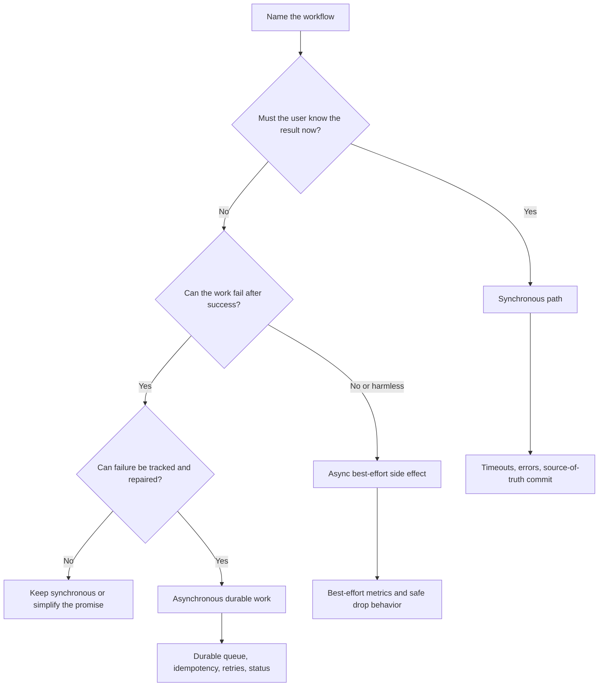

# Synchronous Vs Asynchronous Processing

Synchronous processing makes the caller wait for the result. Asynchronous
processing accepts work now and finishes it later. The right choice depends on
what the user must know immediately, how much delay is acceptable, and how the
system handles failure.

Do not choose async only because work is slow. Choose it when the workflow can
tolerate delayed completion and the system has a reliable way to track,
retry, observe, and repair that delayed work.

## Purpose

Use this decision guide to answer:

- What must be complete before the user sees success?
- Which work can safely happen after the request returns?
- How long can the user, caller, or business process wait?
- Who owns retries and failure reporting?
- Which consistency guarantee does the workflow need?
- What operational burden does the pattern introduce?

The goal is to separate user-visible decisions from background work without
losing correctness or visibility.

## When This Matters

This matters when:

- a request triggers slow or unreliable downstream work;
- a user expects immediate confirmation;
- a workflow has side effects such as email, payment, search indexing, or file
  processing;
- background work could fail after the user has seen success;
- consistency requirements are unclear;
- teams are adding queues or service calls without naming the failure mode.

## Questions To Ask

Start with the user-visible work:

- What does success mean to the user?
- Does success require a source-of-truth write?
- Does success require an external service response?
- Can the user continue if the side effect happens later?
- What status should the user see while work is pending?

Then map delay and failure:

- What is the maximum acceptable wait time?
- What happens if downstream work fails?
- Can the work be retried safely?
- Is duplicate processing harmful?
- How will operators see stuck or failed work?

## Decision Guidance

### Use Synchronous Processing When The Answer Matters Now

Choose synchronous processing when the caller needs the result before moving on.

Good fits:

- reading current state for a page;
- validating a command before accepting it;
- reserving scarce capacity;
- checking authorization;
- returning a payment authorization result when the checkout flow depends on it;
- rejecting invalid input immediately.

Design pressure:

- set clear timeouts;
- keep call chains short;
- return useful errors;
- avoid blocking on optional side effects;
- protect source-of-truth writes before returning success.

Synchronous processing is easier for users to understand, but it couples the
caller to receiver latency and availability.

### Use Asynchronous Processing When Completion Can Happen Later

Choose asynchronous processing when the workflow can accept work now and finish
it after the response.

Good fits:

- sending notifications;
- generating reports, thumbnails, or exports;
- processing imports;
- updating search or analytical views;
- retrying calls to unreliable providers;
- running moderation or review tasks that need a pending state.

Design pressure:

- store durable work before returning success;
- make processing idempotent;
- expose status when users care about completion;
- define retry limits, dead-letter handling, and repair paths;
- monitor queue age, failure rate, and worker health.

Asynchronous processing protects user latency and absorbs spikes, but it creates
delayed completion and operational work.

### User-Visible Work

The boundary between sync and async should follow the user's definition of
success.

Examples:

| Workflow | Must Be Synchronous | Can Be Asynchronous |
| --- | --- | --- |
| Submit permit application | validate required fields and persist application | scan attachments, send confirmation email |
| Reserve practice room | confirm the room is available and reserve it | update calendar search index, send reminder |
| Request data export | create export request and return tracking status | generate file and notify when ready |
| Update profile | persist profile changes needed for immediate reads | rebuild recommendations or analytics |

If the user sees "confirmed," the source-of-truth decision should already be
durable. Optional side effects can happen later if failures are visible and
repairable.

### Delay Tolerance

Delay tolerance should be explicit.

Common categories:

- immediate: user is blocked until the answer returns;
- seconds: user can wait on the page or refresh status;
- minutes: background processing is acceptable with progress state;
- hours: batch or scheduled processing is acceptable;
- best effort: work improves the experience but failure does not block the
  core workflow.

The longer the tolerated delay, the more reasonable async becomes. But async
still needs status, retries, and ownership when users or operators care about
completion.

### Failure Handling

Synchronous failure is visible immediately. Asynchronous failure happens after
the caller has moved on.

For synchronous flows:

- return a clear error or retryable state;
- avoid ambiguous success;
- time out instead of waiting forever;
- make client retries safe where possible.

For asynchronous flows:

- persist work durably before acknowledging it;
- record attempts and final failure state;
- retry with limits and backoff;
- route poison work to inspection;
- alert on stuck or aging work;
- provide a user-facing status when completion matters.

If the team cannot operate failed background work, async may make the system
less reliable even if the initial response becomes faster.

### Consistency

Synchronous and asynchronous choices affect what is true when the user reads
again.

Strong consistency is often needed when:

- a user must read their own accepted write immediately;
- a scarce resource could be double-booked;
- a permission change must take effect before access is granted;
- a payment or entitlement decision must be final before success.

Eventual consistency is often acceptable when:

- derived search results lag behind source-of-truth data;
- email or push delivery can happen after confirmation;
- dashboards can show a recent snapshot;
- reports can finish later and notify users.

When using async, state which read paths may lag and how the user can tell. A
pending status is better than pretending work is complete.

### Operational Complexity

Async adds moving parts. The design should include them explicitly.

Operational questions:

- Where is pending work stored?
- How do workers claim and retry work?
- What happens if a worker crashes mid-job?
- How are duplicates avoided or made harmless?
- What metric shows backlog pressure?
- Who repairs failed jobs?
- How is old work expired or archived?

Sync is not free either. Synchronous chains need timeouts, circuit breakers,
bulkheads, and clear degradation behavior when downstream systems fail.

## Decision Flow

## Trade-Offs

Synchronous and asynchronous processing optimize different risks.

- Synchronous work is easier to explain, but increases user-facing latency.
- Asynchronous work protects response time, but creates pending and failed
  states.
- Synchronous calls can cascade failures through a call chain.
- Asynchronous queues can hide failures until backlog or age is monitored.
- Strong immediate consistency simplifies user expectations, but may require
  blocking coordination.
- Eventual consistency can improve resilience, but needs clear status and
  repair behavior.

Use async to change when work completes, not to avoid designing failure.

## Common Mistakes

- Returning success before the authoritative write is durable.
- Moving work to a queue without idempotency or retry limits.
- Hiding failures from users who need completion.
- Blocking a user on optional notifications or analytics updates.
- Treating all slow work as async even when the result is required.
- Treating async as eventually correct without reconciliation or repair.
- Forgetting to expose pending, failed, and retrying states.
- Creating long synchronous chains without timeouts.

## Example

A community print shop lets residents upload posters, pay for printing, and
pick up completed orders.

Synchronous path:

- validate file type and size;
- create the print order;
- authorize payment or reserve account credit;
- return an order ID and current status.

Asynchronous path:

- scan the file for safety;
- render print previews;
- send confirmation email;
- notify staff when the order is ready;
- update daily reporting tables.

Design choices:

- The user should not see "order accepted" until the order and payment decision
  are durable.
- Preview generation can be asynchronous because the user can see `processing`
  and refresh later.
- Email delivery can retry in the background and should not block order
  acceptance.
- If file scanning fails, the order status changes to `needs review` or
  `rejected`, and operators can inspect the reason.
- Reporting can lag because it does not decide whether the order is accepted.

This keeps the critical promise synchronous and makes delayed work visible
instead of pretending everything completed at submit time.

## Decision Checklist

Before choosing sync or async, confirm:

- The user-visible success condition is written down.
- Required source-of-truth writes happen before success is returned.
- Optional or delayed side effects are separated from the critical path.
- Delay tolerance is explicit.
- Failure handling is defined for both immediate and delayed work.
- Async work is durable before acknowledgment when completion matters.
- Idempotency and duplicate handling are defined.
- Consistency expectations are clear for follow-up reads.
- Operators can see queue age, retries, failures, and stuck work.
- Version 1 uses the simplest pattern that satisfies the user promise.

## Related Pages

- [Communication overview](./)
- [Requirement discovery](../method/requirement-discovery.md)
- [Functional vs non-functional requirements](../method/functional-vs-nonfunctional-requirements.md)
- [Transactions](../data/transactions.md)
- [Operational vs analytical data](../data/operational-vs-analytical-data.md)
- [Trade-off vocabulary](../method/tradeoff-vocabulary.md)
- [Design review checklist](../method/design-review-checklist.md)
- [Glossary](../glossary.md)
