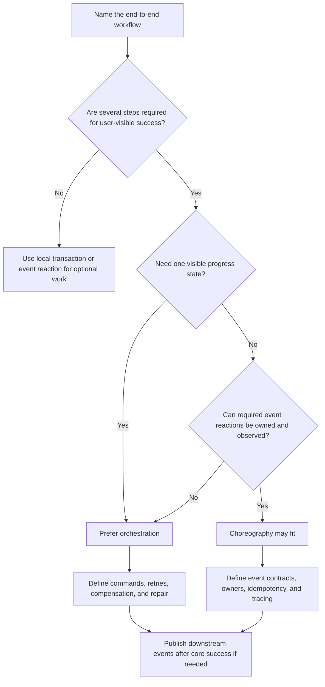

# Workflow Orchestration Vs Choreography

Workflow orchestration and choreography are two ways to coordinate a business
process that spans several steps or services.

Orchestration uses one coordinator to track state and decide the next command.
Choreography lets services react to events and move the process forward without
one central controller.

The choice is not about which style is more modern. It is about where workflow
state, ownership, debugging, and coupling should live.

## Purpose

Use this guide to answer:

- Does this workflow need one visible coordinator?
- Which team owns progress, retries, compensation, and stuck-state repair?
- How hard will the workflow be to debug during partial failure?
- Which dependencies should be explicit commands and which can be event
  reactions?
- How much coupling is acceptable between the participants?
- What is the simplest version 1 coordination model that operators can
  understand?

The goal is to choose a coordination style that makes the workflow reliable and
inspectable without adding unnecessary central control or hidden dependencies.

## When This Matters

This matters when:

- a workflow spans several services, data stores, or provider calls;
- a later step can fail after earlier steps already committed;
- retries and compensating actions need clear ownership;
- many teams or components participate in the same business process;
- required subscribers are hidden behind event reactions;
- operators need to answer "where is this workflow stuck?";
- the system is moving from a simple request path to a long-running workflow.

It matters less for optional side effects that can fail independently, or for
one-step writes that a local transaction can protect.

## Questions To Ask

Start with workflow ownership:

- Who owns the end-to-end user promise?
- Which component knows whether the workflow is complete?
- Where is the workflow state stored?
- Who can pause, retry, cancel, compensate, or manually repair the workflow?

Then map dependencies:

- Which steps are required for success?
- Which steps are optional reactions after success?
- Which services need commands from a coordinator?
- Which services can safely react to committed events?
- What correlation ID links every step?

Then check operations:

- How will support find the current step?
- How will engineers trace one workflow across services?
- How are duplicate events or commands handled?
- What happens when a participant is down for an hour?
- Which metrics show workflow age, stuck steps, retries, and compensation
  failures?

## Decision Guidance

### Orchestration

In orchestration, a coordinator owns the workflow state machine. It sends
commands, receives outcomes, records progress, and decides what happens next.

Good fits:

- multi-step approvals with explicit states and repair actions;
- workflows where required steps must happen in a specific order;
- payment, fulfillment, onboarding, or provisioning flows with ambiguous
  provider results;
- processes where support needs a single status page;
- flows with nontrivial compensation or cancellation rules.

Design pressure:

- keep the orchestrator responsible for workflow progress, not every
  participant's internal model;
- persist every meaningful state transition;
- make commands idempotent;
- time out and retry steps with clear limits;
- expose stuck, compensating, failed, and needs-review states;
- avoid putting unrelated workflows into one oversized coordinator.

Orchestration makes ownership and debugging clearer, but it also creates a
central workflow dependency.

### Choreography

In choreography, services publish events and other services react. Progress is
distributed across participants instead of controlled by one coordinator.

Good fits:

- simple event chains where each reaction is independently owned;
- optional or loosely coupled downstream reactions;
- workflows where adding a new reaction should not change the producer;
- event-driven systems with mature schema, tracing, and replay discipline;
- product areas where central workflow state would add more coupling than value.

Design pressure:

- publish committed facts, not commands hidden as events;
- document required event reactions and their owners;
- include correlation IDs and source versions;
- make every handler idempotent;
- expose lag, failure, and replay behavior for each participant;
- define what happens when a required reaction does not happen.

Choreography reduces direct command coupling, but it can make the real workflow
harder to see.

### Debugging Trade-Offs

Debugging is often the deciding factor.

| Concern | Orchestration | Choreography |
| --- | --- | --- |
| Current step | Read from coordinator state | Reconstruct from events and participant state |
| Stuck workflow | One owner can detect age and step timeout | Each participant must expose lag and failure |
| User support | Easier to show one status | Requires cross-service correlation |
| Root cause | Coordinator shows last command and response | Trace must connect event publication, delivery, and handling |
| Replay | Coordinator can retry selected steps | Event replay can affect many consumers |
| Manual repair | Central repair actions are easier to discover | Repair may require several service owners |

Choreography can be debuggable, but only when events, correlation IDs, owner
metadata, metrics, and runbooks are treated as part of the design.

### Coupling Trade-Offs

Both styles have coupling. They put it in different places.

Orchestration coupling:

- participants depend on coordinator commands;
- the coordinator knows workflow order and required steps;
- changes to the workflow often require coordinator changes;
- a coordinator outage can stop workflow progress.

Choreography coupling:

- consumers depend on event schemas and meaning;
- producers may not know which reactions are critical;
- required subscribers can become invisible dependencies;
- changing event meaning can break downstream behavior.

The practical question is whether explicit command coupling or implicit event
coupling is easier for the team to operate.

### Required Vs Optional Work

Separate required workflow steps from optional reactions before choosing a
style.

Required steps affect the user promise:

- "the booking is confirmed";
- "the payment is authorized";
- "the workspace is ready";
- "the permit is approved."

Optional or downstream reactions happen after the core promise:

- send confirmation email;
- update a search projection;
- feed analytics;
- refresh a public calendar.

Required steps often benefit from orchestration or at least explicit workflow
state. Optional reactions often fit event choreography, pub/sub, or outbox-based
delivery. A single product workflow can use both: orchestrate the core decision,
then publish an event for downstream reactions.

### When To Mix Them

Many good designs are hybrid.

Example hybrid structure:

1. An orchestrator coordinates required approval steps.
2. Each participant owns a local transaction and idempotent command handling.
3. The orchestrator records terminal approval.
4. The service writes an outbox event.
5. Choreographed subscribers send notifications, update projections, and feed
   reporting.

This keeps the user-visible decision inspectable while allowing downstream
systems to react without direct command coupling.

Mixing styles is reasonable when the boundary is explicit. It is risky when the
team cannot tell which steps are required for success and which are downstream
effects.

## Decision Flow



## Trade-Offs

Orchestration and choreography optimize different risks.

- Orchestration improves central visibility, but can become a workflow
  bottleneck.
- Choreography improves participant autonomy, but can hide required
  dependencies.
- Orchestration makes step retries and compensation easier to inspect, but
  couples participants to coordinator commands.
- Choreography makes adding subscribers easier, but event contracts become
  shared product contracts.
- Orchestration gives support one place to look, but that place must be reliable
  and well-modeled.
- Choreography avoids a central controller, but requires stronger tracing,
  ownership, and event hygiene.

Choose the style whose failure mode the team can operate.

## Common Mistakes

- Choosing choreography to avoid naming the workflow owner.
- Building a central orchestrator for optional side effects that could be event
  reactions.
- Treating event publication as proof that every required reaction succeeded.
- Letting required subscribers stay invisible to product and operations teams.
- Putting unrelated workflows into one large orchestrator.
- Comparing styles only by code simplicity and ignoring debugging.
- Skipping correlation IDs and idempotency keys.
- Showing user success before required workflow steps are durable or repairable.

## Example

A community tool library approves equipment rentals. The core user promise is:

```text
The reservation is approved only after staff approval, equipment availability,
and payment authorization are all confirmed.
```

Required steps:

| Step | Coordination Need |
| --- | --- |
| Staff approval | Must be recorded before approval can continue |
| Equipment hold | Must prevent conflicting reservations |
| Payment authorization | Provider result can be ambiguous and needs retry/review |
| Final approval | Must commit the reservation status and version |

Downstream reactions:

| Reaction | Coordination Need |
| --- | --- |
| Confirmation email | Retryable side effect; should not roll back approval |
| Calendar projection | Derived state; can be repaired from source state |
| Analytics event | Useful downstream data; can lag |

Reasonable design:

- Use orchestration for the required approval workflow because support needs one
  status, payment ambiguity needs review, and compensation may release the
  equipment hold.
- Use an outbox event after final approval.
- Use choreography for email, calendar, and analytics subscribers.

This hybrid keeps the approval decision explicit while avoiding direct calls
from the approval service to every downstream consumer.

## Decision Checklist

Before choosing orchestration or choreography, confirm:

- The user-visible success condition is written down.
- Required steps are separated from optional or downstream reactions.
- One component or team owns end-to-end progress.
- Workflow state location is explicit.
- Debugging path for a stuck workflow is clear.
- Coupling is named as either command coupling, event-contract coupling, or
  both.
- Commands and event handlers are idempotent.
- Correlation IDs connect all steps.
- Retry, timeout, compensation, and manual repair behavior are defined.
- Metrics cover workflow age, step failure, retry exhaustion, subscriber lag,
  and compensation failure.
- Version 1 uses the simplest coordination model that the team can operate.

## Related Pages

- [Communication overview](./)
- [Saga pattern](saga-pattern.md)
- [Pub/sub](pub-sub.md)
- [Outbox pattern](outbox-pattern.md)
- [Idempotency](idempotency.md)
- [Retries and backoff](retries-and-backoff.md)
- [Synchronous vs asynchronous processing](sync-vs-async.md)
- [Transactions](../data/transactions.md)
- [Design review checklist](../method/design-review-checklist.md)
