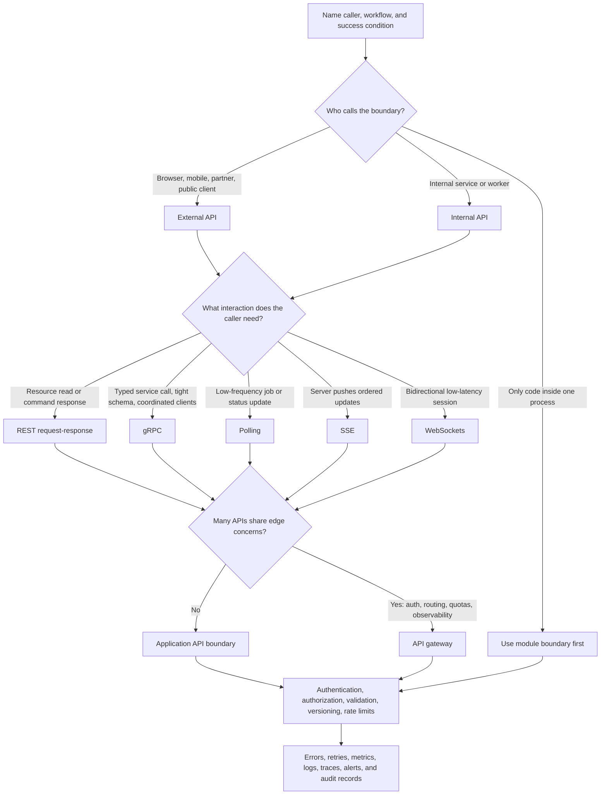

# API Layer

An API layer turns caller workflows into explicit contracts. It decides how
clients, services, partners, workers, and admin tools ask for data or commands,
how identity and permissions are checked, and how the system stays compatible as
callers change.

The goal is not to pick a fashionable protocol. The goal is to choose the
simplest boundary that makes the caller contract, security decision, validation,
failure behavior, and rate limit visible.

## Purpose

Use this page to decide:

- whether a workflow needs an external API, internal API, live update channel,
  or direct function/module boundary;
- whether REST, gRPC, WebSockets, SSE, or polling fits the caller's interaction
  pattern;
- whether an API gateway is justified or whether a simple application boundary
  is enough;
- where authentication, authorization, validation, versioning, rate limits, and
  observability belong;
- what failure modes the API layer must expose instead of hiding.

## When This Matters

Use this tree when:

- browsers, mobile apps, partner systems, services, workers, or admin tools call
  the system;
- the design needs a contract before the data model or component split is
  final;
- clients need live status updates or bidirectional interaction;
- public or partner clients can send invalid, abusive, repeated, or expensive
  requests;
- multiple services need a shared edge for auth, routing, quotas, or
  observability;
- version compatibility matters because clients deploy on a different schedule
  than the backend.

Skip a separate API layer when version 1 is a single process with one trusted
caller and no independent deployment boundary. In that case, keep a clear module
interface and revisit the API when a real caller or compatibility requirement
appears.

## Quick Decision

| If the caller needs... | Start with... | Watch for... |
| --- | --- | --- |
| Resource-style reads and commands for browsers, mobile apps, or partners | REST | Over-broad endpoints, weak validation, unclear error contracts |
| Typed service-to-service commands where both sides deploy often together | gRPC | Operational tooling, compatibility, load balancing, and debugging |
| Low-frequency status updates after a long-running request | Polling | Wasteful refreshes, synchronized spikes, and stale status |
| Server-to-client event updates without client commands on the same channel | SSE | Reconnect behavior, event IDs, authorization, and fanout |
| Bidirectional low-latency interaction | WebSockets | Stateful connections, backpressure, reconnects, and missed messages |
| Many APIs need shared auth, routing, quotas, or edge observability | API gateway | Central bottlenecks, hidden policy, and gateway-specific coupling |

Default to REST for public request/response APIs unless a stronger interaction
requirement justifies another protocol. Add a gateway only when shared edge
concerns are real.

## Questions To Ask

- Who is the caller: browser, mobile app, partner, service, worker, admin, or
  webhook sender?
- Is the caller trusted, semi-trusted, or untrusted?
- Does the caller need a resource read, a command, a stream of updates, or a
  bidirectional session?
- What must be true before the API returns success?
- Which identity is authenticated, and which action is authorized?
- Which fields, states, and transitions must be validated at the boundary?
- How will clients retry safely after timeouts, disconnects, or ambiguous
  responses?
- Which compatibility promise is needed: additive fields, versioned routes,
  typed contracts, or coordinated deployments?
- Which requests can become expensive, abusive, or noisy enough to rate limit?
- What should logs, metrics, traces, and audit records show for each API call?

## API Layer Decision Tree



Use the tree as a first pass. A system can use more than one API style, but each
style should map to a caller need. For example, a REST API can create an export
request, polling can show export status, and SSE can be deferred until users
need push updates.

## Requirements Discovered

| Requirement | Why It Matters | Design Impact |
| --- | --- | --- |
| Caller identity | The system must know who or what is asking | Authentication method, token/session handling, service identity |
| Action permission | The caller may be allowed to read but not write, export, approve, or administer | Authorization checks at the server boundary |
| Interaction pattern | Request/response, status updates, or bidirectional sessions have different costs | REST, gRPC, polling, SSE, or WebSockets |
| Input shape | Invalid or unexpected fields can corrupt state or create ambiguous behavior | Validation schema, error response, and rejected state transitions |
| Compatibility | Clients may deploy more slowly than the API | Versioning, additive changes, deprecation policy, contract tests |
| Abuse or overload risk | Some callers can repeat expensive requests cheaply | Rate limits, quotas, backpressure, and safe error responses |
| Operational visibility | Operators need to debug slow, denied, retried, or abusive calls | Request IDs, logs, metrics, traces, dashboards, and alerts |

## Options

| Option | Use When | Trade-Off |
| --- | --- | --- |
| Direct module boundary | One trusted process owns the workflow | No independent client contract or deployment boundary |
| REST API | Public or partner callers need resource reads and commands | Requires careful resource design, validation, and compatibility discipline |
| gRPC API | Internal services need typed contracts and efficient service calls | Harder for browsers and some debugging workflows; clients need generated or typed tooling |
| Polling | Status updates are simple, low frequency, or acceptable with delay | Can waste requests and serve stale status |
| SSE | Server needs to push one-way updates to clients | Reconnect, authorization, fanout, and event history need design |
| WebSockets | Clients and server exchange low-latency messages in both directions | Long-lived connection state, backpressure, and missed-message recovery |
| API gateway | Many APIs need shared edge policy, routing, quotas, or observability | Adds another operational component and can hide ownership if overused |

## Decision Guidance

### Start With The Caller Contract

Name the caller before naming the protocol.

Use this shape:

```text
Caller: <browser, mobile app, partner, service, worker, admin tool>
Workflow: <read, create, update, approve, export, subscribe, command>
Success means: <what must be durable or true before returning success>
Failure means: <retry, deny, pending, degraded, or manual repair>
Compatibility promise: <who can deploy independently?>
```

A contract is not just a URL. It includes request shape, response shape, error
shape, authentication, authorization, idempotency, rate limits, and
observability fields.

### Choose REST For Resource And Command APIs

REST is a practical default for public request/response APIs because most
clients, tools, caches, and operations teams understand HTTP resources, methods,
status codes, and JSON-style payloads.

Use REST when:

- browsers, mobile apps, partners, or admin tools need ordinary reads and
  commands;
- the API should be easy to inspect, log, test, and call manually;
- compatibility can be handled through additive fields, route versions, and
  clear deprecation;
- live updates are not the core interaction.

Watch for endpoints that hide too much. A route like `POST /do-everything` makes
authorization, validation, idempotency, and error handling harder to review.
Prefer names that match product actions and resources.

### Choose gRPC For Typed Internal Service Calls

gRPC can fit internal service-to-service calls when both sides value typed
contracts, generated clients, low overhead, and consistent schemas more than
broad client compatibility.

Use gRPC when:

- callers are controlled internal services or workers;
- contracts are shared through schemas and generated clients;
- the team can operate service discovery, load balancing, timeouts, retries, and
  debugging for gRPC traffic;
- browser compatibility or manual inspection is not the main requirement.

Do not choose gRPC only to make a design sound more advanced. If a REST endpoint
is clear, observable, and fast enough, it is often the simpler version 1.

### Choose Polling, SSE, Or WebSockets For Updates

Use polling when the client can ask for status occasionally. It is often enough
for exports, imports, report generation, review queues, and other workflows with
seconds or minutes of delay.

Use SSE when the server needs to push a stream of updates to the client and the
client does not need to send frequent messages on the same channel. Define event
IDs, reconnect behavior, authorization, and what happens when a client misses
updates.

Use WebSockets when both sides need low-latency messages, such as collaboration,
chat, presence, or rapidly changing interactive views. Design connection state,
reconnects, message ordering, backpressure, and offline recovery before treating
the connection as reliable.

### Add An API Gateway Only For Shared Edge Needs

An API gateway can be useful when multiple APIs need shared edge behavior:

- authentication and token verification;
- routing to several backend services;
- request size limits, quotas, and rate limits;
- TLS termination and request normalization;
- consistent access logs, metrics, tracing headers, and correlation IDs;
- partner-specific policies or traffic shaping.

Do not add a gateway just because a diagram has one. A single application can
usually handle its own auth checks, validation, rate limits, and observability
until several APIs need a shared edge. A gateway should make ownership clearer,
not become a hidden place where product policy lives.

### Put Auth, Validation, And Limits At The Boundary

Authentication proves identity. Authorization decides whether that identity can
perform this action on this resource. Validation proves the request is shaped
and constrained enough to process safely.

For every endpoint or method, define:

```text
Identity: <user, service, partner, worker, admin>
Permission: <action + resource + condition>
Validation: <required fields, state checks, size limits, allowed transitions>
Idempotency: <key, uniqueness scope, retry response>
Rate limit: <scope, budget, response, and bypass policy>
Audit: <which decisions or changes are recorded>
```

Rate limits should protect a named resource or abuse path. Common scopes include
anonymous IP, user, organization, API key, partner, endpoint, and expensive
operation. Return predictable errors and retry hints when the client can act on
them.

### Version APIs Around Client Independence

Versioning is needed when clients and servers cannot change together.

Prefer additive changes when possible:

- add optional request fields;
- add response fields without removing old ones;
- support old enum values and unknown future values;
- keep error formats stable;
- deprecate with dates and migration notes.

Use explicit versions when a change breaks existing callers, changes semantics,
or changes security expectations. Internal APIs with coordinated deployments may
use schema compatibility and contract tests instead of public route versions,
but they still need a compatibility story.

## Failure Modes

| Failure Mode | Impact | Design Response | Observable Signal |
| --- | --- | --- | --- |
| Missing or expired authentication | Caller cannot prove identity | Reject with a safe error and no sensitive detail | Auth failure count by route and caller type |
| Authorization bypass or stale permission | Caller sees or changes data they should not | Enforce server-side checks and re-check risky worker actions | Denied/allowed audit records, policy version, tenant mismatch logs |
| Invalid request shape | Bad data, ambiguous behavior, or downstream errors | Validate at the boundary and return field-level errors where safe | Validation failure rate and top rejected fields |
| Client retries after timeout | Duplicate creates, payments, reservations, or messages | Require idempotency keys for retryable commands | Duplicate key rate and ambiguous timeout count |
| Version mismatch | Old clients break or silently misread responses | Additive changes, explicit versions, contract tests, deprecation window | Error rate by client version |
| Rate limit exceeded | Expensive or abusive traffic crowds out normal use | Scope quotas and return predictable retry behavior | Limit decisions by caller, endpoint, and reason |
| Live connection drops | Client misses updates or reconnects in a loop | Reconnect protocol, event IDs, resumable status reads | Reconnect rate, missed event count, slow-client backpressure |
| Gateway unavailable or misconfigured | Many APIs fail at the edge | Health checks, fallback plan, config review, direct ownership of policies | Gateway 5xx, route errors, policy reload failures |

## Common Mistakes

- Choosing gRPC, WebSockets, or an API gateway before naming the caller problem.
- Treating authentication as authorization.
- Trusting client-side validation instead of enforcing rules on the server.
- Returning success before the source-of-truth decision is durable.
- Adding live push when polling would satisfy the freshness requirement.
- Versioning every small change instead of preserving additive compatibility.
- Forgetting idempotency for retryable creates and external side effects.
- Applying one global rate limit that punishes normal users while missing the
  expensive endpoint.
- Hiding gateway policy so service owners cannot explain why a request was
  allowed, denied, routed, or throttled.

## Original Example

A city tutoring program is building scheduling for students, tutors, and staff.
Students browse available sessions, book a slot, wait for reminders, and watch a
report export finish. A partner roster system sends nightly updates.

API decisions:

| Requirement | API Choice | Why It Fits | Deferred Until |
| --- | --- | --- | --- |
| Students and staff need normal reads and commands | REST API | Browser and mobile clients need inspectable request/response contracts | gRPC until there are internal services with typed call pressure |
| Booking must not create duplicate reservations on retry | REST command with idempotency key | A timeout or double-click should return the same booking result | More complex workflow engine until booking spans several independent steps |
| Export generation may take minutes | REST create request plus polling status endpoint | Version 1 can show progress without keeping live connections open | SSE until staff need push updates for many active exports |
| Tutor availability changes should eventually update browse results | Additive REST response fields with versioned semantics | Clients can deploy independently while the backend changes details | Breaking route version until semantics must change |
| Partner roster import is machine-to-machine | Authenticated partner endpoint with strict validation and rate limit | The boundary can reject malformed batches and protect import cost | API gateway until several partner APIs share routing and quota policy |

Version 1 can use one REST API for student, staff, and partner workflows, with
server-side auth checks, validation, idempotency keys for booking, scoped rate
limits, and polling for exports. It does not need WebSockets, SSE, gRPC, or an
API gateway until the caller requirements create those pressures.

## Checklist

Before leaving API layer design, confirm:

- Each API exists because a caller and workflow need it.
- REST, gRPC, WebSockets, SSE, or polling is chosen from interaction needs, not
  preference.
- Authentication and authorization are defined separately.
- Validation covers required fields, size limits, state transitions, and unsafe
  enum or type assumptions.
- Retryable commands have an idempotency key and duplicate response behavior.
- Versioning or schema compatibility matches the client deployment model.
- Rate limits name a scope, protected resource, and client response.
- Errors distinguish validation failure, authentication failure, authorization
  denial, rate limiting, conflict, timeout, and server failure where safe.
- Logs, metrics, traces, and audit records include request IDs and caller
  context without leaking secrets.
- Version 1 avoids gateways or live connections until the requirements justify
  them.

## Related Pages

- [Component selection map](./)
- [Communication patterns](../communication/)
- [Synchronous vs asynchronous processing](../communication/sync-vs-async.md)
- [REST vs gRPC](../communication/rest-vs-grpc.md)
- [Polling vs WebSockets vs SSE](../communication/polling-vs-websockets-vs-sse.md)
- [Idempotency](../communication/idempotency.md)
- [Authentication](../security/authentication.md)
- [Authorization](../security/authorization.md)
- [Rate limiting and abuse resistance](../security/rate-limiting-and-abuse.md)
- [Latency requirements](../requirements/latency.md)
- [Throughput requirements](../requirements/throughput.md)
- [Security requirements](../requirements/security.md)
- [Operability requirements](../requirements/operability.md)
