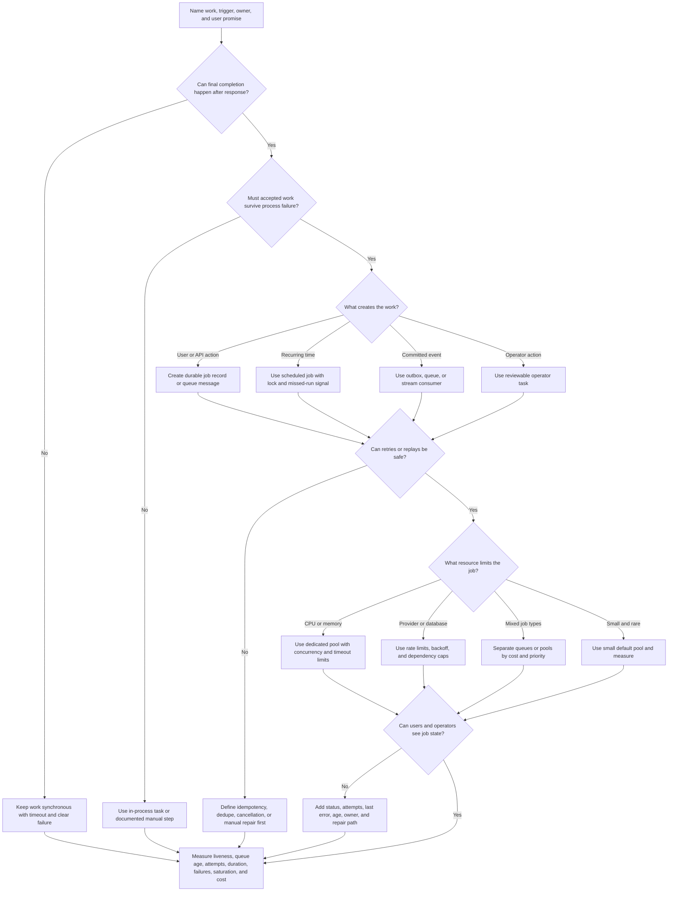
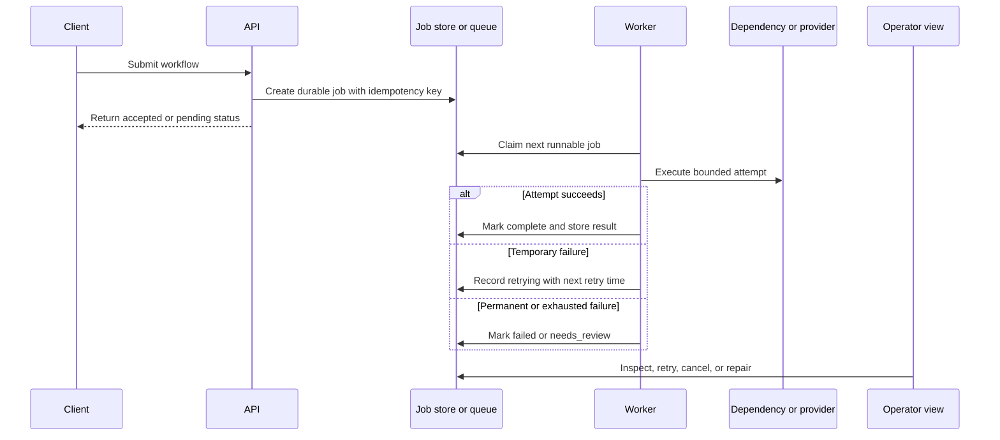

# Background Workers

Background workers run work outside the user-facing request path. They are
useful when work can finish later, needs retries, consumes CPU, calls a slow
provider, runs on a schedule, or should be isolated from interactive traffic.

Workers do not make work disappear. They turn immediate work into a job that
needs ownership, state, retry policy, concurrency limits, observability, and a
repair path. A good worker design explains what the user sees while work is
pending, how operators find stuck jobs, and what happens when workers fall
behind.

## Purpose

Use this page to decide:

- when delayed work should move from a request handler to a background worker;
- whether CPU-heavy work, provider calls, report generation, imports, exports,
  media processing, notifications, or cleanup tasks need worker isolation;
- how retryable tasks, scheduled jobs, and worker pools should be designed;
- what job visibility users, support, and operators need;
- which metrics prove the workers are alive, draining work, respecting
  downstream limits, and repairing failures.

This page focuses on worker execution. Queue selection, event-stream retention,
retry mechanics, and idempotency details are covered by related pages.

## When This Matters

Use this tree when:

- a user request waits for work that can finish after the response;
- work is CPU-heavy, memory-heavy, slow, flaky, or provider-bound;
- jobs need automatic retries, backoff, idempotency, or manual repair;
- a recurring or scheduled task must run reliably;
- a worker pool can overload a database, object store, API provider, or hot key;
- users or operators need status such as `pending`, `running`, `retrying`,
  `failed`, `complete`, or `needs_review`;
- a design says "use workers" without explaining job ownership, pool sizing,
  retries, visibility, or failure handling.

Skip background workers when the work is cheap, required before the user can
continue, not safe to retry, or not important enough to monitor. Use a direct
call, in-process task, manual step, or simpler scheduled script until the
workflow needs durable asynchronous execution.

## Quick Decision

| If the work has... | Start with... | Watch for... |
| --- | --- | --- |
| Final result required before response | Synchronous request path | Hiding incomplete work behind a fast response |
| Delayed but user-visible completion | Durable job plus worker status | Stuck jobs, duplicate work, and unclear user state |
| CPU-heavy processing | Dedicated worker pool with concurrency limits | Starving request traffic or overloading shared stores |
| Flaky provider or network dependency | Retryable job with backoff and idempotency | Retry storms, quota exhaustion, and ambiguous outcomes |
| Recurring maintenance or cleanup | Scheduled job with owner and missed-run alert | Silent missed runs and unsafe catch-up behavior |
| Several job types with different cost | Separate queues or worker pools | Head-of-line blocking and noisy-neighbor jobs |
| Low-volume judgment work | Manual review queue or operator task | Hiding human workflow behind fragile automation |

Default to the simplest path that preserves the user promise. Add durable
workers when the workflow can tolerate delay and the system can expose job
state, retries, pool health, and repair.

## Questions To Ask

- What work is being moved out of the request path?
- Who creates the job: API, queue consumer, scheduler, event handler, import,
  or operator?
- What does the user or caller need to know before continuing?
- Is the job delayed, CPU-heavy, retryable, scheduled, provider-bound, or
  manually reviewed?
- What makes two job attempts the same business operation?
- Which failures are temporary, permanent, ambiguous, or unsafe to retry?
- Does the job need ordering, dedupe, cancellation, timeout, or priority?
- Which worker pool owns the job, and what limits protect shared dependencies?
- How are scheduled jobs locked, caught up, skipped, or alerted when missed?
- What status, metrics, logs, traces, alerts, and runbooks make job visibility
  useful?

## Background Worker Decision Tree



Use the tree to decide whether workers are justified and which worker
obligations must exist before launch. If the tree returns "define visibility
first," the worker may be technically possible but operationally unsafe.

## Requirements Discovered

| Requirement | Why It Matters | Design Impact |
| --- | --- | --- |
| Delay tolerance | The workflow must decide what can finish later | Drives accepted, pending, complete, failed, and timeout states |
| Job trigger | Work can start from API actions, schedules, events, imports, or operators | Drives queue, job table, schedule, outbox, or manual task choice |
| Retry safety | Workers crash and dependencies fail after partial work | Drives idempotency keys, dedupe, attempts, and repair records |
| Workload shape | CPU-heavy, provider-bound, and mixed jobs scale differently | Drives worker pool split, concurrency limits, and resource isolation |
| Scheduled ownership | Recurring jobs can be missed, duplicated, or catch up unsafely | Drives schedule lock, owner, deadline, and missed-run alert |
| Job visibility | Async work is invisible unless state is modeled | Drives status fields, user messages, support tools, metrics, and runbooks |
| Backpressure | Workers can overload downstream systems while draining backlog | Drives rate limits, queue caps, priority, and dependency protection |
| Observability | Operators need proof that workers are alive and safe to scale | Drives liveness, duration, retry, failure, saturation, and repair metrics |

## Options

| Option | Use When | Trade-Off |
| --- | --- | --- |
| Synchronous call | Work must complete before user continues | Simple outcome, but user waits for slow or flaky work |
| In-process background task | Best-effort work can be lost safely on process crash | Easy version 1, but weak durability and observability |
| Durable job table | Work state should be queryable, repairable, and tied to source data | Strong visibility, but needs polling or dispatch logic |
| Queue plus workers | Producers and workers should run independently with durable retries | Adds duplicate delivery, backlog, idempotency, and operations |
| Scheduled worker | Recurring cleanup, export, sync, rotation, or report generation | Needs missed-run detection, locking, and catch-up policy |
| Dedicated CPU worker pool | CPU-heavy jobs should not starve request handlers | Better isolation, but capacity and job duration must be managed |
| Provider-limited pool | External dependency has quotas, rate limits, or variable latency | Protects provider, but slows backlog and needs freshness targets |
| Manual review task | Automation is risky, low-volume, or judgment-heavy | Safer decisions, but creates operational workload and delays |

## Decision Guidance

### Start With The Job Promise

Describe the job before choosing a worker pool.

Use this shape:

```text
Job: <notification, export, import row, thumbnail, report, cleanup, provider call>
Trigger: <API command, queue message, schedule, event, operator action>
Owner: <team, service, module, worker pool, or operator group>
User promise: <complete now, accepted, pending, visible by deadline, best effort>
State: <pending, running, retrying, failed, needs_review, complete, cancelled>
Retry rule: <temporary errors, max attempts, backoff, jitter, timeout>
Idempotency key: <job id, source entity + version, provider attempt, schedule window>
Pool limit: <CPU, memory, provider quota, database load, tenant fairness>
Repair path: <retry, replay, cancel, edit input, quarantine, manual review>
```

If this statement is hard to fill in, the worker design is probably premature.

### Use Workers For Delayed Or Isolated Work

Workers are useful when the request handler should not do all the work itself:

- send notifications after a source-of-truth write commits;
- generate exports or reports that take longer than a request deadline;
- process images, videos, documents, or uploaded files;
- import rows and record per-row success or failure;
- call slow or flaky providers with retries;
- run cleanup, retention, billing, sync, or reconciliation tasks;
- rebuild derived views, indexes, thumbnails, or summaries.

Keep work synchronous when the caller must know final success before continuing
or when async status would make the product harder to understand. Moving work to
a worker improves request latency only if the product can honestly represent
the delayed outcome.

### Separate Queues From Workers

A queue stores work. A worker executes work. A scheduler decides when recurring
work should be created. A stream stores event history. These components often
work together, but they solve different problems.

Use this division:

- queue or job table: durable work and backlog;
- worker: execution, retries, side effects, status updates;
- scheduler: recurring trigger and missed-run detection;
- stream: retained facts for multiple consumers or replay;
- operator queue: human review and repair.

Do not use a worker pool as an excuse to skip job state. If support needs to
answer "what happened to this export?" the job needs an inspectable record even
when the queue message is gone.

### Make Job State Visible

Async work needs status because the request response no longer proves final
completion.

Useful job fields include:

- job ID and source entity ID;
- job type and trigger;
- owner, tenant, or user when safe to store;
- status such as `pending`, `running`, `retrying`, `failed`,
  `needs_review`, `complete`, or `cancelled`;
- attempt count, max attempts, and last attempt time;
- next retry time and retry reason;
- worker pool and worker instance when helpful;
- last safe error category, not raw private payload;
- idempotency key and dedupe result;
- created, started, finished, deadline, and updated timestamps;
- repair action and operator note when manual repair is possible.

Users may only need a simple state such as "processing" or "ready." Operators
need enough context to debug, retry, cancel, or repair the job safely.

### Design Worker Pools Around Bottlenecks

Worker pool size should match the limiting resource.

Ask what gets saturated first:

- CPU or memory for media processing, compression, parsing, or calculations;
- database writes for imports, projections, or reconciliation;
- provider quota for email, SMS, payment, search, or third-party APIs;
- object storage bandwidth for large uploads, downloads, or derivatives;
- one tenant, key, file, account, or customer with many jobs;
- human review capacity for manual workflows.

More workers can make a backlog drain faster, but they can also multiply
timeouts, lock contention, provider errors, and cost. Use concurrency limits,
rate limits, per-tenant caps, priority rules, or separate pools when one job
type can harm another.

### Treat Scheduled Jobs As Products

Scheduled jobs fail differently from user-triggered jobs. They can be skipped,
run twice, overlap with the previous run, or catch up too aggressively after an
outage.

For each scheduled job, define:

- schedule and time zone if human time matters;
- owner and runbook;
- lock or leader election rule if more than one worker can run it;
- deadline and freshness target;
- behavior for missed runs: skip, catch up one, catch up all, or manual review;
- idempotency key such as job name plus scheduled window;
- safe batch size and pause/resume behavior;
- success evidence and missed-run alert.

Do not rely on "the cron runs somewhere" for important cleanup, retention,
billing, or reconciliation. Scheduled work needs the same visibility and repair
standards as other jobs.

### Keep Retries Bounded And Idempotent

Workers often retry because they run outside the user response path. Retrying is
safe only when duplicate attempts cannot create duplicate business effects.

Define:

- which errors retry and which fail fast;
- per-attempt timeout and total job deadline;
- backoff and jitter;
- maximum attempts;
- idempotency key for source writes and external side effects;
- what state appears after retry exhaustion;
- how replay differs from retry.

Retry exhaustion should not vanish. It should produce a visible failed,
dead-lettered, quarantined, or `needs_review` state with enough information to
repair.

## Worker Execution Shape



This shape makes background work inspectable. The queue or job store is not only
a transport mechanism; it is also the source of evidence for user status,
support debugging, retries, and repair.

## Trade-Offs

| Choice | Improves | Costs Or Risks |
| --- | --- | --- |
| Keep work synchronous | Simple final outcome and easier debugging | User waits for slow work and provider failures |
| Use in-process tasks | Small implementation for best-effort work | Lost work on process crash and weak visibility |
| Use durable workers | Better latency, retry, and isolation for delayed work | More states, queues, idempotency, and operations |
| Use one shared pool | Simple deployment and utilization | Head-of-line blocking and noisy-neighbor job types |
| Split worker pools | Better isolation and dependency protection | More capacity planning and routing policy |
| Increase concurrency | Faster drain when workers are the bottleneck | Downstream overload, retry storms, and higher cost |
| Use scheduled jobs | Automates recurring maintenance or reports | Missed runs, duplicate runs, and catch-up policy |
| Manual repair | Handles rare or judgment-heavy cases safely | Slower resolution and operational workload |

## Failure Modes

| Failure Mode | Impact | Design Response | Observable Signal |
| --- | --- | --- | --- |
| Job accepted but never created | User sees pending work that cannot run | Create job in the same durable boundary as accepted state | Accepted-without-job count, support reports |
| Worker crashes mid-attempt | Work may repeat or remain stuck | Idempotency key, attempt timeout, lease expiry, and retry | Stale running jobs, worker restart count |
| Job retries unsafe side effect | Duplicate emails, charges, exports, or provider calls | Side-effect records and provider idempotency keys | Duplicate suppression count, idempotency conflicts |
| Worker pool overloads database or provider | Downstream latency and failures grow | Concurrency caps, rate limits, backoff, and separate pools | Dependency timeout rate, quota errors |
| CPU-heavy jobs share request capacity | User-facing latency rises | Dedicated pool or separate compute capacity | Request p95, worker CPU, queue age |
| Scheduled job is missed | Cleanup, report, sync, or retention work does not happen | Missed-run alert, owner, and catch-up policy | Last successful run age |
| Scheduled job runs twice | Duplicate cleanup, billing, notification, or export | Schedule-window idempotency and distributed lock | Duplicate scheduled run count |
| Job has no visible state | Users and support cannot tell whether work is stuck | Model status, attempts, last error, and repair action | Jobs without terminal state, support escalations |
| Poison job blocks a pool | Later jobs wait behind one permanent failure | Max attempts, quarantine, dead-letter, and priority rules | Retry exhaustion, oldest job age |
| Manual replay repeats old side effects | Repair causes new damage | Replay mode, side-effect guards, and operator confirmation | Replay attempt count, duplicate side effects |

## Common Mistakes

- Moving work to a background worker without naming the user-visible pending
  state.
- Treating worker retries as safe before defining idempotency.
- Letting one shared worker pool run CPU-heavy, provider-bound, and urgent jobs
  together.
- Scaling workers without checking the database, provider, lock, hot key, or
  cost bottleneck.
- Running scheduled jobs without missed-run alerts, locks, or catch-up rules.
- Hiding permanent failures in infinite retries.
- Logging raw payloads or private data to debug failed jobs.
- Deleting queue messages before durable job status or side-effect results are
  recorded.

## Original Example

A neighborhood clinic portal lets patients request vaccination records. The API
can confirm the request quickly, but generating the PDF, calling the legacy
records provider, and emailing the result may take minutes.

The team walks the tree:

- The user can continue after the request, so the API creates a durable
  `record_export` job and returns `pending`.
- The job is tied to one patient request and has an idempotency key based on the
  request ID plus export version.
- Workers call the records provider with bounded timeout, retry temporary
  failures with backoff, and stop on permission or validation failures.
- PDF generation runs in a separate CPU-limited pool so exports do not slow the
  API.
- Email sending records one send attempt per export version and recipient so
  retries do not send duplicate messages.
- The patient sees `pending`, `ready`, or `failed_contact_support`. Operators
  see attempts, last safe error category, next retry time, and repair actions.
- A nightly scheduled job expires old export files. It uses one schedule-window
  key, records last successful run, and alerts if it misses the freshness
  target.

Interview answer frame:

```text
Work: generate and deliver vaccination record export.
Trigger: API request creates durable job after authorization.
User promise: accepted now, downloadable or emailed when ready.
Pool: CPU-limited PDF workers plus provider-limited delivery workers.
Retry: temporary provider failures retry with backoff and idempotency.
Visibility: job status, attempts, last error category, next retry, repair action.
Scheduled job: nightly export expiry with lock, run evidence, and missed-run alert.
Revisit signal: job age, retry exhaustion, provider timeouts, CPU saturation,
duplicate suppression, and support escalations.
```

Version 1 can use one durable job table and a small worker process. It should
not skip job status, idempotency, retry limits, or missed scheduled-job
visibility because those decisions protect users from silent failures and
duplicate side effects.

## Checklist

Before adding background workers, confirm:

- The delayed work, CPU-heavy work, retryable task, scheduled job, or manual
  review task is named.
- The user or caller promise explains whether work is complete, accepted,
  pending, failed, or best effort.
- The job trigger, owner, source entity, and durable storage boundary are clear.
- Job state includes enough visibility for users, support, and operators.
- Retryable and non-retryable failures are classified.
- Idempotency keys, dedupe records, or processed markers protect duplicate
  attempts and replay.
- Worker pools are sized or split around CPU, memory, provider quota, database
  pressure, priority, and tenant fairness.
- Scheduled jobs have owner, lock, schedule-window key, missed-run alert,
  deadline, and catch-up policy.
- Timeouts, max attempts, backoff, jitter, cancellation, and retry exhaustion
  behavior are defined.
- Dead-letter, quarantine, manual repair, or operator replay paths are
  documented for stuck or exhausted jobs.
- Logs and job errors avoid raw private payloads while preserving useful
  debugging context.
- Metrics include worker liveness, active workers, job age, job duration,
  attempts, retry exhaustion, failure rate, dependency errors, CPU/memory,
  queue depth where applicable, manual repairs, and cost.

## Related Pages

- [Component selection map](index.md)
- [Queue](queue.md)
- [Stream](stream.md)
- [API layer](api-layer.md)
- [Object storage](object-storage.md)
- [Sync vs async](../communication/sync-vs-async.md)
- [Retries and backoff](../communication/retries-and-backoff.md)
- [Idempotency](../communication/idempotency.md)
- [Outbox pattern](../communication/outbox-pattern.md)
- [Latency requirements](../requirements/latency.md)
- [Throughput requirements](../requirements/throughput.md)
- [Operability requirements](../requirements/operability.md)
- [Graceful degradation](../reliability/graceful-degradation.md)
- [Component metrics catalog](../operations/component-metrics-catalog.md)
- [Runbooks](../operations/runbooks.md)
- [Capacity planning](../operations/capacity-planning.md)
