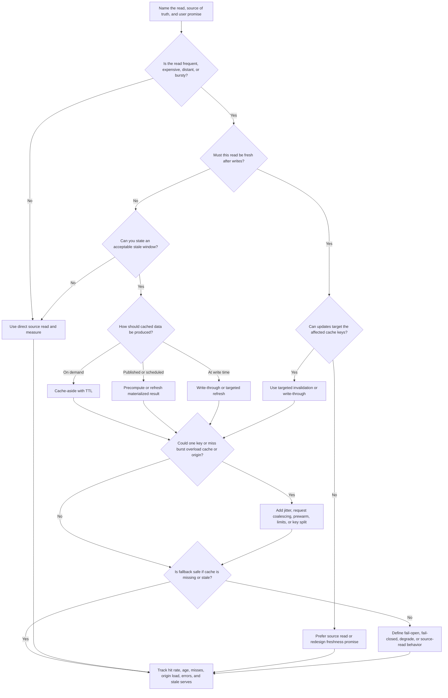

# Cache

A cache stores a reusable answer outside the source-of-truth path so repeated
reads can be faster, cheaper, or less load-bearing. A cache is useful only when
the system can tolerate the freshness, invalidation, fallback, and operational
work it adds.

The goal is not to cache every slow query. The goal is to identify the read
pressure, define the freshness promise, and keep the source of truth correct
when cached data is missing, stale, overloaded, or wrong.

## Purpose

Use this page to decide:

- whether a read-heavy or expensive path justifies a cache;
- which reads are safe to serve stale and which must stay fresh;
- whether TTL, explicit invalidation, write-through, precomputation, or no cache
  is the right first move;
- how hot keys, cache misses, origin fallback, and cache outages should behave;
- what metrics prove the cache improves the system instead of hiding a design
  problem.

This page focuses on cache decisions for system design. It does not compare
specific cache products or tune low-level eviction algorithms.

## When This Matters

Use this tree when:

- a read path is repeated often enough to affect latency, cost, or origin load;
- the source read is expensive because it joins, aggregates, calls another
  service, renders a page, or fetches a large object;
- users can tolerate a named amount of stale data;
- launch traffic, public browse pages, or one hot item could overload the
  source of truth;
- a design already includes a cache but does not explain invalidation,
  fallback, or hot-key behavior.

Skip a cache when the read must be fresh, the workload is modest, the query can
be fixed with a simple index, or the team cannot explain what happens on a
cache miss. Start with the simplest source-of-truth read and add the cache when
measurement shows pressure.

## Quick Decision

| If the read path has... | Start with... | Watch for... |
| --- | --- | --- |
| Modest traffic and a fixable query | No cache; optimize source read first | Premature staleness and invalidation work |
| Frequent repeated reads with bounded staleness | Cache-aside with TTL | Miss storms, stale data, and uneven hit rates |
| Published content that changes rarely | Precomputed view or edge/cacheable response | Slow propagation and purge mistakes |
| Expensive aggregate that can lag | Materialized result refreshed on a schedule or event | Lag, rebuild failures, and unclear freshness labels |
| Freshness after write is required | Source-of-truth read or targeted invalidation | Users seeing old state after successful commands |
| One item, tenant, or key is extremely popular | Hot-key mitigation with coalescing, jitter, or prewarming | Cache node overload and origin stampede |
| Origin or cache failure must not break core flow | Defined fallback behavior | Serving unsafe stale data or overloading the origin |

Default to no cache until a named read is frequent or expensive and stale data is
acceptable. Add the smallest cache behavior that satisfies the read pressure and
write down its freshness, invalidation, and fallback rules.

## Questions To Ask

- Which specific read is slow, repeated, expensive, distant, or overloading the
  source?
- What is the source of truth for the cached answer?
- How stale can this answer be before it becomes harmful?
- What update makes the cached answer unsafe?
- Should the cache be populated on read, write, publish, schedule, or deploy?
- What should happen on miss, stale entry, timeout, eviction, or cache outage?
- Can one key, tenant, user, item, or page become much hotter than the rest?
- Is the cached data public, private, permissioned, personalized, or sensitive?
- How will operators see hit rate, miss rate, stale age, origin load, key
  concentration, and fallback behavior?
- What metric should trigger removing, changing, or expanding the cache?

## Cache Decision Tree



Use the tree to decide whether a cache is justified at all. If the tree returns
direct source read, that is a design decision, not a failure to optimize.

## Requirements Discovered

| Requirement | Why It Matters | Design Impact |
| --- | --- | --- |
| Read frequency | A cache only helps if enough requests reuse the answer | Drives cache-aside, precompute, or no-cache choice |
| Read cost | Expensive joins, aggregations, remote calls, rendering, or large payloads may need relief | Drives caching, materialized views, or query redesign |
| Freshness window | Staleness is safe for some reads and harmful for others | Drives TTL, invalidation, source read, or freshness label |
| Invalidation trigger | Updates can make cached data unsafe | Drives key design, purge events, write-through, or direct reads |
| Fallback behavior | Misses and outages happen during normal operation | Drives origin protection, stale-if-safe, degrade, or fail-closed rules |
| Hot-key risk | One key can overload a cache node or stampede the origin | Drives jitter, request coalescing, prewarming, limits, or key splitting |
| Data sensitivity | Caches can leak private or permissioned data if keys are wrong | Drives cache scope, auth checks, and safe key construction |
| Observability | Operators need proof that caching helps and does not hide bugs | Drives hit/miss metrics, age, stale serves, origin load, and alerts |

## Options

| Option | Use When | Trade-Off |
| --- | --- | --- |
| No cache | Source reads meet latency/load targets or freshness is strict | Simplest correctness, but may need query/index work or later revisit |
| Cache-aside with TTL | Repeated reads can be stale for a bounded window | Simple to add, but misses, stale data, and stampedes need handling |
| Targeted invalidation | Writes can identify affected keys | Fresher reads, but key tracking and missed invalidations are risky |
| Write-through or write-refresh | The write path can update cache safely with the source | Better post-write freshness, but write latency and partial failure increase |
| Precomputed/materialized result | Expensive aggregate or page can be refreshed on a schedule or event | Protects origin, but adds lag, rebuild, and stale-result behavior |
| Edge or HTTP cache | Public or cacheable content is safe to serve near users | Requires cache-control, purge rules, signed/private content discipline |
| Stale-if-safe fallback | Serving old data is better than failing for this read | Improves availability, but can mislead users if freshness is not visible |
| Fail-closed source read | Stale data would harm correctness, permissions, or money-like state | Safer correctness, but higher latency or temporary errors |

## Decision Guidance

### Start With The Read, Not The Cache

Name the read path before choosing a pattern.

Use this shape:

```text
Read: <page, API, aggregate, object, lookup, or search result>
Source of truth: <table, document, service, file, or derived job>
Pressure: <latency, throughput, cost, distance, burst, or expensive compute>
Freshness: <must be fresh, seconds, minutes, hours, publish cycle>
Invalidation: <which write, publish, deploy, or schedule makes it unsafe>
Fallback: <source read, stale-if-safe, degraded response, fail closed>
Revisit signal: <hit rate, p95, origin load, stale bugs, cost, hot key>
```

If this statement is hard to fill in, the cache is probably premature.

### Use No Cache When Correctness Is Simpler

No cache is the right version 1 when:

- the source read is already fast enough;
- the path has low or unpredictable reuse;
- the read must be fresh after writes;
- an index, pagination, smaller payload, or better query shape fixes the
  problem;
- the team cannot yet operate invalidation, hot keys, or fallback behavior.

Avoid adding a cache as a substitute for understanding the data model. A cache
can reduce load, but it cannot make unclear ownership or broken queries safe.

### Use Cache-Aside With TTL For Repeated Stale-Tolerant Reads

Cache-aside means the application checks the cache first, reads from the source
on a miss, stores the result with a TTL, and returns the answer. It is a common
starting point for repeated reads because the source of truth remains explicit.

Before using it, define:

- key format and scope;
- TTL and whether jitter is used;
- maximum acceptable stale age;
- miss behavior and request coalescing if many callers miss at once;
- what happens if the source read fails;
- whether negative results can be cached and for how long.

TTL is not a correctness policy by itself. It is a freshness upper bound only if
the system can tolerate old data until the TTL expires.

### Invalidate Only When Key Ownership Is Clear

Invalidation can keep cached data fresher, but only when the update path knows
which cached answers became unsafe.

Good invalidation candidate:

```text
Publishing menu 2026-06-01 invalidates cache key menu:2026-06-01 and the
public menu index.
```

Weak invalidation candidate:

```text
Any reservation change might affect many browse pages, filters, and counts.
```

When invalidation is broad or uncertain, prefer shorter TTLs, source reads for
critical commands, or a precomputed view with explicit rebuild behavior. Missed
invalidations are stale-read bugs, not harmless implementation details.

### Protect The Origin On Misses

A cache can fail by sending too much traffic back to the source. This happens
when many keys expire together, a popular key is evicted, a node restarts, or a
launch sends many first-time requests.

Mitigations include:

- TTL jitter so many keys do not expire at once;
- request coalescing so one miss refreshes a key while others wait or receive
  a safe stale value;
- prewarming known hot keys before launch;
- per-key and per-tenant limits;
- circuit breakers or degraded responses when the origin is saturated;
- stale-if-safe behavior for informational reads.

Do not assume the cache only reduces load. During failure, it can amplify load
unless fallback is designed.

### Design Hot-Key Behavior Explicitly

Hot keys happen when one page, item, tenant, user, object, or counter receives
far more traffic than the rest. A cache can help a hot read, but it can also
concentrate load on one cache partition.

Design questions:

- Can the hot result be replicated, precomputed, or edge cached?
- Can callers share one refresh through request coalescing?
- Can the key be split by region, segment, or version without breaking
  freshness?
- Should the product show approximate or delayed values during a spike?
- Which metric shows per-key load rather than average hit rate?

Average hit rate can look healthy while one hot key is failing.

### Treat Fallback As Part Of The Contract

Every cache read needs a fallback decision.

Common fallback choices:

- source read on miss;
- source read only when the origin is healthy;
- stale-if-safe with a visible age or pending marker;
- degraded response without optional data;
- fail closed when stale data would expose private, unsafe, or money-like state.

Choose fail closed for authorization decisions, scarce-resource confirmation,
account balance, irreversible commands, or anything where stale data could
grant access or corrupt state. Choose stale-if-safe for public menus, status
pages, catalog browse, and dashboards where the stale window is visible and
acceptable.

## Trade-Offs

| Choice | Improves | Costs Or Risks |
| --- | --- | --- |
| No cache | Correctness, simplicity, and direct debugging | Source load and latency may rise with repeated reads |
| Cache-aside with TTL | Lower read latency and origin load | Stale data, miss storms, TTL tuning, and cache outages |
| Targeted invalidation | Fresher cached reads | Key tracking, missed invalidations, and write-path coupling |
| Write-through/refresh | Better read-your-writes behavior | Slower writes and partial source/cache failure handling |
| Precomputed result | Efficient expensive aggregates | Lag, rebuild operations, and stale or failed refreshes |
| Stale-if-safe fallback | Better availability during cache or origin trouble | Users may see old data if freshness is unclear |
| Hot-key mitigation | Protects cache and origin during skewed traffic | More key design, monitoring, and operational policy |

## Failure Modes

| Failure Mode | Impact | Design Response | Observable Signal |
| --- | --- | --- | --- |
| Cache serves stale data after an important update | Users act on old status, price, availability, or permissions | Use targeted invalidation, shorter TTL, source recheck, or fail closed | Stale-read reports, cache age, invalidation failures |
| Cache miss storm overloads the source | Latency rises or origin fails when cache expires or restarts | Add TTL jitter, request coalescing, prewarming, and origin limits | Miss rate spike, origin CPU, database QPS, p95 latency |
| Hot key overloads one cache partition | One popular item fails while average metrics look healthy | Replicate, split, coalesce, precompute, or rate limit the hot key | Per-key QPS, partition CPU, timeout rate for one key |
| Cache outage becomes full product outage | Reads fail even though source of truth is healthy | Define source-read fallback, degraded response, or fail-closed behavior | Cache error rate, fallback count, origin load |
| Personalized data leaks through shared key | A user sees another user's private or permissioned result | Include identity/permission scope in keys or avoid shared caching | Security report, key-scope audit, unexpected cache hit |
| Negative cache hides newly created data | A missing result remains cached after creation | Use short negative TTL or invalidate on creation | Negative-hit rate, create-then-read complaints |
| Background refresh silently fails | Precomputed data becomes stale without visibility | Track refresh age, failures, and manual rebuild path | Refresh lag, failed jobs, last-success timestamp |

## Common Mistakes

- Adding a cache before naming the read path, source of truth, and stale window.
- Treating TTL as a complete invalidation strategy for data that must be fresh.
- Caching authorization, permission, or account-state decisions without a
  fail-closed rule.
- Measuring only average hit rate and missing hot-key concentration.
- Letting cache misses stampede the source during deploys, restarts, or expiry.
- Caching every query instead of fixing indexes, payload size, or pagination.
- Forgetting negative-cache behavior for newly created records.
- Serving stale data without a visible age, pending state, or source recheck
  when users can act on it.
- Making writes update both source and cache without defining partial-failure
  recovery.

## Original Example

A city recreation site lets residents browse class schedules, reserve limited
spots, and check their own enrollment status.

The team walks the tree:

- The public class schedule is read-heavy during registration week, changes only
  when staff publish updates, and can be stale for up to two minutes. Use a
  cache-aside or precomputed published schedule with TTL and targeted purge on
  publish.
- The "reserve spot" command must check fresh capacity and prevent double
  booking. Do not trust the cached schedule for final success; recheck the
  source of truth inside the reservation write.
- A few popular classes become hot keys. Add TTL jitter and request coalescing
  for class detail pages, and prewarm known launch pages before registration
  opens.
- The "my enrollment" page is personalized. Cache only if the key includes user
  identity and permission scope, or read directly from the source for version 1.
- If the cache is unavailable, public browse pages may read from source with a
  rate limit or serve a clearly aged published copy. Reservation writes fail
  closed or retry against the source rather than accepting stale capacity.

Decision statement:

```text
Read: public class schedule and class detail pages.
Source of truth: classes, schedules, and reservations in the operational database.
Pressure: read-heavy launch traffic and a few hot class pages.
Freshness: public schedule may lag by up to two minutes; reservations must be fresh.
Invalidation: staff publish invalidates affected class and schedule keys.
Fallback: public browse can serve stale-if-safe; reservation writes recheck source.
Revisit signal: hit rate below target, origin p95 rises, stale-read reports, or hot-key timeouts.
```

## Checklist

Before adding a cache, confirm:

- The cached read path is named.
- The source of truth is named.
- The read is frequent, expensive, distant, bursty, or otherwise load-bearing.
- Freshness and stale-window expectations are explicit.
- Invalidation triggers and cache key ownership are clear.
- TTLs have a reason, and jitter is considered for many expiring keys.
- Miss, stale-entry, timeout, eviction, and cache-outage behavior is defined.
- Hot-key risk is considered with per-key metrics, not only average hit rate.
- Private or permissioned data cannot leak through shared cache keys.
- The origin is protected from stampedes and fallback overload.
- Metrics cover hit rate, miss rate, stale age, origin load, key skew, errors,
  and fallback count.
- Version 1 keeps direct source reads where freshness matters.

## Related Pages

- [Components](./)
- [Component selection map](index.md)
- [Database selection](database-selection.md)
- [Latency requirements](../requirements/latency.md)
- [Throughput requirements](../requirements/throughput.md)
- [Scalability requirements](../requirements/scalability.md)
- [Consistency requirements](../requirements/consistency.md)
- [Read and write patterns](../data/read-write-patterns.md)
- [Indexes](../data/indexes.md)
- [Design review checklist](../method/design-review-checklist.md)
