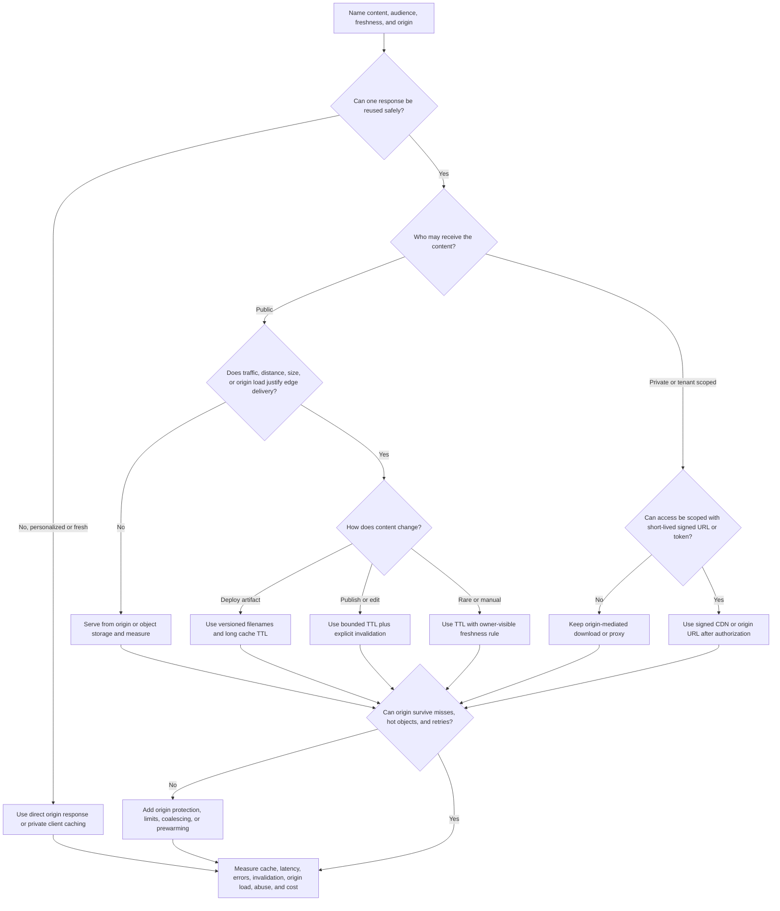
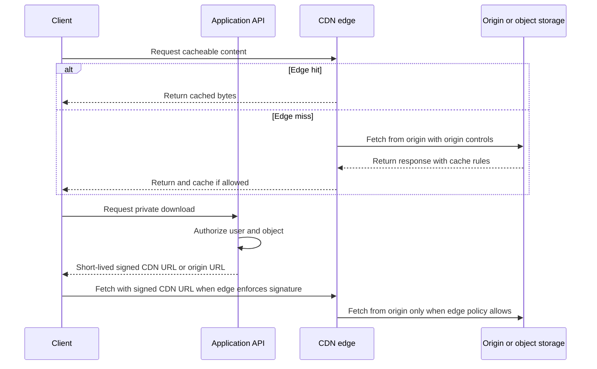

# CDN

A content delivery network places cacheable content near users and shields the
origin from repeat traffic. It is useful when static assets, public pages,
large downloads, images, videos, or other cacheable responses are requested by
many users, especially across regions.

A CDN is not a shortcut around source-of-truth design. The system still needs
cacheability rules, invalidation behavior, signed access for private content,
origin protection, observability, and a clear answer for what happens when the
edge has stale, missing, or denied content.

## Purpose

Use this page to decide:

- when static content, images, downloads, or cacheable responses should be
  served from edge locations;
- whether global users, repeated downloads, launch traffic, or origin load
  justify CDN delivery;
- which content can be cached publicly, privately, briefly, or not at all;
- how invalidation, versioned URLs, signed URLs, and origin protection should
  work;
- what metrics prove the CDN improves latency and reliability instead of hiding
  stale content or origin failures.

This page focuses on CDN component decisions. It does not compare CDN vendors,
edge compute products, image optimization products, or low-level HTTP header
tuning.

## When This Matters

Use this tree when:

- users are far from the origin and static or cacheable content feels slow;
- public assets, images, videos, downloads, or pages are requested repeatedly;
- a launch, campaign, or viral item can overload the application or object
  store;
- the origin should not serve every byte of every repeated download;
- content changes require explicit cache invalidation or versioning;
- private downloads need signed URLs, token checks, or short-lived access;
- the design needs origin protection, abuse controls, or edge observability.

Skip a CDN when the workload is small, users are near the origin, responses are
fresh and personalized, or the team cannot state what is cacheable. Start with
direct origin delivery and add CDN behavior when latency, bandwidth, cost, or
origin load creates a real pressure.

## Quick Decision

| If the delivery path needs... | Start with... | Watch for... |
| --- | --- | --- |
| Small local traffic | Direct origin or object storage delivery | Premature cache rules and purge complexity |
| Static assets that change on deploy | CDN with versioned filenames | Old assets referenced by cached HTML |
| Public global images, videos, or downloads | CDN in front of object storage | Cache keys, invalidation, bandwidth, and hot objects |
| Public pages that change occasionally | CDN with TTL and explicit purge path | Stale pages after publish or rollback |
| Private downloads | Auth check plus short-lived signed CDN or origin URL | Long-lived links and missing permission recheck |
| Fresh personalized responses | No public CDN cache; maybe private or browser caching | Cross-user data leakage |
| Origin overload during misses | Origin protection, request coalescing, limits, or prewarming | Cache stampedes and retry storms |
| Abuse or cost spikes | Edge rate limits, bot controls, and bounded cache keys | Blocking legitimate bursts or hiding attack signals |

Default to versioned static assets or direct delivery first. Add CDN caching
only when the response is safe to reuse and the design names freshness,
invalidation, access, origin fallback, and observability.

## Questions To Ask

- What is being delivered: static asset, public page, image, video, export,
  private file, API response, or generated derivative?
- Who can see it: everyone, signed-in users, one tenant, one owner, or an
  internal service?
- Is the response identical for many users, or does it vary by user, role,
  region, language, device, cookie, or authorization state?
- How stale can the response be before users are harmed?
- What event makes cached content unsafe: deploy, publish, edit, delete,
  permission change, lifecycle transition, or security incident?
- Should changes use versioned URLs, TTL expiry, explicit invalidation, or a
  source-of-truth recheck?
- Can users reach private content through signed URLs, and how short should the
  expiry be?
- What prevents cache misses, retries, or hot objects from overwhelming the
  origin?
- What should happen when the CDN, origin, object store, or invalidation path
  fails?
- Which metrics show cache hit rate, stale content, origin fetches, errors,
  latency, bandwidth, abuse, and cost?

## CDN Decision Tree



Use the tree to decide whether a CDN is justified and which cache, access, and
origin rules must exist before launch. "Do not cache this publicly" is a valid
tree result when freshness or privacy is more important than edge speed.
It does not remove the need to solve origin latency, load, pagination, indexing,
or data-model issues for personalized paths.

## Requirements Discovered

| Requirement | Why It Matters | Design Impact |
| --- | --- | --- |
| Content class | Static assets, pages, images, videos, exports, and API responses have different reuse rules | Drives cache TTL, key design, storage, and invalidation |
| Audience boundary | Public, private, tenant-scoped, and owner-scoped content have different leak risks | Drives signed URLs, authorization checks, cache scope, and fail-closed behavior |
| Global reach | Distant users pay network delay on every origin request | Drives CDN placement, object delivery, and latency measurement |
| Cacheability | The CDN can only reuse responses safely when variants are understood | Drives cache-control, vary rules, key shape, and bypass decisions |
| Freshness and invalidation | Changed content should not stay visible by accident | Drives versioned URLs, TTLs, purge events, and stale-content repair |
| Origin protection | Cache misses and hot objects can overload the source | Drives request coalescing, limits, shielding, prewarming, and fallback |
| Abuse and cost | Public delivery can amplify scraping, hotlinking, and bandwidth spikes | Drives rate limits, signed links, quotas, and traffic alerts |
| Observability | Edge behavior can hide origin health or freshness bugs | Drives hit/miss, origin fetch, invalidation, latency, error, and cost metrics |

## Options

| Option | Use When | Trade-Off |
| --- | --- | --- |
| Direct origin delivery | Traffic is modest, local, or response freshness is strict | Simplest correctness, but origin serves every request |
| Object storage URL | Public or signed object downloads are enough without edge caching | Simple byte delivery, but distant users and hot objects may be slower |
| CDN for versioned static assets | Assets change only when URL changes | Excellent cacheability, but deploys must avoid referencing missing versions |
| CDN with TTL | Content can be stale for a known window | Simple operation, but edits are not immediately visible |
| CDN with explicit invalidation | Publish, edit, delete, or rollback needs faster freshness | Better control, but purge failures and broad invalidations need monitoring |
| Signed CDN URL or cookie | Private or premium content should travel through edge locations | Efficient delivery, but expiry, key rotation, and permission changes are harder |
| Application proxy | App must transform, inspect, watermark, or enforce per-request rules | Strong control, but app pays bandwidth and latency cost |
| Edge rate limit or abuse rule | Public paths can be scraped, hotlinked, or attacked cheaply | Protects origin and cost, but can block legitimate bursts |

## Decision Guidance

### Start With The Content Class

Name the object or response before adding a CDN.

Use this shape:

```text
Content: <asset, page, image, video, export, API response, or derivative>
Audience: <public, signed-in, tenant, owner, internal>
Origin: <application, object storage, generated file, or source service>
Cacheability: <public, private, no-store, TTL, versioned URL, or signed URL>
Freshness: <deploy version, seconds, minutes, publish event, or must be fresh>
Invalidation: <none, version change, purge event, permission change, delete>
Origin protection: <limits, shield, coalescing, prewarm, fallback, or fail closed>
Revisit signal: <latency, origin load, bandwidth, stale report, or cost spike>
```

If this statement is unclear, the CDN would add complexity before the design
knows what it is protecting.

### Use A CDN For Static Or Reusable Content

A CDN is strongest when many users receive the same bytes:

- versioned JavaScript, CSS, fonts, and images from a deploy;
- public marketing or documentation pages that change on publish;
- public thumbnails, attachments, exports, or media derivatives;
- large downloads that should not cross the application tier;
- read-only API responses with explicit freshness and variant rules.

Avoid public CDN caching for responses that depend on a user's identity,
permissions, cart, account balance, notifications, draft state, or confidential
data. Those paths may still use browser caching, private caching, or signed
downloads, but the design must prevent one user from receiving another user's
content.

### Make Cacheability Explicit

CDN design should state what creates a distinct cached response.

Common cache-key inputs include:

- path and normalized query parameters;
- content version or asset hash;
- language or region when the response truly varies;
- device class only when different bytes are served;
- content encoding.

Avoid high-cardinality or unsafe cache keys based on raw user IDs, session
cookies, unbounded query strings, or authorization headers. If authorization
changes the response, do not use a shared public cache unless the response is
scoped by a signed token or another explicit access boundary.

### Prefer Versioned Assets For Deploy Artifacts

Static deploy artifacts are easiest to cache when the URL changes whenever the
content changes.

Good shape:

```text
/assets/app.8f31c9.css
/images/logo.2026-06-01.png
```

The old URL can remain cached while new HTML points to the new URL. This avoids
needing emergency purges for ordinary deploys. Keep old asset versions long
enough that cached pages do not reference missing files during rollout or
rollback.

### Treat Invalidation As A Workflow

Invalidation is part of the product workflow, not a manual afterthought.

Use invalidation when:

- a public page changes after publish;
- a file is deleted or made private;
- a thumbnail or derivative is regenerated;
- unsafe content is removed;
- a rollback needs users to stop seeing a broken version quickly.

Define:

- which event requests the purge;
- which exact paths, tags, or content groups are purged;
- whether the purge is best-effort or must block publish;
- how long stale content may remain after the purge request;
- how operators detect purge failures or stale reports;
- what manual repair path exists for urgent removals.

Broad purges are easy to request but can overload the origin by forcing many
misses at once. Prefer versioned URLs or scoped invalidation when possible.

### Use Signed URLs For Private Edge Delivery

Signed URLs or signed cookies let the application authorize a user, then allow
the client to fetch bytes from the CDN for a short time.

Use signed edge access when:

- the object is large enough that proxying through the app is wasteful;
- the user is allowed to download the object now;
- the URL can be scoped to object, operation, and expiry;
- the content is not safe to expose through a durable public URL;
- permission changes or object lifecycle changes have a defined cutoff.

Already-issued signed URLs usually remain valid until expiry unless the edge or
origin actually checks a revocation-capable policy such as key rotation, object
movement, policy changes, or token revocation. Use short TTLs as the main
control for sensitive downloads and keep the source-of-truth permission check
in the API before issuing the URL.

### Protect The Origin

A CDN reduces origin load only when misses, purges, retries, and hot objects are
controlled.

Origin protection can include:

- caching only safe methods and status codes;
- restricting direct origin access to the CDN or authenticated service paths;
- request coalescing so one miss does not become many origin requests;
- shielding or a regional cache layer when many edge locations miss together;
- limits on large downloads, range requests, and expensive transformations;
- prewarming for predictable launches or releases;
- fail-closed behavior for private content when auth or signing is unavailable;
- stale-if-safe behavior for public content when origin is briefly unhealthy.

Do not let the CDN retry aggressively enough to turn an origin incident into a
larger one. Timeouts, retry limits, and fallback behavior should match the
workflow's user promise.

## Delivery Shape



This shape separates authorization from byte delivery. The application owns
permission decisions; the CDN handles reusable delivery and origin shielding
within the cache and signing rules.

## Trade-Offs

| Choice | Improves | Costs Or Risks |
| --- | --- | --- |
| Direct origin delivery | Simpler freshness and debugging | Higher latency for distant users and more origin bandwidth |
| CDN for static assets | Faster global loads and less origin traffic | Cache rules, deploy versioning, and asset retention |
| CDN for public pages | Lower latency and better burst handling | Stale pages, purge workflows, and origin miss storms |
| CDN for private downloads | Efficient large-file delivery | Signed access, expiry, key rotation, and permission-change edge cases |
| Long TTL | High hit rate and low origin cost | Slow correction after bad content or publish mistakes |
| Short TTL | Faster natural freshness | More origin fetches and less cache benefit |
| Explicit invalidation | Faster content changes | Purge failures, broad purge cost, and operational coupling |
| Origin fail-open stale content | Better availability for public content | Users may see old information |
| Origin fail-closed | Safer for private or correctness-sensitive content | More user-visible errors during dependency issues |

## Failure Modes

| Failure Mode | Impact | Design Response | Observable Signal |
| --- | --- | --- | --- |
| Private response cached publicly | Cross-user or cross-tenant data leak | Do not cache auth-dependent responses publicly; use signed access or private caching | Security report, unexpected cache hit on private path |
| Stale page remains after publish | Users see old or incorrect content | Version URLs, scoped invalidation, and stale-report repair | Invalidation age, stale content reports |
| Purge is too broad | Origin gets overloaded by synchronized misses | Scope purges, stagger refresh, prewarm hot paths | Origin fetch spike, p95 origin latency |
| Purge is too narrow | Deleted or changed content remains visible | Track content-to-path mapping and verify purge result | Stale object count, support reports |
| Signed URL lives too long | Formerly authorized user retains access | Short TTL, key rotation, object move, or policy invalidation | Access after permission change |
| Cache key ignores variant | Wrong language, region, device, or encoding served | Define bounded variant keys and test representative paths | Variant mismatch reports |
| Cache key includes unbounded input | Hit rate collapses and cost rises | Normalize query strings and bound dimensions | Low hit rate, high unique URL count |
| Origin is exposed directly | Attackers bypass CDN protections | Restrict origin access to CDN or signed service paths | Direct-origin request count |
| CDN outage or route issue | Users cannot fetch static or media content | Fallback domain, graceful degradation, or cached shell strategy | Edge 5xx rate, regional error spike |
| Hotlinking or scraping spikes bandwidth | Cost grows and origin may be stressed | Signed URLs, rate limits, abuse alerts, and referrer checks only as a weak signal | Bandwidth anomaly, hot object traffic |

## Common Mistakes

- Adding a CDN before naming which content is cacheable.
- Caching personalized or permissioned responses in a shared public cache.
- Treating TTL as a complete invalidation strategy for urgent changes.
- Using broad purges that turn every edge request into an origin miss at once.
- Letting object keys, file names, or query strings leak private information.
- Issuing signed URLs with long expiry for sensitive content.
- Forgetting to protect the origin from direct traffic.
- Debugging only the origin while ignoring edge hit rate, stale age, and
  regional errors.
- Assuming a CDN solves slow database queries for fresh personalized pages.

## Original Example

A city recreation site publishes activity pages, program photos, and permit
PDFs. Most visitors are anonymous and browse from several regions. Staff can
edit program pages during the day, and registered residents can download
private permit files.

The team walks the tree:

- Versioned CSS, JavaScript, and public images use long-lived CDN caching
  because their URLs change on deploy.
- Public activity pages use a short TTL plus explicit invalidation when staff
  publishes an edit.
- Program photos live in object storage and are delivered through the CDN after
  approval. Unapproved photos are not publicly cacheable.
- Private permit PDFs require an API authorization check. The API returns a
  short-lived signed download URL scoped to one permit file.
- The origin blocks direct public access where possible so users reach files
  through CDN rules.
- Launch-week activity pages are prewarmed, and origin fetches are monitored so
  a missed purge does not overwhelm the application.
- If the origin is briefly unavailable, public activity pages may serve stale
  content for a small window, but private permit downloads fail closed.

Interview answer frame:

```text
Content: public activity pages, photos, static assets, and private permit PDFs.
Audience: anonymous visitors for public content; owner-only for permit files.
CDN use: static assets and public approved content; signed URLs for private PDFs.
Freshness: versioned assets, short page TTL, explicit publish invalidation.
Origin protection: direct-origin restrictions, scoped purges, prewarm hot pages.
Failure behavior: stale-if-safe for public pages; fail closed for private files.
Revisit signal: edge hit rate, origin fetches, p95 regional latency, purge age,
bandwidth cost, and access-denied anomalies.
```

Version 1 can skip advanced edge compute and image transformation. It should not
skip cacheability rules, private-content signing, origin protection, or
invalidation observability because those decisions protect correctness, privacy,
and operability.

## Checklist

Before adding CDN delivery, confirm:

- The content class, audience, source of truth, and origin are named.
- Static content, public pages, images, videos, downloads, exports, and private
  files have separate cacheability rules where needed.
- Global-user latency or origin-load pressure justifies the CDN for this path.
- Cache keys and variants are bounded, safe, and documented.
- Personalized or permissioned responses are not cached publicly by accident.
- Static deploy artifacts use versioned URLs when practical.
- TTLs match the product's freshness promise.
- Invalidation covers publish, edit, delete, rollback, permission change, and
  unsafe-content removal where relevant.
- Signed URLs or signed cookies are scoped, short-lived, and issued only after
  authorization for private downloads.
- Already-issued signed URL behavior after permission or lifecycle changes is
  understood.
- Origin protection covers direct-origin access, miss bursts, retry behavior,
  large downloads, and hot objects.
- Failure behavior is explicit: stale-if-safe, direct origin fallback, degraded
  page, or fail closed.
- Metrics include cache hit/miss, origin fetches, edge and origin latency,
  errors, invalidation age, stale reports, denied signed requests, bandwidth,
  hot object traffic, abuse signals, and cost.

## Related Pages

- [Component selection map](index.md)
- [Cache](cache.md)
- [Object storage](object-storage.md)
- [Load balancer](load-balancer.md)
- [Latency requirements](../requirements/latency.md)
- [Throughput requirements](../requirements/throughput.md)
- [Availability requirements](../requirements/availability.md)
- [Security requirements](../requirements/security.md)
- [Privacy requirements](../requirements/privacy.md)
- [Rate limiting](../scalability/rate-limiting.md)
- [Graceful degradation](../reliability/graceful-degradation.md)
- [Component metrics catalog](../operations/component-metrics-catalog.md)
- [Capacity planning](../operations/capacity-planning.md)
