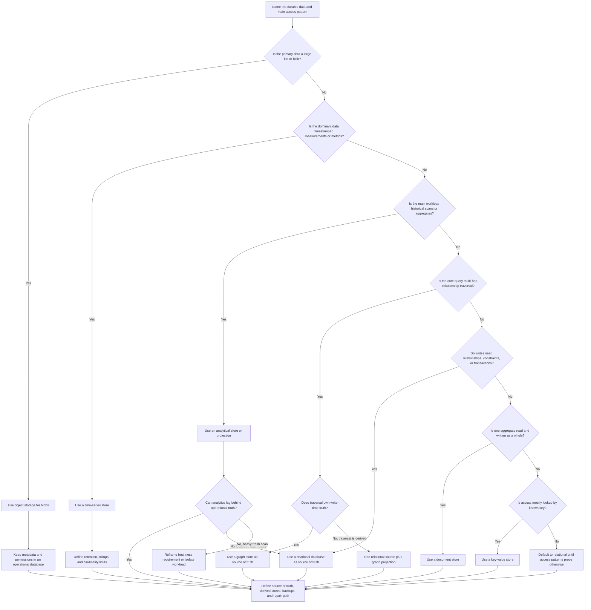

# Database Selection

Database selection decides where the system keeps durable truth and which
specialized stores, if any, are justified by the data shape and access pattern.
Start from the workflow, invariants, reads, writes, and operating constraints
before naming a database category.

The goal is not to crown one database type as best. The goal is to keep version
1 simple, protect the data that matters, and add specialized stores only when a
requirement creates enough pressure to justify them.

## Purpose

Use this page to decide:

- whether a relational database, document store, key-value store, graph store,
  time-series store, object storage, or analytical store fits the main
  requirement;
- which store should be the source of truth and which stores are derived;
- when a specialized store is premature for version 1;
- which trade-offs appear around consistency, query flexibility, scaling,
  storage cost, and operational burden;
- when to revisit the decision because measured access patterns changed.

This page focuses on storage category selection. Product-specific schema design,
index design, backup strategy, and replication topology belong in the related
data and operations pages.

## When This Matters

Use this tree when:

- a workflow creates durable records, files, events, metrics, or reporting data;
- the design needs to explain why one store is authoritative;
- reads and writes have a clear shape but the storage category is still unclear;
- a design proposes multiple databases without naming the requirement for each;
- analytical queries, files, graph traversals, time-series data, or simple key
  lookups are pulling against a general-purpose database.

Skip this tree when the question is still "what data exists?" Start with
[Data](../data/) and [Identifying entities](../data/identifying-entities.md)
first, then return here once the core entities and access patterns are known.

## Quick Decision

| If the system needs... | Start with... | Watch for... |
| --- | --- | --- |
| Relationships, constraints, transactions, and flexible queries | Relational database | Schema discipline, migrations, join cost, and write contention |
| One aggregate usually read and written as a whole | Document store | Cross-document constraints, duplicated fields, and ad hoc query growth |
| Very simple lookup by known key | Key-value store | Weak query flexibility, value evolution, and hot keys |
| Relationship traversal across many connected entities | Graph store | Modeling complexity, operational maturity, and whether relational joins are enough |
| High-volume timestamped events, metrics, or measurements | Time-series store | Retention, downsampling, cardinality, and late-arriving data |
| Large blobs such as images, videos, exports, or backups | Object storage | Metadata ownership, permissions, lifecycle rules, and processing workflow |
| Large scans, dashboards, or historical aggregations | Analytical store | Pipeline delay, duplicate storage, and source-of-truth drift |

Default to one relational source of truth when the data model has relationships,
constraints, transactions, and still-unknown query needs. Add a specialized or
derived store only when the tree identifies a pressure that the primary store
should not carry.

## Questions To Ask

- What is the authoritative record the system cannot lose?
- Which entities, relationships, and invariants must be protected at write time?
- Is the main access pattern lookup by ID, list by owner/status/time, search,
  relationship traversal, aggregate reporting, file retrieval, or metric
  ingestion?
- Which reads must be fresh, and which can be stale or rebuilt?
- Which writes must be transactional or conflict-free?
- Is the data structured, semi-structured, binary, event-like, metric-like, or
  analytical?
- How large can a single value, object, or record become?
- What retention, deletion, audit, privacy, and restore expectations apply?
- Which query would overload the operational store if it ran during peak user
  traffic?
- Can version 1 satisfy the requirement with a simpler store and a clear revisit
  signal?

## Database Selection Tree



Read the tree as a first pass, not a permanent architecture. A system can use
more than one store, but each store should have a named role: authoritative
truth, derived read model, blob storage, metrics history, or analytical
projection.

## Requirements Discovered

| Requirement | Why It Matters | Design Impact |
| --- | --- | --- |
| Authoritative data ownership | The team needs to know which store wins during repair or disagreement | Pick one source of truth before adding derived stores |
| Write-time invariants | Some conflicts must be prevented, not cleaned up later | Prefer relational transactions or explicit conditional writes |
| Access pattern shape | Lookup, list, traversal, blob retrieval, metric ingestion, and scans need different storage shapes | Choose the store that matches the dominant workflow |
| Freshness expectation | Some reads must reflect writes immediately while others can lag | Decide between direct operational reads and derived projections |
| Data size and format | Large binary data and small structured records behave differently | Put blobs in object storage and keep searchable metadata elsewhere |
| Retention and lifecycle | Metrics, audit data, exports, and personal data may have different lifetimes | Add retention, deletion, archive, and restore rules to the storage choice |
| Operational isolation | Reporting or batch scans can harm user-facing paths | Move analytical workloads away from the operational source when needed |
| Query flexibility | Early products often discover new filters and joins | Keep version 1 in a flexible store unless the specialized pattern is clear |

## Options

| Option | Use When | Trade-Off |
| --- | --- | --- |
| Relational database | The model has relationships, uniqueness rules, transactions, flexible queries, or unknown future filters | Requires schema design, migrations, and care with contention or complex joins |
| Document store | A bounded aggregate is usually fetched and replaced together, and cross-aggregate constraints are light | Duplicated data and cross-document queries can become difficult |
| Key-value store | Reads and writes are simple by-key operations with bounded value shape | Secondary queries, migrations, and hot-key management become external concerns |
| Graph store | Multi-hop relationship traversal is central to the product experience | Adds a specialized model and may be unnecessary if simple joins answer the question |
| Time-series store | Timestamped measurements arrive frequently and need retention, rollups, or time-window queries | High-cardinality labels, late data, and retention policy need active management |
| Object storage | Files, images, videos, exports, backups, or large blobs need durable storage outside ordinary records | Metadata, permissions, scanning, lifecycle, and signed access need separate design |
| Analytical store | Dashboards, reports, or history scans need to run without competing with operational traffic | Pipelines add delay, duplicate storage, and reconciliation work |
| One general-purpose store for version 1 | Requirements are modest, unclear, or better served by simple operations first | Revisit when measured workload or product needs outgrow the store |

## Decision Guidance

### Start With One Source Of Truth

Most early systems should choose one authoritative operational store before
adding specialized stores. A relational database is often the safest default
when the team needs constraints, transactions, flexible reads, and a model that
can evolve while requirements are still being discovered.

Use this decision statement:

```text
Source of truth: <store and tables/collections/buckets>
Authoritative for: <records, relationships, files, metrics, or reports>
Derived stores: <none, search index, cache, analytical projection, graph copy>
Freshness rule: <immediate, seconds, minutes, daily, manual>
Repair path: <rebuild, replay, reconcile, restore, or manual review>
Revisit signal: <latency, query load, data volume, cost, incident, user need>
```

Do not let two stores share equal authority over the same fact unless the
conflict resolution rule is explicit.

### Choose Relational For Invariants And Flexibility

Choose a relational database when the design includes:

- relationships that matter to correctness;
- uniqueness rules, foreign-key-like constraints, or transactional updates;
- many list, filter, sort, and join queries that may evolve;
- reporting needs that are modest enough to run without harming user traffic;
- a version 1 team that benefits from familiar migrations and SQL-style
  inspection.

Relational storage is not automatically slow or overcomplicated. The trade-off
is discipline: schema changes, indexes, query plans, migrations, and transaction
boundaries must be designed instead of left accidental.

### Choose Document Storage For Clear Aggregates

Choose a document store when the product naturally edits one aggregate at a
time. Examples include a draft form, profile document, content block, or device
configuration that is usually read and written as one unit.

Watch for these warning signs:

- many workflows need to update two documents consistently;
- many queries filter or aggregate across nested fields;
- the same field is copied into many documents and needs global correction;
- the document grows without a clear lifecycle or ownership boundary.

When those signs appear, either tighten the aggregate boundary or move the
authoritative model toward a relational structure.

### Choose Key-Value For Simple By-Key Access

Choose a key-value store when the access pattern is mostly:

```text
get(key)
put(key, value)
delete(key)
expire(key)
```

This can fit sessions, idempotency records, feature flags, counters with simple
semantics, short-lived tokens, or small state that is retrieved by a known key.
The trade-off is query poverty. If the product needs "find all active records
for this organization ordered by update time," a key-value store alone is the
wrong source of truth.

### Choose Graph Storage For Traversal As The Product

Choose a graph store when the product's central questions are about paths,
neighbors, dependency chains, recommendations, impact analysis, fraud rings, or
permission inheritance across many hops.

Do not add a graph store just because the data has relationships. Most business
data has relationships. Use a graph store when traversal is frequent, deep, and
hard to express or operate in the primary model. For version 1, a relational
model plus indexed join tables may be enough until traversal latency, query
complexity, or product depth justifies the specialized store.

### Choose Time-Series Storage For Measurements Over Time

Choose a time-series store when the system ingests high-volume timestamped
measurements such as metrics, sensor readings, availability checks, financial
ticks, or metric-like operational events that are mostly queried by time window.

Design these rules before committing:

- timestamp source and clock skew tolerance;
- label or tag cardinality limits;
- retention periods for raw and downsampled data;
- rollup strategy;
- late-arriving or corrected data behavior;
- alerting and dashboard freshness expectations.

If the system only stores a few status changes per business entity, an ordinary
event or audit table may be simpler than a time-series store.

If the event history must be replayed by multiple consumers, retained as an
ordered log, or used to rebuild derived projections, evaluate a stream before
treating the data as time-series measurements.

### Choose Object Storage For Blobs

Choose object storage for large binary or file-like data: images, videos,
attachments, exports, imports, backups, and generated reports. Keep the object
itself in object storage and keep metadata, ownership, permissions, workflow
state, and audit records in the operational database.

Key design questions:

- Who can create, read, replace, or delete the object?
- Is access public, private, signed, or time-limited?
- Which metadata is searchable?
- What lifecycle moves objects to archive or deletion?
- What processing jobs scan, transform, or validate objects?
- What happens if metadata exists but the object upload fails, or the object
  exists but metadata creation fails?

### Choose Analytical Storage For Scans And Reports

Choose an analytical store when dashboards, reports, experiments, or historical
aggregations should not compete with operational reads and writes. The
analytical store should usually be a derived projection, not the authority for
customer-facing writes.

Define:

- source tables, events, or files feeding the projection;
- refresh frequency and acceptable staleness;
- reconciliation checks back to the operational source;
- who can access detailed or sensitive data;
- how backfills and schema changes are handled;
- which reports are allowed to be approximate.

If a simple admin report runs occasionally on a small operational database,
defer the analytical store until query cost, runtime, or user-facing impact
proves it is needed.

## Trade-Offs

| Choice | Improves | Costs Or Risks |
| --- | --- | --- |
| Relational source of truth | Correctness, constraints, transactions, flexible queries | Schema migration work, lock/contention risk, query tuning |
| Document source of truth | Aggregate locality and flexible per-document shape | Cross-document constraints, duplicated fields, inconsistent updates |
| Key-value store | Fast simple access and small operational surface for by-key data | Weak querying, hidden secondary indexes, hot keys |
| Graph store | Multi-hop relationship queries and path-oriented modeling | Specialized operations, data duplication, unclear authority if derived |
| Time-series store | Efficient ingestion and time-window queries for measurements | Cardinality limits, retention design, late data handling |
| Object storage | Cheap durable blob storage and large-object delivery | Metadata consistency, permissions, lifecycle and cleanup jobs |
| Analytical store | Isolated scans, dashboards, and historical analysis | Pipeline delay, reconciliation, duplicated storage, privacy controls |
| Multiple stores | Better fit for different workloads | More failure modes, migrations, observability, backup, and repair paths |

## Failure Modes

| Failure Mode | Impact | Design Response | Observable Signal |
| --- | --- | --- | --- |
| Two stores disagree about the same fact | Users see conflicting status or operators repair the wrong record | Name one source of truth and rebuild derived stores from it | Reconciliation failures, support tickets, mismatched counts |
| Analytical query overloads operational database | User-facing reads and writes slow down | Move heavy scans to a replica, export, or analytical projection | Query latency, CPU saturation, lock waits, timeout rate |
| Blob upload and metadata write are not coordinated | Files appear missing, orphaned, or unauthorized | Use pending states, cleanup jobs, idempotent finalize steps, and audits | Orphan count, failed finalize jobs, object-not-found errors |
| Hot key or hot partition dominates traffic | A small data slice limits throughput | Redesign keys, shard hot entities, cache safe reads, or change access pattern | Per-key load, throttling, partition latency |
| High-cardinality time-series labels explode storage | Metrics become expensive or unavailable | Limit tags, aggregate earlier, drop unbounded labels, enforce retention | Series count, ingestion rejection, storage growth |
| Document shape drifts without ownership | Reads become brittle and migrations become risky | Version documents, validate writes, and define aggregate ownership | Validation failures, migration exceptions, unknown-field rates |
| Derived store refresh lags too far behind | Reports or search results mislead users | Publish freshness, monitor lag, retry pipelines, and allow manual rebuilds | Pipeline lag, stale-result complaints, failed backfills |

## Common Mistakes

- Choosing the database product before naming entities, invariants, and access
  patterns.
- Adding a separate store for every query instead of improving the source model
  first.
- Treating an analytical store, cache, or search index as authoritative without
  a repair path.
- Storing large files in ordinary rows because it is convenient at first.
- Using a document store for data that needs frequent cross-document
  transactions.
- Using a key-value store when the product actually needs lists, filters, and
  audits.
- Adding a graph store for shallow relationships that relational joins already
  handle.
- Ignoring backups, restore testing, retention, deletion, and privacy until
  after data exists.

## Original Example

A city-run community workshop lets residents reserve shared rooms, upload event
flyers, and view monthly usage reports.

The team walks the tree:

- Room, resident, reservation, and approval data have relationships and
  double-booking must be prevented, so reservations start in a relational
  database.
- Flyers are image and PDF files, so the files go to object storage while title,
  owner, approval status, object key, and permissions stay in the relational
  database.
- Monthly usage reports can lag by a day, so version 1 uses scheduled exports
  from the relational source before adding a dedicated analytical store.
- Room availability search is filter-based, not ranked full-text search, so the
  team starts with database indexes and defers search infrastructure.
- Door sensor metrics are not part of launch. If the program later records
  minute-by-minute occupancy readings, that data will be evaluated for a
  time-series store with retention and rollups.

Decision statement:

```text
Source of truth: relational database for rooms, residents, reservations,
approvals, flyer metadata, and report inputs.
Blob storage: object storage for uploaded flyers.
Derived artifacts: scheduled report files; no dedicated analytical store for launch.
Freshness rule: reservation reads are fresh; monthly reports may lag by one day.
Revisit signal: reporting queries affect reservation latency, flyer volume
requires lifecycle automation, or sensor metrics become a product requirement.
```

## Checklist

Before choosing or adding a database, confirm:

- The source of truth is named.
- Core entities, relationships, and invariants are clear.
- Main read and write access patterns are listed.
- Freshness and consistency needs are tied to specific workflows.
- Relational, document, key-value, graph, time-series, object storage, and
  analytical options were considered against the actual workload.
- Derived stores have freshness rules and repair paths.
- Blob metadata and blob contents have separate ownership and failure handling.
- Heavy scans and reports will not harm user-facing writes.
- Backups, restore, retention, deletion, and privacy expectations are explicit.
- Version 1 uses the fewest stores that satisfy current requirements.
- Revisit signals are measurable.

## Related Pages

- [Components](./)
- [Component selection map](index.md)
- [Data](../data/)
- [Identifying entities](../data/identifying-entities.md)
- [Read and write patterns](../data/read-write-patterns.md)
- [Relational vs document vs key-value](../data/relational-vs-document-vs-key-value.md)
- [Indexes](../data/indexes.md)
- [Transactions](../data/transactions.md)
- [Operational vs analytical data](../data/operational-vs-analytical-data.md)
- [Backups and restore](../data/backups-and-restore.md)
- [Design review checklist](../method/design-review-checklist.md)
- [Decision record template](https://github.com/LeonSilva15/system-design/blob/main/templates/decision-record-template.md)
