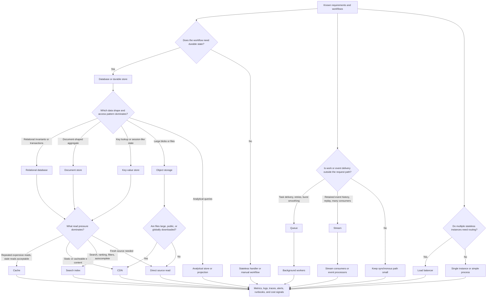

# Components

Component selection turns requirements into justified building blocks. Use this
map after requirement discovery, before drawing a final architecture, so each
database, cache, queue, stream, search index, worker, object store, CDN, and
load balancer appears because a requirement created pressure for it.

The goal is not to collect common architecture boxes. The goal is to explain
which problem each component solves, what it makes harder, and when version 1
should stay simpler.

## Purpose

Use this page to:

- connect requirement signals to component choices;
- decide when a component is justified and when it is premature;
- keep the first architecture small enough to reason about;
- name the trade-off that appears with each added component;
- route readers to the detailed component decision pages as they are delivered.

## When This Matters

Use this map when:

- a design jumps from a prompt directly to components;
- a reviewer asks why a cache, queue, stream, search index, CDN, or load
  balancer is present;
- one requirement can be satisfied by several different components;
- a version 1 design is accumulating infrastructure without clear ownership;
- a walkthrough needs a compact way to explain component decisions.

Skip this map when the question is still about discovering requirements. Start
with the [requirements map](../requirements/) first, then return here once the
architecture-shaping pressures are known.

## Quick Decision

| If the requirement says... | Component that may appear | Watch for... |
| --- | --- | --- |
| Durable source-of-truth state is needed | Database or durable store | Picking a database type before data shape and access patterns are known |
| Repeated reads are slow or expensive and can be stale | Cache | Stale data, invalidation, authorization leakage, and fallback behavior |
| Work can finish later or absorb bursts | Queue plus workers | Hidden latency, duplicate work, ordering, and dead-letter handling |
| Events need replay, retention, or multiple independent consumers | Stream | Consumer lag, partitioning, event contracts, and replay cost |
| Users need text search, filters, ranking, or autocomplete | Search index | Freshness, reindexing, relevance, and source-of-truth drift |
| Files, images, exports, backups, or large blobs are stored | Object storage | Metadata ownership, lifecycle, access, and processing workflow |
| Static or cacheable content must be close to users | CDN | Cacheability, invalidation, signed URLs, and origin protection |
| Stateless instances need routing, health checks, or failover | Load balancer | Overloaded downstreams, sticky sessions, health-check mistakes, and regional routing |
| Slow, CPU-heavy, scheduled, or retryable work should not block users | Background workers | Job visibility, retries, idempotency, and worker saturation |

Default to the simplest component set that satisfies the current requirements.
Add a component only when the map identifies a pressure and an observable
revisit signal.

## Questions To Ask

- Which user-visible workflow is the component meant to protect?
- Which requirement justifies it: latency, throughput, availability,
  durability, consistency, scalability, security, privacy, cost, operability, or
  compliance?
- Is the component part of the source-of-truth path, a derived path, or an
  operational support path?
- Can version 1 use a simpler table, job, manual step, file, or direct call?
- What failure mode does the component introduce?
- How will the team observe, test, deploy, and operate the component?
- What data, permissions, lifecycle, and recovery expectations follow it?
- Which metric, incident, customer need, or scale signal should trigger the
  next component?

## Component Selection Map



Use the map left to right: source of truth first, derived read paths second,
async work third, and routing last. A component can be correct for one
requirement and wrong for another.

## Component Page Map

Detailed component decision pages are linked below. Some linked targets start as
navigation pages and are expanded by later component tickets; this index remains
the first decision pass.

| Component | Page | Appears when... | First question |
| --- | --- | --- | --- |
| API layer | [API layer](api-layer.md) | External or internal callers need a contract | Which caller, protocol, auth, validation, versioning, and rate limit are needed? |
| Service layer | [Service layer](service-layer.md) | Business logic needs ownership and boundaries | Can a modular monolith satisfy the boundary before adding services? |
| Database selection | [Database selection](database-selection.md) | Durable state must be stored and queried | What is the data shape, invariant, access pattern, and consistency need? |
| Cache | [Cache](cache.md) | Repeated reads are slow or expensive and can tolerate staleness | What is the freshness rule, invalidation path, and fallback? |
| Queue | [Queue](queue.md) | Work can be delayed, retried, or smoothed across bursts | What is the delay tolerance, retry behavior, ordering need, and idempotency key? |
| Stream | [Stream](stream.md) | Events need retention, replay, ordering, or many consumers | Who owns the event contract, retention, partitioning, and consumer lag? |
| Search index | [Search index](search-index.md) | Users need search, ranking, filters, typo tolerance, or autocomplete | What freshness and reindexing behavior is acceptable? |
| Object storage | [Object storage](object-storage.md) | Files, images, videos, exports, backups, or blobs outgrow normal records | What metadata, access, lifecycle, and processing path owns each object? |
| CDN | [CDN](cdn.md) | Cacheable content should be served near users or protect origin | What is cacheable, how is it invalidated, and how is private content signed? |
| Background workers | [Background workers](background-workers.md) | CPU-heavy, slow, scheduled, retryable, or provider work should not block users | How are jobs observed, retried, deduped, and repaired? |
| Load balancer | [Load balancer](load-balancer.md) | Multiple stateless instances need routing, health checks, or failover | What health check, routing, session, and downstream-protection behavior is needed? |

## Requirement Signals

| Requirement Signal | Component Pressure | Why It Appears | Trade-Off |
| --- | --- | --- | --- |
| Durable writes and reads | Database | The system needs source-of-truth state | Data model, migration, backup, and consistency choices |
| Strict uniqueness or transaction | Relational database or explicit write invariant | The write path must prevent conflicts | Less write concurrency and more schema discipline |
| Large files or exports | Object storage | Blobs do not belong in normal relational rows | Metadata, lifecycle, permissions, and processing complexity |
| Repeated stale-tolerant reads | Cache or CDN | Fresh source reads are too slow, distant, or expensive | Staleness, invalidation, and fallback behavior |
| Search relevance | Search index | Database filters are not enough for ranking, text, or autocomplete | Index freshness, reindexing, and duplicate storage |
| Burst absorption | Queue | Producers and consumers operate at different speeds | Backlog, retries, ordering, dead letters, and visibility |
| Event history or fanout | Stream | Multiple consumers need retained events or replay | Event contract, ordering, consumer lag, and retention cost |
| Slow side effects | Background workers | User response should not wait for final completion | Pending states, retries, idempotency, and job monitoring |
| Horizontal stateless scale | Load balancer | Requests need routing across healthy instances | Health checks, connection draining, sticky sessions, and downstream overload |
| Global cacheable delivery | CDN | Users are far from origin or origin needs protection | Cache rules, invalidation, signed URLs, and edge debugging |

## Explain The Choice

In an interview or design review, state the path plainly:

```text
Requirement -> component -> trade-off -> version 1 simplification -> revisit signal
```

For example: "Room browsing has repeated reads, but launch traffic is modest, so
version 1 uses indexed database reads. Add a cache only when measured browse
latency or database read load exceeds the target, and document freshness and
fallback behavior before adding it."

## Decision Guidance

### Start With Source Of Truth

The first component question is usually where the durable truth lives.

Ask:

- Which data must survive process, node, or region failure?
- Which invariants must be enforced at write time?
- Which reads must be fresh versus stale-tolerant?
- Which data is large, binary, analytical, personal, audited, or temporary?
- Which data can be recomputed, cached, archived, or manually repaired?

Do not add a cache, queue, stream, or search index before the source-of-truth
model is clear. Derived components need repair paths back to truth.

### Add Derived Read Components Only For A Reason

Caches, CDNs, search indexes, read models, and analytical stores improve read
experience or reduce source load. They also create staleness and operational
work.

Before adding one, write:

```text
Read requirement: <latency, scale, ranking, global delivery, or cost pressure>
Freshness rule: <how stale is acceptable?>
Source of truth: <where correctness is checked?>
Repair path: <how stale, missing, or corrupt derived data is fixed?>
Revisit signal: <metric or incident that justifies the component>
```

If the source read is fast enough and freshness matters, prefer a direct read
for version 1.

### Separate Queues From Streams

Queues and streams both move work asynchronously, but they solve different
problems.

Use a queue when the goal is work delivery:

- process a task later;
- retry after failure;
- smooth a burst;
- isolate a slow provider;
- keep user-facing latency low.

Use a stream when the event history matters:

- multiple consumers read the same event sequence;
- consumers need replay;
- retention and ordering are design requirements;
- event-driven pipelines build derived views.

A queue can be simpler than a stream for version 1. A stream can be justified
when replay, multiple consumers, and event history are real requirements.

### Treat Workers As Operable Components

Background workers are not only implementation details. They need job records,
retry policy, idempotency, visibility, and maintenance.

Worker design should name:

- which job types exist;
- which queue, schedule, or event creates each job;
- whether jobs are idempotent and retryable;
- how ordering, dedupe, and dead letters work;
- what status the user or operator sees;
- which metrics, logs, alerts, and runbooks prove job health.

If none of that is needed and the work is cheap, keep it synchronous.

### Add Routing After Workload Shape Is Known

Load balancers appear when more than one instance should serve traffic, or when
health checks and failover matter. They do not fix a saturated database, hot
key, bad cache rule, or slow dependency by themselves.

Before adding a load balancer, define:

- which instances are stateless enough to receive any request;
- which health check proves readiness, not only process liveness;
- how deployments drain in-flight work;
- whether sessions need shared state or sticky routing;
- how downstream limits are protected as instance count grows;
- what happens during zone, region, or dependency failure.

## Common Mistakes

- Adding a component because it appears in common diagrams rather than because a
  requirement needs it.
- Choosing a cache before naming staleness, invalidation, and fallback.
- Adding a queue without idempotency, retries, dead letters, and user-visible
  status.
- Using a stream when a simple queue or audit table would satisfy version 1.
- Creating a search index when database filters and pagination are enough.
- Storing files in the primary database when object lifecycle and access need a
  different path.
- Adding a CDN for content that is private, uncacheable, or hard to invalidate.
- Adding a load balancer while ignoring the shared database, provider, or queue
  that remains the real bottleneck.

## Original Example

A city recreation department is building a room reservation system. Residents
search available rooms, reserve a time slot, upload optional event permits, and
receive reminders. Staff approve special events and export monthly usage
reports.

Component decisions:

| Requirement | Component | Why It Appears | Deferred Until |
| --- | --- | --- | --- |
| Reservations must not double-book a room and time slot | Relational database | A transactional write or uniqueness rule protects the source-of-truth invariant | Sharding until measured write contention requires it |
| Room browsing needs filters and freshness labels, but launch traffic is modest | Direct indexed database reads | The source of truth stays simple while the read path remains explainable | Cache until browse p95 or database read load exceeds the target |
| Event permits are uploaded as files | Object storage | Large blobs need object lifecycle, metadata, permissions, and virus-scan workflow | CDN until public download latency or origin load requires it |
| Reminder delivery can happen after reservation confirmation | Queue plus background workers | Slow provider calls and retries should not block the user response | Stream until multiple consumers or replay are needed |
| Staff need monthly reports | Analytical projection or scheduled export job | Reporting should not overload the reservation write path | Separate analytical store until report volume grows |
| Launch traffic may require more API instances | Load balancer | Stateless API instances need routing, health checks, and deploy draining | Regional load balancing until regional traffic requires it |

Version 1 can use one relational database, direct indexed reads, object storage
for permit files, a small reminder queue with workers, and a simple load
balancer only if multiple API instances are actually deployed. It does not need
a stream, search index, CDN, or microservice split until the requirements create
those pressures.

## Checklist

Before leaving component selection, confirm:

- Every component maps to a functional or non-functional requirement.
- Source-of-truth data is identified before derived caches, indexes, streams,
  or analytical projections.
- Databases, caches, queues, streams, search, workers, object storage, CDN, and
  load balancers are included only when their requirement signal exists.
- Each component has an owner, failure mode, observability signal, and revisit
  trigger.
- Version 1 defers components that are not needed for the next credible
  requirement.
- Related detailed component pages are listed so future tickets can deepen the
  decision without changing the map.

## Related Pages

- [Requirements map](../requirements/)
- [Latency requirements](../requirements/latency.md)
- [Throughput requirements](../requirements/throughput.md)
- [Availability requirements](../requirements/availability.md)
- [Durability requirements](../requirements/durability.md)
- [Consistency requirements](../requirements/consistency.md)
- [Scalability requirements](../requirements/scalability.md)
- [Security requirements](../requirements/security.md)
- [Privacy requirements](../requirements/privacy.md)
- [Cost requirements](../requirements/cost.md)
- [Operability requirements](../requirements/operability.md)
- [Scale estimation](../method/scale-estimation.md)
- [System design process](../method/system-design-process.md)
- [Read/write patterns](../data/read-write-patterns.md)
- [Sync vs async](../communication/sync-vs-async.md)
- [Outbox pattern](../communication/outbox-pattern.md)
- [Capacity estimation](../scalability/capacity-estimation.md)
