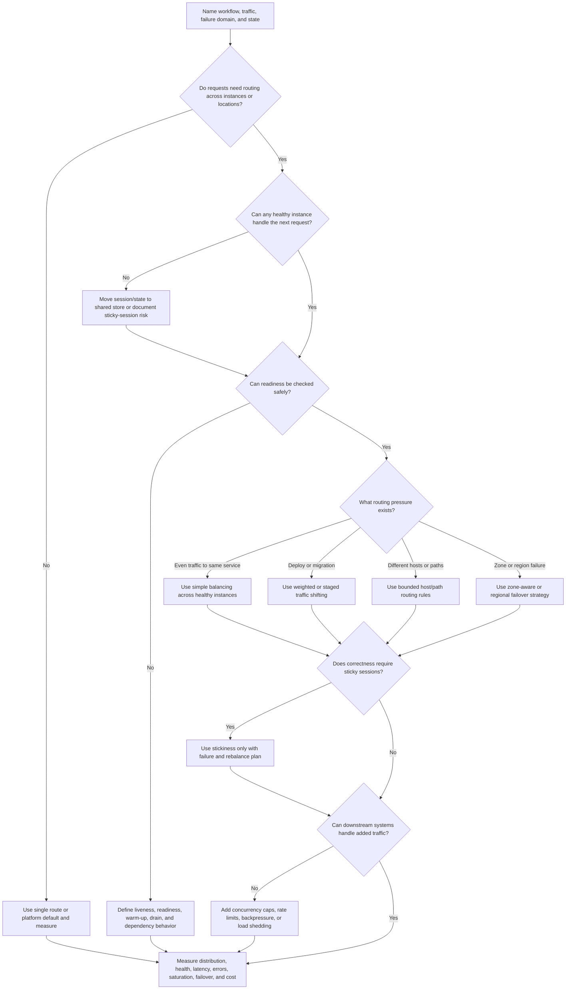
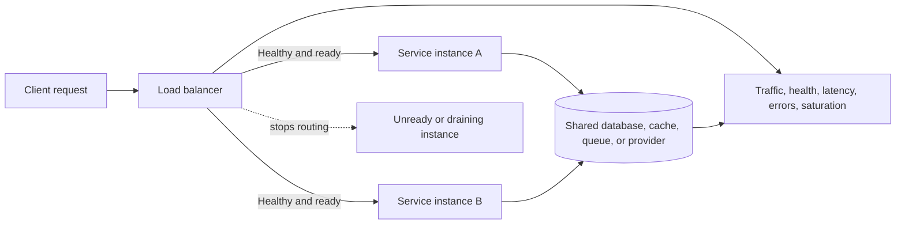

# Load Balancer

A load balancer routes traffic across healthy service instances, zones, or
regions. It is useful when a workflow needs more than one stateless instance,
safe deployments, health-based routing, failover, or controlled regional
traffic.

A load balancer does not make the whole system scalable or highly available by
itself. It only routes requests. The design still needs stateless request
handling, meaningful health checks, connection draining, downstream protection,
session-state choices, failover behavior, and metrics that show where traffic
went.

## Purpose

Use this page to decide:

- when multiple stateless service instances justify a load balancer;
- which health checks prove an instance should receive traffic;
- whether routing should be simple, weighted, host/path based, service based,
  zone aware, or regional;
- how failover should behave when an instance, zone, dependency, or region is
  unhealthy;
- when sticky sessions are necessary and when they hide state-management
  problems;
- what metrics prove traffic is balanced, users are succeeding, and downstream
  systems are protected.

This page focuses on load balancer component decisions. It does not compare
specific products or replace deeper playbooks for regional architecture,
service discovery, or health-check implementation.

## When This Matters

Use this tree when:

- one instance is no longer enough for traffic, deploy safety, or availability;
- stateless API or service instances need request routing;
- deployments need connection draining or gradual traffic shifting;
- health checks decide which instances can receive traffic;
- one zone, instance, service version, or region can fail independently;
- a design mentions failover, sticky sessions, or regional traffic without
  saying what state and dependencies are involved;
- operators need to understand where traffic is routed during incidents.

Skip a load balancer when version 1 has one instance, low traffic, no independent
failover expectation, and no deployment routing need. Add observability first if
the bottleneck is unknown. A load balancer will not fix a saturated database,
provider quota, hot key, queue backlog, or slow query.

## Quick Decision

| If the system needs... | Start with... | Watch for... |
| --- | --- | --- |
| One small instance | Direct routing or simple platform default | Premature failover complexity |
| Multiple stateless instances | Load balancer with readiness checks | Shared database, cache, queue, or provider bottlenecks |
| Safer deploys | Health checks plus connection draining | Sending traffic before warm-up or during shutdown |
| Path or host routing | Layer 7 routing rules | Hidden product policy and hard-to-debug route conflicts |
| Per-user state on one instance | Externalize session state before using stickiness | Uneven load and broken failover |
| Instance or zone failure tolerance | Health-based routing and redundancy | False health checks and cascading dependency failures |
| Regional traffic | Explicit regional strategy and data boundary | DNS delay, state lag, conflict, and much higher operations cost |
| Downstream protection | Load shedding, rate limits, and concurrency caps | Balancing more requests into a shared bottleneck |

Default to simple stateless instances behind a health-checked load balancer only
when more than one instance is needed. Add advanced routing, sticky sessions,
or regional failover only when a named requirement justifies the extra
operational burden.

## Questions To Ask

- Which workflow needs routed traffic, higher availability, safer deploys, or
  horizontal scale?
- Are service instances stateless enough that any healthy instance can serve the
  next request?
- What state lives outside the instance: sessions, uploads, locks, local files,
  caches, WebSocket connections, or in-flight jobs?
- Which health check proves readiness to serve real traffic, not only process
  liveness?
- What should happen during startup, shutdown, deploy, overload, and dependency
  failure?
- Which routing rule is needed: simple round-robin, least-loaded, host/path,
  weighted rollout, zone aware, or regional?
- Do any users need sticky sessions, and what breaks if their instance fails?
- Which dependency remains shared after adding instances?
- What does failover mean: stop routing to one instance, one zone, one service
  version, or one region?
- Which metrics show request distribution, health-check changes, errors,
  latency, saturation, failover, and downstream pressure?

## Load Balancer Decision Tree



Use the tree to decide whether a load balancer is justified and what must be
true before traffic goes through it. If the tree returns "define health first,"
do not launch failover based on a check that cannot distinguish ready instances
from broken ones.

## Requirements Discovered

| Requirement | Why It Matters | Design Impact |
| --- | --- | --- |
| Stateless request handling | Balancing assumes any healthy instance can receive the next request | Drives session storage, local-file avoidance, cache use, and sticky-session decisions |
| Health-check meaning | Bad checks route users to broken instances or remove healthy ones | Drives liveness, readiness, dependency depth, warm-up, and drain behavior |
| Routing rule | Different traffic shapes need different routing choices | Drives simple, weighted, host/path, service, zone-aware, or regional routing |
| Failover boundary | Failover must name the failed unit | Drives instance, zone, service version, dependency, or region response |
| Session affinity | Sticky sessions can preserve local state but reduce resilience | Drives externalized session state, rebalance, and failure behavior |
| Downstream capacity | More instances can overload shared dependencies | Drives connection caps, rate limits, backpressure, and load shedding |
| Deployment behavior | Traffic should not hit cold or shutting-down instances | Drives readiness gates, warm-up, connection draining, and rollback |
| Observability | Operators need to see where traffic went and why | Drives per-instance, per-zone, route, health, error, latency, and saturation metrics |

## Options

| Option | Use When | Trade-Off |
| --- | --- | --- |
| Single direct route | One instance is enough and failover is not required | Simplest version 1, but no instance-level redundancy |
| Basic load balancing | Several stateless instances serve the same API or service | Better capacity and availability, but shared dependencies remain limits |
| Layer 7 host/path routing | One edge routes to several services or route families | Flexible, but route ownership and conflict debugging get harder |
| Weighted traffic shifting | Deploys, migrations, or experiments need gradual rollout | Safer change control, but requires clear rollback and monitoring |
| Zone-aware routing | Instances run in multiple zones and local failure is in scope | Better local resilience, but capacity must survive a zone loss |
| Regional routing | Users or failures need traffic across regions | Lower latency or regional resilience, but data, DNS, failover, and operations are harder |
| Sticky sessions | Local session or connection state cannot be externalized yet | Temporary compatibility, but uneven load and failover pain |
| Load shedding | Overload should fail fast instead of saturating everything | Protects dependencies, but returns explicit errors or degraded behavior |

## Decision Guidance

### Start With Statelessness

Load balancing works best when each request can go to any healthy instance.

Stateless request handling usually means:

- sessions live in signed cookies or a shared session store;
- uploaded files go to object storage or durable upload state;
- background jobs live in a queue or job table;
- locks and coordination are not held only in process memory;
- caches are treated as optional accelerators, not the only state;
- WebSocket, SSE, or long polling reconnects can recover on another instance.

If an instance holds required state, a load balancer can still route traffic,
but the design must name the failure behavior. Sticky sessions may be a bridge,
not a correctness model.

### Design Health Checks Carefully

Health checks should answer whether traffic should be sent to an instance now.

Separate:

- liveness: the process is running and not wedged;
- readiness: the instance can serve real traffic;
- startup warm-up: code, caches, config, and connections are ready;
- shutdown drain: the instance should stop receiving new traffic but finish
  in-flight work;
- dependency health: whether required dependencies are usable enough for this
  route.

Avoid checks that are too shallow or too deep. A shallow check can return
healthy while the service cannot handle real requests. A deep check can remove
every instance during a shared dependency incident, turning partial failure into
total outage. Prefer route-specific readiness when one dependency matters only
for some paths.

Example shape:

```text
/livez: process is alive.
/readyz: instance has loaded config and can serve ordinary traffic.
/readyz/checkout: checkout dependencies are usable enough for checkout traffic.
```

### Choose The Simplest Routing Rule

Use simple balancing when instances are equivalent and stateless. Add routing
rules only when they explain a requirement:

- layer 4 routing when connection-level routing is enough;
- layer 7 routing when host, path, header, or method rules are needed;
- edge/API load balancing for public or client-facing traffic;
- internal service load balancing for service-to-service calls;
- host routing for separate public domains or APIs;
- path routing for a small number of clear service boundaries;
- weighted routing for deploys, migrations, or controlled rollout;
- zone-aware routing for local resilience and lower cross-zone traffic;
- regional routing for user proximity or regional failure response.

Keep routing rules bounded and owned. When every product decision becomes a
load balancer rule, debugging gets harder and the edge becomes a hidden
application.

### Treat Sticky Sessions As A Warning

Sticky sessions route the same client to the same instance. They can help with
legacy local session state, long-lived connection affinity, cache warmth, or
short migration windows.

They also create risks:

- one instance can become hot because its clients are stuck there;
- failover breaks sessions if state is not recoverable elsewhere;
- deploys and draining become harder;
- autoscaling or rebalancing may not move load evenly;
- bugs depend on which instance a user reached.

Prefer externalizing session state or designing reconnect behavior. Use sticky
sessions only when the trade-off is explicit and there is a plan to rebalance,
drain, and recover.

### Make Failover Concrete

Failover means the load balancer stops sending traffic to one target and sends
it somewhere else. The target might be an instance, service version, zone, or
region.

For each failover path, define:

```text
Failure domain: <instance, zone, service version, dependency, region>
Detection: <health check, synthetic check, metric, or operator action>
Decision: <automatic or manual>
Traffic shift: <remove target, drain, weighted shift, regional route>
State risk: <in-flight requests, sessions, writes, caches, queues>
Fallback: <retry, degraded response, fail closed, or manual recovery>
Verification: <metric or test proving users are served safely>
```

Automated instance failover is common when instances are stateless and health
checks are reliable. Regional failover needs more caution because data, secrets,
queues, DNS, user sessions, and operational visibility cross a larger boundary.

### Protect Shared Dependencies

Adding service instances can increase total traffic into shared systems. A load
balancer may spread requests evenly across instances while every instance
overloads the same database, cache, queue, or provider.

Protection options include:

- per-instance and global connection caps;
- request concurrency limits;
- route-specific rate limits;
- circuit breakers or fast failure for known unhealthy dependencies;
- queueing or backpressure for work that can wait;
- load shedding for optional or expensive paths;
- separate pools for background jobs and user-facing requests;
- dashboards that show downstream saturation next to load balancer metrics.

Scaling stateless instances is useful only when the shared limits are also
understood.

### Handle Regional Traffic Deliberately

Regional traffic can be about latency, data residency, capacity, or outage
response. Each reason changes the design.

Regional routing questions:

- Are users routed to the nearest region, a home region, or an active region?
- Is data local, replicated, cached, or restored manually?
- Which region accepts writes?
- How long can routing take to change during an outage?
- What happens to in-flight sessions and idempotency keys?
- Can one region handle another region's traffic during failover?
- How do operators see regional errors, latency, and saturation?

For many version 1 systems, regional load balancing can be deferred. A documented
regional recovery plan may be better than active regional routing if the product
does not require low-interruption regional failover.
Use [availability requirements](../requirements/availability.md) and
[disaster recovery](../reliability/disaster-recovery.md) to decide whether the
workflow needs regional RTO/RPO, manual restore, active-passive, or active-active
behavior.

## Request Routing Shape



The load balancer spreads traffic across ready instances, but the shared
dependency still needs its own capacity, health, and fallback design.

## Trade-Offs

| Choice | Improves | Costs Or Risks |
| --- | --- | --- |
| Single instance | Simplicity and direct debugging | No instance-level redundancy or rolling deploy routing |
| Multiple stateless instances | Capacity, deploy flexibility, and local failover | Requires health checks, shared state, and downstream protection |
| Shallow health check | Avoids removing all instances during dependency trouble | Can route users to broken app paths |
| Deep health check | Catches dependency-specific brokenness | Can create total outage during shared dependency incidents |
| Sticky sessions | Preserves local state or connection affinity | Uneven load, fragile failover, and harder draining |
| Weighted routing | Safer rollout and migration control | More operational policy and monitoring |
| Regional routing | Lower latency or regional resilience | Data placement, DNS delay, conflict, capacity, and cost |
| Load shedding | Protects critical paths during overload | Visible rejections or degraded behavior |

## Failure Modes

| Failure Mode | Impact | Design Response | Observable Signal |
| --- | --- | --- | --- |
| Health check says ready too early | Users hit cold or misconfigured instance | Startup readiness gate and warm-up checks | Errors after deploy, ready-before-warm metric |
| Health check is too deep | All instances removed during shared dependency issue | Route-specific checks and degraded-mode behavior | All-target unhealthy event |
| Draining is missing | In-flight requests fail during deploy or scale-down | Connection draining and graceful shutdown | Reset connections, deploy error spike |
| Sticky session target fails | User loses session or long-lived connection | Externalize state, reconnect, or clear failure behavior | Session loss after target removal |
| Load balancer hides hot instance | Average service metrics look fine while one target is overloaded | Per-target latency, errors, and saturation | One target p95 or CPU outlier |
| Shared dependency saturates | More instances amplify database, cache, queue, or provider load | Connection caps, rate limits, backpressure, and load shedding | Downstream latency, pool exhaustion |
| Routing rule sends traffic to wrong service | Users see wrong API behavior or errors | Bounded route ownership and route tests | 404/5xx by route, route mismatch reports |
| Failover flaps | Traffic bounces between targets and worsens incident | Hysteresis, manual approval for risky failover, and stable health windows | Repeated target add/remove events |
| Regional failover lacks capacity | Backup region fails under redirected traffic | Capacity planning and failover drill | Regional saturation after failover |
| Direct instance access bypasses policy | Clients skip auth, limits, or routing controls | Restrict direct access and centralize edge policy where needed | Direct-target request count |

## Common Mistakes

- Adding a load balancer before making instances stateless enough to share
  traffic.
- Treating a process-up check as readiness for real user workflows.
- Making health checks depend on every downstream service even when degraded
  behavior would be safer.
- Using sticky sessions as the permanent solution for session storage.
- Scaling API instances while ignoring the shared database, provider, queue, or
  cache.
- Forgetting connection draining during deploys and autoscaling.
- Assuming regional routing solves regional data, secrets, queue, and failover
  problems.
- Looking only at aggregate error rate instead of per-target and per-route
  signals.

## Original Example

A local event ticketing service starts with one API instance. During popular
event launches, browse traffic rises, and the team wants safer deploys without
dropping checkout requests.

The team walks the tree:

- The API is made stateless: session data uses signed cookies, uploads go to
  object storage, and background work goes to a queue.
- Two API instances run behind a load balancer.
- Readiness checks fail until configuration is loaded, database connections are
  available, and the instance has completed warm-up.
- Shutdown first marks the instance unready, then drains in-flight checkout
  requests before stopping.
- Weighted routing sends a small percentage of traffic to a new version during
  rollout; rollback sets weight back to the old version.
- Sticky sessions are not used for checkout because retryable commands carry
  idempotency keys and session state is not local to one instance.
- The load balancer has per-route metrics, but the dashboard also shows
  database connection pool use because the database remains the shared limit.
- Regional routing is deferred. The first version documents manual regional
  recovery from backups instead of pretending active regional failover exists.

Interview answer frame:

```text
Requirement: multiple stateless API instances for launch traffic and safer deploys.
Routing: simple health-based balancing plus weighted rollout for deployments.
Health: liveness, readiness, startup warm-up, and shutdown drain.
State: no local required session; idempotency protects retried checkout commands.
Failover: automatic instance removal, not regional active-active in version 1.
Sticky sessions: avoided; revisit only for a specific connection-affinity need.
Protection: connection caps and rate limits protect database and provider limits.
Revisit signal: per-target p95, unhealthy target count, deploy error spike,
database pool exhaustion, and launch traffic saturation.
```

Version 1 can use a simple load balancer across two stateless instances. It
should not skip readiness checks, drain behavior, downstream protection, or
per-target observability because those are what make routing safe.

## Checklist

Before adding a load balancer, confirm:

- The workflow needs multiple instances, deploy routing, failover, or regional
  traffic enough to justify the component.
- Service instances are stateless enough for any healthy target to serve the
  next request, or sticky-session risk is documented.
- Session state, uploads, jobs, locks, and long-lived connections have explicit
  storage or reconnect behavior.
- Health checks distinguish liveness, readiness, startup warm-up, dependency
  behavior, and shutdown draining.
- Routing rules are bounded, owned, and tested.
- Failover names the failure domain: instance, service version, zone,
  dependency, or region.
- Sticky sessions are avoided by default or paired with a rebalance and failure
  plan.
- Downstream systems have connection caps, rate limits, backpressure, or load
  shedding where needed.
- Regional traffic decisions name data placement, write ownership, routing
  delay, capacity, and manual or automatic recovery behavior.
- Targets are not directly reachable in ways that bypass auth, routing policy,
  rate limits, or other edge controls.
- Deployments define readiness gates, connection draining, rollout, rollback,
  and verification.
- Metrics include traffic by route and target, health-check state, target
  errors, target latency, active connections, saturation, retries, failover
  events, direct-target access, downstream pressure, and cost.

## Related Pages

- [Component selection map](index.md)
- [API layer](api-layer.md)
- [Service layer](service-layer.md)
- [Load balancing playbook](../scalability/load-balancing.md)
- [Stateless services](../scalability/stateless-services.md)
- [Cache](cache.md)
- [Queue](queue.md)
- [Background workers](background-workers.md)
- [CDN](cdn.md)
- [Latency requirements](../requirements/latency.md)
- [Throughput requirements](../requirements/throughput.md)
- [Availability requirements](../requirements/availability.md)
- [Scalability requirements](../requirements/scalability.md)
- [Operability requirements](../requirements/operability.md)
- [Rate limiting](../scalability/rate-limiting.md)
- [Bottleneck analysis](../scalability/bottleneck-analysis.md)
- [Graceful degradation](../reliability/graceful-degradation.md)
- [Failover](../reliability/failover.md)
- [Disaster recovery](../reliability/disaster-recovery.md)
- [Metrics](../operations/metrics.md)
- [Component metrics catalog](../operations/component-metrics-catalog.md)
