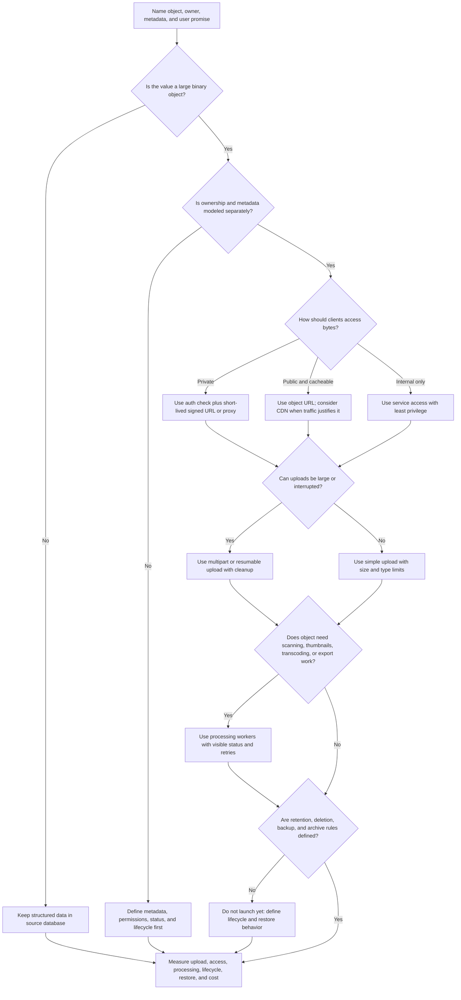
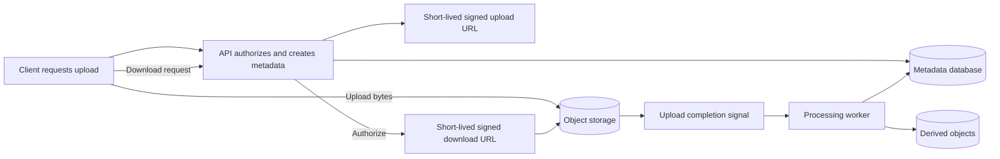

# Object Storage

Object storage keeps large binary objects such as files, images, videos,
exports, and backup artifacts outside the primary transactional database. It is
useful when objects are large, downloaded directly, retained for a lifecycle, or
processed asynchronously.

Object storage is not the whole file system design. The system still needs
metadata ownership, permissions, upload state, signed access, lifecycle rules,
backup and restore behavior, processing workflows, and observability. The
source-of-truth record for who owns an object and what it means usually belongs
in an operational database.

## Purpose

Use this page to decide:

- when files, images, videos, exports, backups, or large blobs should leave the
  primary database;
- which metadata stays in the source-of-truth store;
- whether upload and download should use signed URLs, application proxying, or
  another access path;
- when multipart upload, processing workers, lifecycle rules, or CDN delivery
  are justified;
- how to make object storage safe to operate, recover, and clean up.

This page focuses on component choice. Product-specific file types, image
processing details, video transcoding, CDN rules, malware scanning, and backup
policy are covered by related pages and later walkthroughs.

## When This Matters

Use this tree when:

- users upload files, images, videos, documents, exports, or attachments;
- objects are too large or too numerous for ordinary database rows;
- downloads dominate bandwidth or should not pass through application servers;
- uploads may be interrupted, large, or mobile-network dependent;
- the design needs private access, signed URLs, object metadata, or retention;
- processing such as thumbnails, scanning, transcoding, previews, or archive
  generation happens after upload;
- backups or generated exports need durable storage and restore procedures.

Skip object storage when the data is small, structured, frequently updated, and
queried with the rest of the source-of-truth record. A small avatar reference or
document status can live in the database; the binary bytes usually should not.

## Quick Decision

| If the workflow needs... | Start with... | Watch for... |
| --- | --- | --- |
| Small structured data | Primary database field or table | Storing blobs when metadata is enough |
| Large files, images, videos, or exports | Object storage plus metadata record | Orphaned objects, permissions, lifecycle, and bandwidth |
| Private downloads | Auth check plus short-lived signed URL | Leaking durable object keys or long-lived URLs |
| Public cacheable downloads | Object storage with CDN later if needed | Invalidation, origin protection, and signed/private content |
| Large or unreliable uploads | Multipart or resumable upload flow | Incomplete parts, cleanup, and status tracking |
| Post-upload processing | Object storage plus queue/worker pipeline | Unsafe files, retries, idempotency, and user-visible status |
| Backups or archives | Isolated backup storage with restore plan | Untested restore, key loss, and retention conflicts |
| Deletion or retention rules | Lifecycle policy plus metadata cleanup | Deleted metadata with surviving objects or restored deleted data |

Default to storing authoritative metadata in the database and large immutable
bytes in object storage. Add signed URLs, multipart upload, processing workers,
CDN delivery, or lifecycle automation only when the workflow needs them.

## Questions To Ask

- What object is being stored: uploaded file, image, video, generated export,
  backup artifact, archive, or processed derivative?
- Who owns the object, and which source-of-truth metadata proves that ownership?
- Is the object public, private, tenant-scoped, permissioned, temporary, or
  audit-sensitive?
- How large can one object be, and how many objects are retained?
- Does upload need to survive mobile disconnects, browser retries, or large
  files?
- Should clients upload/download through the app, through signed URLs, or via a
  CDN?
- Which processing steps run after upload, and what status does the user see?
- What lifecycle applies: temporary, active, archived, expired, deleted, or
  legally retained?
- How do backups, versioning, replication, restore, and deletion interact with
  object metadata?
- Which metrics and runbooks prove uploads, downloads, processing, lifecycle,
  and restores are healthy?

## Object Storage Decision Tree



Use the tree to decide whether object storage is justified and which supporting
decisions must exist. The answer may be "define metadata first" when the design
knows where bytes live but not who owns them or how they are cleaned up.

## Requirements Discovered

| Requirement | Why It Matters | Design Impact |
| --- | --- | --- |
| Object type and size | Files, images, videos, exports, and backups have different access and processing needs | Drives storage, upload, bandwidth, and processing choices |
| Metadata ownership | Bytes need source-of-truth context | Drives database records, object keys, status, permissions, and audit |
| Access boundary | Public, private, tenant, support, and internal access differ | Drives signed URLs, auth checks, proxying, CDN, and least privilege |
| Upload behavior | Large or unreliable uploads can fail halfway | Drives multipart upload, retries, cleanup, and user-visible progress |
| Processing workflow | Files may need scanning, thumbnails, previews, or transcoding | Drives queue/worker design, idempotency, status, and repair |
| Lifecycle policy | Objects should not live forever by accident | Drives retention, archive, deletion, legal hold, and cleanup jobs |
| Backup and restore | Objects and metadata must recover together | Drives versioning, backup scope, restore validation, and reconciliation |
| Observability and cost | Blob systems fail through age, bandwidth, orphaning, and storage growth | Drives metrics, alerts, runbooks, and cost controls |

## Options

| Option | Use When | Trade-Off |
| --- | --- | --- |
| Database field for bytes | Object is tiny, structured, and transactionally updated with the record | Simple, but grows rows and backup/restore cost quickly |
| Local disk | Prototype, temporary scratch, or single-process demo | Not durable across instances and blocks horizontal scaling |
| Object storage | Large blobs need durable, addressable storage outside the database | Requires metadata, permissions, lifecycle, and access design |
| Application proxy | App must inspect, transform, or strictly control every byte transfer | Simple auth boundary, but app pays bandwidth and latency cost |
| Signed URL | Client can upload or download directly after an auth decision | Efficient, but URL scope, expiry, and object key safety matter |
| Multipart upload | Files are large or networks are unreliable | More state, cleanup, and completion handling |
| Processing pipeline | Objects need scanning, previews, transcoding, or generated derivatives | Adds workers, retries, status, and repair paths |
| Backup/archive object store | Backups, exports, or long-term archives need isolated storage | Restore, encryption keys, retention, and access review become critical |

## Decision Guidance

### Keep Metadata Authoritative

Object storage should hold bytes. The operational database should usually hold
the record that explains what the object is.

Useful metadata includes:

- owner, tenant, or account ID;
- object type, purpose, and source workflow;
- object key or locator;
- content type and size;
- checksum or hash when integrity matters;
- status such as `pending_upload`, `uploaded`, `processing`, `ready`,
  `failed`, `quarantined`, `archived`, or `deleted`;
- permissions and visibility;
- created, updated, processed, expires, and deleted timestamps;
- processing version and derivative relationships;
- audit or support identifiers.

Do not treat the object key as the authorization model. Authorization should
come from metadata and policy, then the system can issue a scoped access path.

### Use Signed URLs For Direct Transfer

Signed URLs let a client upload or download bytes directly after the
application performs an authorization decision.

Use signed URLs when:

- the object is large enough that proxying through the app wastes bandwidth;
- the client can safely perform direct upload or download;
- the URL can be short-lived and scoped to one object, operation, and content
  constraints;
- the app records upload intent and later confirms completion.

Signed URL design should define:

```text
Operation: <upload or download>
Object key: <opaque path generated by server>
Scope: <object, tenant, owner, method, size, content type>
Expiry: <short enough to limit reuse>
Completion: <how the app confirms bytes arrived and metadata status changes>
Revocation: <how access stops after permission or lifecycle changes>
```

Avoid long-lived signed URLs for private data. Avoid object keys that reveal
tenant names, emails, private titles, or sequential IDs that invite guessing.

### Choose Multipart Upload For Large Or Unreliable Uploads

Multipart or resumable upload is justified when uploads are large, users are on
unreliable networks, or retrying the whole file is too expensive.

Design decisions:

- when to start multipart upload based on size or client type;
- where upload session metadata lives;
- how parts are listed, completed, retried, and cleaned up;
- what timeout expires abandoned sessions;
- how checksum or size validation proves the completed object is correct;
- what the user sees while upload is incomplete.

Multipart upload without cleanup creates storage leaks. Track incomplete upload
age and schedule cleanup for abandoned sessions.

### Separate Original Objects From Derivatives

Images and videos often create derived objects: thumbnails, previews,
transcoded videos, extracted text, compressed variants, or virus-scan reports.

Model derivatives explicitly:

- original object ID;
- derivative type and version;
- processing status;
- worker attempt and error reason;
- content type, size, and checksum;
- whether the derivative is user-visible or internal;
- whether it can be rebuilt from the original.

Do not overwrite the original during processing. Keep the original immutable
unless the product requirement says replacement is allowed and the lifecycle
rules are clear.

### Make Processing Visible And Repairable

Post-upload processing may include:

- malware or safety scan;
- metadata extraction;
- thumbnail or preview generation;
- image resize or compression;
- video transcode;
- document conversion;
- export generation;
- backup manifest creation.

Processing should have a user-visible or operator-visible state when it affects
the workflow. A file stuck in `processing` should not look like a successful
upload.

For each processing step, define:

- trigger: upload completion, source event, schedule, or operator request;
- idempotency key: object ID plus processing version;
- retryable and non-retryable failures;
- max attempts and quarantine behavior;
- whether users can download the original before processing completes;
- repair path: retry, replace, delete, quarantine, or manual review.

### Design Lifecycle Before Storage Grows

Object lifecycle rules decide when objects stay hot, move to archive, expire,
or must be deleted.

Lifecycle categories:

| Object Class | Example | Lifecycle Question |
| --- | --- | --- |
| Active upload | Resident photo attached to an open request | How long does it remain accessible? |
| Processed derivative | Thumbnail or transcoded video | Can it be rebuilt instead of retained forever? |
| Export | User data export or staff CSV | When does the download expire? |
| Backup artifact | Database backup or object manifest | Which RPO/RTO and retention policy apply? |
| Quarantined file | Failed scan or policy violation | Who reviews it and when is it purged? |
| Deleted object | User or policy deletion | How do metadata, object bytes, backups, and restore interact? |

Lifecycle should include both metadata and bytes. Deleting a database row while
leaving private bytes behind is a data-retention bug. Deleting bytes while
leaving metadata that says the file is ready is a product bug.

### Treat Backups As A Workflow

Object storage can store backups, and uploaded objects may also need backup or
versioning. Both cases need restore thinking.

For user-uploaded objects, ask:

- Are objects authoritative, derived, temporary, or externally owned?
- Should versioning protect against accidental overwrite or deletion?
- Does metadata backup include enough object keys and checksums to restore?
- How do object restore and database restore stay consistent?
- What reconciliation finds metadata without bytes or bytes without metadata?

For backup artifacts stored as objects, ask:

- Who can write, read, delete, and restore backups?
- Are encryption keys recoverable during an incident?
- How often is restore tested?
- What retention or legal hold applies?
- How is backup corruption detected?

A backup object that cannot be restored, decrypted, or matched to metadata does
not satisfy the recovery requirement.

## Upload And Processing Shape



This shape keeps ownership and status in the database while large bytes move
directly to object storage. Processing workers update metadata so users and
operators can see `processing`, `ready`, `failed`, or `quarantined` states.

## Trade-Offs

| Choice | Improves | Costs Or Risks |
| --- | --- | --- |
| Store bytes in database | Simple transaction with metadata | Large rows, slower backups, query bloat, and poor bandwidth isolation |
| Store bytes in object storage | Scales large files and direct transfer | Requires metadata, access, lifecycle, and reconciliation |
| Proxy through application | Centralized auth and transformation | App bandwidth, latency, and instance pressure |
| Use signed URLs | Efficient upload/download path | URL scope, expiry, revocation, and key-safety complexity |
| Multipart upload | Better large-file reliability | Incomplete parts, session state, and cleanup burden |
| Keep derivatives | Faster reads and previews | Extra storage, invalidation, and processing versions |
| Rebuild derivatives | Lower storage for recomputable outputs | Rebuild time and degraded experience during repair |
| Long retention | Better recovery and audit | Storage cost, privacy risk, and deletion complexity |

## Failure Modes

| Failure Mode | Impact | Design Response | Observable Signal |
| --- | --- | --- | --- |
| Metadata says ready but bytes are missing | User sees broken download or restore fails | Confirm upload completion and reconcile metadata to objects | Missing object count, download 404s |
| Bytes exist without metadata | Private or costly orphaned object remains | Use upload sessions and orphan cleanup | Orphan object count, storage growth |
| Signed URL is too broad or long-lived | Private object access can leak | Scope by object, method, size, and expiry | Access outside expected window, denied download attempts |
| Multipart upload is abandoned | Storage fills with incomplete parts | Expire sessions and cleanup incomplete uploads | Incomplete upload age, abandoned part count |
| Processing worker fails | File remains unavailable or unsafe | Retry, quarantine, and show status | Processing age, failure count, quarantine count |
| Malware or unsafe file is served | Users or systems are exposed | Gate serving on scan status where required | Scan failure, served-before-scan count |
| Lifecycle deletes too early | User loses needed file or backup | Tie lifecycle to product state and restore tests | Restore miss, deletion audit, support report |
| Lifecycle never deletes | Cost and privacy risk grow | Retention rules, archive, cleanup jobs, and owner review | Objects past retention, storage cost trend |
| Database restore misses object state | Restored app points to wrong or missing files | Restore metadata and object manifests together | Restore validation mismatch |
| Processing creates duplicate derivatives | Storage bloat or wrong version served | Idempotent derivative key and processing version | Duplicate derivative count, stale version served |

## Common Mistakes

- Storing large blobs in the transactional database by default.
- Storing only an object key and forgetting owner, permissions, status, and
  lifecycle metadata.
- Using object keys as secrets.
- Creating signed URLs with broad scope or long expiry for private objects.
- Allowing upload completion without verifying size, type, checksum, or expected
  metadata when those matter.
- Forgetting cleanup for abandoned multipart uploads and failed processing.
- Serving uploaded files before required scanning or policy checks finish.
- Deleting metadata without deleting or retaining bytes according to policy.
- Backing up metadata but not validating that object bytes can be restored.
- Treating generated thumbnails or previews as authoritative when they can be
  rebuilt from originals.

## Original Example

A neighborhood art workshop lets residents submit project photos for a public
gallery. Staff can approve photos, generate thumbnails, and export monthly
archive bundles.

The team walks the tree:

- The image bytes are large binary objects, so they do not belong in the
  project database.
- The database owns metadata: resident ID, project ID, object key, content type,
  size, checksum, visibility, approval status, scan status, thumbnail status,
  and retention date.
- Uploads may come from mobile devices, so files above a size threshold use
  multipart upload. Abandoned upload sessions expire after a short window.
- Residents receive a short-lived signed upload URL after the API verifies they
  can edit the project.
- Gallery downloads are public only after staff approval. Before approval,
  downloads require an auth check and a short-lived signed URL.
- Processing workers scan the image, extract dimensions, and create thumbnails.
  The original is not overwritten.
- If processing fails, the photo shows `needs_review` or `processing_failed`
  instead of appearing as ready.
- Monthly archive exports are generated objects with their own expiry and audit
  event.
- Lifecycle cleanup removes unsubmitted uploads, expires old exports, and
  retains approved gallery photos according to the workshop policy.

Interview answer frame:

```text
Object: resident project photo.
Metadata source: project_photo table in the operational database.
Storage: object storage for original and thumbnail objects.
Access: short-lived signed upload and download URLs after API authorization.
Upload: multipart above threshold, with abandoned session cleanup.
Processing: scan, dimensions, thumbnail; idempotent by photo_id + version.
Lifecycle: unsubmitted uploads expire, exports expire, approved photos follow policy.
Restore: metadata backup includes object keys and checksums for validation.
Revisit signal: upload failures, processing age, storage growth, or CDN need.
```

Version 1 can skip CDN delivery if downloads are modest. It should not skip
metadata ownership, signed access boundaries, upload cleanup, or processing
status because those decisions protect correctness and privacy.

## Checklist

Before adding object storage, confirm:

- The object type, owner, source workflow, and user promise are named.
- Metadata lives in a source-of-truth record with object key, status,
  permissions, size/type, lifecycle, and audit fields where needed.
- The design explains why bytes should not stay in the primary database.
- Signed URL scope, expiry, method, content constraints, completion, and
  revocation behavior are defined when signed URLs are used.
- Multipart or resumable upload is justified by file size or network risk, and
  abandoned uploads are cleaned up.
- Processing steps, worker ownership, retries, idempotency keys, failure states,
  and repair paths are defined.
- Files are not served before required scanning, approval, or policy checks.
- Original objects and derivatives have clear version and rebuild rules.
- Lifecycle rules cover temporary uploads, active files, derivatives, exports,
  backups, archives, quarantined files, deletion, and legal holds where relevant.
- Backup and restore validation covers both metadata and object bytes.
- Metrics include upload success, download errors, signed URL failures,
  processing age, failed jobs, orphan objects, incomplete uploads, lifecycle
  deletions, restore checks, bandwidth, storage growth, and cost.

## Related Pages

- [Component selection map](index.md)
- [Database selection](database-selection.md)
- [Queue](queue.md)
- [Background workers](background-workers.md)
- [CDN](cdn.md)
- [Data overview](../data/)
- [Read and write patterns](../data/read-write-patterns.md)
- [Backups and restore](../data/backups-and-restore.md)
- [Scale estimation](../method/scale-estimation.md)
- [Capacity estimation](../scalability/capacity-estimation.md)
- [Privacy requirements](../requirements/privacy.md)
- [Durability requirements](../requirements/durability.md)
- [Backup and restore recovery](../reliability/backup-and-restore-recovery.md)
- [Graceful degradation](../reliability/graceful-degradation.md)
