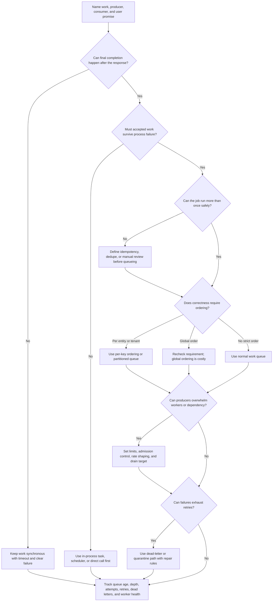

# Queue

A queue stores work so producers and workers do not have to run at the same
speed or in the same request path. Queues can smooth bursts, isolate slow
dependencies, and make retries durable. They also add delay, duplicate delivery,
ordering limits, backpressure decisions, dead-letter handling, and operational
work.

The goal is not to add a queue whenever work is slow. The goal is to decide
whether delay is acceptable, whether the work is safe to retry, and whether the
system can operate the backlog it creates.

## Purpose

Use this page to decide:

- whether async work belongs behind a queue or should stay synchronous;
- which delay tolerance justifies queueing;
- how retries, idempotency, ordering, backpressure, and dead-letter queues
  should work;
- what users and operators see while work is pending, retrying, failed, or
  repaired;
- when a queue is the wrong component because the system needs a stream,
  direct call, transaction, scheduler, or simpler manual workflow.

This page focuses on queue decisions. Worker pool sizing, job implementation,
and detailed communication patterns are covered by related component and
communication pages.

## When This Matters

Use this tree when:

- a user request is waiting on slow work that can finish later;
- a dependency is slow, rate limited, flaky, or outside the team's control;
- a burst of work can be accepted now and drained later;
- retries need durable state instead of in-memory loops;
- provider calls, emails, exports, imports, image processing, or report
  generation should not block the main response;
- a design includes a queue but does not explain delay, ordering, retries,
  backpressure, dead letters, or idempotency.

Skip a queue when the user needs final success before continuing, the operation
is not safe to retry, work volume is small enough for a direct call, or no one
will monitor and repair stuck jobs. A queue can make the API faster while the
actual product workflow becomes harder to understand.

## Quick Decision

| If the workflow has... | Start with... | Watch for... |
| --- | --- | --- |
| User must know final result now | Synchronous path with timeout and clear error | Hiding unfinished work behind "accepted" |
| Work can finish later with visible status | Queue plus worker | Pending states, retry policy, duplicate work, and queue age |
| Bursty producers and slower consumers | Queue with backpressure and drain target | Backlog growth, stale work, and overload shifted to workers |
| Temporary provider failures | Retryable job with backoff and idempotency | Retry storms, provider quotas, and ambiguous outcomes |
| Ordered work for one entity | Per-key serialization or partitioned queue | Head-of-line blocking and hot keys |
| Poison or permanently failing work | Dead-letter or quarantine path | Silent drops, unsafe replay, and manual repair burden |
| Multiple consumers need replayed event history | Stream, not a simple queue | Retention, event contracts, consumer lag, and ordering semantics |

Default to a direct synchronous path when the work is cheap, fresh, and required
for the response. Add a queue only when delay is acceptable and the system can
make retries, duplicates, backlog, and repair visible.

## Questions To Ask

- What work is being moved out of the request path?
- Can the user or caller continue before final completion?
- What is the maximum acceptable delay: seconds, minutes, hours, or deadline?
- Is the work retryable, idempotent, and safe under duplicate delivery?
- Which failures are temporary, permanent, ambiguous, or require manual review?
- Does the work need ordering, and if so by what key?
- What should happen when producers enqueue faster than workers drain?
- How will the system reject, slow, delay, or shed work when the queue is too
  deep?
- What makes a job dead-lettered, quarantined, cancelled, or replayable?
- What status, metrics, logs, traces, alerts, and runbooks prove the queue is
  healthy?

## Queue Decision Tree



Use the tree to decide whether a queue is justified and what obligations come
with it. The answer may be "do not queue this path yet" when final correctness,
idempotency, or operations are unclear.

## Requirements Discovered

| Requirement | Why It Matters | Design Impact |
| --- | --- | --- |
| Delay tolerance | Queueing trades immediate completion for later work | Drives accepted/pending states, freshness target, and queue age alerts |
| Durable acceptance | Accepted work should not vanish on process failure | Drives durable queue, outbox, job table, or simpler direct call |
| Idempotency boundary | Queues can redeliver jobs and workers can retry | Drives job ID, dedupe key, processed marker, or attempt entity |
| Retry policy | Temporary failures need bounded recovery | Drives timeout, backoff, jitter, max attempts, and retry classification |
| Ordering need | Some workflows require serial processing by key | Drives partition key, per-entity queue, or synchronous transaction |
| Backpressure rule | Producers may exceed worker or provider capacity | Drives admission control, rate limits, worker caps, or rejection behavior |
| Dead-letter handling | Some work cannot complete automatically | Drives quarantine, manual repair, replay, cancellation, and alerts |
| Observability | Queues hide work after the request returns | Drives queue age, depth, attempts, worker health, traces, and runbooks |

## Options

| Option | Use When | Trade-Off |
| --- | --- | --- |
| Direct synchronous call | Final result is required now and work is bounded | Simple correctness but exposes users to dependency latency |
| In-process background task | Work is best-effort and can be lost safely | Simple, but not durable across process failure |
| Durable job table or outbox | Work is tied to a source-of-truth write | Good repairability, but needs workers and state transitions |
| Work queue | Accepted work can finish later and needs retry/drain behavior | Adds backlog, duplicate delivery, idempotency, and operations |
| Partitioned or per-key queue | Ordering matters within one entity, tenant, or resource | Reduces concurrency for hot keys and can block later jobs |
| Priority queue | Some work must drain before lower-value work | More scheduling policy and starvation risk |
| Dead-letter or quarantine queue | Retry exhaustion needs inspection or repair | Prevents silent drops but creates operational workload |
| Stream | Events need retention, replay, and multiple independent consumers | More event-contract and consumer-lag complexity than a simple queue |

## Decision Guidance

### Start With Delay Tolerance

Queueing is a product decision before it is an infrastructure decision. The user
or caller must know whether the work is complete, accepted, pending, failed, or
needs review.

Use this frame:

```text
Work: <job, side effect, export, provider call, import, notification>
Producer: <API, scheduler, event handler, operator, batch job>
Consumer: <worker, provider integration, processor>
User promise: <complete now, accepted, pending, complete by deadline>
Delay tolerance: <seconds, minutes, hours, or not acceptable>
Retry policy: <which errors retry, max attempts, backoff, jitter>
Idempotency key: <what makes duplicate work the same business action>
Backpressure: <reject, slow, cap, shed, prioritize, or queue deeper>
Repair path: <dead-letter, manual review, replay, cancel, compensate>
```

If the user cannot tolerate delay, use a synchronous path with a bounded timeout
and clear failure behavior instead of pretending a queue makes the workflow
complete.

### Use Queues For Work Delivery, Not Event History

A queue is best when the goal is to deliver units of work to workers:

- send a notification;
- generate an export;
- resize an image;
- call a provider;
- process an import row;
- run a retryable side effect;
- drain bursts at a safe rate.

Use a stream when the event history itself matters: multiple consumers need the
same event sequence, consumers need replay, or retention and ordering are core
requirements. A queue can be simpler than a stream for version 1 when one worker
group owns the work and replay history is not the product requirement.

### Make Jobs Idempotent Before Retrying

Most queue systems can deliver a job more than once. Workers can crash after
doing the side effect but before acknowledging the job. Providers can time out
after accepting work. Operators may replay a job during repair.

Design idempotency before enabling automatic retries:

- assign a stable `job_id` or business operation key;
- store attempt state and final result when duplicates need the same answer;
- protect side effects with send records, provider idempotency keys, or
  processed markers;
- make derived writes upsert by source entity and version when possible;
- reject or quarantine jobs that reuse a key for a different action.

Without idempotency, retries can turn one failure into duplicate emails,
duplicate charges, duplicate reservations, or repeated external calls.

### Retry Temporary Failures, Classify Permanent Failures

Retries should target temporary failures. Validation errors, missing required
state, permission failures, malformed payloads, and impossible business
transitions usually should not retry forever.

For each job type, define:

- per-attempt timeout;
- retryable error classes;
- non-retryable error classes;
- max attempts;
- backoff and jitter;
- what state the user or operator sees while retrying;
- what happens when attempts are exhausted.

Retry exhaustion should become a visible state such as `failed`,
`needs_review`, `cancelled`, or `dead_lettered`. Silent drops are usually worse
than noisy failures.

### Design Backpressure Before The Queue Fills

A queue can absorb bursts, but it can also hide overload until the backlog is
too old to be useful. Backpressure decides what producers do when workers,
providers, or downstream stores cannot keep up.

Backpressure choices include:

- reject new work with a clear retry hint;
- accept only high-priority work;
- cap per-tenant or per-key queue depth;
- slow producers with rate limits;
- reduce worker concurrency to protect a provider;
- shed optional work;
- switch to degraded or manual mode.

Do not scale workers blindly. More workers can drain CPU-bound work, but they
can also overload the database, external provider, lock, or hot key that made
the queue grow.

### Treat Ordering As A Constraint, Not A Default

Ordering can be local, global, or unnecessary.

Use per-key ordering when one entity needs serial state transitions, such as all
jobs for one payment attempt, reservation, tenant, or uploaded file. This keeps
unrelated work concurrent while protecting one resource.

Avoid global ordering unless the product requirement truly needs it. Global
ordering lowers concurrency, makes backlogs harder to drain, and can block
unrelated work behind one slow job.

If ordering matters only for final state, a versioned write, conditional update,
or idempotent upsert may be simpler than forcing every job through one ordered
lane.

### Make Dead Letters Repairable

A dead-letter queue is not a trash can. It is a repair queue for jobs that
exhausted automatic handling or failed validation after acceptance.

For dead-lettered work, define:

- what error class sends a job there;
- what context is stored for inspection without exposing secrets;
- who owns review and how quickly;
- whether the job can be replayed safely;
- whether replay needs a new idempotency key or the original one;
- when the job should be cancelled, compensated, or escalated;
- what alert fires before dead letters accumulate.

Dead letters without ownership become hidden data loss.

## Trade-Offs

| Choice | Improves | Costs Or Risks |
| --- | --- | --- |
| Keep work synchronous | Clear final outcome and simpler state | User waits for slow work or dependency failure |
| Add queue | Lower user-visible latency and burst smoothing | Delay, duplicates, retries, backlog, and operations |
| Durable job table/outbox | Stronger repairability tied to source writes | More state transitions and worker logic |
| Per-key ordering | Correct serial work for one entity | Hot keys and head-of-line blocking |
| Automatic retries | Recovery from temporary failures | Retry storms and duplicate side effects without idempotency |
| Backpressure | Protects workers and dependencies | Rejects, delays, or deprioritizes some work |
| Dead-letter queue | Prevents silent loss after retry exhaustion | Manual repair burden and unsafe replay risk |

## Failure Modes

| Failure Mode | Impact | Design Response | Observable Signal |
| --- | --- | --- | --- |
| Job is delivered twice | Duplicate side effect or conflicting state | Use idempotency key, processed marker, or dedupe table | Duplicate job count, idempotency hit rate |
| Worker crashes after side effect before ack | Side effect may repeat on redelivery | Persist attempt state and make provider call idempotent | Retry after partial completion, provider duplicate response |
| Queue age grows beyond delay tolerance | Users wait too long for completion | Add backpressure, worker capacity, priority, or degraded mode | Oldest job age, depth, enqueue/dequeue rate |
| Poison job retries forever | Worker capacity is wasted and backlog grows | Classify permanent failures and dead-letter with context | Retry count, repeated error fingerprint, DLQ count |
| Backpressure is missing | Producers overwhelm queue, workers, or dependency | Reject, rate limit, cap per tenant, or shed low-priority work | Admission rejections, provider rate limits, queue growth |
| Ordering blocks unrelated work | One slow key delays many jobs | Partition by key or remove global ordering requirement | Per-key age, hot partition, blocked job count |
| Dead-letter queue is ignored | Accepted work is effectively lost | Alert, assign owner, document replay/cancel rules | DLQ age, unreviewed count, repair SLA misses |
| Queue accepts work the source cannot represent | User sees accepted status but source truth has no durable record | Use outbox/job table with source transaction | Orphan jobs, missing source record, reconciliation failures |

## Common Mistakes

- Adding a queue to make an API fast without defining when the product work is
  actually complete.
- Queueing commands that must be fresh and final before the user continues.
- Retrying non-idempotent work and creating duplicate side effects.
- Counting queue depth but not oldest job age.
- Treating dead-letter queues as a place to hide failures instead of repair
  work.
- Requiring global ordering when only one entity needs serial processing.
- Scaling workers without checking the downstream database, provider, lock, or
  hot key.
- Letting producers enqueue forever instead of applying backpressure.
- Dropping jobs after max attempts without user-visible state or operator
  review.

## Original Example

A neighborhood repair clinic lets residents request pickup for broken household
items. The API records the request, then sends a confirmation message, schedules
a pickup reminder, and generates a weekly staff export.

The team walks the tree:

- Creating the repair request must be synchronous because the resident needs a
  confirmed request ID. The source-of-truth write stays in the API path.
- Sending confirmation and reminder messages can happen after the response, but
  accepted messages must survive process failure. Use a durable queue or outbox
  job after the request commit.
- Message jobs use an idempotency key like `request_id + message_type +
  recipient_id` so worker retries do not send duplicate messages.
- The provider sometimes rate limits. Retry with bounded backoff and jitter,
  cap worker concurrency, and alert when queue age exceeds the reminder
  freshness target.
- Jobs for the same request should not send a reminder before confirmation.
  Use per-request ordering or store message state so the reminder worker checks
  prerequisite state before sending.
- After max attempts, move the job to a dead-letter queue with request ID,
  message type, last error class, and retry count. Support can replay safely
  with the same idempotency key or mark the message cancelled.

Interview answer frame:

```text
Work: confirmation and reminder messages.
Producer: repair request API after source-of-truth commit.
Consumer: notification worker calling provider.
User promise: request creation completes now; messages should send within 10 minutes.
Delay tolerance: confirmation under 1 minute, reminder within its scheduled window.
Retry policy: retry provider timeouts and rate limits with backoff, jitter, and max attempts.
Idempotency key: request_id + message_type + recipient_id.
Backpressure: cap provider concurrency and reject optional bulk sends when queue age is high.
Repair path: dead-letter exhausted jobs for support review and safe replay.
```

Version 1 does not need a stream because one worker group owns message delivery
and no independent consumer needs retained event history. If analytics, audit
replay, and multiple consumers later need the same message events, revisit a
stream as a separate decision.

## Checklist

Before adding a queue, confirm:

- The queued work, producer, consumer, and source of truth are named.
- The user-visible state distinguishes complete, accepted, pending, failed, and
  needs-review work.
- Delay tolerance is explicit and tied to queue age alerts.
- Accepted work is durable when loss would harm users or operators.
- Job idempotency, duplicate delivery, and retry safety are designed.
- Retryable and non-retryable failures are classified.
- Retry policy includes timeout, max attempts, backoff, and jitter.
- Ordering needs are scoped by key instead of assumed globally.
- Backpressure says what happens when producers exceed drain capacity.
- Dead-letter handling has context, owner, alert, and safe replay/cancel rules.
- Metrics include enqueue rate, dequeue rate, depth, oldest age, attempts,
  retries, dead-letter count, worker health, and dependency response classes.
- The page explains why the queue is worth the complexity for this workflow.

## Related Pages

- [Components](./)
- [Component selection map](index.md)
- [Background workers](background-workers.md)
- [Stream](stream.md)
- [Latency requirements](../requirements/latency.md)
- [Throughput requirements](../requirements/throughput.md)
- [Consistency requirements](../requirements/consistency.md)
- [Availability requirements](../requirements/availability.md)
- [Retries and backoff](../communication/retries-and-backoff.md)
- [Idempotency](../communication/idempotency.md)
- [Observability basics](../operations/observability-basics.md)
- [Bottleneck analysis](../scalability/bottleneck-analysis.md)
