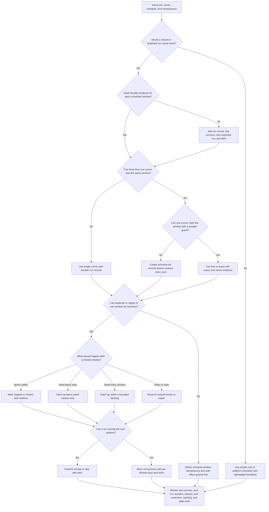

# Scheduler

A scheduler creates work at a specific time, interval, or calendar boundary. It
is useful for cleanup, retention, billing, reconciliation, reports, reminders,
imports, expiry, sync, and other work that starts because time passed instead
of because a user clicked a button.

A scheduler does not prove the work happened. Important scheduled work still
needs an owner, run evidence, idempotency, missed-run behavior, locking when
multiple runners exist, catch-up limits, and monitoring that shows whether the
job is healthy.

## Purpose

Use this page to decide:

- whether a simple cron, platform scheduler, durable schedule table, queue, or
  worker-triggered schedule is enough;
- which recurring work needs durable run records and missed-run alerts;
- how to prevent duplicate scheduled runs when several instances or regions can
  trigger the same job;
- how to make scheduled work idempotent by schedule window, job type, tenant,
  source entity, or business operation;
- what should happen after downtime: skip, catch up one run, catch up a bounded
  backlog, or require manual repair;
- which metrics and runbooks prove scheduled work is running, safe, and useful.

This page focuses on scheduler and cron decisions. Worker execution, queues,
retries, idempotency, and detailed operations are covered by related pages.

## When This Matters

Use this tree when:

- work must run every few minutes, hourly, nightly, monthly, or at a specific
  calendar time;
- a missed run would leave data stale, money unreconciled, files undeleted,
  reminders unsent, reports missing, or users blocked;
- a duplicate run could send duplicate messages, charge twice, delete too much,
  or publish conflicting derived data;
- more than one process, worker, zone, or region might start the same job;
- a job can take longer than its schedule interval;
- the system needs to catch up after downtime without overwhelming workers,
  databases, providers, or operators;
- a design says "use cron" without explaining ownership, run records, locks,
  missed runs, idempotency, catch-up, or alerts.

Skip a scheduler when work is user-triggered, event-triggered, or safe as a
manual version 1 task. A one-time migration, ad hoc repair, or operator action
does not need a recurring scheduler unless the work must repeat reliably.

## Quick Decision

| If scheduled work has... | Start with... | Watch for... |
| --- | --- | --- |
| Low-value, single-instance, best-effort work | Simple cron or platform scheduled task | Silent missed runs and unclear owner |
| Important recurring work | Durable run record with last success and next expected run | Treating trigger success as job success |
| Multiple possible runners | Lease, lock, leader, or claim record per schedule window | Stale locks, split-brain runs, and weak expiry rules |
| Side effects or source writes | Schedule-window idempotency key | Duplicate notifications, releases, deletes, or charges |
| Missed run can be ignored safely | Mark skipped or missed and continue | Hidden data freshness or compliance drift |
| Missed run must be recovered | Bounded catch-up policy | Catch-up storms and stale work that is no longer useful |
| Run duration can exceed interval | Explicit overlap policy | Concurrent writes, lock contention, and growing lag |
| Human calendar semantics | Named time zone and calendar rule | Daylight saving changes, month-end gaps, and surprise local time |

Default to the simplest scheduler that satisfies the consequence of a missed or
duplicate run. Add durable records, locks, catch-up, and alerts when the work is
important enough that operators must prove it happened.

## Questions To Ask

- What work starts because of time: cleanup, report, reminder, sync, billing,
  retention, expiry, reconciliation, import, or rebuild?
- Who owns the schedule, runbook, alert, and repair decision?
- Is the schedule an interval, a wall-clock time, a calendar rule, or a
  business deadline?
- Which time zone matters, if any?
- Must every scheduled window run, or is "latest state only" enough?
- What harm comes from a missed run, duplicate run, late run, or partial run?
- Can more than one process, worker, zone, or region trigger the same job?
- What makes one scheduled run unique: job name, schedule window, tenant,
  entity, source version, or provider attempt?
- Can a run overlap the next scheduled window?
- What should happen after downtime: skip, catch up one, catch up all within a
  bound, or send to manual repair?
- Which metrics, logs, traces, alerts, and runbooks show last success, next
  expected run, duration, failures, lock contention, backlog, and stale work?

## Scheduler Decision Tree



Use the tree to decide whether the scheduler is only a trigger or whether it
must become an observable control point. If the tree returns "define
idempotency first," do not enable automatic retries or catch-up yet.

## Requirements Discovered

| Requirement | Why It Matters | Design Impact |
| --- | --- | --- |
| Schedule semantics | Interval, wall-clock, calendar, and deadline schedules fail differently | Drives time zone, calendar rule, deadline, and run-window modeling |
| Run guarantee | Some jobs are best effort; others must prove each window ran | Drives run records, status, alerts, and repair |
| Single ownership | Every recurring job needs an owner and runbook | Drives alert routing, manual repair, and change review |
| Duplicate safety | Schedulers can fire twice and operators can replay | Drives schedule-window idempotency keys and side-effect records |
| Distributed trigger control | Multiple runners can start the same job | Drives locks, leases, leader election, or claim records |
| Missed-run policy | Downtime can create gaps or stale work | Drives skip, catch-up, bounded backlog, or manual review behavior |
| Overlap policy | Long jobs can collide with the next window | Drives non-overlap locks, concurrency limits, or per-window isolation |
| Observability | Scheduled work often fails when no user is watching | Drives last success, next expected run, duration, failure, lock, and backlog metrics |

## Options

| Option | Use When | Trade-Off |
| --- | --- | --- |
| Manual recurring task | Work is rare, low risk, and human judgment is required | Simple version 1, but depends on people and checklists |
| Simple cron | One instance owns low-value or best-effort work | Easy to start, but weak run evidence and failover |
| Platform scheduler | A managed platform can trigger one endpoint or command reliably enough | Reduces local cron management, but still needs job state and alerts |
| Durable schedule/run table | Important runs need status, history, replay, and missed-run detection | More schema and worker logic |
| Scheduler creates queue jobs | Scheduled work needs worker pools, retries, and backlog control | Adds queue delay, duplicate delivery, and idempotency requirements |
| Lock or lease per window | Several runners may compete for the same run | Prevents most duplicates, but stale locks and split brain still need handling |
| Single leader scheduler | One elected runner owns schedule creation | Simpler trigger path, but leader failover and evidence matter |
| Workflow engine | Timed workflows need long-running state, timers, and compensation | More operational surface than basic recurring jobs |

## Decision Guidance

### Start With The Schedule Promise

Describe the schedule before choosing a tool.

Use this shape:

```text
Job: <cleanup, report, reminder, sync, billing, retention, expiry, reconciliation>
Owner: <team, service, operator group>
Schedule: <interval, wall-clock time, calendar rule, deadline>
Time zone: <UTC, user local time, business location, or not applicable>
Promise: <best effort, every window, latest useful state, complete by deadline>
Run key: <job name + schedule window + tenant/entity/source version>
Missed-run policy: <skip, catch latest, catch bounded backlog, manual repair>
Overlap policy: <forbid, allow per window, replace old run, or alert>
Evidence: <run record, output count, last success, next expected run, result>
```

If this statement is hard to fill in, the scheduler is probably being used as a
shortcut for an undefined operational workflow.

### Separate Trigger From Execution

A scheduler decides when work should start. A worker, queue, service, script, or
operator task performs the work.

Keep the boundary explicit:

- scheduler trigger: creates or claims one scheduled window;
- run record: stores status, timestamps, owner, attempt count, and result;
- worker or job body: performs bounded work with timeouts and idempotency;
- queue or job table: buffers work when execution should not block the
  scheduler;
- operator view: shows missed, running, failed, skipped, and repaired runs.

For small version 1 jobs, the trigger and execution can live in one process.
For important jobs, the run record should still survive process failure so
operators can tell whether the job ran.

### Use Run Records For Important Jobs

Important scheduled jobs should leave durable evidence.

Useful run fields include:

- job name and schedule window;
- owner, environment, and runner instance when useful;
- status such as `scheduled`, `claimed`, `running`, `succeeded`, `failed`,
  `skipped`, `missed`, or `needs_review`;
- scheduled time, start time, finish time, and deadline;
- attempt count and last safe error category;
- lock owner or lease expiry when multiple runners exist;
- input range, tenant, source version, or batch cursor;
- output counts, such as rows scanned, rows changed, messages sent, files
  expired, or reports generated;
- next retry, replay, skip, cancel, or repair action.

The run record should not store raw private payloads. Store enough context to
repair safely without turning scheduler history into a sensitive data dump.

### Design Locks As Hints, Not Correctness By Themselves

Locks and leases reduce duplicate runs, but they do not replace idempotency.
Processes can pause, clocks can drift, networks can partition, and operators can
replay old work.

Use a lock or lease when:

- more than one runner can trigger the same scheduled window;
- the job should not overlap itself;
- one active owner should process a batch cursor or tenant partition;
- the system can expire or steal a stale claim safely.

Pair the lock with:

- a stable schedule-window key;
- a durable run record or claim row;
- an expiry that is longer than normal pauses but shorter than the repair
  target;
- an owner identity for debugging;
- idempotent writes or side-effect records;
- metrics for lock acquisition failures, contention, stale claims, and steals.

If duplicate execution would cause harm, protect the business action itself,
not only the scheduler trigger.

### Define Missed-Run And Catch-Up Behavior

Downtime creates a decision. The system can skip missed windows, catch up the
latest useful window, catch up every missed window within a bound, or require
manual repair.

Choose skip when:

- the job is best effort;
- the next run naturally covers the missed work;
- stale work would be useless or harmful;
- the missed run has no compliance, money, or user impact.

Choose bounded catch-up when:

- each window has business meaning;
- delayed work is still useful;
- workers and dependencies can drain the backlog safely;
- alerts and dashboards show catch-up progress.

Choose manual repair when:

- old work may be unsafe to apply automatically;
- external side effects may have ambiguous outcomes;
- a human must decide whether to replay, skip, compensate, or notify users.

Never let catch-up create unbounded load after an outage. Set maximum windows,
batch sizes, concurrency, provider rate limits, and stale-work cutoffs.

### Monitor The Schedule, Not Only The Process

A healthy process can still miss the job that matters. Monitor scheduled work
from the schedule's promise.

Useful signals:

- last successful run age by job;
- next expected run time;
- missed-run count;
- run duration and deadline misses;
- run success, failure, skip, and needs-review counts;
- duplicate suppression and idempotency conflicts;
- lock acquisition failures, contention, and stale locks;
- catch-up backlog and oldest missed window age;
- output count anomalies, such as zero rows changed when work was expected;
- downstream errors, retry exhaustion, and manual repair count.

Alert on user, data, compliance, or operational risk. A low-value cleanup job
may only need a dashboard. Billing, retention, entitlement, reconciliation, or
customer notification jobs often need alerts and runbooks.

## Trade-Offs

| Choice | Improves | Costs Or Risks |
| --- | --- | --- |
| Keep a manual task | Fastest version 1 and preserves judgment | Easy to forget, hard to audit, and slow to repeat |
| Use simple cron | Minimal implementation and familiar operations | Silent missed runs, poor ownership, and weak failover |
| Add durable run records | Clear evidence, replay, and missed-run detection | More state, schema, and repair paths |
| Use locks or leases | Reduces duplicate runs across instances | Stale locks, clock assumptions, and false confidence without idempotency |
| Forbid overlap | Protects shared data and downstream capacity | Long jobs can skip windows or fall behind |
| Allow overlap | Keeps schedule cadence when jobs run long | Requires per-window keys, concurrency limits, and conflict handling |
| Skip missed runs | Avoids stale catch-up load | Leaves gaps that may affect users, data, or compliance |
| Catch up missed runs | Preserves intended work | Can overload workers and run stale side effects |
| Use a queue behind the scheduler | Adds buffering, retries, and worker isolation | Adds duplicate delivery, backlog, and queue operations |

## Failure Modes

| Failure Mode | Impact | Design Response | Observable Signal |
| --- | --- | --- | --- |
| Scheduled trigger does not fire | Cleanup, report, sync, or reminder work is missed | Last-success alert and next-expected-run monitor | Last success age, missed-run count |
| Trigger fires twice | Duplicate messages, deletes, exports, or writes | Schedule-window idempotency and side-effect records | Duplicate suppression count, idempotency conflicts |
| Multiple runners claim the same window | Conflicting work or wasted capacity | Lock, lease, claim record, and idempotent writes | Lock contention, duplicate run attempts |
| Lock remains after runner crash | Future windows cannot run | Lease expiry, stale-claim repair, and owner evidence | Stale lock age, missed windows |
| Job overlaps next interval | Data races, provider pressure, or growing lag | Non-overlap policy or per-window concurrency limits | Running duration over interval, overlap count |
| Catch-up after outage is unbounded | Database, queue, provider, or workers are overloaded | Catch-up window cap, batch size, rate limit, and pause control | Catch-up backlog, dependency errors |
| Time zone or calendar rule is wrong | Job runs at the wrong local time or misses month-end cases | Explicit time zone and calendar tests for human-time schedules | Unexpected run time, user reports |
| Job succeeds but does no useful work | Data remains stale while dashboard looks green | Output-count checks and business health metrics | Zero-output anomaly, stale data age |
| Replay repeats old side effects | Users receive duplicate messages or external state changes twice | Replay mode, dedupe records, and operator confirmation | Replay count, duplicate side-effect count |
| No owner receives alerts | Failures wait until users notice | Named owner, alert route, and runbook | Unacknowledged alerts, support reports |

## Common Mistakes

- Treating cron firing as proof that the job completed correctly.
- Running important scheduled work without a durable run record.
- Adding a distributed lock while leaving the job itself non-idempotent.
- Letting every missed window catch up after downtime without a backlog limit.
- Ignoring overlap when the job can run longer than its interval.
- Using server local time when the product needs a named business time zone.
- Retrying scheduled side effects without a schedule-window key.
- Alerting only on process uptime instead of last successful run and stale
  work.
- Storing raw private payloads in run history for debugging convenience.
- Leaving scheduled jobs without an owner, runbook, or manual repair path.

## Original Example

A public library system releases unclaimed holds each night so the next patron
in line can be notified. Missing the job keeps books unavailable. Running it
twice could send duplicate notices or release the same hold twice.

The team walks the tree:

- The job has user impact, so a simple hidden cron is not enough.
- The run key is `release_unclaimed_holds + library_id + schedule_date`.
- A platform scheduler triggers the job each night at the library's local
  closing time.
- The job creates a durable run record before processing holds.
- Because two app instances can receive the trigger during deploys, each
  library/date window is claimed with a lease.
- Each hold release uses an idempotency key based on `hold_id + expiry_date +
  release_action`; individual attempts are stored as metadata on that operation.
- If the system is down for one night, it catches up the latest missed date. If
  it is down longer, older windows move to `needs_review` so staff can decide
  whether notices are still useful.
- The job cannot overlap for the same library because it updates the same hold
  queue. Different libraries can run concurrently with per-library limits.
- Operators monitor last successful run age, next expected run, duration,
  released-hold count, duplicate suppressions, lease contention, catch-up
  backlog, and holds past expiry.

Interview answer frame:

```text
Job: release unclaimed library holds.
Owner: circulation platform team.
Schedule: nightly after local branch closing time.
Promise: each library/date window should be processed once or marked for review.
Run key: job name + library_id + schedule_date.
Lock: one lease per library/date window.
Idempotency: hold_id + expiry_date + release action.
Missed run: catch up latest missed day, route older gaps to staff review.
Overlap: no overlap per library; bounded concurrency across libraries.
Observability: last success, next run, duration, output count, stale holds,
lock contention, duplicate suppression, and needs_review count.
```

Version 1 can use a platform scheduler, one durable run table, and one worker
process. It does not need a full workflow engine until many timed workflows need
long-running state, compensation, or complex human approvals.

## Checklist

Before adding or approving a scheduler, confirm:

- The recurring work and owner are named.
- The schedule is defined as interval, wall-clock time, calendar rule, or
  deadline.
- The time zone is explicit when human time matters.
- The consequence of missed, duplicate, late, partial, and overlapping runs is
  understood.
- Important jobs have durable run records and status.
- Multiple runners use a lock, lease, leader, or claim record.
- The job is idempotent by schedule window, job type, tenant, source entity, or
  business operation.
- Side effects have dedupe or send records before retries, replay, or catch-up.
- Scheduler triggers are authenticated, job credentials are least-privilege,
  and manual replay or repair actions are protected.
- Missed-run behavior is one of skip, catch latest, bounded catch-up, or manual
  repair.
- Catch-up has limits for windows, batch size, concurrency, downstream rate, and
  stale-work age.
- The overlap policy is explicit.
- Monitoring covers last success, next expected run, duration, failures, lock
  contention, catch-up backlog, stale work, output count, and manual repair.
- Alerts route to an owner with a runbook.
- Run history avoids raw private payloads while preserving repair context.

## Related Pages

- [Component selection map](index.md)
- [Background workers](background-workers.md)
- [Queue](queue.md)
- [Stream](stream.md)
- [Retries and backoff](../communication/retries-and-backoff.md)
- [Idempotency](../communication/idempotency.md)
- [Outbox pattern](../communication/outbox-pattern.md)
- [Latency requirements](../requirements/latency.md)
- [Throughput requirements](../requirements/throughput.md)
- [Availability requirements](../requirements/availability.md)
- [Operability requirements](../requirements/operability.md)
- [Metrics](../operations/metrics.md)
- [Runbooks](../operations/runbooks.md)
- [Component metrics catalog](../operations/component-metrics-catalog.md)
