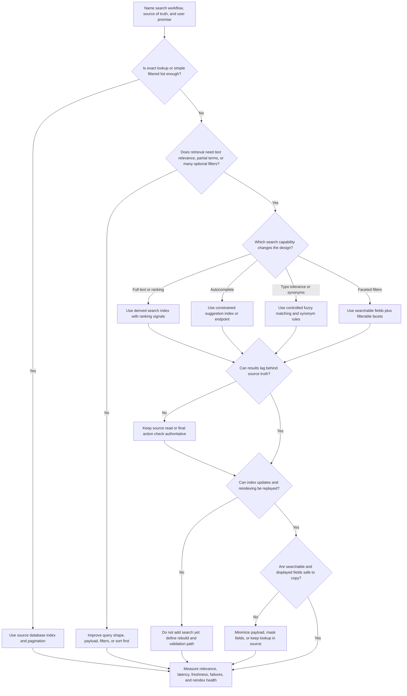
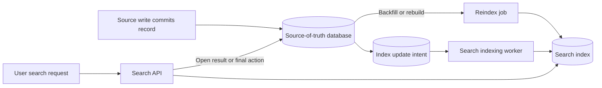

# Search Index

A search index is a derived read model optimized for finding, filtering,
ranking, and suggesting records. It helps when users search by text, many
optional filters, partial terms, typo-tolerant matches, or relevance ranking
that would make ordinary source-of-truth queries slow or awkward.

A search index is not the source of truth. It can be stale, incomplete, poorly
ranked, overbroad, privacy-sensitive, or expensive to rebuild. Use it when the
retrieval experience justifies freshness lag, duplicate storage, reindexing
work, and result-quality operations.

## Purpose

Use this page to decide:

- whether database indexes and exact filters are enough for version 1;
- when full-text search, ranking, filters, autocomplete, or typo tolerance
  justify a derived search index;
- how freshness, source-of-truth checks, reindexing, and rebuilds should work;
- what users see when search is stale, partial, degraded, or unavailable;
- which metrics prove search is useful, fresh enough, and safe to operate.

This page focuses on component choice. Detailed schema design, query syntax,
ranking algorithms, and product-specific relevance tuning belong in later
implementation or walkthrough work.

## When This Matters

Use this tree when:

- users search natural-language text, names, descriptions, notes, addresses, or
  documents;
- exact database filters no longer produce useful discovery;
- ranking, sorting, facets, autocomplete, suggestions, or typo tolerance shape
  the user experience;
- search reads scan too much data or compete with source-of-truth writes;
- a derived search index may lag behind writes and needs a freshness policy;
- the design includes a search service but does not explain reindexing,
  privacy, source-of-truth checks, or degraded behavior.

Skip a search index when users only need exact lookup, a small filtered list, or
a known sort order that ordinary database indexes can serve. Start with the
source-of-truth model and add search only when retrieval requirements create
pressure that database filters should not carry.

## Quick Decision

| If the search need is... | Start with... | Watch for... |
| --- | --- | --- |
| Exact lookup by ID, slug, code, or email | Source database lookup or uniqueness index | Overbuilding a search path for deterministic reads |
| List by owner, status, category, time, or location | Database index shaped to filters and sort | Adding a search index before fixing query shape |
| Full-text search across titles or descriptions | Derived search index | Freshness lag, tokenization, and result quality |
| Ranking by relevance, popularity, or recency | Search index with explicit ranking signals | Hidden ranking rules and hard-to-debug results |
| Faceted filters over many attributes | Search index or derived read model | Source/index drift and filter-count accuracy |
| Autocomplete or prefix suggestions | Suggestion index or constrained search endpoint | Privacy leaks and noisy partial matches |
| Typo tolerance or synonyms | Search index with match controls | False positives and surprising ranking |
| Strict fresh correctness before an action | Source-of-truth read or final write check | Acting on stale search results |

Default to database indexes for known exact filters and sort orders. Add a
search index when users need discovery, text relevance, faceted exploration,
autocomplete, typo tolerance, or search load isolation with an explicit
freshness and reindexing plan.

## Questions To Ask

- What user workflow does search protect: discovery, support lookup, admin
  triage, catalog browsing, compliance review, or autocomplete?
- Which fields are searchable, filterable, sortable, displayed, private, or
  source-only?
- Is the query an exact lookup, a filtered list, full-text search, faceted
  search, autocomplete, or typo-tolerant match?
- What does "good result" mean: relevance, recency, popularity, distance,
  availability, permissions, or business priority?
- How fresh must search results be after source-of-truth writes?
- Which action must recheck the source of truth before success?
- How will the index be populated, updated, reindexed, and validated?
- How will deleted, private, permissioned, or corrected records leave the index?
- What happens when search is unavailable, stale, partially rebuilt, or
  returning poor results?
- Which metrics show query latency, zero-result rate, stale result age,
  indexing lag, reindex progress, and degraded-mode usage?

## Search Index Decision Tree



Use the tree to decide whether a search index is justified and which obligations
come with it. The answer may be "not yet" when exact filters are enough,
freshness is strict, or reindexing and privacy boundaries are undefined.

## Requirements Discovered

| Requirement | Why It Matters | Design Impact |
| --- | --- | --- |
| Query intent | Exact lookup, filtered list, discovery, and autocomplete need different paths | Drives database index, search index, suggestion index, or no new component |
| Searchable fields | The index can only search fields that are copied or derived | Drives document shape, privacy review, and source lookup rules |
| Filter and sort fields | Facets and filters must match user decisions | Drives filterable fields, sort keys, and consistency with source data |
| Ranking rule | Relevance changes which result users see first | Drives scoring signals, tie-breakers, and result-quality metrics |
| Freshness window | Search can lag behind source writes | Drives update pipeline, freshness labels, final source checks, and alerts |
| Reindex path | Indexes can corrupt, drift, or need schema changes | Drives replay, backfill, validation, and rebuild runbooks |
| Typo tolerance | Fuzzy matching improves recall but can reduce precision | Drives match thresholds, query controls, and false-positive review |
| Autocomplete safety | Suggestions may expose private or inappropriate terms | Drives allowlists, permissions, popularity thresholds, and suppression rules |
| Operations signals | Search failures can look like empty inventory | Drives query latency, zero-result, stale age, indexing lag, and fallback metrics |

## Options

| Option | Use When | Trade-Off |
| --- | --- | --- |
| Source database lookup | Users know the ID, slug, code, or exact key | Fresh and simple, but not discovery-oriented |
| Database index for filters | Queries have stable filters, sort order, and pagination | Keeps truth simple, but cannot handle rich relevance or fuzzy text well |
| Materialized or denormalized read model | Expensive list can be precomputed with bounded freshness | Easier than search, but limited ranking and text behavior |
| Search index | Users need full-text search, ranking, facets, or typo tolerance | Adds freshness lag, duplicate data, relevance tuning, and rebuild work |
| Suggestion/autocomplete index | Users need prefix or as-you-type discovery | Fast suggestions, but privacy, noise, and update lag need controls |
| Batch search export | Staff or reports need periodic searchable snapshots | Simpler operations, but not live user-facing search |
| Degraded direct lookup | Search is down but critical records can still be opened by ID | Preserves core workflow, but discovery is reduced |

## Decision Guidance

### Start With The Retrieval Job

Search should start from the user's retrieval job, not from a search product.

Use this frame:

```text
Workflow: <catalog browse, support lookup, admin triage, public search>
Source of truth: <tables, documents, files, or records>
Query intent: <exact, filtered list, full text, facets, autocomplete, fuzzy>
Freshness: <immediate, seconds, minutes, publish cycle, batch>
Ranking: <relevance, recency, distance, availability, popularity, manual boost>
Safety: <permissions, private fields, deletion, abusive terms, sensitive data>
Reindex path: <outbox replay, source scan, backfill, validation, rollback>
Fallback: <source lookup, stale label, reduced filters, unavailable search>
```

If the query intent is exact and the result must be fresh, a database index is
usually the right first move. Search becomes useful when discovery and relevance
matter more than source-query simplicity.

### Separate Database Indexes From Search Indexes

Database indexes and search indexes both improve reads, but they solve
different problems.

Use database indexes when:

- filters and sort order are known;
- the result set can be narrowed predictably;
- the read must be fresh from the source of truth;
- the write path can afford the index maintenance;
- the query is a lookup or list, not discovery.

Use a search index when:

- users type partial, varied, or natural-language queries;
- text scoring, stemming, synonyms, or typo tolerance matter;
- many optional filters and facets need fast exploration;
- ranking combines textual relevance with business signals;
- search load should be isolated from source-of-truth writes;
- stale reads are acceptable or final actions recheck the source.

Do not use search to hide an unclear data model. The source records still need
ownership, permissions, deletion behavior, and source-of-truth validation.

### Design Freshness Explicitly

Search freshness is the delay between a source-of-truth change and the search
result reflecting it. Freshness expectations differ by workflow.

Examples:

| Workflow | Freshness Rule | Source Check |
| --- | --- | --- |
| Public article search | New article appears within 5 minutes | Open article by source ID |
| Marketplace availability | Search may lag 30 seconds | Reservation write rechecks availability |
| Support lookup | Status changes appear within 1 minute | Support detail page reads source |
| Permission-sensitive search | Results must reflect current access | Filter with source permissions or avoid derived private fields |

When search can be stale, label or bound the stale behavior where user decisions
depend on it. When stale results can cause harm, keep the critical decision on a
source-of-truth read or write.

### Treat Ranking As Product Logic

Ranking decides what users see first. It should be explainable enough for
reviewers and operators to debug.

Ranking signals may include:

- text match strength;
- recency or publish date;
- availability or status;
- distance or locality;
- popularity or quality score;
- manual editorial boost or demotion;
- tenant, language, or audience-specific rules.

Write down the tie-breaker. A stable tie-breaker makes pagination and repeated
queries less surprising.

Watch for ranking failures:

- high zero-result rate for common queries;
- users clicking low-ranked results more than top results;
- stale or unavailable items ranking above available ones;
- private or suppressed records appearing in results;
- one source or tenant dominating all results.

Ranking is not purely technical. It can affect trust, fairness, abuse handling,
and business outcomes, so keep the first version simple and observable.

### Keep Filters And Facets Honest

Filters narrow search results by category, status, location, time, owner,
permission, availability, or other structured fields. Facets show counts or
groups that help users refine a search.

Design filter fields from source-of-truth attributes:

- know which source field populates each filter;
- decide whether filter counts can be approximate or stale;
- handle missing or unknown values explicitly;
- make permission filters non-optional when data is private;
- recheck source truth before a write that depends on availability.

If filter counts must be exact and fresh under write load, a search index may
not be the right source for the final decision.

### Use Autocomplete Carefully

Autocomplete and suggestions can make discovery faster, but they can also leak
private data, preserve abusive terms, and encourage bad matches.

Before adding autocomplete, decide:

- which terms can be suggested;
- whether suggestions come from curated labels, popular public queries, or
  source records;
- how recently deleted or private records are removed;
- whether suggestions are scoped by tenant, permission, locale, or audience;
- what minimum prefix length and popularity threshold reduce noise;
- what fallback appears when suggestions are stale or unavailable.

For sensitive domains, suggest only approved public terms or categories. Avoid
suggesting raw user-entered private text.

### Use Typo Tolerance With Guardrails

Typo tolerance improves recall when users misspell names or terms. It can also
return surprising results when the query is short, ambiguous, or safety
sensitive.

Guardrails include:

- require enough query length before fuzzy matching;
- prefer exact matches above fuzzy matches;
- limit edit distance or similarity thresholds;
- combine fuzzy text with explicit filters when possible;
- show no result instead of a risky result for permission, money-like, or
  safety-critical workflows;
- measure false positives, zero-result improvements, and support complaints.

Autocomplete, synonyms, and typo tolerance should be additions to a clear search
intent, not replacements for understanding user language.

### Plan Reindexing Before Launch

Search indexes drift. They need schema changes, backfills, rebuilds, and
validation.

Define:

- source fields used to build each search document;
- update trigger: outbox event, change feed, job, batch, or manual publish;
- idempotent document ID and source version;
- replay or backfill process;
- validation checks such as document counts, sample comparisons, stale age, and
  missing-document reports;
- rollback or dual-index plan for risky schema/ranking changes;
- degraded behavior while a rebuild is running.

Reindexing should not overload the source database, block writes, or expose
deleted/private records. Rate limit backfills and make progress observable.

## Search Pipeline Shape



This shape keeps the source of truth authoritative while letting search serve
discovery reads. The final action still reads or writes the source when stale
search results could harm correctness.

## Trade-Offs

| Choice | Improves | Costs Or Risks |
| --- | --- | --- |
| Stay with database indexes | Fresh reads and simpler operations | Limited full-text relevance, facets, autocomplete, and typo tolerance |
| Add search index | Better discovery, ranking, filters, and load isolation | Freshness lag, duplicate data, reindexing, and relevance tuning |
| Add autocomplete | Faster query entry and discovery | Privacy leaks, stale suggestions, and noisy partial matches |
| Add typo tolerance | Fewer zero-result searches for misspellings | False positives and surprising matches |
| Rich ranking signals | More useful ordering | Harder debugging, fairness questions, and stale signal drift |
| Rich indexed payloads | Fewer source lookups | More privacy, deletion, storage, and drift risk |
| Minimal indexed payloads | Lower data-copy risk | More source lookups and slower detail pages |
| Rebuild from source | Repairable index corruption | Backfill load, rebuild duration, and temporary degraded search |

## Failure Modes

| Failure Mode | Impact | Design Response | Observable Signal |
| --- | --- | --- | --- |
| Search result is stale | User sees old status, price, owner, or availability | Bound freshness and recheck source before critical actions | Stale document age, source/index mismatch |
| Source write is missing from index | New or changed record cannot be found | Durable index intent, retry, and replay from source | Indexing lag, missing-document count |
| Deleted or private record remains searchable | Privacy, security, or trust incident | Treat deletion/access changes as high-priority index updates | Suppression lag, private-hit audit |
| Ranking returns poor results | Users miss useful records or abandon search | Track result quality and keep ranking explainable | Zero-result rate, click position, reformulation rate |
| Typo tolerance overmatches | Wrong records appear for short or sensitive queries | Limit fuzzy matching and prefer exact matches | False-positive reports, fuzzy match rate |
| Autocomplete leaks terms | Sensitive or abusive terms appear while typing | Use curated terms, thresholds, permissions, and suppression | Suggestion suppression count, abuse reports |
| Filter counts disagree with results | Users lose trust or choose impossible filters | Define approximate counts or rebuild facet data | Count mismatch rate, facet rebuild lag |
| Reindex overloads source database | User-facing writes or reads slow down | Rate limit backfill and run from safe snapshots when possible | Source load, reindex throughput, p95 latency |
| Index schema change breaks queries | Search errors or empty results after deploy | Use compatibility checks, dual index, or rollback plan | Query error rate, zero-result spike |
| Search outage hides records | Users think inventory or content is gone | Provide degraded direct lookup or browse fallback | Search availability, fallback usage |

## Common Mistakes

- Adding a search index before database query shape and ordinary indexes are
  understood.
- Treating search results as authoritative for availability, permission, or
  money-like decisions.
- Copying private fields into the index because they are convenient for ranking.
- Forgetting that deletes, permission changes, and corrections must update the
  index quickly.
- Adding autocomplete from raw user queries without curation or suppression.
- Turning on typo tolerance for short or sensitive queries without measuring
  false positives.
- Reindexing live data without a rate limit, validation, or rollback plan.
- Measuring only query latency while ignoring freshness, zero-result rate, and
  result quality.
- Adding ranking boosts that no one can explain during a support issue.

## Original Example

A community skills exchange lets residents post offers such as "bike repair,"
"Spanish conversation practice," and "help moving garden soil." Residents can
find offers by title, description, neighborhood, availability, and skill type.

Version 1 starts with source database filters:

- exact category filter;
- neighborhood filter;
- availability status;
- newest-first sort;
- detail pages read the source record.

This works while the catalog is small. The team adds a search index only after
users start searching for terms like "bicycle tune-up," "flat tire," and "bike
fix" and expect relevant results even when the exact words differ.

The team walks the tree:

- The workflow is discovery, not a final source-of-truth decision.
- Full-text search and ranking matter because residents use varied terms for
  the same skill.
- Filters matter for neighborhood, availability, and skill type.
- Autocomplete is allowed only from approved public skill names and popular
  public terms, not raw private messages.
- Typo tolerance is enabled only for queries longer than a short threshold and
  exact matches rank first.
- Freshness can lag by up to 2 minutes for search results, but booking a session
  rechecks availability in the source database.
- Index updates come from durable source changes. Reindexing can rebuild search
  documents from active public offers and their current availability.
- Operators watch indexing lag, zero-result rate, stale document age, query
  latency, fallback usage, and reindex progress.

Interview answer frame:

```text
Search workflow: residents discover skill offers.
Source of truth: offer records, availability, and member permissions.
Query intent: full-text plus filters for neighborhood, skill type, and status.
Ranking: exact title match, text relevance, availability, distance, recency.
Freshness: search can lag 2 minutes; booking rechecks source availability.
Autocomplete: approved public skill terms only.
Typo tolerance: enabled for longer queries with exact matches first.
Reindexing: rebuild from active public source records with progress metrics.
Fallback: browse by category or open a known offer by ID if search is down.
```

The team does not put private member notes or unpublished offers into the index.
If search is stale, the final booking write still protects correctness.

## Checklist

Before adding a search index, confirm:

- The search workflow and source of truth are named.
- Database indexes and exact filters were considered as the simpler version 1.
- Full-text search, ranking, filters, autocomplete, or typo tolerance justify
  the derived index.
- Search freshness is explicit and tied to user-visible behavior.
- Critical writes or permission-sensitive reads recheck the source of truth.
- Searchable, filterable, sortable, displayed, and private fields are separated.
- Ranking signals and tie-breakers are documented enough to debug.
- Autocomplete sources, thresholds, permissions, and suppression rules are
  defined.
- Typo tolerance has match limits and false-positive signals.
- Index updates have durable intent, retries, idempotent document IDs, and
  source versions where useful.
- Reindexing, backfill, validation, rollback, and degraded behavior are planned.
- Metrics include query traffic, latency, zero-result rate, stale age, indexing
  lag, update failures, index size, fallback usage, and reindex progress.

## Related Pages

- [Components](./)
- [Component selection map](index.md)
- [Database selection](database-selection.md)
- [Cache](cache.md)
- [Stream](stream.md)
- [Data indexes](../data/indexes.md)
- [Read and write patterns](../data/read-write-patterns.md)
- [Latency requirements](../requirements/latency.md)
- [Throughput requirements](../requirements/throughput.md)
- [Consistency requirements](../requirements/consistency.md)
- [Scalability requirements](../requirements/scalability.md)
- [Database read scaling](../scalability/database-read-scaling.md)
- [Graceful degradation](../reliability/graceful-degradation.md)
- [Component metrics catalog](../operations/component-metrics-catalog.md)
