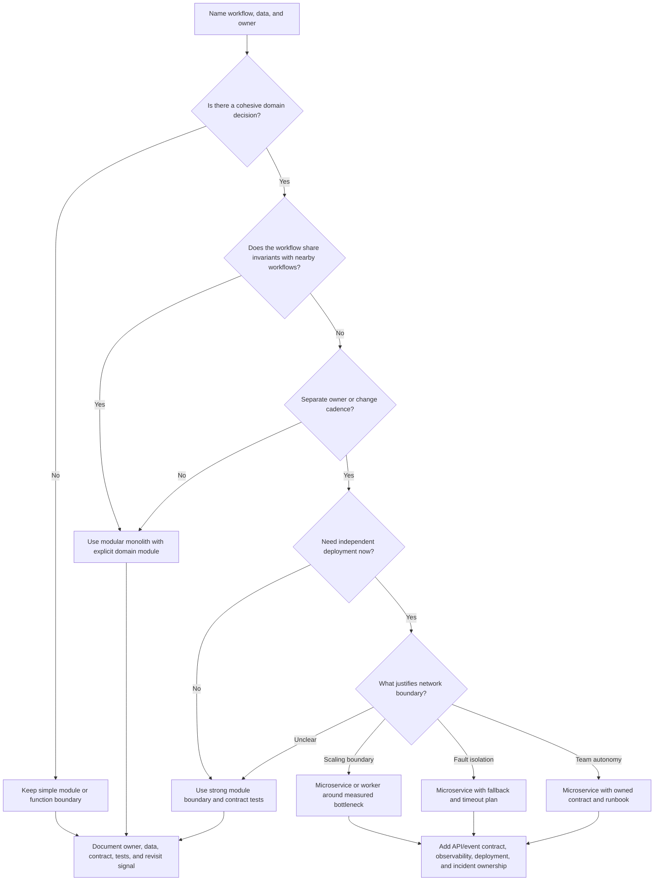

# Service Layer

A service layer organizes business behavior behind clear boundaries. It decides
which workflows belong together, which data each boundary owns, which teams or
operators are responsible for it, and whether the system should stay a modular
monolith or split into separately deployed services.

The goal is not to turn every domain noun into a microservice. The goal is to
make boundaries explicit enough that the design can protect correctness,
ownership, deployment independence, scaling boundaries, and operations without
adding distributed complexity too early.

## Purpose

Use this page to decide:

- whether version 1 should be a simple module, a modular monolith, or one or
  more microservices;
- where domain boundaries and data ownership belong;
- which team, service, or module owns each business decision;
- whether deployment independence is a real requirement or a premature split;
- whether one workflow needs a separate scaling boundary;
- what failure and operational costs appear when a boundary becomes a network
  boundary.

## When This Matters

Use this tree when:

- the design has many workflows and it is unclear which logic belongs together;
- teams are proposing microservices before naming ownership or scaling pressure;
- one workflow changes faster, fails differently, or scales differently than the
  rest;
- two components may write the same data or enforce the same business rule;
- independent deployment, team autonomy, or fault isolation is being claimed as
  a requirement;
- a walkthrough needs to explain why version 1 is a modular monolith instead of
  a distributed service mesh.

Skip a service split when the only reason is "this could be a service later."
Keep the boundary as a module, package, or internal interface until a requirement
justifies moving it across the network.

## Quick Decision

| If the pressure is... | Start with... | Watch for... |
| --- | --- | --- |
| One small team owns one product workflow | Simple module or modular monolith | Premature service deployment and duplicated infrastructure |
| Several workflows share the same data invariants | Modular monolith with explicit domain modules | Hidden cross-module writes and unclear ownership |
| A domain has a separate owner and change cadence | Strong module boundary, then service if deployment independence matters | Coordination cost and contract versioning |
| One workflow needs independent scaling | Separate worker, module, or service around that workload | Shared database, provider, or lock may remain the real bottleneck |
| One capability must fail without taking others down | Service boundary only after failure mode and fallback are clear | Network failures, retries, and degraded behavior |
| Teams need independent deployments | Microservice candidate | More observability, release, compatibility, and incident ownership |

Default to a modular monolith when the product is still learning its domain
shape. Split into microservices only when a named ownership, deployment,
reliability, or scaling requirement pays for the extra operations.

## Questions To Ask

- Which business decision does this boundary own?
- Which entities and invariants must be protected together?
- Who changes this logic, and how often?
- Who operates it when it is slow, wrong, or unavailable?
- Does this boundary need independent deployment, or only clearer code
  organization?
- Does this workflow scale differently from the rest of the system?
- Can the boundary own its data, or would several services write the same
  source of truth?
- What calls, events, queues, or contracts would cross the boundary?
- What happens if the boundary is down, slow, or returns an ambiguous result?
- What is the simplest version 1 boundary that still makes future extraction
  possible?

## Service Boundary Decision Tree



Use the tree to decide the next boundary, not the final organization chart.
Boundaries can begin as modules and become services later when the domain and
operational pressure are clear.

## Requirements Discovered

| Requirement | Why It Matters | Design Impact |
| --- | --- | --- |
| Domain boundary | Business rules should have a clear home | Defines module/service responsibilities and language |
| Data ownership | Several writers can break invariants | Defines which boundary owns source-of-truth writes |
| Change ownership | Different teams or workflows may evolve at different speeds | Drives module ownership, review paths, and service candidates |
| Deployment independence | Some changes must ship without coordinating the whole app | Drives service split, API contracts, and compatibility tests |
| Scaling boundary | One workload may saturate before the rest | Drives worker pools, service extraction, queues, or resource isolation |
| Fault isolation | One capability may need to degrade without failing everything | Drives timeouts, fallbacks, bulkheads, and service boundaries |
| Operational ownership | A boundary is only useful if someone can operate it | Drives dashboards, alerts, runbooks, and incident responsibility |

## Options

| Option | Use When | Trade-Off |
| --- | --- | --- |
| Simple module | The domain is small and one team changes it together | Fast version 1, but weak isolation if the codebase grows |
| Modular monolith | Domains are emerging but shared deployment is acceptable | Clear boundaries without distributed calls, but discipline is required |
| Strong internal boundary | A future service candidate needs a contract before extraction | Good preparation, but can feel heavier than needed |
| Background worker boundary | Slow or retryable work should not block user requests | Adds job ownership, retries, and visibility |
| Microservice | Independent ownership, deployment, scaling, or fault isolation is real | Adds network failure, observability, versioning, and operational overhead |
| Shared platform service | Many teams need the same capability, such as identity or notifications | Reduces duplication, but can become a bottleneck or unclear owner |

## Decision Guidance

### Start With Domain Boundaries

Domain boundaries are product boundaries before they are deployment boundaries.
Name the decision each boundary owns.

Useful statements:

```text
Reservation owns room availability and no-double-booking decisions.
Billing owns invoice state and payment attempt lifecycle.
Notification owns message templates, delivery attempts, and provider outcomes.
Search owns derived retrieval views, not source-of-truth edits.
```

Weak boundary statements:

```text
User service owns users.
Common service owns shared logic.
Backend service owns business logic.
```

The weak statements are too broad to guide ownership, data writes, or failure
behavior.

### Prefer Modular Monoliths For Version 1

A modular monolith keeps one deployment while enforcing internal boundaries
through packages, interfaces, ownership rules, and tests. It is often the best
first service layer because it avoids network calls while the team is still
discovering the domain.

Use a modular monolith when:

- one team owns most workflows;
- transactions or invariants span several early features;
- deployment independence is not yet a real constraint;
- traffic is not high enough to require separate scaling;
- the team wants future extraction without paying distributed-system costs now.

Modular monolith does not mean messy monolith. It needs rules:

- each module owns its write model;
- other modules call through explicit interfaces;
- direct cross-module database writes are forbidden;
- tests protect important contracts;
- logs and metrics still identify module and workflow.

### Split Services Only For Named Pressure

Microservices are justified by pressure that a module cannot satisfy.

Good split signals:

- a team must deploy its capability independently to meet delivery or risk
  requirements;
- a workload needs separate scaling because it saturates CPU, memory, queue
  workers, or provider quotas differently;
- one capability must degrade or fail without taking the main workflow down;
- data ownership is already clean enough that one service can own its source of
  truth;
- the service has a clear API, event contract, runbook, and owner.

Weak split signals:

- the noun sounds important;
- the future system might be large;
- a diagram looks cleaner with more boxes;
- the team wants to use microservices for practice;
- the code is disorganized but the domain boundary is still unclear.

If the code is messy, first create modules and ownership. Splitting messy code
across network calls usually makes the mess harder to see and harder to fix.

### Keep Data Ownership Explicit

The service that owns a business invariant should own the write path that
protects it.

Examples:

- Reservation owns slot availability and booking conflicts.
- Payment owns attempt state and provider reconciliation.
- Inventory owns quantity changes and reservation holds.
- Identity owns credentials, sessions, and account lifecycle.

Avoid designs where several services update the same tables for convenience.
That creates hidden coupling without the safety of a single local transaction.
If several services need the same data, choose one source of truth and publish
events, expose reads, or build derived views.

### Treat Deployment Independence As A Requirement

Independent deployment is not free. It requires:

- compatibility across old and new callers;
- versioned API or event contracts;
- deploy order and rollback plan;
- observability by service version;
- feature flags or migration windows when behavior changes;
- ownership for incidents caused by partial rollout.

If the team still deploys every service together, it may have microservice
operational cost without deployment independence. A modular monolith may be
more honest until independent deployment is needed.

### Use Scaling Boundaries Carefully

A service boundary helps scaling only when the bottleneck is inside that
boundary and can be isolated.

Good scaling-boundary examples:

- report generation moves to workers so API requests stay responsive;
- media processing gets its own worker pool and queue because CPU work is
  bursty;
- search indexing is isolated because reindexing should not block writes;
- notification sending is isolated behind provider quotas and retries.

Bad scaling-boundary examples:

- splitting API handlers while all requests still wait on the same saturated
  database query;
- creating a user service when the real bottleneck is a hot tenant;
- adding more services while all of them share one unbounded provider quota.

Before splitting for scale, name the bottleneck, metric, and shared limit that
will remain after the split.

## Trade-Offs

| Choice | Improves | Costs Or Risks |
| --- | --- | --- |
| Simple module | Speed and low operational overhead | Boundary can blur as features grow |
| Modular monolith | Clear domain ownership without network failures | Requires discipline in imports, data access, and tests |
| Microservice | Deployment independence, ownership, scaling, or fault isolation | Network latency, partial failure, compatibility, and on-call surface |
| Shared database across services | Easy early reads and joins | Hidden coupling and unsafe cross-service writes |
| Service-owned data | Clear invariants and ownership | More API/event design and derived-read handling |
| Independent deployment | Faster isolated change | Versioning, rollback, contract testing, and release coordination |
| Separate scaling boundary | Resource isolation for one workload | Shared downstream limits may still dominate |

## Failure Modes

| Failure Mode | Impact | Design Response | Observable Signal |
| --- | --- | --- | --- |
| Boundary owns no clear decision | Teams route work to the wrong place | Rename boundary around workflow and invariant | Repeated cross-module edits and unclear code owners |
| Two services write the same data | Invariants break or repairs conflict | Choose one source-of-truth owner and expose commands/events | Conflicting writes, reconciliation jobs, audit mismatch |
| Network split without fallback | User workflow fails when a new service is slow | Add timeout, retry, fallback, or keep local module | Timeout rate, dependency latency, fallback count |
| Shared database remains bottleneck | More services do not improve scale | Fix query, pool, cache, queue, or data ownership first | DB saturation, connection pool exhaustion, unchanged throughput |
| Independent deploy breaks callers | Old and new versions disagree | Contract tests, compatibility window, versioning | Error rate by caller/service version |
| Orphaned service ownership | Incidents linger because no team owns it | Name owner, dashboard, alert route, and runbook | Unowned alerts, stale dashboards, long incident handoff |

## Common Mistakes

- Turning every entity into a microservice.
- Splitting because code is messy instead of first clarifying domain boundaries.
- Sharing a database across services while claiming independent ownership.
- Ignoring the cost of network failures, retries, timeouts, and observability.
- Treating deployment independence as achieved when every service still ships
  together.
- Splitting for scale without identifying the actual bottleneck.
- Creating a shared "common" service that becomes a dumping ground.
- Moving validation or authorization into one service but leaving alternate
  paths that bypass it.

## Original Example

A neighborhood meal program lets residents request deliveries, volunteers claim
routes, kitchen staff update meal inventory, and coordinators monitor missed
deliveries.

Boundary decisions:

| Requirement | Boundary Choice | Why It Fits | Revisit Signal |
| --- | --- | --- | --- |
| Residents request meals and coordinators approve eligibility | `Requests` module in a modular monolith | Eligibility, request state, and audit history need one clear write owner | Separate service only when another team owns eligibility changes |
| Kitchen staff update meal inventory | `Inventory` module with explicit commands | Inventory invariants should not be written directly by route assignment code | Extract when inventory changes independently and needs its own deployment window |
| Volunteers claim delivery routes | `Routing` module | Route assignment shares request state early, so local transactions keep version 1 simple | Extract when route optimization CPU work or team ownership diverges |
| Reminder messages can be retried later | Worker boundary inside the monolith | Slow provider calls should not block request approval | Separate notification service when several products share templates and provider quotas |
| Coordinator dashboard reads many statuses | Derived read model inside same deployment | Version 1 can use indexed reads and simple projections | Separate reporting service when dashboard queries slow write paths |

Version 1 can be a modular monolith with `Requests`, `Inventory`, `Routing`,
`Notifications`, and `Reporting` modules, one deployment, and explicit internal
interfaces. It does not need microservices until ownership, deployment
independence, scaling boundaries, or fault isolation become real requirements.

## Checklist

Before leaving service-layer design, confirm:

- Each boundary owns a named workflow or business decision.
- Domain boundaries are based on invariants and language, not only nouns.
- Data ownership is clear for source-of-truth writes.
- A modular monolith has explicit module interfaces and cross-module write
  rules.
- A microservice candidate has a named owner, API or event contract, and runbook.
- Deployment independence is stated as a requirement, not assumed.
- Scaling boundaries name the bottleneck, metric, and shared limit.
- Network boundaries have timeout, retry, fallback, and observability behavior.
- Authorization and validation cannot be bypassed through alternate paths.
- Version 1 keeps boundaries as modules unless a service split is justified.
- Revisit signals are measurable: deploy frequency, team ownership, dependency
  latency, error budget impact, resource saturation, or incident pattern.

## Related Pages

- [Component selection map](./)
- [API layer](api-layer.md)
- [System design process](../method/system-design-process.md)
- [Scalability requirements](../requirements/scalability.md)
- [Operability requirements](../requirements/operability.md)
- [Synchronous vs asynchronous processing](../communication/sync-vs-async.md)
- [Idempotency](../communication/idempotency.md)
- [Vertical vs horizontal scaling](../scalability/vertical-vs-horizontal-scaling.md)
- [Authorization](../security/authorization.md)
