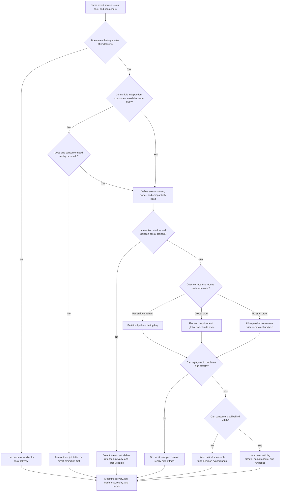
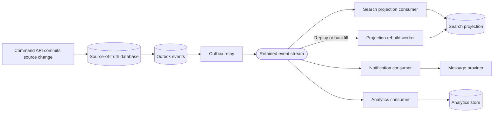

# Stream

A stream stores event history so consumers can process facts after they happen,
with ordering scoped to a defined key or partition. Streams are useful when
multiple consumers need the same event sequence, when derived views must be
rebuilt, or when event-driven pipelines need retention and replay.

A stream is not a faster queue. It adds event contracts, partitioning choices,
retention cost, replay safety, consumer lag, schema evolution, privacy review,
and operational ownership. Use one only when the event history is part of the
design requirement.

## Purpose

Use this page to decide:

- whether event history should be retained or a queue is enough;
- which producers and consumers own the event contract;
- how multiple consumers, replay, retention, ordering, and consumer lag should
  work;
- when event-driven pipelines are justified for projections, analytics,
  integrations, or workflow automation;
- how to keep stream processing observable, idempotent, and repairable.

This page focuses on component choice. Detailed event schema design, workflow
orchestration, and consumer implementation belong in related communication,
data, and reliability pages.

## When This Matters

Use this tree when:

- several independent consumers need the same business events;
- consumers need to replay history after bugs, deploys, outages, or new feature
  launches;
- derived views, analytics, notifications, search indexes, or integrations are
  built from committed facts;
- ordering matters within an entity, tenant, account, or partition;
- consumer lag changes user freshness, operational safety, or cost;
- a design says "publish events" without explaining retention, replay,
  duplicate handling, or schema ownership.

Skip a stream when one worker group only needs to complete task delivery. A
queue, outbox, scheduled job, or direct call is usually simpler when retention,
replay, and independent consumers are not real requirements.

## Quick Decision

| If the system needs... | Start with... | Watch for... |
| --- | --- | --- |
| One worker group processes work once | Queue plus workers | Backlog, retries, idempotency, and dead letters |
| Durable event intent after a source write | Outbox or job table | Relay lag, duplicate publication, and consumer idempotency |
| Several consumers see the same fact | Stream with explicit event contract | Schema ownership, fanout, and privacy boundaries |
| Rebuildable projections or backfills | Stream with replay plan | Repeated side effects and replay duration |
| Per-entity event order | Partition by entity or aggregate key | Hot keys and stale events |
| Long event history | Retention and archival policy | Storage growth, deletion rules, and compliance constraints |
| Low-latency command result | Synchronous source-of-truth path | Hiding incomplete workflows behind async events |

Default to the simplest mechanism that satisfies the workflow. Add a stream
when retained event history, multiple consumers, replay, or event-driven
pipelines are requirements, not because asynchronous work is fashionable.

## Questions To Ask

- What business fact does each event represent?
- Which source-of-truth write proves the event happened?
- Who owns the event contract, schema changes, and compatibility rules?
- How many consumers need the same event, and do they have different timelines?
- Do consumers need replay, backfill, or rebuild from history?
- How long must events be retained, and what data must not be retained?
- What ordering is required, and by which key?
- How much consumer lag is acceptable for each downstream workflow?
- Which consumers create side effects that must not repeat during replay?
- What metrics, logs, traces, alerts, and runbooks prove the stream is healthy?

## Stream Decision Tree



Use the tree to decide whether the event log is justified. A stream is a good
fit only after the design names the event contract, retention window, ordering
boundary, replay behavior, and consumer-lag target.

## Requirements Discovered

| Requirement | Why It Matters | Design Impact |
| --- | --- | --- |
| Event history | The event record remains useful after initial delivery | Drives stream, retention, replay, and archival choices |
| Consumer fanout | Several consumers may need the same fact independently | Drives event contract, schema compatibility, and fanout ownership |
| Replay need | Bugs, outages, new consumers, or rebuilds may require history | Drives retention window, idempotency, and backfill controls |
| Ordering boundary | Correctness may depend on applying facts in sequence | Drives partition key, source version, and stale-event handling |
| Consumer lag target | Delayed processing can stale projections or miss workflows | Drives alerts, backpressure, and freshness behavior |
| Retention and deletion | Events may contain sensitive or costly data | Drives payload minimization, retention windows, archive, and cleanup |
| Idempotency boundary | Replay and redelivery can repeat events | Drives processed markers, upserts, side-effect records, and dedupe |
| Operations ownership | Streams hide delayed work behind consumers | Drives metrics, runbooks, alerting, and support inspection paths |

## Options

| Option | Use When | Trade-Off |
| --- | --- | --- |
| Direct synchronous call | The caller needs the final result immediately | Simple outcome, but couples availability and latency |
| Outbox or durable job table | One source write must create retryable async intent | Repairable and simple, but limited fanout and retention |
| Queue | One worker group needs work delivery, retries, or burst smoothing | Easier than a stream, but not a retained event history |
| Stream | Events need retention, replay, ordering, or independent consumers | Adds contracts, partitions, lag, replay safety, and cost |
| Projection rebuild from source | Derived view can be rebuilt from authoritative records | Avoids event-log dependency, but rebuild may be slower or heavier |
| Batch export or report | Consumers need periodic snapshots, not each event | Simpler contracts, but less real-time and less granular |
| Manual integration | Volume is low and judgment matters | Low automation, but slower and harder to scale |

## Decision Guidance

### Start With The Event Fact

A stream should carry facts that already happened, not vague commands for
someone else to interpret.

Good event:

```text
reservation.approved
Source: reservation record version 12 was committed.
Meaning: the reservation is now approved according to the source of truth.
```

Weak event:

```text
doReservationStuff
Source: unclear.
Meaning: consumer decides what should happen.
```

When the event represents a source-of-truth change, publish from durable intent
such as an outbox record. The stream should not claim a fact happened before
the authoritative write commits.

### Use Streams For History And Fanout

Use a stream when the event sequence itself is valuable:

- search, analytics, notification, and audit consumers all need the same source
  facts;
- a new consumer may start later and read historical events;
- a projection can be rebuilt after a bug by replaying source events;
- independent teams or modules process events at different speeds;
- event-driven pipelines transform raw facts into derived views.

If one consumer only needs to process work once, a queue is usually simpler.
Queues optimize task delivery. Streams optimize retained event history and
independent consumption.

If consumers only need a periodic snapshot, export, or report, batch from the
source of truth instead of publishing every state change as an event.

### Define The Event Contract

An event contract is a public interface inside the system. Changing it can break
consumers that are not deployed with the producer.

Define:

- event name and meaning;
- source entity ID and version;
- producer and contract owner;
- required and optional fields;
- compatibility rules for adding, changing, and removing fields;
- privacy rules for fields that must not be copied into the stream;
- idempotency and ordering fields consumers can rely on;
- retention and replay expectations.

Keep payloads focused. Consumers can look up current source state when they need
large or sensitive details, but the event should contain enough stable identity
and version information to process safely.

### Scope Ordering By Key

Most systems do not need one global event order. They need order for one
business entity, tenant, account, or partition.

Good ordering requirement:

```text
Events for one reservation must apply in source version order so a projection
does not move from approved back to submitted.
```

Weak ordering requirement:

```text
All events are ordered.
```

Partition by the key that matches the correctness requirement. Include source
versions so consumers can ignore stale events, detect gaps, and rebuild when
they see an impossible transition.

Global ordering lowers concurrency, creates a large failure domain, and can
turn one slow event or hot key into a system-wide lag problem.

### Treat Replay As A Normal Operation

Replay is the reason many streams exist, but replay is also where designs often
break. A consumer may process old events after a bug fix, after a downtime
window, or when a new projection is created.

Before relying on replay, decide:

- which events can be replayed and from how far back;
- whether replay should rebuild a projection from scratch or catch up from a
  checkpoint;
- how consumers store processed-event markers or source versions;
- which side effects are disabled, deduped, or manually approved during replay;
- what rate limit prevents replay from harming live traffic;
- how operators validate that the replay produced the expected state.

Do not replay customer-facing side effects blindly. Rebuilding a search
projection by event ID is usually safe. Re-sending every historical email or
webhook is not.

### Design For Consumer Lag

Consumer lag is the distance between produced events and processed events. Lag
is a product and operations signal, not just a broker metric.

For each consumer, define:

```text
Consumer: <projection, notification, analytics, integration, workflow>
Freshness target: <seconds, minutes, hours, or batch deadline>
Lag signal: <oldest unprocessed event age, offset lag, source version gap>
User behavior: <fresh, stale label, pending state, degraded, or blocked>
Backpressure: <slow producers, reduce fanout, pause optional consumers, shed>
Repair path: <replay, rebuild, skip with reason, manual review>
```

A notification consumer may tolerate minutes of lag. A permission projection
may need a fresh source-of-truth check instead of trusting delayed events. Name
the workflow consequence before choosing the stream.

### Keep Retention Deliberate

Retention says how long event history remains available. Longer retention helps
debugging, replay, analytics, and new consumers. It also increases storage,
privacy, deletion, and access-control obligations.

Set retention by use case:

- short retention for transient processing when the source can rebuild state;
- longer retention when replay is part of recovery or onboarding new consumers;
- archive or compacted history when older events are useful but not hot;
- deletion, masking, or minimization when events include personal or sensitive
  fields.

An event log should not become an accidental permanent copy of data that the
source system is supposed to delete or minimize.

## Event-Driven Pipeline Shape



This shape keeps source-of-truth writes first, publication retryable, and
consumers independent. Each consumer still needs its own idempotency, lag
target, replay rules, and failure handling.

## Trade-Offs

| Choice | Improves | Costs Or Risks |
| --- | --- | --- |
| Use a queue instead of a stream | Simpler work delivery for one consumer group | No retained shared event history or broad replay |
| Add a stream | Retention, replay, fanout, and event-driven pipelines | Contracts, partitions, lag, cost, and replay safety |
| Partition by entity | Per-entity order and scalable parallelism | Hot keys and partition rebalancing |
| Keep long retention | Easier replay, debugging, and onboarding consumers | Storage, privacy, deletion, and access-control burden |
| Let consumers replay | Repair and rebuild derived state | Duplicate side effects without idempotency controls |
| Publish minimal payloads | Lower privacy and schema risk | Consumers may need source lookups and version checks |
| Publish rich payloads | Fewer consumer lookups | More drift, retention, and sensitive-data exposure |

## Failure Modes

| Failure Mode | Impact | Design Response | Observable Signal |
| --- | --- | --- | --- |
| Producer publishes event without committed source change | Consumers act on a fact that never happened | Publish from outbox after source transaction commits | Event without source record, reconciliation mismatch |
| Source write commits but event is not published | Projections, integrations, or workflows miss a fact | Store durable outbox intent and retry relay visibly | Oldest pending outbox age, publish failure count |
| Consumer falls behind | Derived views stale or workflows delayed | Alert on lag, reduce fanout, add capacity, or degrade safely | Consumer lag, oldest unprocessed event age |
| Event arrives out of order for one entity | Projection regresses or applies stale state | Partition by key and compare source version | Version gap, stale event ignored count |
| Replay repeats side effects | Users receive duplicate messages or partners see duplicate calls | Separate rebuildable projections from side effects and dedupe by event/action | Duplicate suppression count, replay mode audit |
| Schema change breaks consumers | Consumers fail or silently drop fields | Version contracts and compatibility checks | Consumer error rate, schema validation failures |
| Retention is too short | Required replay or rebuild cannot go far enough back | Match retention to replay window and keep source rebuild path | Replay request beyond retention, missing offset |
| Retention is too long or payload is too rich | Sensitive or costly data accumulates | Minimize payload, apply deletion and archive policy | Storage growth, privacy review findings, records past retention |
| Hot partition grows lag | One entity, tenant, or key blocks related events | Isolate hot key, split workload, or change partition strategy | Per-partition lag, hot key rate, rebalance events |

## Common Mistakes

- Using a stream because "events are scalable" without naming replay, fanout,
  or event history requirements.
- Treating a stream as exactly-once delivery instead of designing idempotent
  consumers.
- Publishing command-like events that hide who owns the source-of-truth change.
- Assuming global ordering when only per-entity ordering matters.
- Letting consumer lag grow without a user-visible freshness or repair policy.
- Replaying old events that trigger emails, webhooks, payments, or other side
  effects again.
- Keeping every field forever in the event log without privacy, retention, and
  deletion rules.
- Making schema changes without knowing which consumers are still reading old
  events.

## Original Example

A community garden platform lets members reserve plots, join waitlists, and
receive seasonal reminders. The source-of-truth write path records membership,
plot assignment, and waitlist position in the primary database.

The team considers a stream because several derived workflows need the same
facts:

- a search projection lists available plots and garden locations;
- a notification consumer sends waitlist and reminder messages;
- an analytics consumer aggregates seasonal demand;
- an integration consumer shares approved volunteer events with a partner
  calendar.

The team walks the tree:

- The event history matters because the search projection may need rebuilds
  after mapping bugs, and analytics may start a new consumer next season.
- Multiple consumers need the same facts, so the team defines events such as
  `plot.reserved`, `waitlist.joined`, and `plot.released`.
- The reservation API writes the source-of-truth row and an outbox event in the
  same transaction. A relay publishes retained events from the outbox.
- Ordering is required per plot and per waitlist entry, not globally. Events
  include `plot_id`, `waitlist_id`, and source versions.
- Search and analytics consumers can replay freely because they upsert derived
  rows by source ID and version.
- Notification replay is guarded by send records keyed by event ID, recipient,
  and message type so a backfill does not resend old reminders.
- Consumer lag targets differ: search should catch up within 2 minutes,
  notifications within 10 minutes, and analytics by the next morning.
- Event payloads avoid private member notes. Consumers that need current member
  contact data look it up from the source system when allowed.

Interview answer frame:

```text
Event facts: plot reserved, waitlist joined, plot released.
Source of truth: garden database plus transactional outbox.
Consumers: search projection, notifications, analytics, partner calendar.
Ordering: per plot or waitlist key, using source version.
Retention: 30 days hot for replay, archived summaries after that if needed.
Replay: projections can rebuild; side effects use send records and replay mode.
Lag target: search 2 minutes, notifications 10 minutes, analytics by morning.
Backpressure: pause optional analytics first; protect source writes and search.
Repair path: replay from event ID or rebuild projection from source records.
```

Version 1 may not need a stream if only notifications exist. A durable outbox
and queue can deliver reminder work. Add the stream when search rebuilds,
analytics fanout, partner integrations, or replay requirements become real.

## Checklist

Before adding a stream, confirm:

- The event facts are named and tied to committed source-of-truth changes.
- The producer, event contract owner, and compatibility rules are explicit.
- Each consumer has a purpose, owner, lag target, and failure response.
- The design explains why a queue, outbox, direct call, or batch export is not
  enough.
- Retention, archival, privacy, and deletion expectations are defined.
- Ordering is scoped by key instead of assumed globally.
- Events include source identity and version fields for stale-event handling.
- Consumer replay is safe for projections and guarded for side effects.
- Idempotency, processed markers, or upserts protect duplicate delivery.
- Consumer lag, publish lag, replay progress, failures, and hot partitions are
  observable.
- Backpressure says which consumers or producers slow, pause, or shed work.
- Runbooks explain replay, rebuild, skip, and manual repair paths.

## Related Pages

- [Components](./)
- [Component selection map](index.md)
- [Queue](queue.md)
- [Background workers](background-workers.md)
- [Throughput requirements](../requirements/throughput.md)
- [Durability requirements](../requirements/durability.md)
- [Consistency requirements](../requirements/consistency.md)
- [Privacy requirements](../requirements/privacy.md)
- [Outbox pattern](../communication/outbox-pattern.md)
- [Idempotency](../communication/idempotency.md)
- [Retries](../reliability/retries.md)
- [Observability basics](../operations/observability-basics.md)
- [Diagram style guide](../visuals/diagram-style-guide.md)
