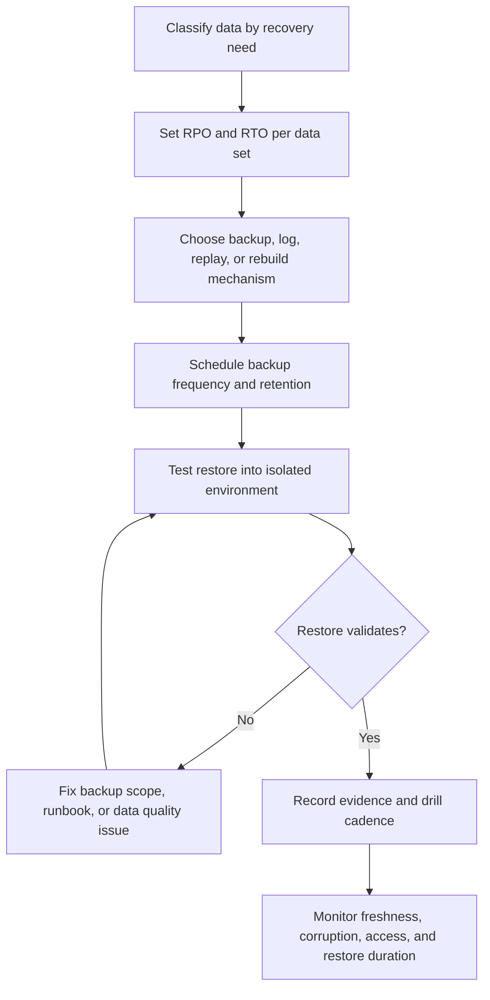

# Backups and Restore

Backups are recovery copies of important data. Restore is the tested ability to
turn those copies back into usable system state. A backup strategy is not
complete until the team knows what is backed up, how often, how corruption is
detected, how restore is tested, and which user workflows the recovery path
protects.

Use this page when a design stores authoritative data, audit history, files,
events, configuration, or derived data that must survive mistakes, outages,
corruption, or destructive changes.

## Purpose

Backup and restore design answers:

- Which data must survive failure, deletion, bad deploys, and operator mistakes?
- How much acknowledged work can be lost before user harm occurs?
- How quickly must the data be usable again?
- Which data needs backup, replay, rebuild, or manual repair?
- How often are recovery copies created and validated?
- How will corruption be detected before it contaminates every copy?
- How will operators rehearse recovery before a real incident?

Backups are a data design concern. They depend on ownership, durability,
retention, privacy, consistency, and the shape of the restore path.

## When This Matters

This matters when:

- a system confirms user actions that should not disappear;
- audit history explains approvals, payments, permissions, or destructive
  actions;
- object files, uploaded media, exports, or attachments are part of the product
  record;
- migrations or bulk edits can damage many records quickly;
- derived data can be rebuilt but only if the source data is safe;
- recovery objectives require proof instead of hope.

For early version 1 systems, the design may start with simple managed backups
and a manual restore drill. Do not skip the drill just because the backup
mechanism is simple.

## Questions To Ask

Start with data classification:

- Which records are authoritative?
- Which records are audit history?
- Which files or objects are part of the user promise?
- Which data is derived and can be rebuilt?
- Which temporary data can be dropped?
- Which external systems own data that should not be treated as local backup?

Then design recovery:

- What RPO and RTO apply to each data set?
- What backup frequency supports the RPO?
- What restore path supports the RTO?
- How are backups protected from accidental deletion or unauthorized access?
- How are corrupted records, bad migrations, and partial restores handled?
- What proves a restore worked?

## Backup and Restore Flow



## Decision Guidance

### Backup Frequency

Backup frequency is how often recovery copies are created. It should follow the
RPO for the data, not a default schedule copied from another system.

Examples:

| Data Set | Recovery Need | Backup Frequency Guidance |
| --- | --- | --- |
| Confirmed bookings | Acknowledged bookings should not be lost | Backup plus durable logs or replication frequent enough for near-zero loss |
| Staff audit history | Needed for repair and accountability | Include in every authoritative backup and protect from silent deletion |
| Uploaded attachments | User-visible product record | Back up object storage metadata and files, or use versioned durable storage |
| Search index | Derived from bookings | Rebuild from source data instead of backing up every index update |
| Daily analytics export | Can be regenerated | Store source facts; export artifact backup may be lower priority |

Frequent backups reduce the amount of work to recreate, but they do not
guarantee fast recovery. A backup created every five minutes is not enough if
restore takes six hours and the workflow's RTO is thirty minutes.

### Restore Testing

Restore testing proves that backup copies can become usable data.

A useful restore test includes:

- restore into an isolated environment or safe target;
- verify schema, row counts, object counts, checksums, or sampled records;
- run a representative application read path;
- validate important relationships and constraints;
- confirm audit history and permissions are present;
- measure elapsed restore time;
- record what failed and what changed in the runbook.

Do not count a backup job success as a restore test. The job only proves a copy
was created. The restore test proves the copy can support a workflow.

### RPO and RTO

RPO and RTO connect backup mechanics to user impact.

- RPO asks how much work can be lost or manually recreated.
- RTO asks how long the workflow can be unavailable, read-only, delayed, or
  degraded.

Design implications:

- A zero-loss acknowledged booking workflow may need durable commit before
  success, transaction logs, replication, and tested point-in-time recovery.
- A report that can be regenerated tomorrow may need source data backups more
  than backup copies of every generated report.
- A search index can often use rebuild and reconciliation instead of a tight
  backup schedule.
- A support lookup tool may need a shorter RTO than a public analytics page
  because operators use it during incidents.

Use [RPO and RTO](../reliability/rpo-rto.md) to set targets before choosing a
backup schedule.

### Corruption

Corruption is harder than obvious loss because bad data can be copied into every
new backup before anyone notices. Corruption includes bad migrations, broken
imports, accidental bulk edits, application bugs, partial writes, missing files,
or derived views that no longer match the source of truth.

Corruption controls:

- keep enough retention to restore before the corruption began;
- monitor invariants such as impossible status transitions or missing foreign
  records;
- compare source-of-truth counts with derived indexes and reports;
- record audit events for destructive or bulk actions;
- protect backup copies from the same credentials and automation that can
  damage production data;
- practice partial restore or forward repair for one account, tenant, table, or
  object set.

Restoring from backup is not always the best response to corruption. If only a
small set of records is wrong, targeted repair from audit history may preserve
more recent valid work than rolling back the whole database.

### Recovery Drills

A recovery drill is a rehearsal of the restore path. It should be boring,
measured, and repeatable before the real incident.

Drill scope can vary:

- restore one table or collection;
- restore one tenant or account;
- restore object files and metadata together;
- perform point-in-time recovery after a simulated bad write;
- rebuild a derived index from the restored source;
- verify a read-only service can use restored data;
- rehearse decision points and communications in a regional or dependency
  incident.

Good drills produce evidence:

- start and end time;
- data volume restored;
- commands or steps used;
- validation checks;
- gaps found;
- updated runbook owner;
- next drill date.

A drill that discovers a broken backup is successful if the issue is fixed
before an incident.

### Partial Restore

Full-system restore is sometimes too blunt. A partial restore recovers a subset
of data without rolling back everything else.

Use partial restore when:

- one tenant, account, table, folder, or object set is affected;
- recent valid writes should be preserved;
- corruption is localized;
- restoring the full system would violate a tighter RTO;
- support needs to repair one workflow while the system remains online.

Partial restore is more complex than full restore because relationships,
foreign keys, derived views, caches, and side effects may need reconciliation.
Plan it only for data sets where localized repair is likely and valuable.

## Trade-Offs

Backup and restore choices trade cost, data loss, downtime, and operational
complexity.

- More frequent backups reduce the loss window, but increase storage, transfer,
  and validation work.
- Longer retention helps recover from delayed corruption discovery, but raises
  cost and may interact with privacy or deletion obligations.
- Full restore can be simpler to reason about, but may discard valid recent
  work or exceed the RTO.
- Partial restore preserves more recent state, but needs careful reconciliation.
- Backing up derived data can speed recovery, but rebuilding from authoritative
  data is often simpler and less stale.
- Automation makes drills repeatable, but risky restore steps still need review,
  access control, and audit trails.

Design for the workflow at risk, not for maximum backup sophistication.

## Common Mistakes

- Assuming a backup exists because the database product advertises one.
- Never testing restore with real application validation.
- Choosing backup frequency without an RPO.
- Ignoring restore duration when discussing RTO.
- Backing up the database but forgetting object storage, audit logs, secrets,
  configuration, or external references.
- Letting corrupted data overwrite every retained backup.
- Treating derived indexes and reports as authoritative during recovery.
- Skipping access control and audit trails for restore operations.
- Running recovery drills only after an incident starts.

## Example

A neighborhood equipment library lets members reserve tools, upload condition
photos, and receive pickup reminders.

Data classification:

| Data | Classification | Recovery Approach |
| --- | --- | --- |
| Tool, member, reservation, and status rows | Authoritative | Back up with point-in-time recovery and test restore |
| Status-change audit records | Audit | Include in authoritative backup and retain longer |
| Condition photos | Product files | Protect object storage and metadata together |
| Reminder jobs | Durable delayed work | Replay from job table or outbox after restore |
| Search index | Derived | Rebuild from restored reservations and tools |
| Monthly utilization report | Derived artifact | Regenerate from authoritative records |

Recovery scenario:

```text
An import bug cancels 200 active reservations at 10:15.
```

Recovery plan:

1. Stop the import job and block the affected action.
2. Use audit history to identify the reservations touched by the import.
3. Prefer targeted repair from audit records if only those reservations changed.
4. If repair is unsafe, restore a copy of the database to 10:14 in isolation.
5. Compare restored rows with current valid writes made after 10:14.
6. Apply a reviewed repair script for the affected reservations.
7. Rebuild the search index and replay reminder jobs for repaired records.
8. Record the actual recovery point, recovery time, and gaps in the runbook.

This avoids rolling back the entire system when a localized repair can preserve
valid member actions that happened after the bad import.

## Checklist

Before approving backup and restore design, confirm:

- Authoritative, audit, derived, temporary, file, and external data are
  classified.
- Backup frequency is tied to RPO for each important data set.
- Restore duration, validation, and operator decision time fit the RTO.
- Restore testing includes application-level validation, not only backup job
  success.
- Corruption detection and retention are sufficient to recover before bad data
  spreads to every copy.
- Object storage, metadata, audit logs, configuration, and external references
  are included where the workflow needs them.
- Derived data has a rebuild or reconciliation path.
- Partial restore is planned where localized repair is valuable.
- Recovery drills are scheduled, measured, and used to update runbooks.
- Restore operations have access control, audit trails, and clear ownership.

## Related Pages

- [Data overview](./)
- [Operational vs analytical data](operational-vs-analytical-data.md)
- [Schema evolution](schema-evolution.md)
- [Transactions](transactions.md)
- [RPO and RTO](../reliability/rpo-rto.md)
- [Backup and restore recovery](../reliability/backup-and-restore-recovery.md)
- [Failure-mode analysis](../reliability/failure-mode-analysis.md)
- [Failover](../reliability/failover.md)
- [Design review checklist](../method/design-review-checklist.md)
