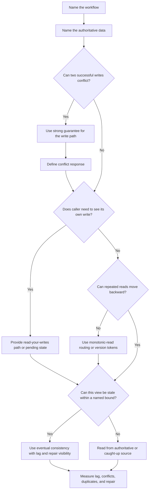

# Consistency Models

Consistency models describe what a caller can expect after data is written and
then read again. They are useful because most systems mix several read paths:
primary database reads, replicas, caches, search indexes, derived projections,
and analytics stores.

The goal is not to choose the strongest model everywhere. The goal is to match
the guarantee to the workflow that needs it, then make weaker paths explicit so
users and operators are not surprised.

## Purpose

Use this page to decide:

- which workflows need strong consistency;
- where eventual consistency is acceptable;
- whether a user needs read-your-writes behavior;
- whether a client should see monotonic reads instead of moving backward in
  time;
- how conflicts should be detected, rejected, merged, or repaired.

Consistency is a product promise. Write the promise in workflow language before
choosing databases, replicas, queues, caches, or locks.

## When This Matters

Consistency decisions matter when:

- two actors can reserve, claim, spend, approve, or edit the same thing;
- a successful write is followed by a confirmation page or API read;
- reads can come from replicas, caches, search indexes, or projections;
- stale information could cause a user to make a bad decision;
- retries or event replays can repeat the same business action;
- operators need to explain why two views disagree.

They matter less for derived, informational, or rebuildable data, as long as the
staleness is named and observable.

## Questions To Ask

- What invariant must never be violated?
- Which data is authoritative for that invariant?
- Which reads must reflect the latest committed write?
- Can a user safely see older data? For how long?
- Does the user need to see their own write immediately?
- Should the same user session move only forward in time?
- Which writes can conflict with each other?
- Can conflicts be rejected, merged, queued, or repaired later?
- What metric shows replica lag, cache staleness, projection lag, duplicate
  attempts, or conflict rate?

## Decision Guidance

### Strong Consistency

Strong consistency means a read observes the latest committed authoritative
write for the data it asks about. In system design interviews and design
reviews, this usually matters less as a formal theory term and more as a
workflow guarantee: "after the reservation is approved, no other user can also
approve the same room and time window."

Use strong consistency when:

- the workflow protects scarce capacity, money, access, inventory, quotas, or
  permissions;
- the system must reject conflicting successful writes before returning success;
- a lifecycle transition changes what actions are allowed next;
- a user-facing confirmation must be based on authoritative state.

Common mechanisms include uniqueness constraints, conditional writes,
transactions, compare-and-set updates, locks with clear timeout behavior, or a
single writer per key.

Trade-off: strong consistency adds coordination. Coordination can increase
latency, reduce write throughput, and force the product to handle conflicts as
normal outcomes.

### Eventual Consistency

Eventual consistency means a derived or replicated view may lag behind the
source of truth but should converge if updates stop and repair continues. It is
appropriate when stale reads are acceptable for the specific path.

Use eventual consistency when:

- search, feeds, reports, recommendations, or dashboards can lag;
- a derived view can be rebuilt from authoritative data;
- user actions recheck the source of truth before committing;
- the product can show pending, processing, last-updated, or stale states.

Do not use eventual consistency as a vague answer for correctness problems.
Name the acceptable lag and the repair path.

Example:

```text
Tool search results may lag reservation updates by up to two minutes. The final
reserve command must still check the authoritative reservation table before it
returns success.
```

Trade-off: eventual consistency improves decoupling and read scalability, but
requires lag metrics, replay or rebuild tools, and user experience for pending
or stale states.

### Read-Your-Writes

Read-your-writes means a user who successfully writes data can see that write
on their next relevant read. This is often the most important consistency
promise for user trust.

Use read-your-writes when:

- a user edits a profile and returns to the profile page;
- an order, booking, or payment action shows a confirmation page;
- an API client creates a resource and then immediately fetches it;
- retry behavior depends on knowing whether the first attempt succeeded.

Implementation choices include reading from the primary source of truth for a
short period, routing the user's session to a fresh replica, returning the
created representation in the write response, or showing a pending state until
the projection catches up.

Trade-off: read-your-writes can increase load on the authoritative store or add
routing complexity. If the product can tolerate a pending state, that may be
simpler than making every read globally fresh.

### Monotonic Reads

Monotonic reads mean a caller does not move backward in time across repeated
reads. If the caller has already seen version 8 of a record, a later read should
not show version 6.

This matters when:

- requests are load balanced across replicas with different lag;
- a mobile or web client refreshes a status page repeatedly;
- support tools show a workflow moving through states;
- users make decisions based on a sequence of status changes.

Implementation choices include session affinity, version-aware reads, minimum
observed version tokens, or routing reads to replicas that have caught up to the
client's last observed version.

Trade-off: monotonic reads are weaker than globally strong consistency but
stronger than arbitrary eventually consistent reads. They can preserve a sane
user experience without forcing every read to hit the primary.

### Conflict Handling

Conflicts happen when two commands cannot both be true under the product rules.
The design should make conflict handling explicit.

Common conflict types:

- lost update: two users edit the same state and one overwrites the other;
- scarce resource conflict: two users try to reserve the same slot;
- duplicate command: a retry creates another payment, booking, or message;
- mergeable edit: two changes can be combined without violating a rule;
- divergent replicas: two locations accept writes that must later converge.

Common responses:

- reject the later command and return the current authoritative state;
- retry automatically only when the command is idempotent and safe;
- use optimistic concurrency with versions or conditional updates;
- serialize commands by key through a queue or single writer;
- merge changes when product rules allow it;
- send rare, judgment-heavy conflicts to manual review with an audit trail.

Trade-off: rejecting conflicts protects correctness but makes contention
visible to users. Merging improves convenience but is only safe when the product
has clear merge rules.

## Decision Flow



## Original Example

A neighborhood clinic lets residents reserve evening vaccination appointments.

Important workflows:

- Residents search open appointment times.
- A resident reserves one appointment slot.
- The resident sees a confirmation page.
- Staff view a daily schedule.
- An analytics dashboard counts bookings by neighborhood.

Consistency choices:

| Workflow | Consistency Promise | Why |
| --- | --- | --- |
| Reserve slot | Strong consistency on `(clinic_id, start_time)` | Two residents must not receive the same confirmed slot |
| Confirmation page | Read-your-writes | A resident who reserved successfully must see the appointment immediately |
| Search open slots | Eventual consistency with final recheck | Search can lag if the reserve command rechecks authoritative availability |
| Staff schedule | Monotonic reads per staff session | Staff should not see an appointment disappear because a later request hit a lagging replica |
| Analytics dashboard | Eventual consistency | Counts can lag because they do not decide who gets care |

One reasonable version 1:

- keep appointment slots and reservations in one relational database;
- protect the slot with a uniqueness rule or transaction;
- return the confirmed appointment in the reserve response;
- let search read from a cache or projection with a short stale window;
- route staff schedule reads to the primary or to a replica that has caught up
  to the last version observed by that staff session;
- track projection lag and reservation conflict rate.

This design keeps the strongest guarantee on the narrow write path that needs
it. Search and analytics can be simpler and cheaper because they do not decide
the final reservation.

## Trade-Offs

| Choice | Benefit | Cost |
| --- | --- | --- |
| Strong consistency | Protects scarce or sensitive invariants | More coordination, contention, and conflict handling |
| Eventual consistency | Scales reads and decouples derived views | Stale reads, lag monitoring, replay, and repair work |
| Read-your-writes | Preserves user trust after a command | May require source reads, session routing, or pending states |
| Monotonic reads | Avoids confusing time travel for one caller | Requires tracking observed versions or sticky routing |
| Reject conflicts | Keeps rules simple and auditable | Users may need to retry or choose again |
| Merge conflicts | Reduces user friction for mergeable changes | Needs clear product-specific merge rules |

## Common Mistakes

- Saying "use strong consistency" without naming the invariant.
- Treating one product as if every read path needs the same guarantee.
- Letting a stale search result make the final reservation decision.
- Returning success before the authoritative write is durable.
- Ignoring read-your-writes on confirmation pages.
- Load balancing a user across lagging replicas without monotonic-read rules.
- Retrying non-idempotent commands after ambiguous timeouts.
- Measuring uptime but not replica lag, projection lag, or conflict rate.

## Checklist

Before choosing a consistency model, verify:

- [ ] The source of truth for each decision is named.
- [ ] Each critical invariant is written in product language.
- [ ] Strong consistency is used only where conflict-free success is required.
- [ ] Every eventually consistent path has an acceptable stale window.
- [ ] User-facing writes either provide read-your-writes or an explicit pending
      state.
- [ ] Repeated reads for one caller cannot move backward when that would confuse
      the workflow.
- [ ] Duplicate commands and ambiguous retries have idempotency behavior.
- [ ] Conflict responses are defined for users, clients, and operators.
- [ ] Metrics cover lag, conflicts, duplicate attempts, and repair work.

## Related Pages

- [Consistency requirements](../requirements/consistency.md)
- [Transactions](transactions.md)
- [Read and write patterns](read-write-patterns.md)
- [Schema evolution](schema-evolution.md)
- [Retries and backoff](../communication/retries-and-backoff.md)
- [Idempotency](../communication/idempotency.md)
