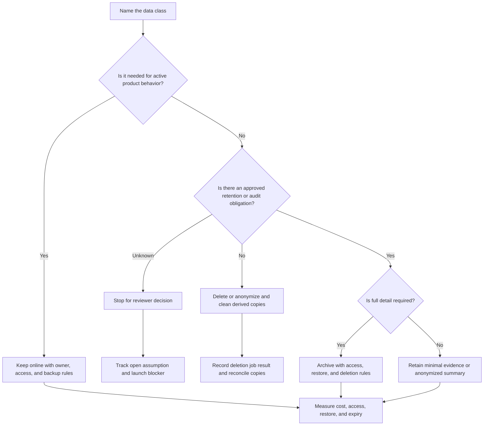

# Data Retention

Data retention defines how long each data class stays online, archived,
deleted, anonymized, or preserved as audit evidence. It is a product,
operational, privacy, compliance, and cost decision, not just a storage cleanup
job.

Good retention design answers two questions at the same time:

```text
What must we keep, and why?
What should we remove, and when?
```

## Purpose

Use this page to decide:

- which lifecycle states each data class moves through;
- when data should be deleted, anonymized, archived, or retained-minimal;
- which compliance or customer obligations need reviewer input;
- how storage cost changes over time;
- which audit records must remain after primary data changes;
- how backups, logs, exports, caches, search indexes, and analytics copies are
  handled.

The goal is to avoid both extremes: keeping everything forever and deleting
records that the system still needs to operate, explain, or restore.

## When This Matters

Retention matters when:

- data volume grows over time and affects cost, query latency, backups, or
  restore time;
- users, customers, auditors, or policies expect deletion or lifecycle rules;
- logs, audit trails, exports, and analytics copies may outlive primary data;
- support or operations need historical evidence to explain a decision;
- old data should move to cheaper or slower storage;
- compliance obligations are unclear and need named reviewer approval.

It matters even in small systems because default retention usually becomes
"forever" unless the design says otherwise.

## Questions To Ask

- What data classes exist: primary records, history, audit events, logs,
  exports, files, backups, caches, search documents, and analytics rows?
- Who owns each data class and who can approve lifecycle changes?
- How long does the product need the data online?
- How long do legal, compliance, customer, or audit obligations require it?
- Which data can be deleted, anonymized, archived, or retained as a minimal
  summary?
- Which derived copies must be expired or rebuilt after deletion?
- What happens if archived data must be restored for investigation?
- What is the storage and operational cost of keeping it?
- Which metric proves lifecycle jobs are working?

## Decision Guidance

### Model The Lifecycle

Retention starts with lifecycle states, not a single delete date.

Common lifecycle states:

| State | Meaning | Design Impact |
| --- | --- | --- |
| Active | Needed for current product behavior | Fast reads, normal backups, normal access controls |
| Inactive | No longer active but still useful for support or user history | Lower read priority, possible compaction or narrower indexes |
| Archived | Rarely read but retained for approved reason | Slower access, restore process, explicit access record |
| Deletion pending | Scheduled for deletion or anonymization | Job state, retry behavior, derived-copy cleanup |
| Retained-minimal | Primary details removed but approved evidence remains | Safe summary, strict access, reviewer-owned fields |
| Purged | Removed from normal stores after retention window | Tombstone or job evidence only if required |

Write lifecycle rules by data class:

```text
Reservation records stay online for 18 months, move to archive for 5 years,
then keep only an audit summary unless a dispute hold exists.
```

Avoid vague statements such as "old data is archived later." The reader should
know when, why, where, and how it can be retrieved.

### Deletion And Anonymization

Deletion removes data from normal stores. Anonymization removes or transforms
identifying fields while preserving aggregate or operational value. Some
systems need both.

Use deletion when:

- the data is no longer needed for product behavior;
- no approved obligation requires continued retention;
- keeping it increases privacy, security, cost, or operational risk;
- derived copies can be deleted or rebuilt safely.

Use anonymization or retained-minimal records when:

- aggregate metrics are still useful;
- audit evidence must remain but full personal details are not required;
- support needs to know that an action happened without seeing old sensitive
  fields;
- deletion conflicts with a reviewer-approved retention rule.

Deletion must include copies:

- primary database rows;
- object storage files;
- search documents;
- caches and materialized views;
- analytics rows;
- exports and generated reports;
- logs where practical and policy-approved;
- backups through restore-time reconciliation.

Trade-off: immediate deletion is simpler to explain but can conflict with
restore, audit, and dispute workflows. Retained-minimal evidence reduces
exposure but requires careful field selection and access control.

### Archival

Archival moves data out of the hot operational path while preserving it for an
approved reason.

Use archival when:

- data is rarely read but still needed for audit, support, reporting, or legal
  holds;
- old rows make primary queries, indexes, backups, or migrations too large;
- storage cost can be reduced without losing approved evidence;
- restore time is acceptable for archived data.

Archive design should specify:

- what data moves and what stays online;
- archive format and schema version;
- lookup key and metadata;
- access approval and audit record;
- restore or rehydrate process;
- retention and deletion date for the archive itself.

Do not archive data into an unreadable pile. If the team cannot restore or
interpret it, the archive is only deferred cleanup.

### Compliance And Review

Retention rules often depend on law, contract, customer promise, or internal
policy. Engineers should not invent those obligations.

When obligations are unclear:

- name the legal, privacy, security, compliance, product, or policy reviewer;
- record assumptions and open questions;
- block launch for regulated workflows until the owner approves the rule;
- keep the first implementation explicit instead of hiding a guess in code.

Useful reviewer question:

```text
After user deletion, which minimal fields may remain in audit evidence, for how
long, and who may access them?
```

That question creates implementable design work: field allowlist, retention
window, access control, audit event, and cleanup job.

### Storage Cost

Retention is also a cost decision. Old data can increase:

- primary storage size;
- index size and write cost;
- backup duration and restore duration;
- migration and backfill time;
- query latency;
- search and analytics rebuild time;
- breach impact and review scope.

Cost controls include:

- time-based partitioning;
- compaction of old history;
- moving blobs to object storage;
- dropping or narrowing indexes on archived data;
- keeping summaries instead of raw payloads;
- expiring exports and temporary files;
- measuring growth by data class.

Do not use cost alone to delete data with an unresolved compliance or audit
requirement. Resolve the requirement first, then choose the cheapest compliant
lifecycle.

### Audit Constraints

Audit records explain what happened later. They may need to outlive primary
records, but they should not become a copy of everything.

Audit retention should define:

- actor, action, resource, result, timestamp, reason, and correlation ID;
- whether old sensitive values are stored, redacted, hashed, or omitted;
- retention window and archive behavior;
- who can read audit records;
- how corrections are recorded;
- how audit records survive deletion of primary details.

Good pattern:

```text
Delete the user's old profile fields, but retain an audit event showing that a
profile deletion request was completed, who processed it, when it completed,
and which request ID authorized it.
```

Bad pattern:

```text
Copy the full deleted profile into the audit log just in case.
```

Audit evidence should be enough to prove the workflow, not enough to recreate
unnecessary sensitive data.

## Decision Flow



## Original Example

A neighborhood tool library stores member profiles, tool reservations, pickup
photos, reminder jobs, search documents, audit events, exports, and backups.

Retention choices:

| Data Class | Online Window | Later Lifecycle | Reason |
| --- | --- | --- | --- |
| Active reservation | Until returned or cancelled plus 18 months | Archive for dispute window, then retained-minimal summary | Support and audit questions |
| Member profile | While account is active | Delete or anonymize after approved account closure | Privacy and reduced exposure |
| Pickup photo | Until return is confirmed plus 30 days | Delete unless dispute hold exists | Large storage cost and sensitive content |
| Reminder job | Until sent, cancelled, or expired | Delete after job outcome is recorded | Operational data, not history |
| Search document | Derived from active tools and reservations | Rebuild or delete when source changes | Not authoritative |
| Audit event | Policy-approved evidence window | Archive with strict access, then expire or retain-minimal | Explain approvals and deletions |
| Export file | 7 days | Delete file, keep export request summary | Limits uncontrolled copies |
| Backup | Backup retention window | Reconcile deletion after restore | Recovery without pretending backups are live records |

Version 1 implementation:

- add `expires_at` or lifecycle state to short-lived jobs and exports;
- keep deletion/anonymization as an observable worker with retries;
- record deletion completion events without copying deleted payloads;
- archive old reservations before they slow common member views;
- keep a data-class table owned by product and compliance reviewers;
- measure storage growth by class, not only total database size.

The design keeps user-facing data small, preserves approved evidence, and makes
derived copies explicit.

## Trade-Offs

| Choice | Benefit | Cost Or Risk |
| --- | --- | --- |
| Keep data online | Fast support and product reads | Higher cost, larger indexes, more exposure |
| Archive data | Lower hot-path cost while preserving evidence | Restore process and access controls required |
| Delete data | Lower storage, privacy, and breach impact | Less history for support or audit |
| Anonymize data | Keeps aggregate usefulness | Hard to prove if identifiers remain indirectly |
| Retain minimal audit evidence | Explains actions with lower exposure | Requires reviewer-approved field list |
| Short export expiry | Limits uncontrolled copies | Users may need to regenerate reports |
| Long backup retention | Better recovery window | Higher cost and deletion reconciliation work |

## Common Mistakes

- Keeping everything forever because no one chose a lifecycle.
- Deleting primary data while leaving search, analytics, exports, or caches
  untouched.
- Treating backups as normal queryable records or ignoring restore
  reconciliation.
- Archiving data without a tested lookup and restore process.
- Copying raw sensitive payloads into audit logs.
- Letting storage cost drive deletion before compliance questions are resolved.
- Forgetting that logs, dead-letter queues, and support attachments may contain
  retained data.
- Failing to measure retention job failures and records past expiry.

## Checklist

Before finalizing retention, verify:

- [ ] Data classes are listed across primary stores, derived stores, logs,
      exports, backups, caches, files, and analytics.
- [ ] Each data class has an owner and lifecycle states.
- [ ] Online, archive, retained-minimal, anonymization, deletion, and purge
      behavior is explicit where relevant.
- [ ] Compliance, customer, legal, privacy, and audit obligations are either
      approved by a named reviewer or recorded as launch blockers.
- [ ] Deletion covers derived copies and has retry, reconciliation, and evidence
      behavior.
- [ ] Archival includes format, lookup, access control, restore, and expiry.
- [ ] Storage cost is measured by data class and tied to retention choices.
- [ ] Audit records keep only necessary evidence with controlled access.
- [ ] Lifecycle jobs have metrics for backlog, failures, records past expiry,
      archive restores, and deletion reconciliation.

## Related Pages

- [Compliance requirements](../requirements/compliance.md)
- [Privacy requirements](../requirements/privacy.md)
- [Backups and restore](backups-and-restore.md)
- [Schema evolution](schema-evolution.md)
- [Partitioning and sharding](partitioning-and-sharding.md)
- [Operational vs analytical data](operational-vs-analytical-data.md)
- [Audit logs](../security/audit-logs.md)
- [Logs](../operations/logs.md)
