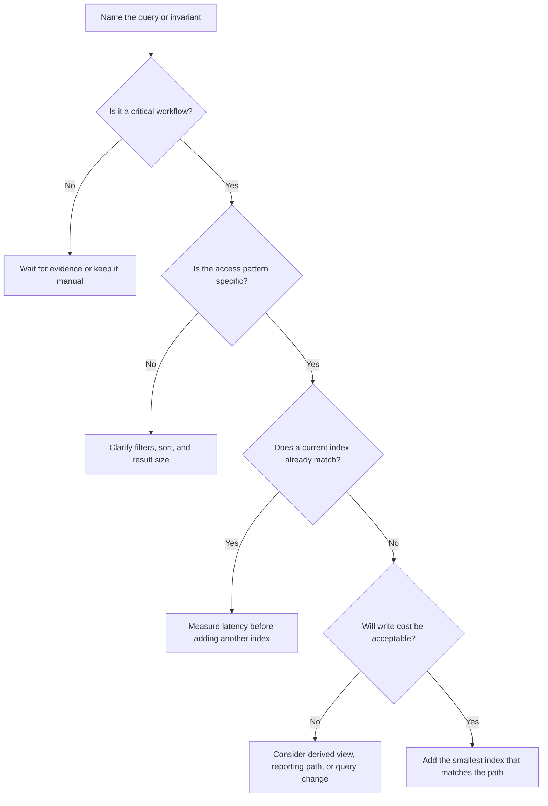

# Indexes

Indexes are extra access paths that help a database find data without scanning
everything. They are useful when a read pattern is important, repeated, and
specific enough to justify the write and storage cost.

Do not add indexes as decoration. Add them because a named workflow needs a
lookup, list, filter, sort, or uniqueness rule that the base data shape cannot
serve efficiently enough.

## Purpose

Use index design to answer:

- Which reads must be fast enough for users or operators?
- Which columns or fields identify the small subset to read?
- Which filters, sort order, and pagination shape the query?
- Which uniqueness rule or invariant needs enforcement?
- Which writes will become slower because each index must be maintained?
- Which indexes are required now, and which should wait for measurement?

The goal is to connect indexes to access patterns, not to guess every future
query.

## When This Matters

Indexes matter when:

- a page lists records by owner, status, time, category, or location;
- a lookup uses something other than the primary ID;
- a query filters and sorts by several fields together;
- a uniqueness rule protects an invariant;
- a table or collection is growing beyond trivial size;
- write latency, storage, or backfill work could be affected by extra indexes.

## Questions To Ask

Start with the read path:

- Who runs the query?
- Is it a single-item lookup, a list, a search, a report, or a background job?
- Which field narrows the result first?
- Which filters are always present, and which are optional?
- Which sort order is required?
- How large can the matching result set be?
- Does the query need fresh source-of-truth data, or can it use a derived view?

Then check the write path:

- How often are indexed fields inserted or updated?
- Does the write happen in a latency-sensitive request?
- How many indexes must change on each write?
- Can an index be added later without a risky backfill?
- What metric will show whether the index is helping?

## Decision Guidance

### Lookup Patterns

Index the lookup pattern, not just the field name.

Common lookup patterns:

| Pattern | Example | Index Pressure |
| --- | --- | --- |
| Exact lookup | find user by email | equality on one unique field |
| Owner list | list orders for one account | equality by owner plus stable sort |
| Status queue | find pending jobs | equality by status plus priority or time |
| Time window | show events next week | range by time, often with another filter |
| Scoped uniqueness | one active booking per room and hour | uniqueness across several fields |
| Cursor pagination | continue after last seen item | stable sort field plus tie-breaker |

Example:

```text
A community garden app lists open tasks for one garden, sorted by due date.
```

The useful access path is not just `garden_id` or `due_date`. It is the combined
query shape: `garden_id = ?`, `status = open`, ordered by `due_date`, with a
stable tie-breaker such as `task_id`.

### Composite Indexes

A composite index uses more than one field in a defined order. It is useful when
the query filters, sorts, or enforces uniqueness across fields together.

Good composite index candidates:

- a tenant or owner scope followed by status or time;
- a queue status followed by priority and creation time;
- a uniqueness rule across resource, date, and state;
- a pagination path with a sort field and stable ID.

Order matters because the index supports the query prefix. Put fields that
narrow the query and are always present before fields used only sometimes. Put
the sort order into the design when the page must return ordered results.

Example:

```text
List approved practice-room reservations for one room between two timestamps,
ordered by start time.
```

A useful composite index might follow this shape:

```text
room_id, status, starts_at, reservation_id
```

`room_id` scopes the query, `status` narrows it to approved reservations,
`starts_at` supports the time range and ordering, and `reservation_id` gives a
stable tie-breaker for pagination.

### Query Latency

An index improves latency only when it helps the database skip enough work. A
bad index can still leave the system scanning many rows, sorting a large result,
or fetching too much data after the lookup.

Watch for:

- filters that do not match the index order;
- low-selectivity fields such as a boolean used alone;
- sorting that still happens after fetching many rows;
- pagination that skips deep into a large result set;
- queries that return too many columns or large blobs;
- reports that should use analytical data instead of the operational store.

For user-facing reads, measure the whole path: database time, rows scanned, rows
returned, query plan shape, p95 or p99 latency, network payload, and application
processing. An index can reduce one part while another part remains the real
latency problem.

### Write Cost

Every index is another structure the database must update. Indexes can increase
write latency, storage use, memory pressure, replication work, and backfill
time.

Write costs show up when:

- an insert adds entries to many indexes;
- an update changes indexed fields;
- a hot value receives many writes, such as `status = pending`;
- a large backfill builds an index while the table is live;
- a rarely used index consumes storage and maintenance effort.

Treat write-heavy paths carefully. Add the indexes required by correctness and
critical reads first, then use measurement before adding speculative indexes.

### Uniqueness And Invariants

Some indexes protect correctness, not just speed.

Examples:

- one active reservation for a room and time window;
- one account per normalized email address;
- one idempotency key per client command;
- one open cart per shopper;
- one current membership role per user and organization.

When an index enforces an invariant, document the rule in product language.
`unique(room_id, starts_at, status)` is also not the right shape for every
stateful workflow because it may restrict pending or cancelled records that are
allowed to coexist. Prefer wording such as "only one approved reservation may
exist for this room and start time," then choose a scoped uniqueness rule,
conditional constraint, or separate authoritative approved-slot record that
matches that invariant.

## Index Decision Flow



## Trade-Offs

Indexes trade read speed and correctness checks against write cost and
operational complexity.

- A single-column index is simple, but may not match the real filter-and-sort
  path.
- A composite index can serve a precise query well, but the field order can make
  it useless for a different query.
- A uniqueness index can protect an invariant, but may require careful data
  cleanup before it can be added.
- An index for a rare admin query can slow every write on a hot user path.
- A covering index can avoid extra reads, but duplicates more data and may be
  larger than the benefit justifies.
- A partial or scoped index can reduce cost, but only if the condition matches a
  stable, important query shape.

Prefer the smallest set of indexes that supports known critical paths.

## Common Mistakes

- Adding an index for every field that appears in a filter.
- Ignoring sort order and pagination.
- Building composite indexes in an order that does not match the query.
- Indexing low-selectivity fields by themselves.
- Forgetting that every index makes writes and backfills more expensive.
- Keeping old indexes after the product no longer uses the query.
- Letting dashboards scan operational tables because "there is an index."
- Treating a cache as a substitute for the correct source-of-truth index.
- Failing to document uniqueness indexes as business invariants.

## Example

A local repair clinic lets residents book repair slots for bikes, lamps, and
small appliances. Staff need to see pending requests, residents need to see
their own bookings, and the system must prevent double booking.

Important queries:

| Query | Access Pattern | Candidate Index |
| --- | --- | --- |
| Resident views their requests | `resident_id`, newest first | `resident_id, created_at, request_id` |
| Staff triage queue | `status = pending`, oldest first | `status, created_at, request_id` |
| Mechanic calendar | `mechanic_id`, time window | `mechanic_id, starts_at, request_id` |
| Prevent duplicate booking | one approved request per slot | scoped uniqueness for approved requests on `slot_id`, or another explicit approved-slot constraint |

Design notes:

- The resident list and staff queue are different access paths; one index is
  unlikely to serve both well.
- The staff queue index may become hot if all new requests share
  `status = pending`, so write load and queue size should be measured.
- The mechanic calendar should avoid fetching old completed requests if the page
  only shows a future time window.
- The uniqueness rule should be named in the design: "a slot cannot have two
  approved repair requests."
- If weekly utilization reports become frequent, create a reporting path
  instead of adding more indexes to support broad analytical scans.

## Checklist

Before adding an index, confirm:

- The query is tied to a named workflow.
- Filters, sort order, pagination, and expected result size are listed.
- The index field order matches the query shape.
- Composite indexes are justified by combined filters or ordering.
- Unique indexes are described as product invariants.
- Write cost is acceptable for inserts, updates, replication, and backfills.
- Query latency will be measured with rows scanned and rows returned.
- Low-selectivity fields are not indexed alone without a clear reason.
- Rare reports and analytics are not overloading the operational database.
- Old or unused indexes have an owner and removal path.

## Related Pages

- [Data overview](./)
- [Read and write patterns](read-write-patterns.md)
- [Database read scaling](../scalability/database-read-scaling.md)
- [Relational vs document vs key-value](relational-vs-document-vs-key-value.md)
- [Identifying entities](identifying-entities.md)
- [Scale estimation](../method/scale-estimation.md)
- [Trade-off vocabulary](../method/tradeoff-vocabulary.md)
- [Design review checklist](../method/design-review-checklist.md)
- [Glossary](../glossary.md)
