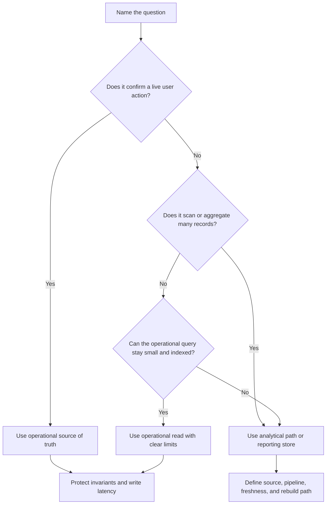

# Operational Vs Analytical Data

Operational data supports live product workflows. Analytical data supports
questions about patterns, trends, performance, and planning. Confusing the two
can make user-facing systems slow or make reports untrustworthy.

Start with the question being asked. "Can this user reserve this room right
now?" and "How many rooms were used by district last month?" need different
data paths, freshness expectations, and failure handling.

## Purpose

Use this page to answer:

- Which data is authoritative for user-facing decisions?
- Which data is derived for reporting or exploration?
- Which queries must be fresh, and which can lag?
- Which broad scans should stay away from the operational database?
- Which events, snapshots, or facts should feed analytical views?
- Which dashboard numbers need operational precision versus trend-level
  direction?

The goal is to keep critical product workflows reliable while still making data
useful for operators, product teams, and capacity planning.

## When This Matters

This matters when:

- dashboards or reports begin running against hot product tables;
- analytical scans compete with checkout, booking, messaging, or approval
  writes;
- teams disagree about whether a metric must be real time;
- data pipelines produce numbers that differ from the source of truth;
- operators need dashboards during incidents;
- historical reporting requires data that operational tables overwrite or
  delete.

## Questions To Ask

Start with the product workflow:

- Which data must be correct before confirming a user action?
- Which writes must be protected by transactions, constraints, or conditional
  updates?
- Which read paths are latency-sensitive?
- Which data is authoritative, derived, temporary, or external?

Then map analytical needs:

- Who reads the dashboard or report?
- What decision will they make from it?
- What freshness is actually required: seconds, minutes, hours, or daily?
- Can the report tolerate late, corrected, duplicated, or deleted events?
- How will the system explain mismatches between operational and analytical
  numbers?

## Decision Guidance

### Operational Data

Operational data serves live workflows. It is usually the source of truth for
current product state.

Examples:

- current reservation status;
- account balance or entitlement;
- cart contents;
- active membership role;
- pending job state;
- latest workflow decision and audit trail.

Operational design pressure:

- protect invariants before confirming success;
- keep read and write latency predictable;
- avoid broad scans on hot tables;
- keep the model understandable for repair;
- define backups, restore behavior, and retention for authoritative data.

Operational data can produce events or change records for analytics, but it
should not be reshaped primarily for reporting at the cost of correctness.

### Analytical Data

Analytical data answers questions across many records or longer time windows.
It is usually derived from operational data, events, imports, or snapshots.

Examples:

- weekly booking utilization;
- monthly revenue by plan;
- average time from request to approval;
- route capacity by district;
- incident count by service and day;
- cohort retention.

Analytical design pressure:

- scan and aggregate without slowing user traffic;
- preserve historical facts that operational rows may overwrite;
- define data freshness and completeness;
- handle late, corrected, or duplicated source events;
- make lineage and rebuild paths clear.

Analytical data should not silently become the authority for live product
decisions unless the workflow explicitly moves the source of truth.

### Pipelines

A pipeline moves data from operational sources to analytical views. It may be a
scheduled job, event consumer, export process, stream processor, or batch load.

Pipeline decisions:

- source: authoritative tables, append-only events, logs, or external imports;
- shape: raw facts, cleaned events, aggregates, or dashboard-ready tables;
- cadence: continuous, every few minutes, hourly, daily, or manual;
- failure behavior: retry, quarantine bad records, alert, or pause;
- replay behavior: rebuild from source, replay events, or re-run batch windows.

Pipelines need ownership. A dashboard is only useful if someone knows what data
feeds it, how late it can be, and how to repair it.

### Warehouses And Reporting Stores

A warehouse or reporting store is a separate place optimized for scans,
aggregations, and historical analysis. The concept matters more than the
product: keep broad analytical work away from the critical operational path.

Use a warehouse or reporting store when:

- reports scan large time windows;
- many dashboards share the same derived facts;
- historical snapshots matter;
- joins across operational domains would overload product databases;
- analysts need exploratory queries that should not affect users.

Trade-offs:

- reporting load no longer competes directly with user traffic;
- freshness usually becomes delayed;
- pipelines, schemas, access control, and data quality checks add work;
- numbers may differ from operational views until late data or corrections
  settle.

For version 1, a small reporting table or scheduled aggregate may be enough. Do
not add a full analytics platform when a single derived view solves the named
workflow.

### Dashboards

Dashboards should be designed around decisions, not vanity counts.

Dashboard categories:

| Dashboard Type | Example Question | Freshness Need |
| --- | --- | --- |
| Operational health | Are approval jobs stuck right now? | seconds to minutes |
| Support queue | Which requests need attention today? | minutes |
| Product usage | Which features were used this week? | hours to daily |
| Capacity planning | Do we need more pickup windows next month? | daily to weekly |
| Financial close | What should be reconciled for the month? | controlled batch window |

A dashboard used during an incident may need fresher data and clear missing-data
indicators. A planning dashboard can often lag if it is complete, stable, and
explainable.

### Freshness Trade-Offs

Freshness is a requirement. State it explicitly.

Freshness choices:

- real time: needed for live operational decisions or incident response;
- near real time: useful for dashboards where a short delay is acceptable;
- batch: acceptable when decisions happen daily, weekly, or monthly;
- snapshot: useful when reports must be reproducible for a period close.

Trade-offs:

- Fresher data usually costs more operational complexity.
- Lower freshness can protect user-facing systems from reporting load.
- Batch reports can be easier to reconcile but less useful during incidents.
- Near-real-time pipelines need duplicate handling, ordering decisions, and
  lag monitoring.
- Dashboards should show data timestamp or lag when stale data could mislead.

## Decision Flow

## Trade-Offs

Operational and analytical data optimize for different things.

- Operational stores protect correctness and latency, but broad reports can
  overload them.
- Analytical stores support scans and history, but usually lag behind current
  state.
- Pipelines isolate workloads, but add failure modes and reconciliation work.
- Dashboards improve visibility, but stale or incomplete numbers can mislead.
- Snapshots support reproducibility, but may not show current reality.
- Real-time reporting feels useful, but may cost more than the decision needs.

Name the decision before choosing freshness. A dashboard that informs next
month's staffing does not need the same path as a check that prevents double
booking.

## Common Mistakes

- Running wide reporting queries on the same path as user-facing writes.
- Treating dashboard numbers as authoritative without explaining lineage.
- Asking for real-time analytics without naming the decision it supports.
- Ignoring late, duplicate, corrected, or deleted source records.
- Building a warehouse before a simple reporting table is justified.
- Hiding pipeline failures until someone notices a stale dashboard.
- Forgetting access control and privacy rules in derived analytical copies.
- Using analytics data to make live decisions without a freshness and
  correctness guarantee.

## Example

A city bike-repair pickup service lets residents request pickups, dispatchers
assign routes, and drivers complete stops.

Operational questions:

| Question | Source | Freshness |
| --- | --- | --- |
| Can this pickup request be assigned to a route? | pickup request and active route records | current |
| What stops should this driver see now? | assigned route and stop state | current to seconds |
| Can a cancelled request receive a reminder? | pickup request lifecycle state | current |

Analytical questions:

| Question | Analytical Shape | Freshness |
| --- | --- | --- |
| How many pickups were completed by district last week? | daily completion facts by district | daily |
| Which routes usually run late? | route duration aggregates | hourly or daily |
| How many reminders failed by provider? | notification attempt facts | minutes to hourly |
| Which districts need more pickup capacity next month? | historical demand and completion trends | daily to weekly |

Design:

- Keep pickup requests, route assignments, stop state, and status changes in the
  operational source of truth.
- Emit or copy status changes and notification attempts into a pipeline.
- Build daily reporting tables for district demand, completion rates, and route
  duration.
- Show dashboard freshness, such as "updated 14 minutes ago," when operators may
  act on the data.
- Avoid running weekly utilization scans against the route assignment tables
  during dispatch hours.

Version 1 can use a scheduled job that reads committed status changes and writes
small reporting tables. A warehouse becomes justified when report volume,
history, cross-domain joins, or analyst exploration outgrow that simple path.

## Checklist

Before separating operational and analytical data, confirm:

- The live user workflows and authoritative records are named.
- Analytical questions are tied to decisions, not just charts.
- Pipeline source, cadence, owner, retry behavior, and rebuild path are defined.
- Warehouse or reporting-store use is justified by scan size, history, or
  isolation needs.
- Dashboards state freshness and show stale or missing data clearly.
- Freshness requirements are explicit for each report or dashboard.
- Late, duplicate, corrected, and deleted data have handling rules.
- Analytical queries do not compete with critical operational traffic by
  default.
- Access control and retention rules carry into derived copies.
- Version 1 uses the smallest analytical path that satisfies the decision.

## Related Pages

- [Data overview](./)
- [Read and write patterns](read-write-patterns.md)
- [Identifying entities](identifying-entities.md)
- [Indexes](indexes.md)
- [Transactions](transactions.md)
- [Schema evolution](schema-evolution.md)
- [Trade-off vocabulary](../method/tradeoff-vocabulary.md)
- [Design review checklist](../method/design-review-checklist.md)
- [Glossary](../glossary.md)
