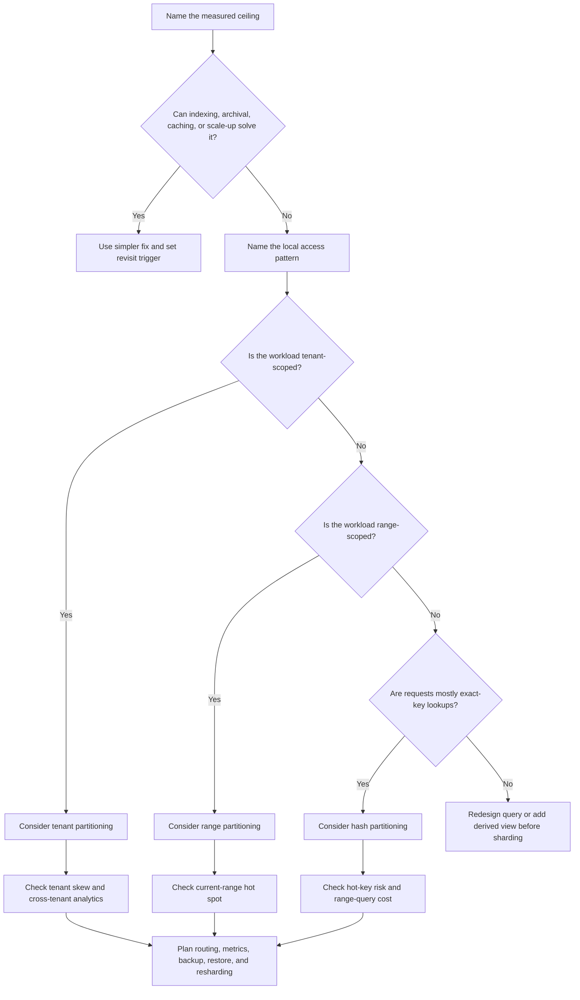

# Partitioning And Sharding

Partitioning splits data into smaller pieces. Sharding is a form of
partitioning where different pieces are placed on different storage nodes or
clusters. Both can help with data growth, write throughput, tenant isolation,
and operational maintenance, but they also add routing, rebalancing, hot
partition, and repair complexity.

Use partitioning when a named data or traffic pressure has outgrown simpler
choices. Do not start with sharding just because a system may become large.

## Purpose

Use this page to decide:

- whether data should stay in one store for version 1;
- which partition key matches the access pattern;
- whether hash, range, or tenant partitioning fits the workload;
- how hot partitions can appear;
- what resharding would cost later;
- which queries, backups, migrations, and repairs become harder.

The goal is to make the operational cost visible before the architecture
depends on partitions.

## When This Matters

Partitioning and sharding matter when:

- one table, collection, index, tenant, or key is growing beyond manageable
  query, backup, restore, or maintenance limits;
- write throughput is limited by one shared writer or hot key;
- one tenant needs isolation for scale, compliance, or noisy-neighbor control;
- retention or archival can be managed more safely by time or tenant boundary;
- a system needs clear ownership for data movement, backfills, and repair.

They matter less when the current bottleneck is an inefficient query, missing
index, unbounded report, cacheable read, or operational limit that can be fixed
without splitting the source of truth.

## Questions To Ask

- What exact ceiling are we hitting: data size, write throughput, tenant skew,
  query latency, backup time, restore time, or maintenance windows?
- Which access pattern must stay local to one partition?
- Which queries would need to cross partitions?
- Is the partition key stable, available at request time, and evenly
  distributed?
- Can one key, tenant, range, or time window become much hotter than others?
- How will new partitions be created and old partitions retired?
- What happens when a partition becomes too large or too hot?
- How will backups, restores, migrations, and reindexing work by partition?
- What metrics show partition size, traffic, lag, errors, and skew?

## Decision Guidance

### Start With The Boundary

A useful partition boundary follows the data's access pattern. The best key is
usually the one that keeps the most important read and write path local.

Good candidates:

- tenant or account ID when most queries are tenant-scoped;
- resource ID when commands target one resource at a time;
- time window when retention, archival, and reporting are time-based;
- region when data residency or local reads matter;
- a synthetic hash when the main need is even distribution.

Weak candidates:

- fields that are not present on every request;
- fields that change frequently;
- low-cardinality fields such as `status`;
- keys that create one huge partition for a large tenant or popular item;
- keys chosen only because they are easy to hash.

Write the expected local query before choosing the key:

```text
List open maintenance tickets for one building by priority and creation time.
```

That points toward a building or tenant boundary. A random hash may distribute
data well but make the main list query cross many partitions.

### Hash Partitioning

Hash partitioning sends each record to a partition based on a hash of a key,
such as user ID, account ID, or order ID. It is useful when the primary goal is
even distribution.

Use hash partitioning when:

- requests are mostly single-key lookups or writes;
- data needs to spread across nodes evenly;
- range scans are less important than balanced load;
- the key has high cardinality and no one key dominates.

Trade-offs:

- Good: tends to balance size and traffic when keys are well distributed.
- Good: simple routing for exact key lookups.
- Cost: range queries, tenant-wide scans, and time-window reports may touch many
  partitions.
- Cost: a hot key remains hot because all traffic for that key still lands on
  one partition.
- Cost: changing the number of partitions can require data movement unless the
  system uses an indirection layer.

Hashing spreads ordinary load. It does not solve celebrity accounts, viral
items, or shared counters by itself.

### Range Partitioning

Range partitioning groups data by ordered ranges, such as time, numeric ID,
alphabetical key, or geographic code. It is useful when queries and retention
naturally follow a range.

Use range partitioning when:

- most queries read recent time windows;
- retention deletes old data by time;
- maintenance can happen one range at a time;
- reporting reads contiguous ranges;
- operational work benefits from predictable partitions.

Trade-offs:

- Good: time-window queries, archival, and deletion are straightforward.
- Good: old partitions can be moved, compressed, or dropped.
- Cost: the newest range can become a hot partition when most writes are
  current.
- Cost: bad range boundaries can create uneven partition sizes.
- Cost: splitting a busy range later can be disruptive.

For time-based data, design the write path for the "current partition is hot"
case. A daily partition may be too coarse for a launch spike and too fine for a
small product.

### Tenant Partitioning

Tenant partitioning groups data by customer, organization, workspace, or other
tenant boundary. It is useful when most reads and writes are tenant-scoped and
when tenant isolation matters.

Use tenant partitioning when:

- the product is naturally multi-tenant;
- most queries include `tenant_id`;
- one large tenant should not slow everyone else;
- compliance, export, deletion, or restore work is tenant-specific;
- enterprise tenants need placement or migration control.

Trade-offs:

- Good: tenant-scoped queries and operations stay local.
- Good: large tenants can be isolated or moved.
- Good: restores, exports, and deletions can be scoped.
- Cost: cross-tenant analytics need a separate reporting path.
- Cost: tenant sizes can be highly skewed.
- Cost: small tenants may waste capacity if each gets a dedicated partition.

A common version 1 compromise is shared storage with `tenant_id` in every table,
indexes scoped by tenant, and clear metrics for tenant skew. Dedicated shards
can wait until a tenant actually justifies isolation.

### Hot Partitions

A hot partition receives disproportionate traffic, storage growth, lock
contention, or background work. Average load can look safe while one partition
fails.

Hot partitions come from:

- one tenant much larger than others;
- a viral item, celebrity account, or popular resource;
- current-time range receiving all writes;
- shared counters or leaderboards;
- queue partitions keyed too coarsely;
- low-cardinality partition keys.

Mitigations:

- isolate the hot tenant or resource;
- add per-key or per-tenant rate limits;
- split a large tenant into subpartitions by resource or time;
- spread write-heavy counters with buckets and aggregate later;
- cache repeated hot reads with explicit freshness rules;
- queue or serialize writes by key when correctness requires order;
- move reporting or exports away from operational partitions.

Do not assume "more shards" fixes a hot partition. If all requests target the
same key, the same partition remains overloaded unless the key or workflow
changes.

### Resharding Complexity

Resharding changes how data maps to partitions. It can mean splitting one
partition, moving tenants, changing hash ranges, or adding more storage nodes.
It is often harder than the first sharding design.

Resharding work includes:

- routing old and new keys correctly during movement;
- copying data while writes continue;
- verifying row counts, checksums, or event replay positions;
- handling retries and duplicate commands during migration;
- backfilling derived indexes and caches;
- updating backups, restore plans, dashboards, and runbooks;
- rolling back safely when movement fails.

Design choices that reduce resharding pain:

- route through a partition map instead of hardcoding node choices;
- keep partition keys stable and explicit in APIs and jobs;
- make background workers partition-aware;
- measure partition size, traffic, and lag early;
- rehearse moving one tenant or range before it becomes urgent;
- keep cross-partition transactions out of version 1 unless unavoidable.

Trade-off: sharding can raise capacity ceilings, but it adds a permanent
operational system for routing and data movement.

## Decision Flow



## Original Example

A neighborhood delivery platform stores tasks for volunteers. Version 1 uses
one relational database. After a year, three pressures appear:

- task history grows by 60 GB per month and must be retained for two years;
- most user-facing reads are "tasks for one neighborhood this week";
- one downtown neighborhood creates 30 percent of daily writes during events.

Possible choices:

| Choice | Fit | Risk |
| --- | --- | --- |
| Hash by task ID | Spreads individual task rows | Weekly neighborhood lists touch many partitions |
| Range by week | Helps retention and weekly reads | Current week can become hot |
| Tenant/neighborhood partition | Keeps common reads local | Downtown tenant may become a hot partition |
| Tenant plus time subpartition | Keeps neighborhood reads local and bounds history | More routing and migration logic |

Reasonable version 1.5:

- keep one database for now;
- add tenant-scoped indexes for the weekly task views;
- archive old completed tasks by month;
- measure per-neighborhood traffic and query latency;
- isolate the downtown neighborhood only if it crosses defined CPU, lock, or
  latency thresholds.

Reasonable later move:

- partition by neighborhood for local operational reads;
- subpartition large neighborhoods by week or task bucket;
- send cross-neighborhood analytics to a reporting store;
- keep a partition map so neighborhoods can move without changing application
  code everywhere.

The design does not jump straight to global hash sharding because the important
read is neighborhood-scoped, not random task lookup.

## Trade-Offs

| Choice | Benefit | Cost |
| --- | --- | --- |
| No partitioning yet | Simple queries, transactions, and operations | Lower ceiling and larger maintenance windows |
| Hash partitioning | Balanced distribution for exact-key access | Poor fit for range and grouped queries |
| Range partitioning | Natural retention and range scans | Current range or uneven ranges can get hot |
| Tenant partitioning | Isolation and local tenant workflows | Tenant skew and cross-tenant analytics cost |
| Dedicated shard for large tenant | Protects other tenants | More placement, migration, and support logic |
| Resharding later | Delays complexity until justified | Can be painful without routing and metrics prepared |

## Common Mistakes

- Choosing a partition key before naming the access pattern.
- Sharding because traffic might grow someday.
- Using `status` or another low-cardinality field as the partition key.
- Assuming hash partitioning fixes a single hot key.
- Forgetting cross-partition queries, reports, backups, and restores.
- Hardcoding shard locations throughout application code.
- Ignoring tenant size and traffic skew.
- Treating resharding as a one-time script instead of an operational workflow.

## Checklist

Before partitioning or sharding, verify:

- [ ] The measured or credible ceiling is named.
- [ ] Simpler fixes have been considered first.
- [ ] The partition key matches the most important local read or write path.
- [ ] Hash, range, or tenant partitioning is chosen for a stated reason.
- [ ] Cross-partition queries and reports have a plan.
- [ ] Hot partition risks are identified and measured.
- [ ] Resharding, tenant movement, or range splitting has an operational plan.
- [ ] Backups, restores, migrations, and reindexing work by partition.
- [ ] Metrics show partition size, traffic, latency, errors, lag, and skew.

## Related Pages

- [Scalability requirements](../requirements/scalability.md)
- [Read and write patterns](read-write-patterns.md)
- [Indexes](indexes.md)
- [Replication](replication.md)
- [Capacity estimation](../scalability/capacity-estimation.md)
