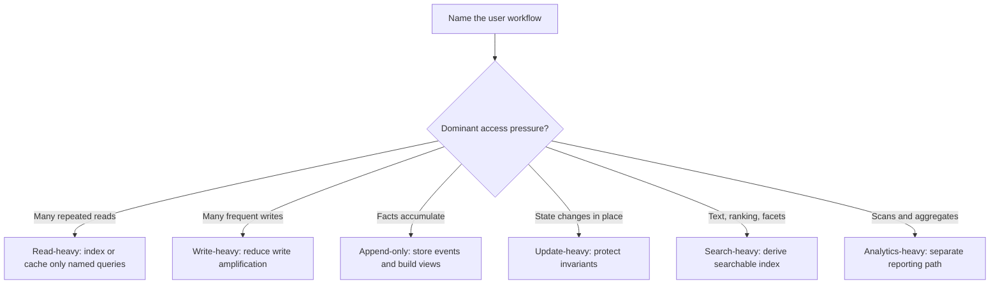

# Read And Write Patterns

Access patterns describe how a system reads and changes data. They connect
product behavior to schema shape, indexes, consistency rules, storage choices,
and background processing.

Do this before choosing a database feature. A data model is only useful if it
supports the reads users need and protects the writes that change important
state.

## Purpose

Use read and write patterns to answer:

- Which queries must be fast?
- Which writes must be correct under concurrency?
- Which data is appended, replaced, searched, or aggregated?
- Which paths can be stale, delayed, or eventually rebuilt?
- Which paths need indexes, transactions, queues, search, or analytical copies?
- Which workload is the source of truth, and which workload is derived?

The goal is to name the pressure on the data model before adding tables,
documents, indexes, caches, streams, or reporting stores.

## When This Matters

This matters when:

- the same entity has many possible read views;
- a write path fans out to notifications, search, metrics, or audit history;
- a page must filter, sort, or paginate by fields beyond the primary ID;
- a workflow writes frequently enough that indexes or derived views may become
  a cost;
- analytics queries could slow down user-facing reads and writes;
- a search requirement is more than a simple exact lookup.

## Questions To Ask

Start with reads:

- Who reads the data?
- Do they read one item, a list, a feed, a search result, or a report?
- What filters, sort orders, joins, and time windows are required?
- How fresh must the result be?
- How many rows or objects does the query scan at the expected scale?
- Can the answer be cached, precomputed, or served from a derived copy?

Then map writes:

- Who creates or changes the data?
- Is the write a create, update, delete, append, import, or retry?
- Which invariant must remain true while the write happens?
- Does the write update one aggregate or several related records?
- What side effects happen after the write succeeds?
- Can duplicate commands arrive, and how will the system handle them?

## Decision Guidance

### Read-Heavy Workloads

A read-heavy workload serves many reads for each write. Examples include product
catalog pages, public profiles, help articles, and event schedules.

Design pressure:

- keep the common lookup and list queries explicit;
- add indexes for the filters and sort orders users actually need;
- cache only after naming freshness and invalidation behavior;
- denormalize small, stable display fields when it removes repeated joins;
- protect the source of truth from expensive derived reads.

Example:

```text
A community workshop catalog is updated by staff a few times per day, but
residents browse open classes by topic, date, and neighborhood all day.
```

Version 1 can store workshops in one relational database with indexes on
`topic`, `starts_at`, and `neighborhood`. A cache is optional until measured
read load or latency justifies it. If the catalog later needs typo-tolerant text
search, a derived search index may be justified.

### Write-Heavy Workloads

A write-heavy workload receives frequent changes compared with reads. Examples
include telemetry ingestion, check-in events, location updates, and high-volume
collaboration edits.

Design pressure:

- keep writes small and predictable;
- avoid adding indexes that are not needed by important reads;
- batch or buffer work that does not need to happen inside the user request;
- make retries idempotent so duplicate delivery does not corrupt state;
- watch hot partitions, hot rows, and contention on shared counters.

Example:

```text
A campus shuttle app receives vehicle position updates every few seconds while
students mostly read the latest location for routes near them.
```

This describes the vehicle-position ingest path, not the whole product. The
current position can be stored separately from durable position history. The
latest-location write path should avoid expensive secondary indexes. History can
be appended asynchronously for replay, debugging, and later analytics.

### Append-Only Workloads

An append-only workload mostly adds new records instead of changing old ones.
Examples include audit logs, ledger entries, status history, event streams, and
message delivery attempts.

Design pressure:

- use immutable records for facts that should not be rewritten;
- include enough context to understand the event later;
- choose retention and compaction rules early;
- build views or snapshots when replaying every event becomes too slow;
- ensure append ordering is defined only where the workflow needs it.

Example:

```text
A volunteer reimbursement tool records every approval, rejection, payment
attempt, and manual correction as a separate history entry.
```

The reimbursement request can keep a current status for fast reads, while the
append-only history explains how the request reached that state. The history is
useful for audits and support, but dashboards should read a derived current
view instead of scanning the full history for every page load.

### Update-Heavy Workloads

An update-heavy workload repeatedly changes existing state. Examples include
task boards, inventory counts, profile settings, room bookings, and moderation
queues.

Design pressure:

- define the transaction boundary around the invariant;
- use optimistic concurrency, conditional writes, or locks when conflicts are
  expected;
- record important state transitions even if the current row is updated in
  place;
- keep frequently changed fields away from large immutable blobs;
- avoid denormalized copies that are hard to keep correct.

Example:

```text
A local tool library updates reservation status as a request moves from
requested to approved, picked up, returned, or cancelled.
```

The reservation row can hold the current status for operational reads. A status
change table preserves the lifecycle. Approval should be protected by a
transaction or uniqueness rule so two members cannot reserve the same tool for
the same pickup window.

### Search-Heavy Workloads

A search-heavy workload retrieves data by text, ranking, facets, fuzzy matching,
or many optional filters. Examples include document search, marketplace search,
knowledge bases, and support ticket search.

Design pressure:

- separate exact lookups from ranked search;
- decide which fields are searchable, filterable, sortable, and private;
- define freshness expectations for the search index;
- plan rebuilds and backfills for derived search data;
- keep the source of truth authoritative when search results lag.

Example:

```text
A neighborhood swap board lets members search posts by item name, condition,
pickup area, and availability.
```

Version 1 may start with database filters for exact category and availability.
A search index becomes justified when users need ranking, partial terms,
synonyms, or fast faceted search across many posts. The index should be treated
as derived data that can be rebuilt from posts and status changes.

### Analytics-Heavy Workloads

An analytics-heavy workload scans, groups, and aggregates data to answer
operational or business questions. Examples include dashboards, cohort reports,
capacity planning, fraud review summaries, and service-level metrics.

Design pressure:

- avoid running broad scans on the critical user-facing database;
- define acceptable dashboard freshness;
- choose which operational events feed analytical views;
- separate metrics used for operations from reports used for exploration;
- account for late, corrected, or deleted data.

Example:

```text
A meal-delivery coordinator wants daily reports for completed deliveries,
missed pickups, average route duration, and volunteer capacity by district.
```

The order and route tables remain the operational source of truth. A scheduled
job can copy selected facts into reporting tables. If the dashboard can lag by
fifteen minutes, the system can protect checkout and route updates from large
analytical scans.

## Pattern Map

Use the workload shape to choose the first modeling move. One product often has
several workload shapes, so map each important read and write path separately
before deciding which pressure dominates a specific model or component.

| Workload Shape | Main Risk | First Modeling Move |
| --- | --- | --- |
| Read-heavy | Slow or expensive common queries | Name lookup/list queries and add only justified access paths |
| Write-heavy | Write amplification and contention | Keep writes narrow, idempotent, and lightly indexed |
| Append-only | History growth and replay cost | Separate immutable facts from current views |
| Update-heavy | Lost updates and broken invariants | Define transaction and conflict boundaries |
| Search-heavy | Treating search as simple lookup | Model source data separately from derived search index |
| Analytics-heavy | Reports competing with user traffic | Move scans to derived reporting views with explicit freshness |



## Trade-Offs

Optimizing for one access pattern usually makes another one harder.

- Extra indexes speed reads but slow writes and increase storage.
- Denormalized read models reduce joins but require backfills and repair paths.
- Append-only history improves auditability but needs retention and snapshot
  decisions.
- Strong update guarantees protect invariants but can reduce throughput under
  contention.
- Search indexes improve discovery but introduce freshness lag and rebuild work.
- Analytical copies protect operational traffic but add pipelines and delayed
  answers.

State the trade-off in terms of the workflow. "Fast list by owner and due date"
is a better justification than "add an index because indexes are good."

## Common Mistakes

- Designing only by entity names and ignoring how the data is read.
- Adding indexes for hypothetical queries.
- Caching before defining freshness and invalidation.
- Updating current state without preserving important lifecycle history.
- Treating append-only data as free even though retention and replay cost grow.
- Running dashboards directly against hot operational tables by default.
- Letting search results become the source of truth.
- Optimizing every path before identifying the critical path.

## Example

A shared music practice-room system lets students reserve rooms, staff manage
closures, and coordinators review utilization.

Access patterns:

| Pattern | Product Behavior | Design Consequence |
| --- | --- | --- |
| Read-heavy | Students browse open rooms by building, date, and instrument type | Index the exact browsing filters before adding a cache |
| Write-heavy | Door sensors send frequent occupancy pings | Store latest occupancy separately from durable sensor history |
| Append-only | Reservation status changes must be auditable | Append status events and keep current status for fast reads |
| Update-heavy | Staff close rooms and cancel affected reservations | Use transaction boundaries around room closure and reservation changes |
| Search-heavy | Students search rooms by equipment notes | Start with exact filters; add derived search only when ranking/fuzzy search matters |
| Analytics-heavy | Coordinators review weekly utilization by building | Feed reporting tables or jobs instead of scanning reservation tables on every dashboard load |

Version 1 can use one relational source of truth for rooms, reservations,
closures, and status changes. It can add a small reporting job later when
utilization dashboards become frequent or expensive. It should not introduce a
search service until users need more than simple filters.

## Checklist

Before finalizing a data model, confirm:

- Main read paths are listed with filters, sort order, freshness, and expected
  result size.
- Main write paths are listed with invariants, side effects, and retry behavior.
- Read-heavy paths have justified indexes or cache plans.
- Write-heavy paths avoid unnecessary indexes and large synchronous fan-out.
- Append-only data has retention, compaction, and current-view decisions.
- Update-heavy data has a transaction, lock, or conditional-write strategy where
  conflicts matter.
- Search-heavy needs are separated from exact lookup and list needs.
- Analytics-heavy queries do not compete with critical operational traffic by
  default.
- Derived data has a rebuild or repair path.
- Version 1 uses the fewest access paths that satisfy known requirements.

## Related Pages

- [Data overview](./)
- [Identifying entities](identifying-entities.md)
- [System design process](../method/system-design-process.md)
- [Requirement discovery](../method/requirement-discovery.md)
- [Scale estimation](../method/scale-estimation.md)
- [Trade-off vocabulary](../method/tradeoff-vocabulary.md)
- [Design review checklist](../method/design-review-checklist.md)
- [Glossary](../glossary.md)
