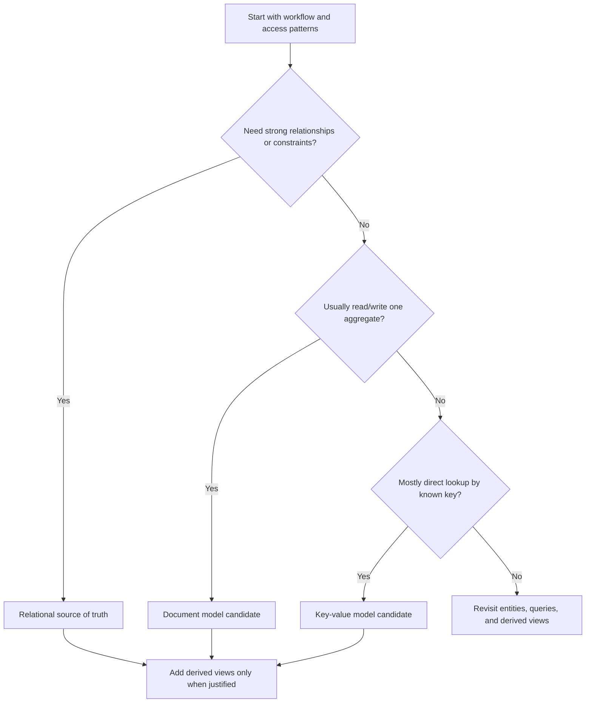

# Relational Vs Document Vs Key-Value

Relational, document, and key-value models organize data around different
assumptions. The right starting point depends on relationships, access
patterns, consistency needs, query flexibility, and operational simplicity.

Choose the model from the workflow. A familiar database is useful only if its
shape matches the data the product must protect and retrieve.

## Purpose

Use this comparison to answer:

- Does the workflow depend on relationships and constraints?
- Is the main unit of work a self-contained aggregate?
- Are reads and writes mostly direct lookups by key?
- Which queries must stay flexible as the product changes?
- Which invariants need transactions, uniqueness, or conditional writes?
- Which model keeps version 1 simple without hiding future migration costs?

The goal is not to crown one model as better. The goal is to make the trade-off
visible before a storage choice becomes expensive to change.

## When This Matters

This matters when:

- a new service needs its first durable source of truth;
- a feature can be modeled as tables, documents, or keyed values;
- teams are tempted to choose a database before naming access patterns;
- denormalization would speed reads but complicate writes;
- relationships, ownership, lifecycle, or invariants are unclear;
- a later cache, search index, or analytical copy may depend on the source
  model.

## Questions To Ask

Start with the shape of the data:

- Which entities exist, and how do they relate?
- Can one entity be safely read and written as one aggregate?
- Are relationships mostly stable, or do users need flexible cross-entity
  queries?
- Which fields are used for lookup, filtering, sorting, and reporting?
- Which data changes together?
- Which rules must be enforced when two actors act at the same time?

Then ask about operations:

- Can the team inspect and repair the data easily?
- What backup, restore, migration, and backfill paths are needed?
- How will the model handle growth in reads, writes, and data volume?
- Which derived views can be rebuilt from the source of truth?

## Decision Guidance

### Relational Model

A relational model stores data in tables with rows, columns, relationships, and
constraints. It is usually a strong default when the system has meaningful
relationships and correctness rules.

Use relational when:

- entities have important one-to-many or many-to-many relationships;
- the product needs joins, ad hoc filters, or flexible reporting;
- uniqueness, foreign keys, transactions, or constraints protect correctness;
- several entities change together in one workflow;
- operators need clear inspection and repair paths.

Trade-offs:

- Normalized data reduces duplication but can require joins.
- Schema changes need care, migrations, and compatibility planning.
- Very high write throughput or wide global distribution may require
  partitioning decisions later.
- Denormalized read views may still be needed for hot paths.

Example:

```text
A neighborhood tool library tracks members, tools, pickup windows,
reservations, payments, and status changes.
```

Relational is a good version 1 fit because reservations connect several
entities and the system must prevent two approved reservations for the same tool
and pickup window. The source model can enforce relationships and invariants,
while later read models or search indexes can be derived from it.

### Document Model

A document model stores related data together as documents. It is useful when a
workflow usually reads and writes one aggregate at a time and the nested shape
is part of the product.

Use document-style storage when:

- the main access pattern loads one aggregate by ID;
- nested data is normally created, updated, and displayed together;
- the document has clear ownership and lifecycle boundaries;
- schema variation is expected but still controlled;
- cross-document relationships are limited or can be handled explicitly.

Trade-offs:

- Reading one aggregate can be simple and fast.
- Duplicated data can drift unless update rules are clear.
- Queries across many documents may become awkward or expensive.
- Large documents can create write amplification and conflict problems.
- Constraints across documents are harder than constraints inside one aggregate.

Example:

```text
A field inspection app stores an inspection report with checklist answers,
photos metadata, reviewer notes, and local device sync state.
```

A document model can work because the report is usually opened and submitted as
one aggregate. The design should still separate large binary files into object
storage and keep cross-report analytics as derived data, not as expensive scans
over every document.

### Key-Value Model

A key-value model stores values behind known keys. It is useful when the access
pattern is simple, predictable, and mostly key-based.

Use key-value storage when:

- callers know the key before reading or writing;
- the value is small or bounded enough to replace safely;
- query needs are limited to direct lookup, simple prefixes, or known buckets;
- data can expire, be recomputed, or tolerate limited query flexibility;
- the model supports a cache, session store, rate limit counter, feature flag,
  or materialized lookup.

Trade-offs:

- Direct lookups can be very simple and fast.
- Secondary queries usually require another structure.
- Relationships and constraints live in application logic or another source of
  truth.
- Value format changes need compatibility discipline.
- Hot keys can become a scaling problem.

Example:

```text
A public library site stores short-lived availability snippets by
`branch_id:book_id` so catalog pages do not repeatedly call the checkout
system.
```

Key-value is a good fit for the derived snippet because the page already knows
the branch and book. It should not become the authoritative checkout record; the
reservation and loan rules still belong in the source of truth.

## Comparison Map

| Decision Factor | Relational | Document | Key-Value |
| --- | --- | --- | --- |
| Best fit | Connected entities and correctness rules | Aggregate read/write workflows | Direct lookup by known key |
| Query shape | Flexible filters, joins, reports | Aggregate lookup plus limited filters | Exact key, prefix, or bucket lookup |
| Write shape | Multi-row changes with constraints | One document or aggregate at a time | Replace, set, increment, expire |
| Relationship handling | Explicit relationships and constraints | Embedded when owned by aggregate | Usually external to the value |
| Schema evolution | Managed migrations | Flexible but needs validation discipline | Application-owned value versioning |
| Common risk | Over-normalizing or slow joins on hot reads | Duplicated data and cross-document invariants | Hidden query needs and hot keys |



## Trade-Offs By Design Pressure

### Relationships And Invariants

Relational models are strongest when relationships and invariants are central.
Document models can protect rules inside one aggregate, but rules across many
documents need additional coordination. Key-value models usually depend on a
separate source of truth or careful application logic for correctness.

### Read Shape

Document and key-value models can make direct reads simple when the caller wants
one aggregate or one value. Relational models can serve many read shapes, but
the common paths need indexes and sometimes denormalized projections.

### Write Shape

Relational writes are useful when several rows must change together. Document
writes are useful when the aggregate boundary is clear. Key-value writes are
useful when the value can be replaced, incremented, expired, or recomputed
without complex relationships.

### Change Over Time

Relational schemas make structure explicit and migration work visible. Document
and key-value schemas can feel flexible early, but old values, validation,
backfills, and readers of multiple versions still need deliberate handling.

### Version 1 Simplicity

Version 1 should usually start with one authoritative model and derive other
views only when the access pattern justifies them. A relational source of truth
plus later key-value cache or search index is often simpler than making every
read path authoritative.

## Common Mistakes

- Choosing by trend, team preference, or vendor feature list before naming the
  workflow.
- Treating document flexibility as permission to skip validation.
- Treating key-value storage as a general database for unknown future queries.
- Splitting data across models before defining which one is authoritative.
- Denormalizing without a repair or backfill path.
- Ignoring lifecycle, ownership, retention, and deletion rules.
- Assuming a model removes the need for indexes, transactions, or operational
  runbooks.

## Example

A neighborhood lesson-swap service lets members offer lessons, request swaps,
schedule sessions, message each other, and view simple availability.

Storage candidates:

| Data | Better Starting Model | Reason |
| --- | --- | --- |
| Members, lessons, swap requests, sessions | Relational | Relationships, constraints, and flexible staff queries matter |
| Lesson application form draft | Document | The draft is owned by one member and edited as one aggregate |
| Short-lived availability badge | Key-value | The page reads by known `member_id:day` and can rebuild the value |
| Searchable lesson descriptions | Derived search index later | Text ranking is useful, but not the source of truth |

Design consequence:

- Keep the authoritative member, lesson, request, and session data relational.
- Store draft application data as a document only if the nested form changes
  frequently before submission.
- Use key-value storage for derived availability only after the direct query is
  measured as a problem or the data is expensive to compute.
- Treat search and analytics as derived views that can be rebuilt from the
  source data and lifecycle events.

This keeps version 1 understandable while leaving room for derived models where
they solve a named access pattern.

## Decision Checklist

Before choosing the model, confirm:

- Entities, relationships, ownership, lifecycle, and invariants are named.
- Main read and write paths are listed.
- The authoritative source of truth is clear.
- Relational is considered when constraints, transactions, and flexible queries
  matter.
- Document-style storage is considered only when the aggregate boundary is
  clear.
- Key-value storage is considered only when lookup is mostly by known key.
- Derived copies have freshness, rebuild, and repair plans.
- Denormalized data has an owner and update rule.
- Schema/version changes are planned for existing data.
- Version 1 uses the fewest storage models that satisfy known requirements.

## Related Pages

- [Data overview](./)
- [Identifying entities](identifying-entities.md)
- [Read and write patterns](read-write-patterns.md)
- [System design process](../method/system-design-process.md)
- [Requirement discovery](../method/requirement-discovery.md)
- [Trade-off vocabulary](../method/tradeoff-vocabulary.md)
- [Design review checklist](../method/design-review-checklist.md)
- [Glossary](../glossary.md)
