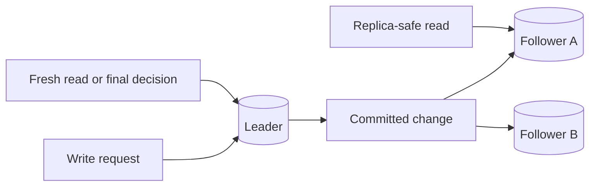

# Replication

Replication keeps copies of data on more than one node, zone, region, or
storage service. It can improve read scalability, availability, and disaster
recovery, but it also creates reader-visible effects such as stale reads,
replication lag, failover gaps, and split-brain risk.

Use replication to satisfy a named requirement, not as a default badge of
seriousness. A replicated system is easier to read from and can survive
failures only when the design explains which copy is authoritative, how lag is
handled, and what happens during failover.

## Purpose

Use this page to decide:

- whether read replicas are justified;
- which node accepts writes;
- which reads may use replicas;
- how much replication lag the product can tolerate;
- how failover affects stale reads and accepted writes;
- what operators need to observe before and after promotion.

Replication is a data-flow choice. It should be tied to read traffic, recovery
objectives, regional placement, or operational resilience.

## When This Matters

Replication matters when:

- read traffic is high enough to separate read load from the primary writer;
- a reporting or support tool should not compete with write traffic;
- the system needs to survive node or zone failure;
- users in multiple locations need lower read latency;
- backups alone do not meet recovery time needs;
- the product can tolerate some stale reads but not stale decisions.

It matters less for early version 1 systems where one well-backed-up database
with clear restore procedures meets the current requirement.

## Questions To Ask

- What problem is replication solving: read scale, availability, lower read
  latency, migration, backup, or disaster recovery?
- Which node or service is the write leader?
- Which reads are allowed to use replicas?
- Which reads must go to the leader or a caught-up replica?
- What is the acceptable stale-read window for each replica-backed path?
- How will the system detect and expose replication lag?
- What happens to in-flight writes during failover?
- Can the old leader return and accept writes by accident?
- How will clients reconnect, retry, or route after promotion?
- Which dashboards, alerts, and runbooks prove replication is healthy?

## Decision Guidance

### Read Replicas

Read replicas are copies used primarily to serve reads. They are useful when
the primary writer is overloaded by read traffic or when read-heavy tools should
not interfere with critical writes.

Use read replicas for:

- browse pages, search filters, dashboards, and support views that can be
  slightly stale;
- expensive reads that would otherwise slow the write leader;
- geographically closer reads when the workflow tolerates lag;
- reporting queries that need operational data but do not decide writes.

Avoid read replicas for:

- final authorization, balance, inventory, booking, or quota decisions;
- confirmation pages that need read-your-writes;
- workflows where a stale value would trigger an unsafe user action;
- writes disguised as reads, such as "check then reserve" without rechecking the
  leader.

Trade-off: replicas can reduce leader read load, but every replica-backed read
needs a freshness promise and a fallback when lag is too high.

### Leader/Follower Replication

In leader/follower replication, one leader accepts writes and followers copy
the leader's changes. Many common database topologies start here because the
write path has one authority.

Typical flow:



This model is easier to reason about than accepting writes everywhere, but it
does not remove consistency decisions. Followers can lag, fail, or be promoted.
Clients need routing rules that match the workflow.

Use leader reads when:

- the user just wrote and expects to see the result;
- a command needs authoritative state before success;
- a replica's lag exceeds the path's stale-read budget.

Use follower reads when:

- the read is informational;
- stale results are labeled or harmless;
- the command path rechecks authoritative state later.

### Replication Lag

Replication lag is the delay between a write becoming durable on the leader and
the same change becoming visible on a replica. Lag can be milliseconds during
healthy operation and much longer during load spikes, network trouble, large
migrations, or replay after downtime.

Lag matters because users observe it as inconsistent behavior:

```text
A volunteer updates a delivery address and immediately opens the route view.
The route view reads from a lagging replica and still shows the old address.
```

Design responses:

- read from the leader after user writes for a short session window;
- return the changed resource in the write response;
- route reads using a minimum observed version or timestamp;
- show pending status for derived projections;
- fail closed to the leader when replica lag exceeds the path budget;
- alert when lag threatens a user promise.

Trade-off: strict lag handling protects user trust but may send more traffic to
the leader during incidents. The system should know which reads can degrade and
which must stay fresh.

### Stale Reads

A stale read returns older data than the latest committed authoritative write.
Stale reads are acceptable only when the workflow has a named stale window and
safe downstream behavior.

Accept stale reads for:

- catalogs, feeds, reports, analytics, and browse pages;
- status pages with a visible "last updated" time;
- views where the next write rechecks the leader;
- operational dashboards that tolerate delay and alert on excessive lag.

Reject stale reads for:

- final reservation, payment, permission, quota, or inventory decisions;
- user confirmation after a successful command;
- safety or compliance workflows that require current state;
- support actions where showing old state could cause incorrect repair.

The safe pattern is "stale view, fresh decision." A replica can help a user find
options, but the final command should check the authoritative write leader.

### Failover

Failover promotes a replica or standby so the system can continue after leader
failure. Failover is a recovery mechanism, not just a switch.

During failover, the design must answer:

- Which replica is safe to promote?
- How much committed data could be missing from the promoted copy?
- How are clients redirected?
- How are in-flight writes retried or rejected?
- How is the old leader fenced off so it cannot accept writes?
- How do operators verify replication health before returning to normal?

For many version 1 systems, automated promotion is less important than a tested
manual runbook with clear data-loss and recovery-time expectations. Faster
failover is useful only if it does not promote stale or conflicting state
without detection.

## Failure Modes

| Failure Mode | What Users See | Mitigation |
| --- | --- | --- |
| Replica lag spike | Recently changed data disappears or old values return | Lag budgets, leader fallback, pending states, alerts |
| Replica outage | Some read paths fail or slow down | Remove unhealthy replica from routing and retry safe reads |
| Failed replication stream | Replica serves increasingly stale data | Heartbeat checks, replication-lag alert, stop routing stale replica |
| Promotion of stale replica | Writes acknowledged on old leader are missing | Promotion criteria, data-loss window, reconciliation runbook |
| Split brain | Two leaders accept conflicting writes | Fencing, quorum/lease controls, single-writer routing |
| Read after write misses | User retries because confirmation appears missing | Read-your-writes routing or return the changed representation |
| Reporting overload | Replica falls behind during heavy analytical scans | Separate reporting replica, query limits, lag alerts |

Failure modes should be visible in operations, not discovered through user
complaints.

## Original Example

A community equipment library stores tools, reservations, and pickup windows in
one relational database.

Version 1 runs on one primary database with backups. After growth, staff reports
and member browse pages start slowing reservation approvals, so the team adds a
read replica.

Read routing:

| Path | Data Source | Reason |
| --- | --- | --- |
| Approve reservation | Leader | Must prevent double booking |
| Member confirmation page | Leader or write response | Must provide read-your-writes |
| Browse available tools | Replica | Can lag if final reserve command rechecks leader |
| Staff overdue report | Replica | Can tolerate a few minutes of delay |
| Analytics export | Reporting replica | Should not slow user-facing reads |

Operational promises:

- browse pages may lag by up to two minutes;
- reservation approval always checks the leader;
- replica lag above two minutes removes the replica from browse routing;
- staff reports show the report generation time;
- failover is manual until the team has rehearsed promotion and fencing.

This design adds replication only after naming the read pressure and stale-read
rules. It avoids letting the replica make final booking decisions.

## Trade-Offs

| Choice | Benefit | Cost |
| --- | --- | --- |
| Single leader | Clear write authority | Leader can become a bottleneck |
| Read replicas | More read capacity and isolation | Stale reads and lag-aware routing |
| Leader reads after writes | Stronger user trust | More leader load and possible latency |
| Replica reads for browse/reporting | Lower leader load | Freshness promises and fallback logic |
| Fast automated failover | Shorter outage | Higher risk if promotion safety is weak |
| Manual failover runbook | More operator control | Longer recovery time |

Replication usually trades simple consistency for availability and read scale.
The design should say which trade-off is acceptable for each path.

## Common Mistakes

- Adding replicas without naming which reads can be stale.
- Letting a replica-backed read decide a scarce-resource write.
- Treating failover as safe without fencing the old leader.
- Measuring database CPU but not replication lag.
- Sending confirmation pages to any replica after a write.
- Using reporting queries on the same replica that serves user reads.
- Assuming replication replaces backups or restore testing.
- Hiding stale state without last-updated time, pending state, or retry logic.

## Checklist

Before adding replication, verify:

- [ ] The reason for replication is named.
- [ ] The write leader or authoritative source is clear.
- [ ] Each read path says whether it can use a replica.
- [ ] Each replica-backed path has an acceptable stale-read window.
- [ ] Read-your-writes paths avoid lagging replicas or return the written data.
- [ ] Final decisions recheck authoritative state.
- [ ] Replication lag has metrics, dashboards, and alerts.
- [ ] Failover behavior covers promotion, client routing, retries, and fencing.
- [ ] Backups and restore testing still exist; replication is not treated as a
      backup.

## Related Pages

- [Consistency models](consistency-models.md)
- [Transactions](transactions.md)
- [Read and write patterns](read-write-patterns.md)
- [Backups and restore](backups-and-restore.md)
- [Capacity planning](../operations/capacity-planning.md)
