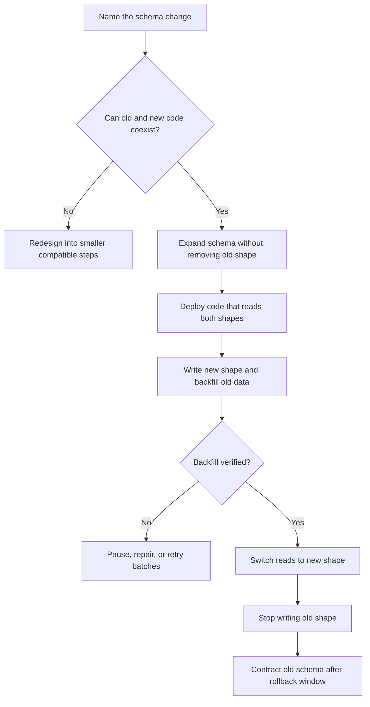

# Schema Evolution

Schema evolution is the practice of changing data shape while old data, old
application versions, background jobs, and readers may still exist. Safe schema
changes protect availability and correctness while the system moves from one
shape to another.

Treat schema changes as product changes, not just database chores. A migration
can break a user workflow as surely as a code bug if readers and writers are not
compatible during the transition.

## Purpose

Use schema-evolution planning to answer:

- Which code versions will read or write the old shape?
- Which code versions will read or write the new shape?
- What happens while both shapes exist?
- How will old rows, documents, or values be backfilled?
- When is it safe to stop writing the old shape?
- How will the team roll back if the change fails halfway?

The goal is to make data changes deployable in small, observable steps.

## When This Matters

Schema evolution matters when:

- a column, field, table, document property, index, or relationship changes;
- a required field is introduced;
- data moves from one owner or aggregate to another;
- a write path must support rolling deploys;
- a migration touches enough data to affect latency or locks;
- old jobs, consumers, reports, or exports may still depend on the old shape.

It matters even in small systems because old data and old code usually outlive
the first deploy.

## Questions To Ask

Start with compatibility:

- Can old code read data written by new code?
- Can new code read data written by old code?
- Can old and new writers run at the same time?
- Which API responses, events, exports, and reports expose the changed field?
- Does the change affect idempotency keys, indexes, constraints, or retention?

Then plan migration:

- Is the data authoritative, derived, temporary, or external?
- Can the change be backfilled in batches?
- Can the backfill be paused and resumed?
- What metric proves backfill progress and correctness?
- What is the rollback path before and after cleanup?

## Decision Guidance

### Migrations

A migration changes stored data or metadata. It may add fields, create indexes,
backfill values, move relationships, split tables, merge fields, or delete
obsolete data.

Common migration types:

| Migration Type | Example | Main Risk |
| --- | --- | --- |
| Additive | add nullable `preferred_pickup_window` | new writers assume old rows have the field |
| Backfill | copy `display_name` from profile rows into search documents | batch work overloads the source store |
| Constraint | require one active membership per user and group | existing bad data blocks the constraint |
| Rename | replace `state` with `status` | old and new code disagree on the field name |
| Split | move billing contact data into a separate table | readers need both shapes during transition |
| Cleanup | drop old field after migration | hidden consumers still read the old field |

Make migration steps reversible where practical. At minimum, know which step is
the point of no easy rollback.

### Backward Compatibility

Backward compatibility means a newer schema shape does not break older readers
or writers during the rollout window.

Compatibility rules:

- New readers should tolerate missing new fields on old records and default them
  deliberately.
- Old readers should ignore new optional fields.
- New writers should avoid producing data old readers cannot parse until old
  readers are gone.
- Required fields should be introduced in stages: add optional, write values,
  backfill old records, then enforce requiredness.
- Events and exports need the same compatibility plan as database rows.

Compatibility is not only about deploys. Background jobs, dashboards, data
exports, and support tools are often slower to update than the main service.

### Expand And Contract

Expand/contract is a staged approach for risky schema changes.

Expand:

- add the new field, table, index, or relationship without removing the old one;
- deploy code that can read both old and new shapes;
- start writing the new shape while preserving the old shape if needed;
- backfill historical data in small batches;
- compare old and new reads where correctness matters.
- name which shape remains authoritative until the switch, and record how
  divergence between old and new shapes will be detected and repaired.

Contract:

- switch reads to the new shape after backfill is complete, dual-read comparison
  is clean enough for the workflow, and known consumers are migrated;
- stop writing the old shape;
- monitor for consumers still using old data;
- remove old fields, indexes, or compatibility code only after the rollback
  window closes.

This sequence keeps old and new code compatible during rolling deploys and
reduces the blast radius of each step.

### Rolling Deploys

A rolling deploy means some instances run old code while others run new code.
The schema must tolerate mixed readers and writers.

Design for:

- old code reading records written by new code;
- new code reading records last written by old code;
- background workers running behind the API deploy;
- retries from clients using old request formats;
- jobs that read in batches while the schema is changing.

Avoid deploy steps that require every process to switch at the same instant.
If a change requires coordination, name the maintenance window or feature gate
explicitly instead of pretending the deploy is rolling-safe.

### Constraints And Indexes

Constraints and indexes often need their own rollout plan.

Safe sequence:

- clean existing bad data before enforcing a new constraint;
- add an index before moving traffic to a query that depends on it;
- build large indexes or backfills in a way that can be paused;
- separate build, validation, and enforcement steps for large constraints or
  uniqueness rules;
- verify the query plan before relying on the new index;
- remove old indexes after the old query path is no longer used.

Do not make a field required at the database layer before all writers reliably
provide it and all old records are backfilled or intentionally defaulted.

## Migration Flow



## Trade-Offs

Safe schema evolution trades short-term complexity for safer deploys.

- Dual reads and writes add temporary code paths but keep rolling deploys safe.
- Backfills reduce runtime branching but can load the database and take time.
- Keeping old fields longer helps rollback but creates ambiguity for owners.
- Enforcing constraints protects correctness but may require cleanup first.
- Feature gates can reduce rollout risk but add state to manage.
- Contracting too early simplifies code but can break hidden consumers.

Prefer explicit temporary complexity over a single risky migration that must
succeed perfectly.

## Common Mistakes

- Renaming or deleting a field in one deploy.
- Adding a required field before old writers and old rows are handled.
- Backfilling without progress metrics, pause behavior, or retry behavior.
- Forgetting background jobs, reports, exports, and support tools.
- Assuming a rolling deploy is safe because the application code compiles.
- Building a large index or migration without checking operational impact.
- Removing compatibility code before the rollback window closes.
- Treating derived search, cache, or analytics data as authoritative during the
  migration.

## Example

A neighborhood tutoring marketplace currently stores one `display_name` field
on each tutor profile. The product now needs separate `first_name` and
`last_initial` fields for search cards, messages, and moderation tools.

Risk:

```text
Old code reads display_name. New code wants first_name and last_initial.
Profiles, search documents, message previews, and exports will not update at
the same moment.
```

Expand plan:

- add nullable `first_name` and `last_initial` fields;
- deploy readers that prefer the new fields but fall back to `display_name`;
- update profile editing to write both old and new shapes;
- keep `display_name` authoritative until the backfill and comparison checks
  show the new fields match expected rendering;
- backfill existing profiles in batches;
- compare rendered tutor cards for old and new data during the rollout.

Switch plan:

- move search indexing and message previews to the new fields after backfill;
- stop writing `display_name` only when all known consumers use the new fields;
- keep a rollback window where readers can still fall back.

Contract plan:

- remove fallback reads after the rollback window;
- drop or archive `display_name` only after exports and support tools no longer
  depend on it;
- remove any temporary backfill metrics or feature gates once cleanup is done.

This is slower than a single rename, but it works while old API instances,
workers, and exports are still running.

## Checklist

Before shipping a schema change, confirm:

- The changed fields, relationships, indexes, and constraints are named.
- Old code can read data written by new code during the rollout.
- New code can read old data before and during backfill.
- Required fields are introduced through optional, write, backfill, enforce
  steps.
- Expand and contract phases are separated.
- Rolling deploy behavior is described for API instances and workers.
- Backfill work is batched, observable, pauseable, and retryable.
- Rollback is clear before and after the cleanup point.
- Hidden consumers such as reports, exports, jobs, and support tools are
  checked.
- Cleanup happens only after monitoring shows the old shape is unused.

## Related Pages

- [Data overview](./)
- [Identifying entities](identifying-entities.md)
- [Read and write patterns](read-write-patterns.md)
- [Indexes](indexes.md)
- [Transactions](transactions.md)
- [Relational vs document vs key-value](relational-vs-document-vs-key-value.md)
- [Trade-off vocabulary](../method/tradeoff-vocabulary.md)
- [Design review checklist](../method/design-review-checklist.md)
- [Glossary](../glossary.md)
