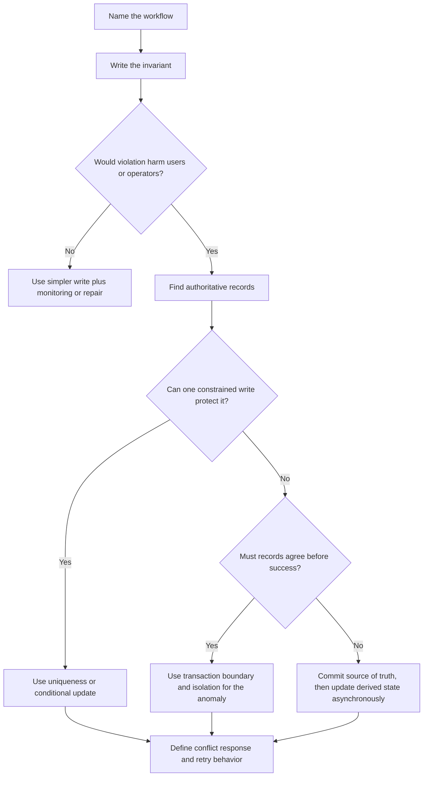

# Transactions

Transactions group related reads and writes so the system can protect a rule
while data changes. They matter when a workflow would harm users, operators, or
business state if only part of the change happened or if two actors changed the
same data at the same time.

Use transactions to protect specific invariants. Do not make every workflow
maximally strict by default; stronger guarantees usually cost latency,
throughput, and operational flexibility.

## Purpose

Use transaction design to answer:

- Which writes must succeed or fail together?
- What invariant must stay true while the write happens?
- Which rows, documents, or resources are inside the transaction boundary?
- Which conflicts can happen if two actors act at once?
- Which reads need isolation from in-progress or competing writes?
- When is a retry, idempotency key, or compensating action enough?

The goal is to name the correctness requirement before choosing a transaction,
lock, conditional write, queue, or eventual repair workflow.

## When This Matters

Transactions matter when:

- money, inventory, reservations, permissions, or quotas change;
- a workflow updates multiple related records;
- an entity has lifecycle states that block or allow actions;
- two users can approve, claim, edit, or reserve the same thing;
- a read-modify-write flow could overwrite someone else's update;
- side effects should happen only after the source-of-truth write commits.

They matter less when data is derived, temporary, append-only, or safely
rebuildable, as long as duplicate commands and partial failures are handled.

## Questions To Ask

Start with the invariant:

- What bad outcome must never happen?
- Which data must be checked before the write?
- Which data must be changed together after the check passes?
- Can the invariant be enforced with uniqueness, conditional writes, or a
  single-row update?
- What should the user see if the transaction conflicts and must retry?

Then define the boundary:

- Which records are authoritative for the decision?
- Which side effects must wait until commit?
- Which derived views can be updated later?
- How long will the transaction hold resources?
- What happens if the client disconnects, retries, or sends the command twice?

## Decision Guidance

### Transaction Boundaries

A transaction boundary is the smallest set of authoritative state that must be
read and written together to protect a rule.

Good boundaries are tied to product language:

- approve one reservation for one room and time window;
- transfer one seat from available to held for one customer;
- move one task from open to claimed by one worker;
- create one account and its required ownership record;
- apply one billing adjustment and append its audit event.

Avoid boundaries that are vague or too broad, such as "update everything about
the order" or "lock the whole schedule." Broad boundaries increase contention
and make retries harder.

### Atomicity

Atomicity means the grouped change commits completely or does not commit at all.
It prevents half-finished source-of-truth state.

Atomicity is useful when:

- a current-state row and its history entry must agree;
- a reservation approval and capacity decrement must happen together;
- a permission grant and audit record must both exist;
- a workflow creates several required records before exposing the result.

Atomicity does not mean every side effect belongs inside the transaction. Email,
push notifications, search indexing, metrics, and analytics updates usually run
after commit from durable state or an outbox-like record.

### Isolation

Isolation controls what a transaction can see while other transactions are
running. Stronger isolation reduces anomalies, but can increase blocking,
retries, and latency.

Think in terms of the anomaly you are trying to prevent:

| Risk | What Can Go Wrong | Design Response |
| --- | --- | --- |
| Dirty read | A reader sees data that later rolls back | Do not expose uncommitted source-of-truth state |
| Non-repeatable read | A record changes between reads in one workflow | Re-read at commit, lock, or use a suitable isolation level |
| Lost update | Two writers read the same value and one overwrites the other | Use version checks, conditional updates, or locking |
| Write skew | Two writers update different records after reading the same condition | Put the invariant in one constrained record or use stronger isolation |
| Phantom conflict | A new matching record appears during a range decision | Use a uniqueness rule, scoped constraint, or isolation that protects the range |

Do not name an isolation level without naming the anomaly it prevents. The
reader should know what failure mode the design is buying protection from.

### Lost Updates

A lost update happens when two actors read the same state, both compute a new
state, and the later write overwrites the earlier one.

Example:

```text
Two dispatchers open the same pickup stop. Both see status = skipped. One marks
it reopened for driver A. The other marks it reopened for driver B. The second
write overwrites the first assignment.
```

Common protections:

- optimistic concurrency with a version number or updated timestamp;
- conditional update such as "change only if status is still skipped";
- a transaction that reads and writes the authoritative row;
- a lock when conflicts are likely and retry UX is acceptable;
- append commands to a queue when same-entity commands are serialized by key or
  by a single worker, and each command still commits safely to authoritative
  state.

### Write Conflicts

A write conflict happens when two transactions cannot both commit because they
touch the same protected state or violate the same invariant.

Design for conflicts as expected behavior:

- return a clear message when a reservation is no longer available;
- retry automatically only when the command is idempotent and safe;
- ask the user to refresh when the decision depends on new state;
- record failed attempts when operators need to investigate contention;
- measure conflict rate so hot resources are visible.

Write conflicts are not always bugs. They are often the correct outcome when
the system protects a scarce resource.

### When Transactions Matter

Use transactions or equivalent conditional guarantees when:

- violating the invariant would be user-visible or hard to repair;
- multiple authoritative records must agree immediately;
- a conflict must be resolved before confirming success;
- a lifecycle transition changes what actions are allowed next;
- a duplicate command could create duplicate authoritative state.

Use weaker or asynchronous handling when:

- the data is derived and can be rebuilt;
- the operation is append-only and duplicates are safely deduplicated;
- a background repair job can restore correctness before users are harmed;
- users can tolerate stale lists or delayed reports;
- the side effect can be retried from durable committed state.

## Transaction Decision Flow



## Trade-Offs

Transactions trade correctness guarantees against coordination cost.

- A small transaction protects a clear invariant with limited contention.
- A broad transaction can simplify reasoning but slow unrelated work.
- Stronger isolation prevents more anomalies but can increase retries or locks.
- Optimistic concurrency keeps normal writes fast but pushes conflicts into
  retry handling.
- Pessimistic locking can make conflicts explicit but may block users longer.
- Asynchronous side effects improve latency but require durable retry and
  observability.

Pick the weakest guarantee that still protects the named invariant.

## Common Mistakes

- Saying "use a transaction" without naming the invariant.
- Putting emails, webhooks, search updates, or analytics inside the critical
  transaction.
- Protecting a workflow with a read check but no conditional write.
- Ignoring lost updates in edit, claim, approval, and counter workflows.
- Treating write conflicts as rare errors instead of expected outcomes.
- Using one broad lock because the exact boundary was not identified.
- Retrying non-idempotent commands automatically.
- Updating derived state before the source-of-truth commit is durable.

## Example

A community rehearsal-space system lets bands request rooms. Staff approve
requests, but a room can have only one approved reservation for a time window.

Entities:

- room;
- reservation request;
- approval decision;
- status change;
- notification job.

Invariant:

```text
A room cannot have two approved reservations for overlapping time windows.
```

Transaction boundary:

- read the room and candidate time window;
- check for an existing approved reservation that conflicts;
- protect the overlapping range with a scoped constraint, authoritative slot
  record, range-protecting isolation, or equivalent mechanism;
- mark the request approved;
- create a status change or approval decision record;
- create a durable notification job or outbox record after the approval is
  accepted.

Conflict handling:

- If another staff member approved a conflicting request first, the transaction
  fails or the conditional write does not match.
- The user sees "room no longer available for that time" and can choose another
  slot.
- The failed approval attempt can be logged for operators if conflicts are
  common.

What stays outside the transaction:

- sending email;
- updating a search index;
- refreshing weekly utilization dashboards;
- notifying a chat channel.

Those side effects can run from committed reservation and status-change data.
If they fail, they should retry without changing the approval decision.
When reliable side effects are required, persist the job or outbox record with
the authoritative approval, then send the email, chat message, search update, or
dashboard refresh after commit.

## Checklist

Before finalizing a transaction design, confirm:

- The invariant is written in product language.
- The transaction boundary includes only authoritative state needed for the
  invariant.
- Atomicity is required for the grouped source-of-truth writes.
- Isolation is tied to a named anomaly such as lost update or write skew.
- Lost-update risks are handled with version checks, conditional writes, locks,
  or transactions.
- Write conflicts have a user-facing and operator-facing response.
- Side effects happen after commit or through durable retryable records.
- Idempotency is defined for retries.
- Conflict rate, retry failures, and invariant violations can be observed.
- Derived views can be rebuilt from committed source-of-truth state.

## Related Pages

- [Data overview](./)
- [Identifying entities](identifying-entities.md)
- [Read and write patterns](read-write-patterns.md)
- [Indexes](indexes.md)
- [Relational vs document vs key-value](relational-vs-document-vs-key-value.md)
- [Outbox pattern](../communication/outbox-pattern.md)
- [Trade-off vocabulary](../method/tradeoff-vocabulary.md)
- [Design review checklist](../method/design-review-checklist.md)
- [Glossary](../glossary.md)
