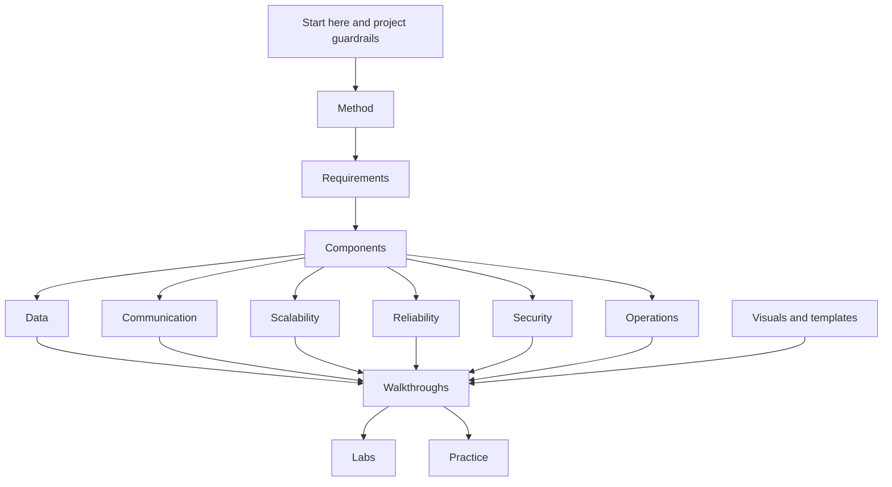

# System Design Decision Cookbook

The cookbook helps you move from a vague system design prompt to defensible
architecture decisions. Start with the problem and requirements, then choose
components because they satisfy those requirements, not because they are common
in diagrams.

Use this page as the docs site map. It links the major topic areas by category
and points to a practical first path through the material.

## Start Here

If you are new to the cookbook, read these in order:

1. [Project guardrails](start-here/project-guardrails.md) - understand the
   originality, scope, and attribution rules behind the resource.
2. [How to use this cookbook](start-here/how-to-use-this-cookbook.md) - learn
   how docs, labs, walkthroughs, and checklists fit together.
3. [Learning paths](start-here/learning-paths.md) - choose a reading order by
   level or a beginner, interview, builder, or production architecture route.
4. [System design process](method/system-design-process.md) - learn the repeatable
   path from problem statement to architecture.
5. [Requirement discovery](method/requirement-discovery.md) - practice turning
   vague prompts into functional and non-functional requirements.
6. [Requirements map](requirements/) - choose the requirement category most
   likely to change the design.
7. [Component selection map](components/) - connect requirements to justified
   components.
8. [Walkthroughs](walkthroughs/) or [labs](labs/) - apply the method to worked
   systems and runnable examples.

## Cookbook Map

The map is a reading order, not a strict process. In a real design review you
will loop between requirements, data, communication, reliability, security, and
operations as new constraints appear.

## Major Topics

| Category | Start With | Use It To Answer |
| --- | --- | --- |
| [Start Here](start-here/) | [Project guardrails](start-here/project-guardrails.md), [how to use this cookbook](start-here/how-to-use-this-cookbook.md), [learning paths](start-here/learning-paths.md), [definition of done](start-here/definition-of-done.md), [project management](start-here/project-management.md), [content review workflow](start-here/content-review-workflow.md), [contribution quality dashboard](start-here/contribution-quality-dashboard.md) | What is in scope, how to begin, which route fits your goal, and what quality means |
| [Method](method/) | [System design process](method/system-design-process.md), [requirement discovery](method/requirement-discovery.md), [scale estimation](method/scale-estimation.md), [design review checklist](method/design-review-checklist.md) | How do I go from prompt to architecture without jumping to tools? |
| [Requirements](requirements/) | [Latency](requirements/latency.md), [throughput](requirements/throughput.md), [availability](requirements/availability.md), [consistency](requirements/consistency.md), [operability](requirements/operability.md) | Which constraint changes the design? |
| [Components](components/) | [API layer](components/api-layer.md), [database selection](components/database-selection.md), [cache](components/cache.md), [queue](components/queue.md), [stream](components/stream.md), [background workers](components/background-workers.md) | Which component is justified, and what does it make harder? |
| [Data](data/) | [Identifying entities](data/identifying-entities.md), [read/write patterns](data/read-write-patterns.md), [consistency models](data/consistency-models.md), [replication](data/replication.md), [partitioning and sharding](data/partitioning-and-sharding.md) | What is the source of truth, how is it read, and what must stay correct? |
| [Communication](communication/) | [Sync vs async](communication/sync-vs-async.md), [queues](communication/queues.md), [streams](communication/streams.md), [retries and backoff](communication/retries-and-backoff.md), [idempotency](communication/idempotency.md) | What must happen now, what can happen later, and how do retries stay safe? |
| [Scalability](scalability/) | [Capacity estimation](scalability/capacity-estimation.md), [bottleneck analysis](scalability/bottleneck-analysis.md), [caching strategies](scalability/caching-strategies.md), [sharding strategies](scalability/sharding-strategies.md), [hot-key mitigation](scalability/hot-key-mitigation.md) | Which part saturates first, and what scale mechanism is justified? |
| [Reliability](reliability/) | [Timeouts](reliability/timeouts.md), [retries](reliability/retries.md), [failure-mode analysis](reliability/failure-mode-analysis.md), [failover](reliability/failover.md), [disaster recovery](reliability/disaster-recovery.md) | What fails, what should degrade, and how does the system recover? |
| [Security](security/) | [Authentication](security/authentication.md), [authorization](security/authorization.md), [data privacy](security/data-privacy.md), [audit logs](security/audit-logs.md), [rate limiting and abuse](security/rate-limiting-and-abuse.md) | Who can do what, what data is sensitive, and where can abuse happen? |
| [Operations](operations/) | [Observability basics](operations/observability-basics.md), [metrics](operations/metrics.md), [logs](operations/logs.md), [alerting](operations/alerting.md), [runbooks](operations/runbooks.md), [cost analysis](operations/cost-analysis.md) | How will operators notice, debug, repair, and pay for the system? |
| [Walkthroughs](walkthroughs/) | [URL shortener](walkthroughs/url-shortener.md), [rate limiter](walkthroughs/rate-limiter.md), [notification system](walkthroughs/notification-system.md), [news feed](walkthroughs/news-feed.md), [metrics platform](walkthroughs/metrics-platform.md) | How do complete designs show requirements, choices, trade-offs, and simplification? |
| [Labs](labs/) | [Labs guide](labs/) and the runnable labs in `../labs/` | How can I observe behavior such as rate limiting, retries, caching, quorum reads, sharding, hot keys, compaction, and DLQs? |
| [Visuals](visuals/) | [Diagram style guide](visuals/diagram-style-guide.md), [diagram legend](visuals/diagram-legend.md), [Mermaid examples](visuals/mermaid-examples.md), [diagram review checklist](visuals/diagram-review-checklist.md) | How should diagrams clarify decisions instead of decorating pages? |
| [Practice](practice/) | [Practice index](practice/), [system design rubric](practice/system-design-rubric.md), [self-review checklist](practice/self-review-checklist.md), [interview practice prompts](practice/interview-practice-prompts.md), [flashcards](practice/flashcards.md), [common mistakes](practice/common-mistakes.md), [overengineering checklist](practice/overengineering-checklist.md), [simplification checklist](practice/simplification-checklist.md), [challenge progression](practice/challenge-progression.md) | How can I review, critique, and improve system design answers? |
| [Glossary](glossary.md) | [Glossary](glossary.md) | What do common system design terms mean in practical language? |

## Choose Your Next Page

| Goal | Read Next |
| --- | --- |
| Start using the cookbook | [How to use this cookbook](start-here/how-to-use-this-cookbook.md) |
| Choose a reading order by level or goal | [Learning paths](start-here/learning-paths.md) |
| Learn the overall method | [System design process](method/system-design-process.md) |
| Turn a prompt into requirements | [Requirement discovery](method/requirement-discovery.md) |
| Decide whether a component belongs | [Component selection map](components/) |
| Estimate traffic or storage | [Scale estimation](method/scale-estimation.md) and [capacity estimation](scalability/capacity-estimation.md) |
| Practice a complete design | [Walkthroughs](walkthroughs/) |
| Run code and observe behavior | [Labs guide](labs/) |
| Review someone else's design | [Design review checklist](method/design-review-checklist.md) |
| Add or update content | [Definition of done](start-here/definition-of-done.md), [content review workflow](start-here/content-review-workflow.md), [diagram style guide](visuals/diagram-style-guide.md), and the templates in [`../templates/`](https://github.com/LeonSilva15/system-design/tree/main/templates/) |

## How To Use The Cookbook

For each design, keep asking:

- What problem am I solving?
- Which requirements are real constraints?
- Which component is justified by each constraint?
- What trade-off did that component introduce?
- What can fail, and what does the user see?
- What signal proves the system is healthy or unhealthy?
- What is the smallest useful version 1?

The best next page is the one that helps you answer the weakest question in
your current design.
