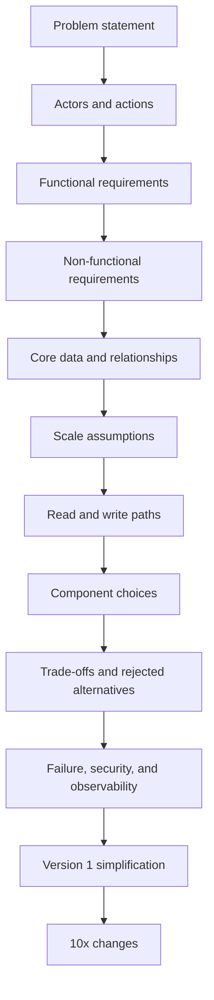

# System Design Process

Use this process to move from a rough prompt to architecture decisions that are
easy to explain, review, and simplify.

The process is intentionally repeatable. It helps you avoid jumping from a
problem statement straight to components before you know which requirements
matter.

## Purpose

System design work is a chain of decisions:

```text
problem -> actors -> requirements -> data -> scale -> components -> trade-offs
-> failure modes -> operations -> version 1
```

Each step should make the next step more constrained. If a component choice does
not trace back to a requirement, scale assumption, data shape, or failure mode,
it is probably premature.

## When This Matters

Use this page when you need to:

- turn an ambiguous product idea into a design conversation;
- prepare for a system design interview without memorizing canned answers;
- review whether an architecture proposal is justified;
- identify which details belong in version 1 and which can wait;
- explain the trade-offs behind a design instead of listing technologies.

## Questions To Ask

Start with questions that reduce ambiguity:

- What problem are we solving, and for whom?
- Who are the actors: users, operators, administrators, services, and external
  systems?
- Which actions must the system support?
- Which actions are read-heavy, write-heavy, latency-sensitive, or risky?
- What data must be stored, derived, cached, expired, or audited?
- What scale matters now: users, requests, writes, reads, objects, storage,
  fanout, or geographic distance?
- What can fail, and what should the user or operator see when it fails?
- What must be observable before launch?
- What is the smallest version 1 that still teaches or solves the core problem?

## Concise Algorithm

```text
1. Restate the problem in one sentence.
2. Name the actors and the actions they take.
3. Separate functional requirements from non-functional requirements.
4. List the core entities and the relationships between them.
5. Estimate the scale dimension that is most likely to stress the design.
6. Sketch the read path and write path before choosing infrastructure.
7. Choose components only when they solve a stated requirement or constraint.
8. For each major choice, state what it improves and what it makes worse.
9. Add failure modes, recovery behavior, security concerns, and observability.
10. Remove anything not needed for version 1, then name what changes at 10x.
```

## Process Flow



## Decision Guidance

### 1. Frame the Problem

Write one sentence that names the user, the job, and the boundary of the system.

Weak framing:

```text
Build a scheduling app.
```

Stronger framing:

```text
Build a scheduling system for neighborhood repair volunteers so residents can
request a time slot, volunteers can accept jobs, and coordinators can see
missed or overloaded appointments.
```

The stronger version identifies actors and hints at availability, assignment,
visibility, and failure behavior.

### 2. Name Actors And Actions

Actors are not only end users. Include:

- primary users who create, read, update, or delete data;
- administrators or operators who resolve exceptions;
- background workers that send messages or process events;
- external systems that call APIs or receive callbacks;
- abuse actors when security or trust matters.

Actions reveal API boundaries, data ownership, authorization checks, and
workflows.

### 3. Split Requirements

Functional requirements describe what the system does. Non-functional
requirements describe how well it must behave.

For example:

- Functional: residents request appointments, volunteers accept appointments,
  coordinators cancel unsafe or duplicate requests.
- Non-functional: confirmation reads should feel instant, duplicate bookings
  should be prevented, reminders can be delayed by a few minutes, coordinator
  audit history should be retained.

Do not treat every quality as equally important. Rank the ones that change the
architecture.

### 4. Identify Data And Relationships

List core entities before storage technology:

- user or account;
- object being created or reserved;
- event, request, job, payment, message, or notification;
- relationship or membership;
- state transition and audit record.

Then ask which data is authoritative, which can be derived, which can be cached,
and which must expire.

### 5. Estimate Scale Where It Changes Choices

Scale estimates are useful when they affect a decision. You usually do not need
precise math before you know the stress point.

Useful scale dimensions include:

- peak reads per second;
- writes per second;
- fanout per event;
- stored objects and growth rate;
- largest object size;
- hot keys or celebrity users;
- geographic distance between users and data;
- acceptable recovery time after failure.

State assumptions plainly. A design for ten writes per second can be simpler
than a design for ten thousand writes per second.

### 6. Sketch Read And Write Paths

Before picking components, describe what happens on the main read and write
paths:

- request arrives;
- authentication and authorization happen;
- data is read, written, validated, or locked;
- derived work is done inline or asynchronously;
- response is returned;
- events, logs, metrics, and alerts are emitted.

The read path often reveals latency and caching choices. The write path often
reveals consistency, idempotency, and failure-handling choices.

### 7. Choose Components From Constraints

Pick components because they solve a named problem:

- database for durable source of truth;
- cache for repeated reads that can tolerate staleness;
- queue for buffering, retries, and worker isolation;
- search index for ranked or text-heavy retrieval;
- object storage for large immutable blobs;
- scheduler for delayed or recurring work;
- gateway or load balancer for routing, rate limits, and edge controls.

Avoid adding a component just because it appears in common architecture
diagrams. Every component creates operational work and failure modes.

### 8. State Trade-Offs And Alternatives

For each major choice, write:

- what this choice improves;
- what it makes worse;
- what alternative was rejected;
- what signal would make you revisit the choice.

Example:

```text
Use one relational database for appointment state in version 1 because the main
risk is double booking, not read throughput. This keeps transactions simple.
The trade-off is that reporting queries can compete with transactional reads.
If coordinator dashboards become slow, add read replicas or a separate reporting
projection before considering sharding.
```

### 9. Plan For Failure And Operations

Ask what happens when:

- the database is slow or unavailable;
- a worker retries a job;
- a message is duplicated or lost;
- an external dependency times out;
- a user repeats a request;
- a deployment introduces bad behavior;
- an operator needs to debug a single user-visible issue.

The design should name metrics, logs, traces, dashboards, alerts, and manual
repair paths that matter for version 1.

### 10. Simplify Version 1

After the design is sketched, remove optional machinery.

Version 1 usually prefers:

- one durable source of truth;
- one or two critical APIs;
- simple deployment and rollback;
- explicit limits;
- manual review for rare edge cases;
- clear observability over clever automation.

Then write what changes at 10x scale so the simplification is intentional, not
forgotten.

## Trade-Offs

This process improves design quality by forcing requirements before components.
It also has costs:

- It can feel slower than drawing the architecture first.
- It may expose missing product decisions that need follow-up.
- It does not remove judgment; it makes assumptions visible.
- It can produce too much detail if every minor requirement is treated as
  architecture-shaping.

Use the process as a decision aid, not as paperwork.

## Common Mistakes

- Starting with a database, cache, queue, or cloud product before naming the
  requirement it satisfies.
- Treating scale as a single number instead of identifying the stress dimension.
- Ignoring actors such as operators, administrators, background workers, or
  abusive users.
- Listing requirements without ranking which ones shape the architecture.
- Drawing only the happy path and skipping retries, duplicates, partial failure,
  and degraded behavior.
- Adding advanced distributed systems patterns before version 1 needs them.
- Forgetting observability until after the design is already difficult to
  operate.

## Example

A campus tool checkout desk wants students to reserve shared equipment for
class projects.

Problem framing:

```text
Students reserve tools, desk staff approve pickups, and the system prevents the
same tool from being promised to two people at the same time.
```

Actors:

- student;
- desk staff;
- maintenance coordinator;
- reminder worker.

Architecture-shaping requirements:

- Students can search available tools and request a pickup window.
- Staff can approve, reject, or mark a reservation returned.
- Double booking the same tool for overlapping windows is not acceptable.
- Reminder delivery can be delayed.
- Staff need a daily list of overdue tools.

Likely version 1:

- one relational database for tools, reservations, users, and state changes;
- transactional writes for reservation approval;
- simple search over indexed tool names and categories;
- background reminders through a queue;
- dashboard metrics for failed reminder jobs, overdue count, and reservation
  approval latency.

Rejected for version 1:

- sharding, because reservation write volume is low;
- global replication, because the desk operates in one campus region;
- event sourcing for every state change, because a simple audit table is enough.

At 10x usage, revisit read replicas for search and dashboards, queue throughput
for reminders, and staff workflows for resolving high overdue volume.

## Checklist

Before moving from design discussion to implementation, confirm:

- The problem statement is one clear sentence.
- Actors include users, operators, services, and external systems.
- Functional requirements are separated from non-functional requirements.
- Requirements are ranked by architecture impact.
- Core entities and relationships are named.
- Data ownership, derived data, and expiration are clear.
- The most important scale dimension is estimated.
- The read path and write path are sketched.
- Each component maps to a requirement or constraint.
- Major trade-offs and rejected alternatives are explicit.
- Failure modes, retries, duplicates, and degraded behavior are covered.
- Security and abuse concerns are named where relevant.
- Logs, metrics, traces, alerts, and manual repair paths are identified.
- Version 1 is simpler than the full future design.
- The design states what changes at 10x scale.

## Related Pages

- [Method section](index.md)
- [Definition of Done](../start-here/definition-of-done.md)
- [Project guardrails](../start-here/project-guardrails.md)
- [Content guardrails](../../CONTENT_GUARDRAILS.md)
- [Style guide](../../STYLE_GUIDE.md)
- [Templates](../../templates/README.md)
