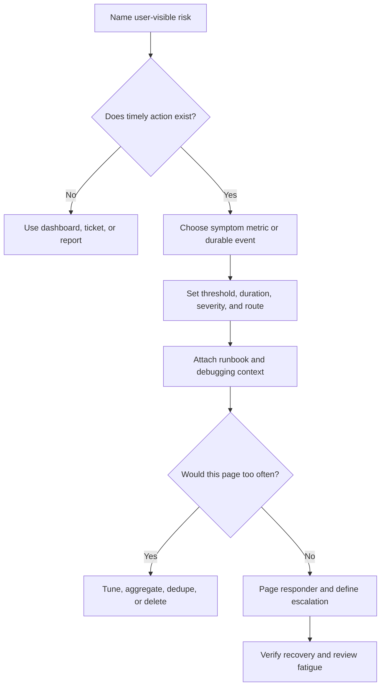

# Alerting

Alerting is the part of operations design that decides when a system should
interrupt a human. A good alert points to user impact, data risk, security risk,
quota exhaustion, or fast-growing cost, and it gives the responder enough
context to act.

An alert is not a dashboard notification. It is a commitment that someone should
stop what they are doing and investigate.

Use [Metrics](metrics.md) to choose the signals. Use [Logs](logs.md) and
[Tracing](tracing.md) to debug one affected request, job, or dependency after an
alert fires.

## Purpose

Use alert design to answer:

- Which user-visible symptom deserves a page?
- Which metric or event proves the symptom is real?
- What threshold separates noise from action?
- Who is paged, when, and with what context?
- Which alerts should route to tickets, dashboards, or business review instead
  of waking someone?
- How does escalation work when the first responder cannot mitigate the issue?
- Which alerts should be deleted because they cause fatigue without improving
  recovery?

The goal is to reduce time to notice and time to repair without training people
to ignore the system.

## When This Matters

Alerting matters when:

- a workflow has a reliability, latency, freshness, correctness, or cost
  expectation;
- failures can affect users before support reports arrive;
- queues, workers, providers, caches, replicas, or scheduled jobs can silently
  fall behind;
- a dependency quota, budget, or rate limit can be exhausted;
- a security or data-risk event needs fast human review;
- repeated noisy pages are already reducing trust in operations;
- the design needs an on-call, escalation, or runbook model.

It matters less when the workflow is experimental, manually watched, and has no
user or data impact. Even then, define what would make the workflow important
enough to alert on later.

## Questions To Ask

Start with the action:

- What user-visible symptom, data risk, security risk, or cost risk does this
  alert represent?
- What should the first responder do in the first 10 minutes?
- Is the signal a symptom, a likely cause, or only a diagnostic detail?
- What threshold avoids paging for harmless blips but catches real impact early?
- How long must the condition persist before alerting?
- Which dimensions matter for routing: workflow, service, tenant tier, region,
  dependency, job type, or severity?
- Who owns the runbook and escalation path?
- What evidence should the alert include: dashboard, trace query, log query,
  runbook, recent deploy, or affected tenant list?
- What would prove recovery?

## Alert Design Flow



This flow keeps alerts tied to action. If no one can name the mitigation,
rollback, escalation, or customer communication step, the signal should not page
a person yet.

## Decision Guidance

### Prefer Symptom-Based Alerts

Symptom-based alerts start from what users, callers, jobs, data, or the business
experience. They page when the system is failing a promise, not merely when a
component looks busy.

Good symptom alerts:

- valid request error rate is above target for a critical workflow;
- p95 or p99 latency exceeds the user-visible target for long enough to matter;
- oldest queue age exceeds the workflow freshness expectation;
- accepted jobs are dead-lettering or stuck in retry exhaustion;
- provider failures exhaust fallback or retry budget;
- reconciliation detects missing or inconsistent data;
- quota or budget burn rate will exhaust capacity before normal review.

Cause signals still matter. Database connections, CPU saturation, cache
evictions, provider timeouts, and retry volume should appear in dashboards and
runbooks. Page on them only when they have a clear action and are known to
precede user impact.

### Use Cause Alerts Carefully

Cause alerts can be useful when they are early, reliable, and actionable.

Use cause alerts when:

- a dependency quota will be exhausted before users fail;
- database connections or disk space approach a hard limit;
- certificate, secret, or key expiry requires action before outage;
- a queue consumer is stopped and no alternate worker exists;
- backup, restore verification, or reconciliation has failed;
- a security control detects a high-risk event.

Avoid cause alerts when:

- the component recovers automatically and users are not affected;
- the threshold fires during normal daily peaks;
- the alert only says "CPU high" with no runbook decision;
- several cause alerts always fire for the same symptom and create duplicate
  pages;
- the signal is useful only after someone is already investigating.

The design can keep cause signals on dashboards and link them from symptom
alerts. Not every useful signal needs to page.

### Set Thresholds From Expectations

Thresholds should come from workflow expectations and operating history, not
from arbitrary round numbers.

Define:

- metric or event;
- threshold value;
- time window or persistence duration;
- baseline traffic shape, normal-volume guard, or comparison period;
- severity;
- route or owner;
- suppressions or maintenance windows;
- recovery condition.

Example:

```text
Alert: reservation_submission_high_error_rate
Signal: valid reservation submissions with result=system_error
Threshold: >2% for 10 minutes and at least 20 failed attempts
Baseline context: compare to branch-hours traffic, not overnight trickle traffic
Severity: page during branch operating hours, urgent ticket otherwise
Owner: reservation on-call
Context: dashboard, recent deploys, top branches, trace query, runbook
Recovery: error rate below 1% for 15 minutes
```

Use multiple conditions when a single threshold is noisy. A percentage-only
alert can page on one failure during low traffic. A count-only alert can miss a
small but critical tenant. Combine rate, count, duration, and affected scope
when needed.

### Decide Paging Versus Non-Paging

Paging is for timely human action. Non-paging routes are for work that matters
but can wait.

Use pages for:

- critical workflow failures affecting active users;
- data-loss, data-integrity, or security-risk conditions;
- stuck queues where freshness promises are being missed;
- provider failures where fallback is exhausted;
- quota exhaustion that will soon break user-visible behavior;
- incidents that need coordination, rollback, or customer communication.

Use tickets, dashboard annotations, or daily reports for:

- slow capacity trends;
- flaky non-critical background jobs with manual retry windows;
- cost growth that needs planning but not immediate mitigation;
- low-volume errors with no user impact;
- cleanup, documentation, and follow-up work;
- expected maintenance behavior.

The same signal can route differently by time, workflow, tenant tier, or
severity. A payment failure may page immediately; a delayed weekly export may
create a ticket.

### Reduce Alert Fatigue

Alert fatigue happens when alerts are frequent, low-value, duplicate, unclear,
or unactionable. It makes real incidents slower because responders stop trusting
the pager.

Reduce fatigue by:

- deleting alerts that have no timely action;
- deduplicating multiple component alerts behind one symptom alert;
- using duration windows to avoid one-minute blips;
- grouping related failures by workflow, dependency, tenant, or region;
- suppressing expected alerts during maintenance or known migrations;
- routing low-severity work to tickets or reports;
- adding runbooks so responders do not rediscover the same checks;
- reviewing pages after incidents and after noisy weeks;
- tracking alert count, page count, false positives, and time to acknowledge.

Every recurring alert should earn its place. If the same page fires repeatedly
and no one changes the system, the alert is either misrouted, mistuned, missing
ownership, or pointing to an accepted risk that should be handled differently.

### Define Escalation

Escalation says what happens when the first responder cannot confirm, mitigate,
or repair the issue.

Define escalation by:

- primary owner and backup owner;
- time to acknowledge;
- time to escalate;
- severity level and communication channel;
- handoff information required;
- decision authority for rollback, feature disablement, provider failover, or
  customer messaging;
- when to involve security, data, legal, support, or product leadership.

Compact example:

```text
Primary on-call acknowledges within 10 minutes.
If no mitigation is active within 20 minutes, escalate to the service owner.
If data integrity or customer communication is involved, add support lead and
incident commander immediately.
```

Useful handoff context:

```text
symptom
start time
affected workflow and segment
current severity
mitigations attempted
latest metrics
example trace or request ID
suspected cause
next decision needed
```

Escalation should not be a personal memory chain. It should be written in the
runbook or alert routing configuration.

## Trade-Offs

| Choice | Benefit | Cost |
| --- | --- | --- |
| Symptom-based page | Closely tied to user impact | May detect impact later than a strong cause signal |
| Cause-based page | Can warn before users notice | Noisy if the cause is not reliably actionable |
| Short threshold window | Faster detection | More false positives during brief blips |
| Long threshold window | Less noise | Slower response |
| Page immediately | Fast human attention | Expensive interruption if action is unclear |
| Ticket or report | Preserves focus and supports planning | May delay mitigation |
| Many granular alerts | Precise ownership | Duplicate pages and harder incident coordination |
| Aggregated alert | Reduces fatigue | May need better dashboard context for debugging |

Choose alert behavior based on recovery value, not on how easy the signal is to
measure.

## Common Mistakes

- Paging on host CPU, memory, or disk warnings without user impact or a runbook.
- Alerting on every dependency timeout while retries and fallbacks are working.
- Using average latency instead of p95, p99, queue age, or completed workflow
  count.
- Setting thresholds without count, duration, or affected-scope guards.
- Creating duplicate pages for one incident across API, database, cache, and
  worker components.
- Routing every warning to the same on-call person.
- Letting low-priority batch or cleanup jobs wake people at night.
- Keeping alerts that repeatedly fire and require no action.
- Sending pages without links to dashboards, logs, traces, runbooks, or recent
  deploy context.
- Failing to define escalation or recovery proof.

## Example

A neighborhood equipment library lets residents reserve tools. The workflow has
three important operational promises:

- residents can submit valid reservations during branch hours;
- reminder jobs should not be more than 10 minutes late;
- provider quota should not be exhausted during peak reservation windows.

Alert design:

| Alert | Signal | Route | Why |
| --- | --- | --- | --- |
| Reservation submissions failing | Valid submission system errors exceed 2% and 20 failures for 10 minutes | Page reservation on-call | Users cannot complete the critical workflow |
| Reservation p95 latency high | p95 latency above 900 ms for 15 minutes with normal traffic volume | Page during branch hours, ticket otherwise | Slow confirmations create support load during active use |
| Reminder queue age high | Oldest reminder job above 10 minutes for 5 minutes | Page if branch is open, urgent ticket if closed | Freshness promise is being missed |
| Email provider quota burn high | Projected quota exhaustion within 2 hours | Page operations owner | Users will soon stop receiving reminders |
| App CPU high | CPU above 85% for 10 minutes | Dashboard only unless paired with symptom alert | CPU alone is a cause signal and often recovers |

Runbook context attached to the page:

- current error rate, p95 latency, queue age, and provider quota;
- top affected branches;
- recent deploys and feature flags;
- trace query for failed reservation submissions;
- log query filtered by `event=reservation.submit.failed`;
- rollback and provider-fallback steps;
- escalation path for data integrity or provider outage.

Fatigue review:

- If reservation latency pages three times in a week but users are not affected,
  tune duration, scope, or route it to a ticket.
- If CPU warnings always accompany reservation errors, keep CPU on the dashboard
  and let the symptom alert page once.
- If provider quota burn is predictable every Friday, add capacity planning or
  rate limiting instead of accepting recurring emergency pages.

This design pages for user impact and imminent failure, keeps cause signals
near the runbook, and avoids waking someone for every busy component.

## Checklist

Before accepting an alerting design, confirm:

- Each paging alert maps to user impact, data risk, security risk, quota risk,
  or fast-growing cost.
- Each alert has a first action, owner, runbook, and recovery condition.
- Symptom-based alerts exist for critical workflows.
- Cause-based alerts are early, reliable, and actionable.
- Thresholds include value, duration, count or scope guard, severity, and route.
- Paging and non-paging routes are deliberately separated.
- Alert context links to dashboards, logs, traces, recent changes, and runbooks.
- Escalation names primary owner, backup owner, handoff context, and timing.
- Alerts are deduplicated or grouped so one incident does not create many pages.
- Maintenance windows and expected migrations have suppression rules.
- Alert fatigue is reviewed with page count, false positives, and repeated
  unactioned alerts.
- Low-priority work routes to tickets, dashboards, or reports instead of pages.
- The design states what would cause an alert to be tuned, deleted, or promoted.

## Related Pages

- [Operations overview](./)
- [Metrics](metrics.md)
- [Logs](logs.md)
- [Tracing](tracing.md)
- [Observability basics](observability-basics.md)
- [Timeouts](../reliability/timeouts.md)
- [Retries](../reliability/retries.md)
- [Circuit breakers](../reliability/circuit-breakers.md)
- [Graceful degradation](../reliability/graceful-degradation.md)
- [Bottleneck analysis](../scalability/bottleneck-analysis.md)
