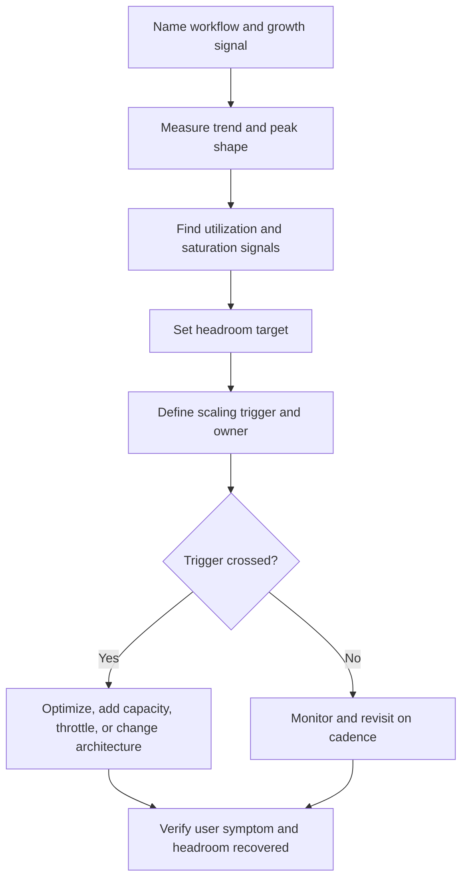

# Capacity Planning

Capacity planning is the operational practice of watching growth, utilization,
saturation, and headroom so the team can scale before users feel pain. It turns
rough estimates into ongoing decisions: when to optimize, when to add capacity,
when to change architecture, and when to keep version 1 simple.

Capacity planning is not the same as capacity estimation. Use
[Capacity estimation](../scalability/capacity-estimation.md) to create first
rough numbers. Use this page after the system exists or is close to launch and
needs measured growth signals, scaling triggers, and operating headroom.

Use [Metrics](metrics.md) to choose signals, [Dashboards](dashboards.md) to
show trend and saturation, and [Bottleneck analysis](../scalability/bottleneck-analysis.md)
when a measured constraint is already hurting a workflow.

## Purpose

Use capacity planning to answer:

- Which demand signals are growing: users, requests, writes, jobs, storage,
  bandwidth, provider calls, or cost?
- Which resource is closest to saturation during normal and peak load?
- How much headroom should the system keep for bursts, deploys, retries, and
  recovery?
- What scaling trigger should move the team from watch, to optimize, to add
  capacity, to architecture change?
- Which component can be scaled independently, and which component will become
  the next bottleneck?
- Which capacity risk is important enough to plan now, and which should be
  revisited later?

The goal is to make growth decisions from evidence instead of surprise
incidents or premature scaling work.

## When This Matters

Capacity planning matters when:

- traffic, tenants, data, files, logs, jobs, or provider calls are growing;
- peak load is much higher than average load;
- utilization is high enough that normal variance can become saturation;
- queues, workers, imports, exports, or scheduled jobs can fall behind;
- storage growth affects backup, restore, retention, or index maintenance;
- a dependency quota, rate limit, or budget can become the first hard limit;
- launch readiness depends on proving the system has enough headroom;
- the team needs a trigger for scaling, not a guess.

It matters less when measured load is tiny and one simple deployment plus one
database clearly has enough headroom. Even then, name the metric that would
make the team revisit the decision.

## Questions To Ask

Start with the growth shape:

- What is growing fastest: traffic, writes, data, jobs, fanout, payload size,
  tenants, regions, or cost?
- Is growth steady, seasonal, launch-driven, deadline-driven, or bursty?
- What is the busiest minute, hour, day, or scheduled job window?
- Which resource gets busy first as load rises?
- Which metric shows utilization, and which metric shows saturation?
- How much headroom is needed for failover, retries, deploys, batch work,
  customer spikes, or abuse?
- What scaling action is safe and reversible?
- What trigger would justify a larger architecture change?

## Capacity Planning Flow



The flow separates trend from saturation. A system can grow quickly while still
having headroom, or grow slowly while already sitting on a hard limit.

## Decision Guidance

### Track Growth Trends

Growth trends show where future pressure is coming from. They should be tied to
workflows and cost drivers, not only host charts.

Useful trend signals:

| Trend | Why It Matters |
| --- | --- |
| Daily and peak request rate | API, load balancer, cache, and database pressure |
| Read/write ratio | Different scaling paths for repeated reads and mutations |
| Active tenants, users, branches, or regions | Segment growth and blast-radius decisions |
| Storage and index size | Query latency, backup time, restore time, retention cost |
| Queue enqueue rate and oldest age | Worker capacity and freshness expectations |
| Payload size and bandwidth | CDN, object storage, compression, and export pressure |
| External provider call volume | quota, rate limit, retry, and vendor-cost pressure |
| Log, metric, and trace volume | observability cost and retention planning |
| Business completion rate | whether technical capacity matches product outcome |

Look at both absolute values and slope. A database at 30% utilization but
doubling every two weeks may deserve attention sooner than a database at 55%
with flat traffic.

### Separate Utilization From Saturation

Utilization says how much of a resource is being used. Saturation says the
resource is near a limit and work is waiting, slowing, failing, or being
rejected.

Examples:

| Resource | Utilization Signal | Saturation Signal |
| --- | --- | --- |
| API workers | request concurrency, worker use | queueing, timeouts, rejected connections |
| CPU | CPU percentage | latency rises while CPU stays high |
| Memory | heap use, cache size | GC pauses, eviction churn, OOM restarts |
| Database | connection use, CPU, rows scanned | lock waits, slow queries, connection exhaustion |
| Queue | worker utilization | oldest age rising, retry exhaustion, dead letters |
| Storage | disk used, object count | slow writes, backup window too long, no restore headroom |
| Provider | calls per minute, quota use | rate limits, timeout rate, fallback use |

Do not scale only because utilization looks high. A database can run safely at a
high steady utilization if latency, lock waits, and recovery headroom are fine.
Do scale or optimize when saturation signals threaten user-visible behavior.

### Define Headroom

Headroom is spare capacity reserved for normal variance and recovery. It should
be explicit because "enough capacity" depends on the workflow.

Plan headroom for:

- normal daily peaks;
- launch or deadline bursts;
- retries during dependency failure;
- failover when one instance, worker pool, node, zone, or provider path is
  unavailable;
- deploys, migrations, reindexing, backups, and restore testing;
- abuse or accidental client loops;
- observability, audit, and support queries during incidents.

Example headroom statements:

```text
Keep API p95 latency below target while running at 2x normal peak traffic.
Keep database connection use below 70% during branch operating hours.
Keep worker capacity high enough to drain the reminder queue within 10 minutes
after one worker instance is unavailable.
Keep 30 days of storage growth available after accounting for backups and
restore staging.
```

Headroom is not free. More spare capacity can increase cost and operational
surface. Too little headroom turns routine spikes into incidents.

### Set Scaling Triggers

A scaling trigger names the condition that causes action. It should include the
metric, threshold, duration, owner, and next step.

Useful trigger format:

```text
If <metric> is above <threshold> for <duration/window>,
and user-visible health is at risk,
then <owner> does <action> and verifies <recovery signal>.
```

Examples:

| Trigger | Action |
| --- | --- |
| API p95 latency exceeds target at normal peak for 3 days | profile hot route, reduce payload, or add instances |
| Database connection use stays above 75% and lock waits rise | reduce transaction length, tune pool, or add read path protection |
| Oldest queue age exceeds freshness target twice in a week | tune workers, add concurrency, or pause low-priority producers |
| Storage growth projects less than 60 days of backup headroom | archive old data, adjust retention, or expand storage |
| Provider quota exceeds 80% during normal traffic | reduce non-critical calls, batch, cache, or request quota change |
| Cache eviction rises and source database load increases | resize cache, reduce key churn, or review stale-read policy |

Avoid vague triggers like "scale when traffic is high." A trigger should point
to a decision and a verification check.

### Choose The Smallest Useful Scaling Move

Capacity planning should not automatically produce a big architecture change.
Choose the smallest move that restores headroom and keeps the design operable.

Common moves:

- optimize a query, payload, cache key, batch size, or retry policy;
- add instances for stateless CPU-bound work;
- add workers or split queues when backlog is the limit;
- add indexes or read replicas when read pressure is measured and freshness
  rules allow it;
- move large files or exports to object storage;
- add CDN or compression when bandwidth is the pressure;
- partition, shard, or isolate tenants only when simpler moves no longer meet
  measured requirements;
- throttle, rate limit, or degrade low-priority work during bursts.

Use [Bottleneck analysis](../scalability/bottleneck-analysis.md) when the
symptom is already visible. Use capacity planning when the trigger is warning
that the symptom is likely soon.

### Plan By Component And Workflow

Capacity belongs to both workflows and components.

Workflow planning asks:

- can users complete the important action during peak load?
- can async work meet freshness expectations?
- can the system recover after one component is reduced or unavailable?
- can support or operators investigate without making load worse?

Component planning asks:

- which resource saturates first?
- can this component scale independently?
- does scaling it move pressure to a database, queue, provider, or cost limit?
- what is the rollback path if the scaling change causes instability?

Do not let component headroom hide workflow pain. A worker pool can look idle
while one tenant's jobs are stuck behind a poison message. Do not let workflow
aggregate health hide component limits that will become incidents at the next
peak.

## Trade-Offs

| Decision | Benefit | Cost Or Risk |
| --- | --- | --- |
| More headroom | Absorbs bursts and failover | Higher spend and idle capacity |
| Less headroom | Cheaper version 1 | More incidents from normal variance |
| Early scaling trigger | Prevents user pain | Can cause premature work if noisy |
| Late scaling trigger | Avoids unnecessary change | Can leave too little time to respond |
| Add capacity | Fast for known pressure | Can hide inefficient or unsafe paths |
| Optimize first | Reduces waste | Can take longer than a capacity increase |
| Component-level planning | Clear ownership | May miss user-visible workflow health |
| Workflow-level planning | Tied to user impact | Requires cross-component signals |
| Manual scaling | Simple and controlled | Slow during sudden bursts |
| Automatic scaling | Faster reaction | Can amplify bad traffic or retry storms |

## Common Mistakes

- Treating average traffic as the capacity plan.
- Measuring utilization without checking saturation or user-visible symptoms.
- Setting no headroom for retries, deploys, failover, or scheduled jobs.
- Scaling stateless services while the database, queue, or provider is the real
  limit.
- Adding capacity without checking whether cost, quota, or storage retention
  becomes the next bottleneck.
- Using a scaling trigger with no owner or recovery signal.
- Waiting until an incident to learn that rollback or capacity change is slow.
- Letting one tenant, route, key, or job type hide inside aggregate charts.
- Treating capacity planning as a one-time launch task instead of an operating
  cadence.

## Examples

### Reservation Search Growth

A neighborhood equipment library lets residents search available tools and
reserve pickup slots.

Observed trend:

| Signal | Current Shape |
| --- | --- |
| Valid search requests | 4x growth over two months |
| Peak search RPS | 12x average during Saturday mornings |
| Database rows scanned | growing faster than returned results |
| API p95 latency | still within target, but rising at peak |
| Cache hit rate | stable for common branches, poor for rare filters |

Capacity plan:

- keep search p95 below 500 ms during Saturday peak;
- keep database CPU below 70% and lock waits near zero during branch operating
  hours;
- add an index or query rewrite if rows scanned doubles again or p95 exceeds
  500 ms for two peak windows;
- add cache only for common branch/day searches after stale-inventory risk is
  reviewed;
- defer read replicas because measured peak load is still small after query
  tuning.

Scaling trigger:

```text
If p95 search latency exceeds 500 ms during two Saturday peaks and rows scanned
per search continues to rise, the reservation owner reviews the query plan,
adds the missing access-path index, and verifies p95 and rows scanned recover.
```

Rejected for now:

- sharding inventory by branch, because write conflicts and total data size do
  not justify the operational cost;
- caching every search response, because rare filters would add stale-read risk
  without meaningful load reduction.

### Reminder Worker Headroom

The same system sends pickup reminders after reservations are approved.

Observed trend:

| Signal | Current Shape |
| --- | --- |
| Reminder jobs | 35% monthly growth |
| Oldest queue age | below 2 minutes normally, 8 minutes after provider slowdowns |
| Worker utilization | 55% normally, 90% during retry bursts |
| Provider quota | 68% of daily limit during normal branch hours |

Capacity plan:

- keep oldest reminder age below 10 minutes;
- keep enough worker headroom to absorb one worker instance being unavailable;
- reduce retry concurrency when provider timeout rate rises;
- request provider quota review when normal branch-hours usage reaches 80%;
- add worker capacity only if queue age rises while provider health and quota
  are normal.

This plan separates worker saturation from provider quota. Adding workers would
not help if the provider is already rate-limiting the system.

## Checklist

Before accepting a capacity plan, confirm:

- Growth trends are named for traffic, writes, storage, bandwidth, jobs,
  provider calls, observability volume, or cost where relevant.
- Average, peak, and burst shapes are separated.
- Utilization signals and saturation signals are both defined.
- Headroom targets account for retries, failover, deploys, migrations, batch
  work, and incident investigation.
- Scaling triggers include metric, threshold, duration, owner, action, and
  recovery signal.
- The plan identifies the likely next bottleneck after the scaling action.
- Workflow health and component health are both visible.
- Cost, quota, privacy, and operational complexity are considered before adding
  capacity or dimensions.
- The first scaling move is proportional to measured risk.
- The plan says when to revisit estimates and update dashboards, alerts, or
  runbooks.

## Related Pages

- [Operations overview](./)
- [Metrics](metrics.md)
- [Dashboards](dashboards.md)
- [Alerting](alerting.md)
- [SLOs](slos.md)
- [Runbooks](runbooks.md)
- [Incident response](incident-response.md)
- [Capacity estimation](../scalability/capacity-estimation.md)
- [Bottleneck analysis](../scalability/bottleneck-analysis.md)
- [Vertical vs horizontal scaling](../scalability/vertical-vs-horizontal-scaling.md)
- [Performance testing playbook](../scalability/performance-testing-playbook.md)
