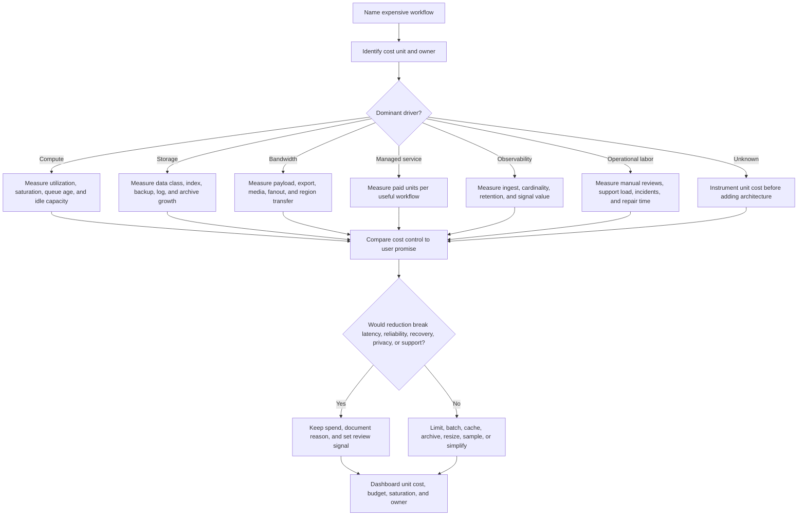

# Cost Analysis

Cost analysis is the operational practice of connecting architecture choices to
the resources they consume: compute, storage, bandwidth, managed services,
observability, and human effort. It helps a team decide where to spend
intentionally, where to set limits, and which trade-offs are acceptable for the
current version.

For early requirement discovery, start with
[Cost requirements](../requirements/cost.md). This page focuses on ongoing
analysis after a design starts becoming an operable system.

## Purpose

Use cost analysis to decide:

- which workflow or tenant creates the most spend;
- which resource drives the cost: compute, storage, bandwidth, managed-service
  units, observability volume, or operational labor;
- which overprovisioned capacity is justified by peak load, failover, deploys,
  retries, or recovery;
- which cost controls preserve the user promise and which ones weaken it;
- which dashboard, alert, or review cadence should catch cost drift before it
  becomes an incident.

The goal is not to minimize every line item. The goal is to understand the cost
of useful behavior, remove waste, and make deliberate trade-offs.

## When This Matters

Cost analysis matters when:

- usage is growing and the next bill may surprise the team;
- one tenant, route, job, export, search, or provider call can dominate spend;
- logs, metrics, traces, audit events, indexes, backups, files, or retained data
  keep growing after the product team stops thinking about them;
- version 1 uses a managed service whose unit price is easy to multiply with
  retries, scans, fanout, or broad indexing;
- spare capacity is sized for peaks, launches, failover, or background jobs;
- cost controls could affect latency, freshness, availability, support speed,
  privacy, or recovery.

If cost is clearly tiny, keep the system simple and name the review trigger.
Do not build a cost platform before there is a cost decision to make.

## Questions To Ask

- What is the expensive workflow, not just the expensive service?
- What unit does cost grow with: request, job, GB, object, retained day,
  message, export, trace, search, tenant, or seat?
- Which line item is fixed, and which one grows with user behavior?
- Is current headroom tied to a requirement or just a guess?
- Which retries, scans, broad queries, fanout, or default retention settings can
  multiply cost during failure?
- Which cost can be reduced by a product limit rather than new infrastructure?
- Which cost cut would weaken latency, reliability, recovery, debugging,
  security, or privacy?
- Who reviews cost trends, and what signal causes action?

## Decision Guidance

### Start With Unit Economics

Cost analysis becomes practical when each cost has a unit and an owner.

Useful units:

| Cost Area | Unit To Watch | Owner Question |
| --- | --- | --- |
| API compute | CPU seconds or instance hours per successful request | Which route burns capacity without completing user work? |
| Worker compute | job minutes per completed job | Which retries or low-priority jobs consume the pool? |
| Storage | GB per object type or retained day | Which data class grows without a lifecycle owner? |
| Bandwidth | GB egress per download, export, or fanout event | Which payloads leave the system repeatedly? |
| Managed service | calls, scans, messages, searches, minutes, seats, or documents | Which product action creates the paid unit? |
| Observability | log, metric, trace, or audit event volume | Which signal supports an alert, runbook, or review? |
| Human operations | support cases, manual reviews, incident hours, or repair tasks | Which manual step is still cheaper than automation? |

Global spend hides design problems. A "storage is expensive" complaint is less
useful than "unexpired export files grow by 80 GB per week and are never read
after day two."

### Separate Fixed, Variable, And Burst Costs

Different cost shapes need different controls.

- Fixed costs stay even when traffic is low: baseline instances, reserved
  capacity, licenses, always-on workers, idle replicas, and minimum managed
  service commitments.
- Variable costs grow with usage: requests, provider calls, stored objects,
  network transfer, traces, messages, scans, and report generation.
- Burst costs appear during launches, outages, retries, backfills, restores,
  migrations, incidents, or abuse.

Fixed costs are reduced by simplifying the baseline, scheduling capacity, or
removing always-on components. Variable costs are reduced by changing units,
limits, retention, batching, caching, compression, or product behavior. Burst
costs are controlled with queues, retry caps, circuit breakers, quotas,
backpressure, and post-event right-sizing.

### Analyze Compute Cost

Compute cost comes from CPU, memory, instance count, worker pools, containers,
serverless execution, batch jobs, and idle headroom.

Ask:

- Which route, command, job, or tenant uses the most CPU or memory?
- Is the work synchronous, asynchronous, scheduled, or retry-heavy?
- Are instances busy with useful work or waiting for I/O?
- Does peak load require permanent capacity, scheduled capacity, autoscaling, or
  a queue?
- Can expensive jobs be batched, deduplicated, paused, prioritized, or moved out
  of the request path?

Compute trade-off: smaller pools reduce idle spend but increase queue age and
make bursts more visible. Larger pools reduce waiting but can hide inefficient
work until the bill grows.

### Analyze Storage Cost

Storage cost includes primary data, indexes, replicas, backups, logs, metrics,
traces, audit events, archives, search documents, files, generated reports, and
temporary exports.

Ask:

- Which data is authoritative, derived, temporary, or recomputable?
- Which data needs hot query speed, and which can move to archive?
- Which indexes, replicas, thumbnails, search documents, and backups multiply
  the raw data size?
- Which retention window is required by product, support, privacy, audit, or
  compliance?
- Which records are past expiry or never read after creation?

Storage trade-off: short retention lowers cost and exposure, but can weaken
support, audit, analytics, and recovery. Long retention is justified only when
someone owns the purpose, access rule, and cleanup rule.

### Analyze Bandwidth And Fanout

Bandwidth cost comes from downloads, uploads, media, exports, replication,
analytics copies, cross-region traffic, provider callbacks, CDN misses, and
repeated large responses.

Ask:

- Which response or file leaves the system most often?
- Are payloads paginated, compressed, cached, streamed, or narrowed?
- Does one request fan out to many users, tenants, regions, or providers?
- Do retries during provider failure resend the same large payload?
- Are exports and generated files expired after they are useful?

Bandwidth trade-off: caching and CDNs can reduce repeated egress and latency,
but they add invalidation, privacy, and stale-data decisions. Compression and
pagination are often cheaper first moves.

### Treat Managed Services As Paid Loops

Managed services are useful when they replace difficult undifferentiated work.
They become risky when a product loop creates paid units invisibly.

For each managed service, record:

```text
Purpose: <workflow outcome>
Paid unit: <request, message, scan, search, minute, document, GB, or seat>
Limiter: <quota, cap, sample rate, retention, batching, or approval>
Failure guard: <retry cap, circuit breaker, fallback, or manual path>
Review signal: <budget threshold, usage ratio, or calls per completed workflow>
```

Good analysis traces paid units back to user value. A search service that
charges per indexed document should have index allowlists and document-count
alerts. A notification provider should have dedupe, retry caps, and calls per
completed workflow. Reassess build-versus-buy after usage stabilizes; the right
version 1 service may stop being the right long-term cost shape.

### Make Overprovisioning Explicit

Overprovisioning is not always waste. It is useful when spare capacity protects
a named requirement.

Justified headroom examples:

- peak traffic during a launch window;
- failover when one instance, node, zone, worker, or provider path is
  unavailable;
- retries after transient dependency failure;
- deploys, backfills, migrations, backup jobs, and restore staging;
- abuse spikes while rate limits and investigation catch up;
- user-visible latency target during normal daily peak.

Unjustified headroom smells like:

- "we might need it someday";
- capacity sized for the largest historical spike with no review date;
- idle worker pools for jobs that could be queued;
- replicas or regions added before availability requirements justify them;
- observability retained forever because nobody owns deletion.

Every headroom decision should include target, owner, review date, and recovery
signal.

## Cost Analysis Flow



Use the flow when a bill, dashboard, capacity review, or design proposal says
"this is getting expensive." It keeps the discussion tied to user value and
operational evidence.

## Original Example

A neighborhood equipment library lets residents browse tools, upload photos of
damaged items, reserve pickup windows, receive reminder messages, and export
their borrowing history.

Cost analysis:

| Workflow | Cost Driver | Cost-Aware Decision | Trade-Off |
| --- | --- | --- | --- |
| Browse catalog | Database reads and repeated payloads | Paginate and index first; add cache only after read load or latency requires it | Simpler version 1, but cache may be needed later |
| Damage photos | Object storage, thumbnails, backup size, and egress | Limit count and size, store blobs outside the database, expire abandoned uploads | Some users may need support for extra photos |
| Pickup reminders | Worker compute and notification provider calls | Queue reminders, dedupe by reservation, cap retries, and track calls per completed pickup | A provider outage may delay non-critical reminders |
| Resident export | Worker time and bandwidth | Generate asynchronously, compress, expire file, and allow one active export per user | Users wait longer than a synchronous download |
| Audit history | Retained events, indexes, and backup growth | Keep safe audit summaries longer than detailed operational logs | Investigations may require joins to authorized systems |
| Launch headroom | Idle API and worker capacity | Keep temporary headroom through launch week, then review utilization | Higher short-term cost buys lower launch risk |

Version 1 does not need multi-region replicas, a custom cost platform, or a
large managed search deployment. It needs unit-cost signals, retention rules,
provider-call limits, export expiry, and a review after the launch traffic is
measured.

Back-of-the-envelope:

```text
monthly export bandwidth =
  exports per month * average compressed export size * retry factor

provider reminder cost =
  reservations with reminders * average attempts per reminder * provider unit

idle worker headroom =
  always-on worker count * idle hours per month * worker unit cost
```

The exact vendor price can change. The useful design insight is that retry
factor, export size, reminder attempts, and idle headroom are controllable
architecture and product choices.

## Trade-Offs

| Choice | Benefit | Cost Or Risk |
| --- | --- | --- |
| Smaller baseline compute | Lower idle spend | Higher queue age, less burst tolerance, and more careful autoscaling |
| More compute headroom | Better peak handling and failover margin | Higher fixed spend and possible inefficient work hiding under capacity |
| Shorter retention | Lower storage, backup, privacy, and search cost | Less support, audit, analytics, or recovery history |
| Archival | Keeps hot paths smaller while preserving approved evidence | Restore workflow, access control, and schema-version work |
| Caching | Lower repeated compute, database reads, and bandwidth | Invalidation, staleness, and privacy considerations |
| Batching | Fewer writes, calls, and job startups | More delay and more complex partial-failure handling |
| Managed service | Faster capability and lower build burden | Paid-unit surprises, quotas, provider failure modes, and migration effort |
| Rich observability | Better debugging and safer operations | Log, metric, trace, retention, and privacy cost |
| Manual operation | Low infrastructure cost for rare cases | Slower response, staffing dependency, and inconsistent execution risk |

## Failure Modes

| Failure Mode | Impact | Design Response | Signal |
| --- | --- | --- | --- |
| Cost is only tracked at account level | Expensive workflow or tenant is invisible | Tag or attribute spend by workflow, tenant, data class, or job type | Unallocated cost, top-N usage unknown |
| Retry storm multiplies provider calls | Bill rises while users still see failures | Retry caps, idempotency, circuit breaker, and budget alert | Calls per success, retry count, provider errors |
| Idle capacity remains after launch | Baseline spend stays high | Temporary headroom with review date and right-sizing action | Low utilization after launch window |
| Logs or traces become the largest store | Observability cost crowds out useful signals | Sampling, retention classes, safe labels, and dashboard ownership | Ingest volume, cardinality, retention cost |
| Retained files or exports accumulate | Storage and egress grow without user value | Expiry, lifecycle jobs, and stale-file report | Files past expiry, download age distribution |
| Cost attribution leaks sensitive metadata | Cost dashboards expose tenant, user, or private workflow details too broadly | Use safe tags, aggregation, access control, and privacy review for cost labels | Sensitive label review, dashboard access logs |
| Cost cut violates user promise | Users see stale, slow, unavailable, or unrecoverable behavior | Write the requirement next to the cost decision | SLO miss, queue age, support complaints |
| Managed service scans too broadly | Unit cost grows faster than usage | Narrow queries, indexes, quotas, and per-workflow usage alerts | Scans per request, cost per completed workflow |

## Common Mistakes

- Treating cost as a monthly bill review instead of a design signal.
- Saying "optimize cost" without naming the expensive workflow and unit.
- Cutting capacity before checking latency, queue age, failover, or recovery
  requirements.
- Ignoring bandwidth from exports, media, replication, analytics, retries, and
  cross-region traffic.
- Assuming managed services are cheaper without measuring paid units and retry
  behavior.
- Keeping logs, traces, exports, backups, indexes, and temporary files forever.
- Hiding operational labor as "free" because it is not on an infrastructure
  bill.
- Adding a cache, queue, replica, or region before a simpler limit or retention
  rule would solve the cost driver.

## Checklist

Before accepting a cost analysis, confirm:

- [ ] The expensive workflow, tenant, job, or data class is named.
- [ ] The dominant cost driver is identified: compute, storage, bandwidth,
      managed service, observability, or operational labor.
- [ ] Cost growth is tied to units such as requests, jobs, GB, objects,
      retained days, messages, scans, exports, tenants, or seats.
- [ ] Compute analysis separates steady load, burst load, retries, scheduled
      jobs, queue age, utilization, saturation, and idle headroom.
- [ ] Storage analysis covers primary data, indexes, replicas, backups, logs,
      metrics, traces, audit events, archives, files, and temporary exports.
- [ ] Bandwidth analysis covers payload size, downloads, uploads, media,
      exports, fanout, replication, retry traffic, and region transfer.
- [ ] Managed services have purpose, paid unit, quota or limiter, retry cap,
      fallback, and review signal.
- [ ] Overprovisioned capacity has a target, owner, review date, and user or
      recovery requirement.
- [ ] Cost trade-offs are explicit for latency, freshness, availability,
      durability, privacy, observability, support, and recovery.
- [ ] Dashboards or reports show unit cost, budget burn, usage attribution,
      saturation, and top expensive workflows.
- [ ] Version 1 uses the simplest cost control that preserves the user promise.

## Related Pages

- [Operations overview](./)
- [Cost requirements](../requirements/cost.md)
- [Capacity planning](capacity-planning.md)
- [Metrics](metrics.md)
- [Dashboards](dashboards.md)
- [Alerting](alerting.md)
- [Logs](logs.md)
- [SLOs](slos.md)
- [Data retention](../data/data-retention.md)
- [Vertical vs horizontal scaling](../scalability/vertical-vs-horizontal-scaling.md)
- [Rate limiting](../scalability/rate-limiting.md)
