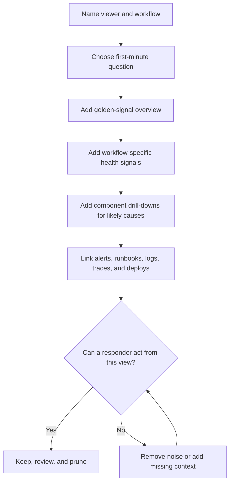

# Dashboards

Dashboards are shared views of operational signals. They help responders,
service owners, and product stakeholders see whether a workflow is healthy,
what changed recently, and where to investigate next.

A good dashboard is not a wall of charts. It is an answer surface for a small
set of operational questions.

Use [Metrics](metrics.md) to choose measurable signals, [Alerting](alerting.md)
to decide which signals interrupt a human, and [SLOs](slos.md) to tie dashboard
views to user-visible reliability targets.

## Purpose

Use dashboard design to answer:

- Is the critical workflow currently healthy?
- Are users seeing errors, slow responses, stale data, or delayed work?
- Which component is the most likely cause of the symptom?
- Did a deploy, migration, dependency issue, traffic spike, or quota change
  line up with the problem?
- Is capacity, cost, or backlog trending toward a limit?
- Which signals belong on an overview, and which belong in a component drill
  down?
- Which charts should be deleted because they are noisy, unused, or
  unactionable?

The goal is to make investigation faster without teaching operators to ignore a
crowded page.

## When This Matters

Dashboard design matters when:

- a workflow has an SLO, alert, runbook, or support expectation;
- the system crosses APIs, databases, queues, caches, search, object storage,
  workers, or external providers;
- incidents require more than one person to share the same view of symptoms and
  likely causes;
- capacity, quota, storage, cost, or backlog trends can become future
  incidents;
- teams already have many charts but cannot answer "are users affected?";
- dashboards are used in design reviews, launch readiness, incident response,
  or post-incident follow-up.

It matters less for a throwaway prototype. Even then, a compact dashboard for
one critical workflow can reveal whether the first operational risks are real.

## Questions To Ask

Start from the decision the viewer needs to make:

- Who is the dashboard for: responder, service owner, product owner, support,
  executive review, or capacity planner?
- What question should the dashboard answer in the first minute?
- Which user-visible workflow or system boundary is in scope?
- Which golden signals show symptoms: traffic, errors, latency, and saturation?
- Which queue age, freshness, correctness, or business signal matters for this
  workflow?
- Which component charts help explain the symptom?
- Which dimensions are safe and useful: route, result class, tenant tier,
  region, dependency, job type, or error class?
- Which links should point to logs, traces, runbooks, alerts, deploy history, or
  related dashboards?
- Which charts would be misleading, high-cardinality, privacy-risky, or only
  decorative?

## Dashboard Design Flow



The flow starts with the viewer because the same metric can belong on different
dashboards for different reasons. A responder needs immediate impact and likely
cause. A capacity planner needs trend, headroom, and growth shape.

## Decision Guidance

### Design Around Dashboard Purpose

Name the dashboard purpose before adding charts.

Common dashboard types:

| Dashboard Type | Purpose | Good First Question |
| --- | --- | --- |
| Workflow overview | Show user-visible health for one important journey | Are users succeeding right now? |
| Incident response | Triage symptom, scope, and likely cause quickly | What changed and where is impact? |
| Component drill-down | Explain behavior of one component | Is this component saturated, failing, or slow? |
| SLO review | Compare reliability target, burn, and causes | Are we consuming the budget too fast? |
| Capacity planning | Show trend and headroom | When will this limit matter? |
| Cost review | Show spend drivers and usage shape | Which usage path is growing cost? |
| Launch readiness | Confirm required operational signals exist | Can we detect and debug the first failure? |

Avoid a dashboard named only after a tool or service if the viewer cannot tell
what decision it supports. "Reservation workflow health" is clearer than
"service-api dashboard" when the goal is user impact.

### Put Golden Signals On The Overview

Golden signals are a compact starting point for service health:

- traffic: how much work is arriving;
- errors: how much work is failing or being rejected;
- latency: how long successful and failed work takes;
- saturation: how close the system is to a useful limit.

These signals are not enough by themselves, but they keep the overview honest.
If a dashboard cannot show request volume, error shape, latency, and the first
likely saturation point, responders will waste time proving basic conditions.

Use workflow-oriented golden signals when possible:

```text
Traffic: valid reservation submissions per minute
Errors: system-error reservations by route and result class
Latency: p50 and p95 reservation submission time
Saturation: API concurrency, database connections, and worker queue age
```

For asynchronous work, include backlog and freshness. A request can return
success while reminders, exports, reconciliation, or provider callbacks are
stuck.

### Add Workflow-Specific Health

Some important failures are not visible in generic service charts.

Add workflow signals such as:

- completed bookings, failed payments, delayed reminders, fulfilled exports, or
  approved reviews;
- oldest queue item age and retry exhaustion for background work;
- stale data age for caches, replicas, search indexes, and derived views;
- conflict rate for inventory, booking, or idempotency-sensitive flows;
- provider success, timeout, rate-limit, and fallback counts;
- tenant, region, branch, or tier health when aggregate metrics hide small but
  important segments;
- cost or quota burn when usage growth can break the workflow.

Workflow health should appear above component detail. A database chart can look
normal while users cannot complete the final step because a provider callback is
failing.

### Use Component Dashboards For Causes

Component dashboards explain likely causes after an overview shows a symptom.
They should be linked from workflow dashboards and alert context.

Useful component drill-downs:

| Component | Useful Charts | Caution |
| --- | --- | --- |
| API | request rate, error class, latency percentiles, concurrency | Do not hide route-level failures inside service-wide averages |
| Database | connection use, query latency, lock waits, replication lag, storage growth | Do not page on every internal warning without user impact |
| Queue or worker | enqueue/dequeue rate, oldest age, retry count, dead letters, worker saturation | Depth alone can mislead when workers drain normally |
| Cache | hit rate, miss latency, eviction rate, stale-read indicators, source load | High hit rate can hide stale or unauthorized data |
| Search index | indexing lag, query latency, failed updates, result freshness | Query success is not enough if results are stale |
| External provider | call volume, latency, timeout rate, quota, fallback use | Separate provider failures from caller bugs |
| Storage or CDN | object count, error rate, latency, bandwidth, cache status, cost | Keep private object names and user data out of labels |

Keep component dashboards close to ownership boundaries. A platform team may
own a database dashboard. A product team still needs a workflow dashboard that
shows whether users are affected by database behavior.

### Make Dashboards Useful During Incidents

Incident dashboards should reduce navigation and argument.

Include:

- the current symptom and recent baseline;
- related deploys, migrations, feature flags, or configuration changes;
- alert status and SLO burn when available;
- top affected routes, tenants, regions, dependencies, or job types;
- links to logs, traces, runbooks, and known rollback or mitigation steps;
- an annotation or marker for incidents, deploys, load tests, and maintenance;
- recovery signals that prove the workflow is healthy again.

Avoid making responders jump through five dashboards to answer one question.
The overview should show impact and point to the most likely drill-down.

### Remove Useless Dashboards

A useless dashboard is a dashboard that looks informative but does not improve
operational decisions.

Common useless dashboards:

- chart dumps generated from every metric with no question or owner;
- dashboards that show only host CPU, memory, and disk for a user-facing
  workflow;
- service averages that hide route, tenant, region, or dependency failures;
- charts with unbounded labels that are slow, expensive, or privacy-risky;
- graphs with no units, thresholds, time window, or explanation;
- dashboards nobody opens during incidents, reviews, or planning;
- dashboards that duplicate alert noise without adding context;
- dashboards that make every line red during normal traffic spikes.

Deletion is a valid dashboard improvement. If a dashboard has no owner, no
decision, and no recent use, either rewrite it around a real question or remove
it.

### Keep Layout Predictable

Put the fastest decision at the top:

1. user-visible health;
2. SLO, alert, or incident status;
3. traffic, errors, latency, and saturation;
4. workflow-specific signals such as queue age, freshness, correctness, or
   business outcome;
5. likely causes by component;
6. links to logs, traces, runbooks, deploys, and related dashboards;
7. longer-term capacity and cost trends.

Use the same layout across related services where possible. Consistency helps a
responder move from one workflow to another under pressure.

## Trade-Offs

| Decision | Benefit | Cost Or Risk |
| --- | --- | --- |
| Workflow dashboard | Shows user impact quickly | Requires careful metric design |
| Component dashboard | Explains likely causes | Can distract from user-visible health |
| One broad overview | Shared incident view | Can become crowded and slow |
| Many focused dashboards | Clear ownership and drill-down | Harder to navigate without links |
| More dimensions | Better scope and routing | Higher cardinality, cost, and privacy risk |
| Fewer dimensions | Cheaper and simpler | Can hide tenant, region, route, or provider impact |
| Aggressive pruning | Keeps dashboards useful | May remove rare diagnostic context too early |
| Long trend windows | Supports planning | Can hide current incidents |
| Short windows | Shows current impact | Can overreact to normal noise |

## Common Mistakes

- Starting from available metrics instead of the viewer's question.
- Treating dashboards as a replacement for alerts, logs, traces, or runbooks.
- Putting component health above workflow health.
- Using averages for latency or error behavior that users experience in the
  tail.
- Hiding low-volume but high-value tenant or region failures in aggregate
  charts.
- Showing queue depth without oldest item age or drain rate.
- Logging or labeling private data so charts become a privacy problem.
- Keeping dashboard pages because they look impressive even though no one uses
  them.
- Showing cost or quota only after it has already caused an incident.
- Building a dashboard that cannot help prove recovery.

## Examples

### Reservation Workflow Overview

A neighborhood equipment library lets residents reserve tools, staff approve
high-value loans, and a worker send pickup reminders.

Dashboard purpose:

```text
Viewer: reservation on-call
Question: are residents able to reserve tools, and where should we look if not?
Scope: reservation submission, approval, reminder enqueue, and provider send
```

Top row:

| Panel | Signal |
| --- | --- |
| Reservation traffic | valid submissions per minute by branch |
| Reservation errors | system errors, conflicts, dependency failures, and validation rejections |
| Reservation latency | p50 and p95 submission latency |
| Saturation | API concurrency, database connection use, and reminder queue age |

Workflow row:

| Panel | Signal |
| --- | --- |
| Booking success | completed reservations and failed attempts |
| Reminder freshness | oldest accepted reminder age and send success |
| Provider health | timeout rate, quota headroom, and fallback count |
| SLO burn | 28-day reservation success budget and short-window burn |

Drill-down links:

- API route dashboard for submission latency and errors;
- database dashboard for lock waits and connection saturation;
- worker dashboard for queue age, retry exhaustion, and dead letters;
- provider dashboard for notification timeout and quota behavior;
- runbook for pausing reminders, retrying failed jobs, and rolling back a bad
  deployment.

This dashboard does not need every host metric. It needs enough evidence to
separate user impact from likely cause.

### Useless Dashboard Rewrite

Original dashboard:

- CPU for every host;
- memory for every host;
- disk for every host;
- one service-wide average latency line;
- one raw error count;
- no owner, thresholds, links, annotations, or workflow context.

Problems:

- it cannot show whether reservations are failing;
- average latency hides slow reservation submissions;
- raw error count mixes validation mistakes with system failures;
- host metrics are useful only after the symptom is known;
- responders still need to search elsewhere for deploys, logs, traces, and
  runbooks.

Rewrite:

- top row shows reservation traffic, system-error rate, p95 latency, and
  reminder queue age;
- second row breaks down failures by route, branch, dependency, and result
  class;
- component links open API, database, worker, and provider drill-downs;
- annotations show deploys and migrations;
- runbook links explain rollback, queue pause, retry, and verification.

The rewritten dashboard answers an operational question. The original only
proved that charts existed.

## Checklist

Before accepting a dashboard design, confirm:

- The viewer, workflow, and first-minute question are named.
- The overview includes traffic, errors, latency, and saturation.
- Workflow-specific signals cover queue age, freshness, correctness, business
  outcome, cost, or quota where relevant.
- Component dashboards explain likely causes and link from workflow views.
- SLO, alert, incident, deploy, and runbook context is visible or one click
  away.
- Dimensions are safe, bounded, and useful for routing or investigation.
- Thresholds, units, time windows, and recovery signals are clear.
- The dashboard can help prove both impact and recovery.
- Useless, duplicate, privacy-risky, or unactionable charts are removed.
- Ownership and review cadence are defined.

## Related Pages

- [Operations overview](./)
- [Metrics](metrics.md)
- [Alerting](alerting.md)
- [SLOs](slos.md)
- [Logs](logs.md)
- [Tracing](tracing.md)
- [Observability basics](observability-basics.md)
- [Performance testing playbook](../scalability/performance-testing-playbook.md)
