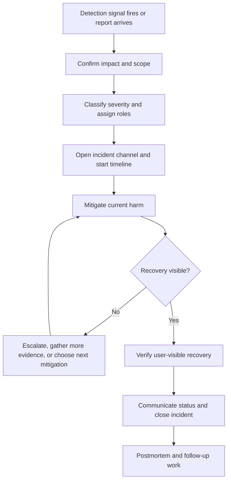

# Incident Response

Incident response is the operating flow a team follows when a system is
hurting users, data, security, reliability, or cost. It turns detection into
triage, mitigation, communication, verification, learning, and follow-up work.

Good incident response is not heroics. It is a repeatable way to reduce harm
while preserving enough evidence to understand what happened.

Use [Alerting](alerting.md) to decide when a human should be interrupted. Use
[Runbooks](runbooks.md) for known procedures. Use [Dashboards](dashboards.md),
[Logs](logs.md), and [Tracing](tracing.md) to gather evidence during response.

## Purpose

Use incident response design to answer:

- How will the team detect a user-visible or operator-visible problem?
- Who triages severity, scope, and ownership?
- What is the safest mitigation while the cause is still uncertain?
- How will responders communicate with users, support, product, security, and
  leadership?
- What proves the incident is mitigated or fully recovered?
- How will the team run a useful postmortem without turning it into blame?
- Which follow-up work prevents recurrence or improves detection and response?

The goal is to reduce time to notice, time to mitigate, and time to learn
without making the system more fragile during the incident.

## When This Matters

Incident response matters when:

- a workflow has an alert, SLO, runbook, support expectation, or launch
  readiness requirement;
- failures can affect active users before support reports arrive;
- bad deploys, migrations, provider outages, quota exhaustion, security events,
  or data issues can create urgent coordination needs;
- a queue, worker, cache, replica, derived view, or external provider can fail
  silently or partially;
- communication matters as much as the technical fix;
- repeated incidents are consuming engineering time without durable follow-up;
- the design review needs to show how version 1 will be operated, not only how
  it will be built.

It matters less for experiments with no real users or data. Even then, naming
the first response trigger helps the team know when the prototype has become a
system that needs operational discipline.

## Questions To Ask

Start from the impact:

- What would tell us users, data, security, reliability, or cost are at risk?
- Which signals detect the issue: alert, dashboard, support report, audit
  event, synthetic check, SLO burn, or provider notice?
- How do we classify severity and avoid underreacting or overreacting?
- Who coordinates, who investigates, who communicates, and who approves risky
  action?
- Which mitigation can reduce harm before root cause is known?
- Which runbook, rollback path, feature flag, degradation mode, or traffic
  control should be tried first?
- Which stakeholders need updates, how often, and with what level of detail?
- What evidence must be saved for postmortem and follow-up?
- What is the recovery check from the user's point of view?

## Incident Response Flow



The flow favors mitigation before perfect explanation. Root cause matters, but
users benefit first from reduced impact and clear communication.

## Decision Guidance

### Detect From Symptoms And Durable Events

Detection should start from user-visible symptoms and durable risk signals.
Component warnings are useful, but they should not be the only way the team
learns about impact.

Useful detection sources:

| Source | What It Catches | Risk |
| --- | --- | --- |
| Symptom alert | Errors, latency, stale data, queue age, SLO burn, quota burn | Can miss small but important segments if aggregation is weak |
| Support report | Real user pain and product context | Often arrives after impact has already grown |
| Dashboard review | Trend, capacity, backlog, or cost drift | Depends on someone looking at it |
| Audit or security event | Privileged action, abuse, policy violation, data-risk event | Needs careful routing and privacy handling |
| Synthetic check | Known workflow failure from outside the system | Can miss tenant-specific or data-specific failures |
| Provider notice | Upstream outage, maintenance, quota, or degraded region | May not match local user impact |

Design detection so a critical workflow does not rely on one signal. A checkout
or reservation path might need a symptom alert, a provider-failure dashboard,
structured logs, and a support escalation path.

### Triage Severity And Scope

Triage decides how urgent the incident is and who needs to join. It should be
fast, explicit, and revisited when evidence changes.

Classify:

- affected workflow;
- affected users, tenants, regions, clients, or job types;
- impact type: unavailable, slow, stale, incorrect, delayed, duplicated,
  private, insecure, or costly;
- severity level and expected response time;
- data integrity or security risk;
- current mitigation status;
- next decision needed.

Compact severity model:

| Severity | Meaning | Response |
| --- | --- | --- |
| SEV1 | Broad user impact, data loss risk, security risk, or critical workflow unavailable | Page owners, open incident channel, assign coordinator, communicate frequently |
| SEV2 | Important workflow degraded, segment-specific outage, delayed critical background work | Page service owner, mitigate, update stakeholders |
| SEV3 | Limited impact or workaround exists | Create urgent ticket, monitor, communicate to affected teams |
| SEV4 | Low-risk anomaly or follow-up from near miss | Track as normal work |

Severity can move up or down. A small incident affecting a high-value tenant,
security boundary, or irreversible data path may deserve a higher response than
aggregate traffic suggests.

### Assign Roles Early

Incidents become slower when everyone investigates and nobody coordinates.

Useful roles:

| Role | Responsibility |
| --- | --- |
| Incident coordinator | Owns severity, timeline, handoffs, next decision, and closure |
| Technical lead | Directs diagnosis and mitigation options |
| Responder | Runs checks, applies safe mitigations, gathers evidence |
| Communications lead | Sends internal and external updates |
| Service owner | Approves risky rollback, data repair, failover, or degradation |
| Support or product lead | Tracks user reports, customer messaging, and product trade-offs |
| Security or data lead | Joins when privacy, abuse, audit, or integrity risk exists |

Small teams can combine roles, but they should still name the duties. During a
SEV1, the person coordinating should not also be the only person debugging the
hardest technical path.

### Mitigate Before Root Cause Is Perfect

Mitigation reduces current harm. It should be chosen from evidence, but it does
not require a complete root-cause analysis.

Common mitigation choices:

- roll back a recent deploy or configuration change;
- disable a feature flag or risky workflow path;
- pause producers so queues stop growing;
- scale workers or capacity for a known saturation issue;
- route around a degraded dependency;
- enable fallback behavior or degraded mode;
- shed low-priority traffic;
- stop retry storms or expensive fanout;
- freeze risky deploys while the incident is active;
- communicate a workaround or delay when technical recovery will take time.

Choose the least risky mitigation that reduces user harm. If a rollback may
break schema compatibility or duplicate work, pause the workflow and escalate
before making the damage worse.

### Communicate With Precision

Communication is part of incident response, not a task after the fix.

Good incident updates include:

- current status;
- affected workflow and scope;
- user-visible impact;
- mitigation in progress;
- next update time;
- what users or support should do now;
- what is known, unknown, and not yet safe to claim.

Example internal update:

```text
Status: investigating SEV2 reservation reminder delay.
Impact: pickup reminders are delayed for three branches; reservations still work.
Mitigation: non-critical reminder jobs paused; worker queue age is falling.
Next update: 20 minutes.
Need: provider quota check and confirmation from branch support.
```

Avoid speculation in user-facing communication. It is better to say "we are
investigating delayed reminders" than to blame a provider before evidence is
clear.

### Verify Recovery

Recovery means the user-visible promise is working again and temporary risk is
understood.

Verify:

- original symptom has cleared for the recovery window;
- a valid user workflow succeeds end to end;
- error rate, latency, queue age, stale-data age, or SLO burn is back within an
  acceptable range;
- logs and traces show representative success;
- dependency behavior is normal or a fallback is intentionally active;
- delayed work has drained or is tracked;
- data repair or reconciliation has confirmed no missing, duplicated, or
  inconsistent work;
- temporary mitigations, suppressions, feature disables, or manual overrides
  are removed or assigned to follow-up;
- support knows what to tell affected users.

Do not close an incident only because the first chart turned green. If users
still need retry guidance, data still needs reconciliation, or a queue is still
draining, record the system as mitigated but not fully recovered.

### Run Useful Postmortems

A postmortem should improve the system, not find someone to blame.

Write down:

- timeline from detection to closure;
- what detected the incident and what missed it;
- user impact, duration, and affected scope;
- contributing technical and organizational factors;
- mitigations tried and their results;
- communication gaps;
- what made response slower or easier;
- follow-up actions with owners and due dates.

Useful questions:

- Why did detection happen when it did?
- Why did the first mitigation work or fail?
- Which assumption in the design was wrong?
- Which dashboard, log, trace, runbook, or alert was missing?
- Which manual step should be automated or rehearsed?
- Which follow-up is necessary, and which would be overengineering?

Keep the postmortem specific. "Improve monitoring" is not a follow-up. "Add
oldest reminder age alert with branch dimension and runbook link" is.

### Turn Learning Into Follow-Up Work

Follow-up work should reduce recurrence, reduce blast radius, or improve future
response.

Common follow-up categories:

| Category | Examples |
| --- | --- |
| Detection | add symptom alert, tune threshold, add SLO burn view, add synthetic check |
| Diagnosis | add dashboard panel, log reason code, trace dependency call, add correlation ID |
| Mitigation | add feature flag, rollback checklist, degraded mode, queue pause switch |
| Prevention | fix bug, add test, change schema rollout, add idempotency, reduce retry storm |
| Recovery | add replay tool, reconciliation job, audit check, repair verification |
| Communication | update support macro, status template, escalation policy |
| Practice | rehearse rollback, run game day, review runbook owner and route |

Follow-up must be prioritized against product work. Not every incident justifies
multi-region failover or a new platform. The right action is the smallest
change that meaningfully reduces the next risk.

## Trade-Offs

| Decision | Benefit | Cost Or Risk |
| --- | --- | --- |
| Page early | Reduces time to notice | Can create fatigue if severity is too broad |
| Wait for confirmation | Avoids false alarms | Can let impact grow |
| Roll back quickly | Often reduces user impact | Unsafe if data or schema compatibility changed |
| Degrade gracefully | Keeps core workflow available | Requires design work before the incident |
| Communicate frequently | Builds trust and coordination | Can distract responders without a communications role |
| Full postmortem | Captures learning | Heavyweight for low-impact incidents |
| Lightweight review | Fast and practical | Can miss systemic causes |
| Many follow-ups | Addresses several weaknesses | Can overwhelm the team and never finish |
| Few follow-ups | Focuses execution | May leave repeated failure modes untouched |

## Common Mistakes

- Treating detection as only a pager alert and ignoring support reports,
  dashboards, audit events, or provider notices.
- Debating root cause while users are still affected and no mitigation is
  active.
- Letting severity stay fixed after new evidence changes the scope.
- Having no clear coordinator, so several responders duplicate work.
- Rolling back without checking migration, queue, cache, or data compatibility.
- Communicating certainty before the evidence supports it.
- Closing the incident when one metric recovers but delayed work or data repair
  remains.
- Writing a postmortem that has vague follow-ups without owners.
- Creating follow-up work that is larger than the risk justifies.
- Repeating the same incident because runbooks, alerts, or ownership were not
  updated.

## Example

A neighborhood equipment library lets residents reserve tools, staff approve
high-value loans, and a worker send pickup reminders.

Incident:

```text
Alert: reminder_queue_age_high
Impact: pickup reminders are delayed for four branches.
Initial severity: SEV2 because reservations still work, but users may miss pickup windows.
```

Response flow:

| Step | Decision |
| --- | --- |
| Detection | Alert fires when oldest accepted reminder is older than 10 minutes for 5 minutes |
| Triage | Reservation on-call confirms queue age, affected branches, provider timeout rate, and recent worker deploy |
| Roles | Service owner coordinates; worker engineer investigates; support lead prepares branch update |
| Mitigation | Pause non-critical reminders and scale worker pool while checking provider quota |
| Communication | Internal update every 20 minutes; support tells branches to check pending pickup list manually |
| Verification | Queue age below 5 minutes for 15 minutes, no new dead letters, provider success normal, sample reservation receives reminder |
| Postmortem | Timeline shows provider quota warning existed on a dashboard but had no alert or runbook link |
| Follow-up | Add quota burn alert, add runbook dependency check, add branch-level reminder delay dashboard panel |

Rejected response:

- replay every delayed reminder immediately, because duplicates could confuse
  residents until idempotency is confirmed;
- declare recovery when the provider succeeds once, because queue age and dead
  letters still need verification;
- build a new notification platform, because a quota alert and runbook update
  are the proportional first fixes.

The response reduces current harm, communicates a workaround, verifies user
recovery, and turns the learning into focused follow-up work.

## Checklist

Before accepting an incident response design, confirm:

- Detection sources cover alerts, dashboards, support reports, audit or security
  events, SLO burn, and provider notices where relevant.
- Severity levels define impact, response expectations, and escalation.
- Roles cover coordination, technical investigation, communication, ownership,
  support/product, and security/data when needed.
- Triage identifies affected workflow, scope, user impact, data risk, and next
  decision.
- Mitigation options include rollback, feature disablement, degradation, queue
  pause, capacity change, dependency fallback, or traffic shedding where
  relevant.
- Communication templates include status, scope, user impact, mitigation, next
  update time, and known unknowns.
- Recovery checks prove the user-visible workflow works again.
- Delayed work, data repair, temporary suppressions, and manual overrides are
  tracked before closure.
- Postmortems capture timeline, detection gaps, contributing factors,
  mitigation results, communication gaps, and follow-up owners.
- Follow-up work is specific, owned, and proportional to the risk.
- Runbooks, alerts, dashboards, logs, traces, and ownership are updated when the
  incident reveals a gap.

## Related Pages

- [Operations overview](./)
- [Alerting](alerting.md)
- [Runbooks](runbooks.md)
- [Dashboards](dashboards.md)
- [Metrics](metrics.md)
- [Logs](logs.md)
- [Tracing](tracing.md)
- [SLOs](slos.md)
- [Audit logs](../security/audit-logs.md)
- [Third-party integrations](../security/third-party-integrations.md)
- [Retries](../reliability/retries.md)
- [Graceful degradation](../reliability/graceful-degradation.md)
- [Failure-mode analysis](../reliability/failure-mode-analysis.md)
