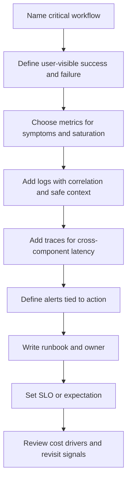

# Operations

Operations is the part of system design that asks how a team will notice,
diagnose, repair, and pay for the system after the happy path is implemented.
It turns "we will monitor it" into concrete signals, ownership, runbooks,
service objectives, and cost trade-offs.

Good operational design starts while choosing APIs, data stores, queues,
caches, and external dependencies. If a design cannot explain how operators
debug one user-visible failure, roll back a bad deployment, notice saturation,
or control cost growth, the architecture is not ready.

## Purpose

Use this overview to decide:

- which metrics, logs, traces, dashboards, and alerts are needed for critical
  workflows;
- which identifiers let operators debug one request, user, tenant, resource,
  job, or integration;
- which runbooks explain mitigation, rollback, repair, and verification;
- which SLOs or service expectations are tied to user-visible behavior;
- which cost awareness signals should shape version 1 and future scaling
  decisions;
- what should be observable before launch instead of added after incidents.

The goal is not to instrument everything. The goal is to collect the evidence
needed to answer operational questions without drowning the team in noise,
sensitive data, or unnecessary cost.

## When This Matters

Operations changes the architecture when:

- a workflow is important enough that someone must know when it fails;
- a system crosses service, queue, database, cache, vendor, or region
  boundaries;
- background jobs can stall, retry, duplicate work, or accumulate backlog;
- deployments, migrations, imports, exports, or admin tools can affect many
  users;
- users, tenants, partners, or support teams need status and recovery
  expectations;
- infrastructure, managed services, storage, bandwidth, analytics, logs, or
  external APIs can become meaningful cost drivers.

For a small prototype, operational design may be a short checklist. For a
shared production system, operations belongs in the first design pass because it
changes component boundaries, data models, failure behavior, and cost.

## Questions To Ask

Start with the workflow and failure mode:

- What user-visible outcome matters most?
- What does success, partial success, degraded mode, and failure look like?
- Which metric shows the symptom before users report it?
- Which log event or audit record explains one affected request or resource?
- Which trace shows where time was spent across components?
- Which alert pages a human, and which signal is only useful on a dashboard?
- Which runbook tells the responder what to check, mitigate, roll back, and
  verify?
- Which SLO, target, or expectation says when reliability is good enough?
- Which cost grows with users, requests, data, tenants, fanout, or retention?
- What can be removed from version 1 because it adds operational surface without
  protecting a real workflow?

## Operations Review Flow



## Decision Guidance

### Tie Signals To Workflows

Operational signals should start from the workflow, not the tool.

Use this format:

```text
Workflow: <what the user or operator is trying to do>
Symptom metric: <what shows user-visible health>
Debug context: <request, user, tenant, resource, job, or trace ID>
Failure signal: <error, timeout, queue age, stale data, denied action, cost spike>
Runbook owner: <team or role responsible for first response>
```

For example, "reservation approval works" is not directly observable. Better:
track approval request rate, error rate, latency, queue age for reminder jobs,
duplicate-submission suppression, and audit events for staff approval decisions.

### Use Metrics For Trends And Alerts

Metrics are aggregated measurements. They are useful for symptoms, capacity,
saturation, and alerting because they can be counted, graphed, and compared over
time.

Useful metric categories:

- request rate, error rate, and latency for APIs;
- saturation such as CPU, memory, database connections, worker concurrency, and
  queue depth;
- backlog and age for queues, outboxes, imports, exports, and dead-letter
  records;
- cache hit rate and stale-read indicators;
- dependency timeouts, retry count, circuit breaker state, and provider quota
  usage;
- business health signals such as successful bookings, failed payments, delayed
  reminders, or approval throughput;
- cost signals such as storage growth, bandwidth, log volume, provider calls,
  and always-on capacity.

Metrics should not require raw sensitive data. Prefer dimensions such as route,
tenant ID, provider name, result class, and error class over full payloads or
private values.

### Use Logs For Debugging One Event

Logs are structured events that explain what happened at a point in time. They
are most useful when an operator needs to debug one request, one resource, one
job, or one user report.

Good operational logs include:

- timestamp, service, environment, and route or command name;
- request ID, trace ID, job ID, tenant ID, resource ID, or correlation ID;
- result class such as allowed, denied, retrying, failed, skipped, or completed;
- error class and safe reason code;
- small safe context needed for debugging;
- no secrets, tokens, passwords, private notes, raw payloads, or unnecessary
  personal data.

Logs should be sampled, retained, and protected deliberately. Logging every
field can create privacy risk and cost. Logging too little makes incidents
unrepairable.

### Use Traces For Cross-Component Work

Traces connect the spans of one request, job, or workflow across components.
They are useful when latency or failure can happen in several places.

Trace when:

- a user request calls multiple services or dependencies;
- a write path includes database work, queue publication, and provider calls;
- a background job fans out to several resources;
- a slow dependency can consume the request's deadline;
- operators need to compare time spent in API, database, cache, queue, and
  vendor calls.

Traces should carry correlation IDs across boundaries. They should also respect
the same privacy rules as logs: do not attach raw request bodies, secrets, or
full user data as span attributes.

### Design Alerts Around Action

An alert should page a person only when a timely human action is needed. If no
one knows what to do when the alert fires, the system needs a runbook or a
better signal.

Good alerts are usually symptom-based:

- user-facing error rate is above a threshold;
- latency exceeds a user-visible target;
- queue age is beyond the workflow's freshness expectation;
- a critical dependency is failing and fallback is exhausted;
- data reconciliation or restore verification failed;
- cost or quota burn rate will exhaust a budget soon.

Avoid alerts that only say a host is busy when users are fine, or alerts that
fire on every short blip. Keep detailed component metrics available on
dashboards, but reserve pages for user impact, data risk, security risk, or
fast-growing cost.

### Write Runbooks Before Incidents

A runbook is a short operational guide for a known failure or maintenance task.
It should be specific enough that a responder can act without guessing.

Useful runbook sections:

- symptom and alert name;
- likely causes;
- first checks and dashboards;
- mitigation steps;
- rollback or disable path;
- data repair or reconciliation steps;
- customer, tenant, or stakeholder communication notes when needed;
- verification that the system recovered;
- owner and escalation path.

Runbooks are part of the design for risky workflows. A rare manual repair can
be acceptable in version 1 if ownership, auditability, and verification are
clear.

### Use SLOs To State Reliability Expectations

An SLO, or service level objective, states how reliable a user-visible behavior
should be over a time window. It is useful when the team needs to decide whether
to spend more complexity on reliability or accept a simpler version 1.

Start with workflow-oriented statements:

```text
Residents can submit reservation requests successfully for 99.5% of valid
attempts measured over 30 days.

Staff approval pages load within the target latency for 95% of requests during
branch operating hours.

Reminder delivery can be delayed, but 99% of accepted reminders should leave the
queue within 10 minutes.
```

Not every internal component needs its own SLO. Use SLOs where user trust,
business impact, support load, or operational trade-offs justify the discipline.

### Keep Cost Awareness Visible

Cost is an operational signal, not only a finance concern. Many architecture
choices move cost between compute, storage, bandwidth, managed services,
external APIs, observability, and human labor.

Review cost drivers:

- always-on compute and idle reserved capacity;
- database size, indexes, replicas, backups, and restore testing;
- queue retention, dead-letter storage, and replay windows;
- log, metric, trace, audit, and analytics volume;
- external API calls, notifications, searches, payments, or webhooks;
- bandwidth, object storage, CDN, and export traffic;
- operational labor for on-call, manual review, incident response, and data
  repair.

Version 1 should be cost-aware without becoming prematurely optimized. The best
design is often the one that can measure cost growth and name the signal that
would justify more complexity later.

### Keep Version 1 Practical

A practical version 1 might include:

- one dashboard for the critical workflow;
- request rate, error rate, latency, and saturation metrics for the API;
- queue depth and oldest job age for background work;
- structured logs with request ID, tenant ID, resource ID, and safe reason
  codes;
- traces for the one workflow that crosses several dependencies;
- alerts tied to user impact, stuck work, data risk, or quota exhaustion;
- runbooks for rollback, stuck queues, failed provider calls, and data repair;
- one or two workflow SLOs rather than a target for every component;
- cost checks for storage growth, log volume, external API calls, and idle
  capacity.

Revisit when the system adds more tenants, stricter reliability expectations,
larger data retention, more external providers, higher on-call load, or cost
growth that changes product decisions.

## Trade-Offs

| Decision | Benefit | Cost Or Risk |
| --- | --- | --- |
| More metrics | Better trend and alert visibility | More dashboards and cardinality to manage |
| More logs | Easier single-event debugging | Higher storage cost and privacy risk |
| Detailed traces | Clear latency and dependency breakdown | Extra instrumentation and data volume |
| Symptom-based alerts | Pages humans for user impact | May miss early component trouble if dashboards are weak |
| Component alerts | Earlier technical signal | Can create alert fatigue without clear action |
| Manual runbook | Fast enough for rare failures | Depends on ownership, training, and rehearsal |
| Automated repair | Faster recovery for common failures | Can make bad assumptions faster if poorly tested |
| Strict SLO | Clarifies reliability investment | Can force cost or complexity before the product needs it |
| Cost-aware version 1 | Avoids expensive unused machinery | Requires revisiting when growth changes assumptions |

## Common Mistakes

- Adding "monitoring" as a final checkbox instead of designing signals around
  workflows.
- Measuring only servers and not user-visible success, queue age, dependency
  health, or business outcomes.
- Logging full request bodies, secrets, tokens, or private user data for
  convenience.
- Alerting on every component warning instead of actionable symptoms.
- Creating dashboards that no runbook or incident flow uses.
- Setting an SLO for a component without explaining the user-visible behavior it
  protects.
- Ignoring the cost of logs, traces, indexes, backups, retained events, and
  external API calls.
- Accepting manual repair without owner, audit trail, and verification.
- Making version 1 operationally complex before measuring the actual risk.

## Example

A neighborhood equipment library lets residents reserve tools, staff approve
high-value loans, and a worker send pickup reminders.

Operational design:

| Concern | Decision |
| --- | --- |
| Metrics | Track reservation request rate, approval error rate, approval latency, reminder queue age, provider timeout count, and branch-level approval volume. |
| Logs | Include request ID, reservation ID, branch ID, actor ID, command name, result class, and safe reason code. Do not log borrower contact details or full reminder payloads. |
| Traces | Trace reservation approval through API validation, authorization, database write, outbox insert, and reminder job enqueue. |
| Alerts | Page when approval errors affect residents, reminder queue age exceeds the freshness target, or provider failures exhaust the retry budget. Use dashboards for lower-priority saturation. |
| Runbooks | Document rollback for a bad approval deployment, how to pause reminders, how to retry failed jobs, and how to reconcile stuck reservations. |
| SLOs | Reservation submission has a stricter target than reminder delivery. Reminders may be delayed as long as staff can see pending work. |
| Cost | Watch reminder provider calls, log volume, backup growth, and idle worker capacity before adding more always-on workers. |

Rejected for version 1:

- a dashboard for every table and worker, because the first operational risk is
  the reservation workflow;
- a page for every warning metric, because alerts should map to action;
- long retention for full debug logs, because audit events and safe summaries
  carry the necessary accountability with lower privacy and cost risk.

The design is small, but it gives operators enough evidence to answer "what
happened to this reservation?" during a real incident.

## Checklist

Before accepting an operations design, confirm:

- Critical workflows and user-visible success states are named.
- Metrics cover request rate, errors, latency, saturation, queue age, dependency
  health, and business outcomes where relevant.
- Logs include correlation IDs and safe context without secrets or sensitive
  payloads.
- Traces cover cross-component paths where latency or failure can hide.
- Alerts are tied to symptoms, user impact, data risk, quota exhaustion, or cost
  burn that requires action.
- Runbooks name owner, first checks, mitigation, rollback, repair, escalation,
  and verification.
- SLOs or reliability expectations are tied to workflows, not vague component
  uptime.
- Cost drivers include compute, storage, bandwidth, managed services,
  observability volume, provider calls, and operational labor.
- Version 1 keeps instrumentation focused on the risks that are most likely to
  matter.
- Related reliability, security, data, scalability, and communication decisions
  have enough operational evidence to debug and repair them.

## Operations Pages

Current pages:

- [Operations overview](./)
- [Observability basics](observability-basics.md)

Planned pages:

- `docs/operations/metrics.md`: request rate, errors, latency, saturation,
  queue depth, cache hit rate, and business metrics.
- `docs/operations/logs.md`: structured logs, correlation IDs, sensitive data,
  log volume, and debugging usefulness.
- `docs/operations/tracing.md`: distributed traces, spans, propagation, latency
  breakdowns, and dependency visibility.
- `docs/operations/alerting.md`: symptom-based alerts, alert fatigue,
  thresholds, paging, and escalation.
- `docs/operations/slos.md`: SLIs, SLOs, error budgets, and reliability
  trade-offs.
- `docs/operations/dashboards.md`: dashboard purpose, golden signals,
  component dashboards, and useless dashboards.
- `docs/operations/runbooks.md`: incident steps, ownership, rollback,
  dependency checks, verification, and templates.
- `docs/operations/incident-response.md`: detection, triage, mitigation,
  communication, postmortems, and follow-up work.
- `docs/operations/capacity-planning.md`: growth trends, utilization,
  saturation, headroom, and scaling triggers.
- `docs/operations/cost-analysis.md`: compute, storage, bandwidth, managed
  services, overprovisioning, and cost trade-offs.
- `docs/operations/component-metrics-catalog.md`: metrics for APIs, databases,
  caches, queues, workers, search, CDN, and object storage.

These paths become linked pages as their tickets are completed.

## Related Pages

- [System design process](../method/system-design-process.md)
- [Design review checklist](../method/design-review-checklist.md)
- [Functional vs non-functional requirements](../method/functional-vs-nonfunctional-requirements.md)
- [Reliability](../reliability/)
- [Failure-mode analysis](../reliability/failure-mode-analysis.md)
- [Retries](../reliability/retries.md)
- [Security design](../security/)
- [Third-party integrations](../security/third-party-integrations.md)
- [Communication patterns](../communication/)
- [Scalability](../scalability/)
- [Data decisions](../data/)
- [Glossary](../glossary.md)

Return to the [documentation index](../).
