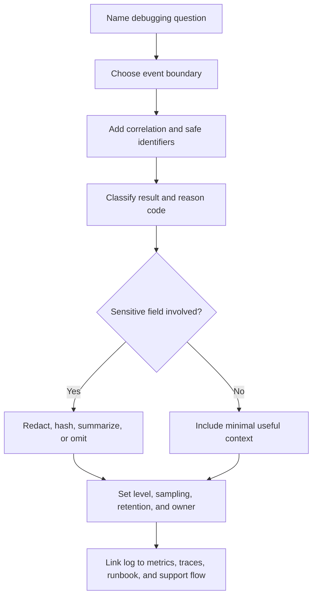

# Logs

Logs are structured records of events that happened inside a running system.
They help a responder debug one request, job, resource, tenant, or dependency
call after a metric or user report says something is wrong.

Good logs are not a transcript of every payload. They are compact evidence:
what action was attempted, which safe identifiers connect the event to the rest
of the system, what result happened, and what a responder should inspect next.

Use [Observability basics](observability-basics.md) to decide which workflows
need operational evidence. Use [Audit logs](../security/audit-logs.md) when the
main question is accountability for sensitive or privileged actions.

## Purpose

Use logging design to answer:

- What happened for one request, job, message, resource, or tenant?
- Which safe identifiers connect the log to metrics, traces, jobs, and support
  reports?
- Which error class, decision, dependency, or state transition explains the
  outcome?
- Which fields must never be logged?
- How much log volume is useful before the system becomes noisy, expensive, or
  risky?
- Which log event would help a responder debug the next incident faster?

The goal is to make debugging possible without turning logs into a privacy
liability or a high-cost data lake of low-value messages.

## When This Matters

Logging design matters when:

- support or operations must answer "what happened to this request?";
- a workflow crosses API, database, cache, queue, worker, service, or provider
  boundaries;
- background jobs can retry, skip, duplicate, or dead-letter work;
- external dependencies can timeout, rate limit, return ambiguous results, or
  charge per call;
- authorization, validation, idempotency, or rate-limit decisions need safe
  explanations;
- incidents have been hard to debug from metrics alone;
- log volume, sensitive data exposure, or retention cost could become a design
  risk.

It matters less when a prototype has no real users, no support workflow, and no
multi-step paths. Even then, a few structured logs with request IDs can prevent
early debugging from becoming guesswork.

## Questions To Ask

Start from the debugging question:

- What user-visible or operator-visible problem would trigger a log search?
- Which identifier would the responder have: request ID, trace ID, user ID,
  tenant ID, resource ID, job ID, message ID, idempotency key, or provider ID?
- Which event boundaries matter: request accepted, authorization decision,
  validation result, state transition, dependency call, retry, enqueue,
  completion, or failure?
- What safe context explains the event without exposing private payloads?
- Which errors need stable reason codes instead of free-form messages?
- Which logs should be sampled, summarized, or emitted only on result changes?
- How long should debug logs be retained compared with audit events?
- Which logs must support an incident runbook or support lookup?

## Logging Design Flow



The flow starts from a question because logs without a debugging purpose become
noise. A log line that cannot be used during a support case, incident, or
post-incident analysis should be challenged.

## Decision Guidance

### Use Structured Logs

Structured logs use stable fields instead of unparseable prose. They let
responders filter, group, and join events without guessing how a string was
formatted.

Prefer fields such as:

| Field | Why It Helps | Example |
| --- | --- | --- |
| `timestamp` | Orders events | `2026-06-01T12:14:09Z` |
| `service` | Identifies emitter | `reservation-api` |
| `environment` | Separates production, staging, and local | `production` |
| `event` | Names the event boundary | `reservation.submit.completed` |
| `level` | Indicates severity or purpose | `info`, `warn`, `error` |
| `result` | Groups outcomes | `completed`, `denied`, `retrying`, `failed` |
| `reason_code` | Explains safe cause | `slot_conflict`, `provider_timeout` |
| `request_id` | Finds one synchronous request | `req_8f31` |
| `trace_id` | Follows distributed work | `trace_5b2d` |
| `tenant_id` | Scopes impact safely | `branch_17` |
| `resource_id` | Finds the affected object | `reservation_884` |
| `job_id` | Connects async work | `job_7ac0` |
| `duration_ms` | Explains slow events | `418` |

Keep free-form messages short and secondary. The fields should carry the
meaning. For example, `result=denied` and `reason_code=policy_limit_exceeded`
are easier to search and count than a message that says "user cannot reserve
more tools today."

### Add Correlation IDs

Correlation IDs connect logs from different parts of the workflow. Without
them, responders must guess whether several events belong to the same user
action.

Common identifiers:

- `request_id` for one inbound API or web request;
- `trace_id` for work that crosses services, dependencies, and queues;
- `tenant_id`, account ID, or organization ID for impact scoping;
- `resource_id` for the user-visible object;
- `job_id` or `message_id` for background work;
- `idempotency_key` for retried writes where safe;
- provider request, receipt, or webhook ID for external integrations.

Propagate correlation across boundaries:

```text
request accepted -> database write -> outbox event -> worker job -> provider call
```

Each boundary should log the same trace or correlation value plus its own local
identifier. If the provider returns a receipt, store a safe provider reference
so the team can reconcile ambiguous outcomes later.

Do not use secrets, access tokens, session cookies, full email addresses, phone
numbers, or raw payloads as correlation values. Use stable IDs, masked values,
or hashes only when the privacy and debugging trade-off is explicit.

### Log Event Boundaries, Not Every Line Of Code

Good logs mark meaningful boundaries. They explain the state of the workflow,
not the internal path through every helper function.

Useful event boundaries:

- request accepted, rejected, completed, or failed;
- authorization allowed or denied with a safe reason code;
- validation failed with a stable category;
- state transition attempted and completed;
- database write conflict, retry, or timeout;
- job enqueued, started, retried, completed, skipped, or dead-lettered;
- dependency call started only when needed, then completed, timed out, or
  returned an ambiguous result;
- fallback, degradation, rate-limit, or circuit-breaker decision;
- manual repair or operator-triggered action when it is not audit-only.

Avoid logs that only say "entering function" or "got here." They increase
volume without telling a responder what changed or what decision was made.

### Keep Sensitive Data Out

Logs are often copied, searched, retained, exported, and viewed by more people
than the primary database. Treat them as a separate data exposure surface.

Do not log:

- passwords, tokens, session cookies, API keys, private keys, or secrets;
- full request or response bodies by default;
- payment card data, credentials, government IDs, or raw identity documents;
- private notes, messages, addresses, phone numbers, or emails unless a masked
  or hashed value is explicitly justified;
- authorization headers, signed URLs, reset links, or invite links;
- large file contents or uploaded documents;
- data a user has deleted unless retention policy explicitly allows it.

Safer alternatives:

- stable internal ID instead of personal data;
- masked value such as `email_domain=example.org` or `phone_last4=1234` only
  when useful and allowed;
- `field_changed=true` instead of old and new sensitive values;
- error class and reason code instead of raw exception text containing payloads;
- count, size, or category instead of full payload.

Sensitive-data rules should apply to logs, traces, metrics labels, dashboards,
screenshots, and exported incident notes.

### Manage Log Volume

Log volume is an operational cost and a debugging risk. Too many logs make it
hard to find the important event, increase storage and indexing cost, and can
slow systems during incidents.

Control volume by design:

- log one clear event per important boundary rather than repeated internal
  progress messages;
- use `debug` logs locally or for short diagnostic windows, not as permanent
  production noise;
- sample high-volume successful reads if they are not needed for support;
- keep errors, denials, retries, dead letters, and state transitions complete
  enough to investigate;
- aggregate routine counts into metrics instead of repeating identical logs;
- cap payload sizes and array lengths in log fields;
- avoid high-cardinality free-form labels when logs are indexed;
- define retention by log type and investigation need.

Volume controls should not hide rare high-risk events. A single denied admin
action, failed provider callback, or dead-lettered payment job may matter even
when successful requests are sampled.

### Make Logs Useful For Debugging

A useful log answers one narrow question quickly. It should help a responder
move from "something is wrong" to "this is the affected object and likely
cause."

For each critical workflow, make sure logs support:

- support lookup by request, resource, tenant, job, or provider reference;
- incident scoping by result class, reason code, route, dependency, or tenant;
- connection to metrics and traces through shared identifiers;
- reconstruction of important state transitions without reading raw payloads;
- comparison with recent deploys, migrations, config changes, or feature flags;
- verification that mitigation or retry completed.

Example useful event:

```text
event=reservation.submit.completed
result=failed
reason_code=slot_conflict
request_id=req_8f31
trace_id=trace_5b2d
tenant_id=branch_17
resource_id=slot_401
actor_type=resident
duration_ms=418
attempt=1
```

This event is useful because it says which workflow failed, why it failed, what
object was involved, and which trace or request to follow. It does not expose
the resident's name, contact details, or request payload.

### Separate Operational Logs From Audit Logs

Operational logs explain behavior during debugging. Audit logs provide
accountability for important actions. They may share identifiers, but they have
different retention, access, integrity, and completeness requirements.

Use operational logs for:

- request and job debugging;
- dependency timeouts and retries;
- safe error context;
- state transitions needed for repair;
- short-term incident investigation.

Use audit logs for:

- privileged reads or changes;
- role, permission, membership, approval, export, deletion, and impersonation
  events;
- durable records of who changed what and why;
- tamper-resistance, access review, and longer retention decisions.

Do not rely on noisy debug logs as the only audit trail. Do not turn audit logs
into high-volume debug traces.

## Trade-Offs

| Choice | Benefit | Cost |
| --- | --- | --- |
| Structured logs | Searchable, filterable, easier to join with traces and metrics | Requires field naming discipline |
| Free-form messages | Fast to write during early development | Hard to query and easy to make inconsistent |
| More context | Speeds debugging when fields are safe and relevant | Increases privacy, volume, and retention risk |
| More sampling | Controls cost for high-volume success paths | Can hide rare successes or low-frequency patterns |
| Longer retention | Helps slow investigations and trend analysis | Increases cost and exposure window |
| Shorter retention | Reduces cost and privacy risk | May lose evidence before support cases are investigated |
| Raw exception text | Quick clue during development | Can leak payloads or secrets and create noisy groups |
| Stable reason codes | Better grouping and safer dashboards | Requires mapping errors deliberately |

Use the least data that can answer the debugging question reliably.

## Common Mistakes

- Logging full request bodies to make debugging easier.
- Using logs as the only metric source for high-volume system health.
- Emitting unstructured messages that cannot be filtered by workflow, result,
  tenant, resource, or dependency.
- Creating a new request ID inside each service instead of propagating one
  correlation path.
- Logging user-facing error text but not stable internal reason codes.
- Sampling away failures, retries, denials, or dead-letter events.
- Keeping debug logging permanently enabled in production.
- Ignoring log volume until storage, indexing, or incident search becomes
  expensive.
- Treating ordinary application logs as a durable audit trail.
- Adding sensitive values to logs and hoping access control is enough.

## Example

A neighborhood equipment library lets residents reserve tools. A resident
reports that a reservation appeared to fail, but later they received a reminder
email.

Debugging question:

```text
What happened to reservation request req_8f31?
```

Useful log events:

| Event | Key Fields | Why It Helps |
| --- | --- | --- |
| `reservation.submit.accepted` | `request_id`, `trace_id`, `tenant_id`, `actor_type`, `route` | Confirms the request entered the system |
| `reservation.submit.validation_failed` | `request_id`, `reason_code`, `resource_id` | Explains user-correctable failures safely |
| `reservation.submit.completed` | `request_id`, `resource_id`, `result`, `duration_ms` | Shows whether the write completed |
| `outbox.enqueue.completed` | `trace_id`, `resource_id`, `job_id`, `result` | Connects the request to async reminder work |
| `reminder.send.retrying` | `job_id`, `provider`, `reason_code`, `attempt`, `next_retry_at` | Explains delayed side effects |
| `reminder.send.completed` | `job_id`, `provider_receipt_id`, `result` | Confirms the provider accepted the reminder |

Fields intentionally excluded:

- resident name and contact details;
- full reminder payload;
- session cookie or authorization header;
- private staff notes;
- raw provider response body.

Operational outcome:

- support can search by `request_id` or `resource_id`;
- operations can follow `trace_id` into the outbox and worker;
- the provider receipt can be reconciled without logging the email body;
- metrics still show overall request rate, error rate, queue age, and provider
  timeout rate.

The logs do not prove who approved a privileged action. If staff override a
reservation or export resident data, that action belongs in the audit log with
different retention and access rules.

## Checklist

Before accepting a logging design, confirm:

- Critical debugging questions are named by workflow.
- Logs are structured with stable event names, result classes, and reason codes.
- Request IDs, trace IDs, resource IDs, job IDs, tenant IDs, or provider IDs are
  propagated where they are needed.
- Correlation values are safe and are not secrets, tokens, cookies, or raw
  personal data.
- Sensitive fields are omitted, redacted, hashed, masked, or summarized by
  policy.
- Important event boundaries are logged without logging every function entry.
- Failures, denials, retries, dead letters, and important state transitions are
  not sampled away.
- High-volume successful events have sampling, aggregation, retention, or
  volume controls.
- Logs connect to metrics, traces, runbooks, and support lookup flows.
- Debug logs have an owner, retention period, and access expectations.
- Operational logs and audit logs have separate purpose, retention, and
  integrity decisions.
- The logging plan names what would be removed from version 1 to avoid noise,
  cost, or privacy risk.

## Related Pages

- [Operations overview](./)
- [Observability basics](observability-basics.md)
- [Metrics](metrics.md)
- [Audit logs](../security/audit-logs.md)
- [Secrets management](../security/secrets-management.md)
- [Access control models](../security/access-control-models.md)
- [Retries and backoff](../communication/retries-and-backoff.md)
- [Outbox pattern](../communication/outbox-pattern.md)
- [Idempotency](../communication/idempotency.md)
