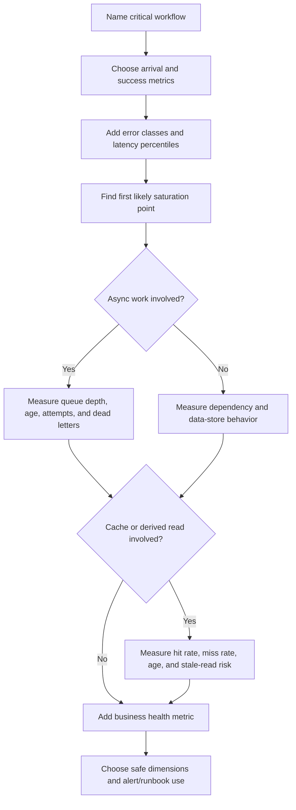

# Metrics

Metrics are aggregated measurements that show how a system behaves over time.
They help designers and operators see user-visible symptoms, capacity pressure,
dependency health, queue backlog, cache effectiveness, and business workflow
health before every investigation becomes a log search.

Good metrics answer operational questions:

- How much work is arriving?
- How much work is succeeding, failing, delayed, or rejected?
- How long does the work take for users and callers?
- Which resource is saturated?
- Is background work falling behind?
- Is a cache helping without hiding stale behavior?
- Does the technical health match the user or business outcome?

Metrics should be chosen from workflows and failure modes. A system with many
component charts can still be hard to operate if it cannot answer whether the
critical workflow is healthy.

## Purpose

Use this page to decide which metrics a design needs by component and system
behavior.

The goal is to choose metrics that:

- show user-visible symptoms such as failed requests, high latency, stale data,
  or stuck work;
- reveal likely causes such as saturation, dependency errors, retry loops, queue
  backlog, or cache problems;
- support alerting, dashboards, SLOs, capacity planning, and cost review;
- avoid leaking sensitive data through labels or high-cardinality dimensions;
- connect technical behavior to business workflow outcomes.

Metrics do not replace logs, traces, audit events, or runbooks. They give the
broad view that tells operators where to look next.

## When This Matters

Metrics matter when:

- a workflow has a success rate, latency target, freshness expectation, or
  reliability promise;
- traffic can spike, grow, or shift across tenants, routes, regions, or
  dependencies;
- a component can saturate CPU, memory, threads, database connections, file
  descriptors, queue workers, provider quota, or storage;
- background work can pile up while user requests still appear successful;
- caches, replicas, derived views, or search indexes can make reads fast but
  stale;
- business stakeholders care about completed bookings, failed payments,
  delayed reminders, fulfilled exports, or other workflow outcomes;
- operations needs trend data to decide whether to optimize, scale, simplify, or
  accept the current design.

For a small version 1, use a compact set of workflow and component metrics. Add
more dimensions when repeated incidents or growth make the extra detail worth
the cost.

## Questions To Ask

Start from the workflow:

- What user-visible action or background process matters most?
- What rate shows how much work is arriving?
- What error metric separates user mistakes, validation failures, dependency
  failures, rejected work, and unexpected system errors?
- What latency percentile shows the experience users notice?
- Which resource saturates first as traffic grows?
- Which queue, outbox, stream, worker, or scheduled job can fall behind?
- Which cache metric shows both usefulness and stale-read risk?
- Which business metric would look wrong if the technical metrics looked fine?
- Which dimensions are safe and useful for debugging: route, result class,
  tenant tier, region, dependency, job type, cache name, or error class?
- Which labels would create privacy risk or uncontrolled cardinality?

## Metric Selection Flow

The flow keeps metrics tied to a reason. If a metric does not support a symptom,
cause, capacity, freshness, cost, or business question, it may not belong in the
first dashboard.

## Decision Guidance

### Request Rate

Request rate measures how much work reaches a system. It is the baseline for
capacity, cost, error-rate interpretation, and traffic-shape decisions.

Useful request-rate metrics:

- total requests per route, command, endpoint group, or workflow;
- accepted, rejected, throttled, and rate-limited requests;
- read versus write requests when they scale differently;
- requests by tenant tier, region, client type, or dependency path when safe;
- background job creation rate and provider call rate.

Interpret request rate with context. Ten errors during ten requests is an
incident. Ten errors during one million requests may be a low-rate defect unless
the affected workflow is critical or the failures cluster around one tenant.

### Errors

Error metrics should separate failure classes instead of counting every
non-success together.

Useful error classes:

- validation or user-input errors;
- authentication and authorization failures;
- conflict or duplicate-request outcomes;
- rate-limit or quota rejections;
- dependency timeout, unavailable, rate-limited, or ambiguous responses;
- database constraint, timeout, or connection errors;
- retry exhausted, dead-lettered, or manually quarantined work;
- unexpected internal errors.

Do not use only a raw `errors_total` metric. A design review should ask which
errors are expected user behavior, which require user correction, which suggest
abuse, which show dependency failure, and which indicate a system defect.

### Latency

Latency metrics show how long work takes from the caller's point of view and
inside key internal steps. Percentiles are usually more useful than averages
because users notice slow tails.

Useful latency metrics:

- end-to-end request latency for critical routes;
- p50, p95, and p99 latency when traffic volume justifies tail analysis;
- database query duration by query family or operation class;
- cache lookup duration and fallback read duration;
- dependency call duration;
- queue wait time and processing time for background work;
- export, import, reconciliation, or batch duration.

Do not optimize latency before naming the user expectation. A staff dashboard
may tolerate a slower report than a checkout confirmation. A background reminder
may tolerate minutes of delay if the user-visible state is honest.

### Saturation

Saturation measures how close a resource is to its useful limit. It explains
why latency and errors may rise as load increases.

Useful saturation metrics:

- CPU, memory, disk, network, and file descriptor pressure;
- request concurrency, worker pool utilization, and thread pool exhaustion;
- database connections, lock waits, transaction duration, and replication lag;
- queue consumer utilization and worker concurrency;
- cache memory, eviction rate, and hot-key pressure;
- provider quota consumption and rate-limit headroom;
- storage size, index size, backup size, and log ingest volume.

Saturation metrics are usually cause signals. They help responders explain the
symptom, but alerts should still be tied to user impact, data risk, or an
actionable capacity threshold.

### Queue Depth And Age

Queue depth counts how much work is waiting. Queue age shows how old the oldest
or typical waiting item is. Age is often the stronger user signal because a
small queue of stuck high-value jobs can be worse than a large queue draining
normally.

Useful queue metrics:

- enqueue rate and dequeue rate;
- current depth by queue, priority, tenant tier, or job type;
- oldest item age and age percentiles;
- processing duration;
- retry count and retry age;
- dead-letter or quarantine count;
- worker heartbeat, concurrency, and saturation;
- lag for streams, outboxes, and consumers.

Use queue metrics to decide whether to scale workers, shed low-priority work,
pause producers, inspect poison messages, or communicate delay. Do not treat a
successful enqueue as workflow success when users depend on the later work.

### Cache Hit Rate

Cache hit rate measures how often reads are served from cache instead of a
slower source. It is useful only when paired with correctness and load signals.

Useful cache metrics:

- hit rate and miss rate by cache name or read path;
- lookup latency and fallback latency;
- eviction count and memory saturation;
- key age or freshness where stale data matters;
- invalidation failures or refresh failures;
- source-of-truth load after cache misses;
- stale-read conflict or booking conflict count for advisory caches.

A high cache hit rate is not always good. It may hide stale data, over-cache
rare reads, or preserve outdated authorization or inventory state. A low hit
rate is not always bad if the cache protects only a small but expensive path.

### Business Metrics

Business metrics connect system behavior to the outcome the system exists to
produce. They prevent a design from looking healthy while the workflow is
failing in product terms.

Useful business metrics:

- successful reservations, failed approvals, fulfilled orders, completed
  uploads, or delivered reminders;
- conversion through a multi-step workflow;
- abandoned forms, expired holds, or stuck pending resources;
- duplicate submissions, conflict outcomes, or compensation events;
- provider success by payment, notification, search, or export workflow;
- manual review backlog and operator throughput;
- tenant, branch, or region health when the product serves distinct groups.

Business metrics are not a replacement for product analytics. In operations,
they should be small, safe, and tied to system health. A sharp drop in completed
reservations can be a better incident signal than a host-level warning.

### Choose Safe Dimensions

Dimensions make metrics useful for filtering and grouping, but they can also
create cost, privacy risk, and dashboards that cannot load.

Good dimensions are bounded and operationally meaningful:

- route template rather than full URL;
- result class rather than raw error message;
- dependency name rather than full provider payload;
- tenant tier or region rather than arbitrary user attributes;
- job type rather than job ID;
- cache name rather than full cache key.

Avoid unbounded labels such as email address, user ID, session ID, request ID,
full URL, raw error text, search query, object name, or stack trace. Use logs
and traces for single-request debugging; use metrics for aggregate behavior.

## Metric Categories By Component

| Component Or Behavior | Metrics To Consider | Design Question |
| --- | --- | --- |
| API or service route | Request rate, success rate, error class, latency percentiles, concurrency | Are users able to complete the request path? |
| Database | Query latency, connection use, lock waits, transaction duration, rows scanned, replication lag | Is the source of truth becoming the bottleneck? |
| Cache | Hit rate, miss rate, lookup latency, eviction count, key age, stale-read conflicts | Is the cache reducing load without hiding incorrect data? |
| Queue or stream | Depth, oldest age, lag, enqueue/dequeue rate, retries, dead letters | Is async work keeping up with freshness expectations? |
| Worker | Active workers, processing duration, success/failure count, retry count, heartbeat | Is background processing healthy and repairable? |
| External dependency | Call rate, timeout rate, error class, latency, quota use, retry exhaustion | Is outside behavior affecting user outcomes? |
| Storage and backups | Object count, bytes stored, growth rate, backup age, restore-test age | Is durability and cost behaving as expected? |
| Business workflow | Completed actions, stuck states, conflict count, manual review backlog, delayed work | Does technical health match the real outcome? |

This table is a starting point, not a requirement to instrument everything.
Prefer the metrics that explain the workflow's highest-risk failure modes.

## Trade-Offs

| Decision | Benefit | Cost Or Risk |
| --- | --- | --- |
| More dimensions | Easier segmentation by route, region, tenant tier, or dependency | Higher cardinality, cost, and privacy review burden |
| More percentiles | Better tail-latency visibility | Needs enough traffic to interpret correctly |
| Fine-grained component metrics | Easier cause analysis | More dashboards and alerts to maintain |
| Business health metrics | Connects system health to user outcome | Can drift into product analytics if not scoped |
| Longer metric retention | Better trend and capacity planning | Higher storage cost |
| Fewer metrics in version 1 | Lower cost and simpler dashboards | May leave blind spots during incidents |

Metrics are valuable when someone uses them to decide. A metric with no
dashboard, alert, SLO, runbook, capacity question, or cost review is usually a
candidate for deletion or lower retention.

## Common Mistakes

- Measuring only host CPU and memory while ignoring user-visible workflow
  success.
- Counting total errors without separating validation failures, dependency
  failures, rate limits, conflicts, and internal defects.
- Optimizing average latency while p95 or p99 latency violates the user
  expectation.
- Alerting on saturation without knowing whether users are affected or what
  action a responder should take.
- Watching queue depth but not queue age, retries, or dead letters.
- Treating cache hit rate as success without freshness and source-of-truth
  checks.
- Emitting metrics with unbounded labels such as user ID, request ID, or raw
  URL.
- Adding business metrics so broad that they become unaudited analytics instead
  of operational health signals.
- Keeping dashboards that no incident, runbook, SLO, capacity review, or cost
  review uses.

## Example

A neighborhood equipment library has residents reserve tools, staff approve
high-value requests, and workers send pickup reminders.

Metrics for version 1:

| Workflow Or Component | Metric | Why It Matters |
| --- | --- | --- |
| Reservation API | Request rate by route and result class | Shows demand and separates successful reservations from validation errors, conflicts, and system failures |
| Reservation API | p50 and p95 latency for submit and approve actions | Shows whether the user-facing path is still usable during peak hours |
| Approval database write | Transaction duration and conflict count | Shows whether approval correctness is creating lock contention or duplicate attempts |
| Reminder queue | Oldest job age, depth, retry count, and dead-letter count | Shows whether reminders are delayed, stuck, or failing after approval |
| Reminder provider | Timeout rate, rate-limit count, and call latency | Shows whether an external dependency is causing late reminders |
| Availability cache | Hit rate, cache age, and booking conflict count | Shows whether cached availability is useful and whether stale data is harming reservations |
| Business workflow | Approved reservations missing reminders after 10 minutes | Shows a user-impacting outcome that component metrics might miss |
| Cost | Log ingest volume, provider call count, and worker idle time | Shows whether observability and reminder delivery costs are growing unexpectedly |

Interpretation:

- If request rate doubles and latency stays flat, the current API capacity may
  be acceptable.
- If p95 latency rises while database transaction duration and connection use
  rise, the database path is a likely cause.
- If approval succeeds but the oldest reminder job age grows, the user-visible
  symptom is delayed reminders, not failed approvals.
- If cache hit rate is high but booking conflicts rise, the cache may be serving
  stale availability.
- If provider errors are low but business reminders are missing, check enqueue
  and worker metrics before assuming the provider is healthy.

This metric set is intentionally small. It gives enough evidence to notice
impact, find likely causes, and decide whether to scale, fix, roll back, or
write a more specific runbook.

## Checklist

Before accepting a metrics design, confirm:

- Critical workflows have request rate, success rate, error class, and latency
  metrics where relevant.
- Error metrics distinguish user input, authorization, conflict, dependency,
  rate-limit, retry-exhausted, and internal failure classes where relevant.
- Latency metrics use percentiles and match the user or caller expectation.
- Saturation metrics name the likely first bottleneck: CPU, memory,
  concurrency, database connections, locks, worker capacity, provider quota,
  storage, or log volume.
- Queue, stream, outbox, and worker metrics include depth, oldest age, lag,
  attempts, dead letters, and worker health where relevant.
- Cache metrics include hit rate, miss rate, latency, freshness, eviction, and
  source-of-truth impact where relevant.
- Business metrics show whether the critical workflow is producing the intended
  outcome.
- Dimensions are bounded, safe, and useful for operations.
- Sensitive values and unbounded identifiers are excluded from metric labels.
- Metrics are tied to dashboards, alerts, SLOs, runbooks, capacity planning, or
  cost review.
- Version 1 avoids low-value metrics that increase noise without answering a
  concrete operational question.

## Related Pages

- [Operations overview](./)
- [Observability basics](observability-basics.md)
- [Design review checklist](../method/design-review-checklist.md)
- [Scale estimation](../method/scale-estimation.md)
- [Cost analysis](cost-analysis.md)
- [Failure-mode analysis](../reliability/failure-mode-analysis.md)
- [Timeouts](../reliability/timeouts.md)
- [Retries](../reliability/retries.md)
- [Circuit breakers](../reliability/circuit-breakers.md)
- [Database read scaling](../scalability/database-read-scaling.md)
- [Rate limiting](../scalability/rate-limiting.md)
