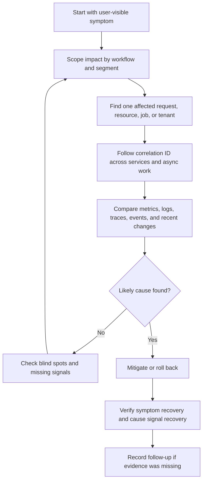

# Observability Basics

Observability is the ability to explain what the system is doing from evidence
the system emits while it runs. In system design, observability is not a tool
choice. It is a design decision about which symptoms, causes, identifiers, and
debugging paths must exist before users depend on the workflow.

Good observability lets a responder answer:

- Is a user-visible workflow healthy?
- Who or what is affected?
- Where did the request, job, event, or state transition spend time?
- Which dependency, data path, deploy, configuration change, or input shape is
  the likely cause?
- What mitigation or rollback should happen now?
- How do we prove the system recovered?

## Purpose

Use this page to decide what observability is for before choosing metrics,
logs, traces, dashboards, alerts, or runbooks.

The goal is to connect system behavior to operational questions:

- symptoms show that users, callers, tenants, jobs, or data are affected;
- causes explain why the symptom is happening;
- debugging flow guides the responder from broad impact to one concrete
  request or resource;
- signals provide the evidence needed for that flow;
- blind-spot review prevents designs that look monitored but are hard to
  repair.

Observability should make the system understandable during stress. It should
not create a permanent record of every private value, every payload, or every
low-value internal detail.

## When This Matters

Observability should be designed explicitly when:

- a workflow has a user-visible success or failure state;
- a request crosses API, database, cache, queue, worker, service, or provider
  boundaries;
- background work can stall, duplicate, retry, or partially complete;
- support or operations must debug one user report, tenant issue, resource, or
  job;
- a deploy, migration, configuration change, or feature flag can affect many
  users quickly;
- external dependencies can time out, rate limit, return ambiguous responses, or
  charge per call;
- security, privacy, auditability, or cost constraints limit what can be logged
  or retained.

For a prototype, the observability plan may be a few fields and one dashboard.
For a production workflow, it should be part of the design review because it
changes API identifiers, state transitions, queue records, logging fields,
retention choices, and runbooks.

## Questions To Ask

Start with the user-visible outcome:

- What does success look like for the workflow?
- What symptom proves users are affected before reading component dashboards?
- Which identifier lets an operator find one affected request, user, tenant,
  resource, job, message, or provider call?
- Which signals distinguish "slow", "failing", "stuck", "duplicating",
  "dropping", and "showing stale data"?
- Which cause categories are plausible: deploy, input, dependency, capacity,
  data change, configuration, abuse, or operator action?
- Which signal proves a mitigation worked?
- Which sensitive values must never appear in logs, traces, metrics labels, or
  screenshots?
- Which signals are useful during an incident, and which are only useful for
  later analysis?

## Symptoms And Causes

A symptom is what the user, caller, operator, or business process experiences.
A cause is the reason the symptom is happening.

Do not start incident thinking from a component that "looks red." Start from
the affected workflow, then use component signals to find the cause.

| Symptom | Possible Causes | Useful Signals |
| --- | --- | --- |
| API requests are timing out | Slow database query, dependency timeout, connection pool exhaustion, overloaded instance, retry storm | Request latency, timeout count, trace spans, database query duration, pool saturation, retry count |
| Background work is late | Worker crash, queue backlog, poison message, provider rate limit, too little worker capacity | Oldest job age, queue depth, worker heartbeat, retry count, dead-letter count, provider response class |
| Users see stale data | Cache invalidation missed, replica lag, delayed event consumer, failed refresh job | Cache age, replica lag, event consumer lag, refresh job status, source-of-truth comparison |
| Some tenants fail while others work | Tenant-specific config, quota, hot partition, permission rule, regional dependency | Tenant-scoped error rate, quota usage, partition load, authorization decision logs, dependency status by region |
| A write appears to succeed but side effects are missing | Outbox publish failed, worker retry exhausted, provider accepted ambiguously, deduplication suppressed a message | Audit event, outbox state, trace ID, job attempts, provider receipt status, idempotency key result |
| Cost or quota spikes | Log volume increase, fanout change, retry loop, abusive client, large export, unbounded cardinality | Cost metric, provider call rate, log ingest volume, request dimensions, export job history, rate-limit decisions |

The same symptom can have several causes. The same cause can create several
symptoms. Design signals so responders can narrow the search quickly without
guessing from memory.

## Debugging Flow

Use a repeatable debugging flow instead of jumping between dashboards.



A useful flow has two levels:

- broad view: what changed for users, tenants, regions, queues, providers, or
  workflows;
- narrow view: what happened to this one request, resource, message, or state
  transition.

If the system can only show broad charts, operators cannot debug one user
report. If it can only show individual logs, operators cannot tell whether the
problem is isolated or growing.

## Signals

Signals are the evidence the system emits. Each signal type answers a different
operational question.

| Signal | Best For | Weak At |
| --- | --- | --- |
| Metrics | Trends, rates, saturation, alerts, SLOs, cost, queue age, dependency health | Explaining one exact request or payload-specific failure |
| Logs | Explaining one event, decision, error, state change, or support lookup | Showing fleet-wide trends without aggregation |
| Traces | Following one request or workflow across services, dependencies, and async boundaries | Long-term business health and high-volume analytics |
| Audit events | Proving who changed important state and when | High-volume debug detail for every low-risk action |
| Synthetic checks | Detecting whether a critical path works from outside the system | Explaining internal cause without other signals |
| Deployment and config events | Connecting symptoms to recent changes | Showing impact unless tied to workflow metrics |

Metrics, logs, and traces should share identifiers where possible. A request ID
helps inside one request. A trace ID follows a distributed path. A job ID,
message ID, resource ID, tenant ID, or idempotency key helps connect async work
and support reports.

## Decision Guidance

### Start From Workflows

Write observability requirements in workflow language:

```text
Workflow: staff approves a loan request
Symptom: approval attempts fail or take too long
Affected object: loan_request_id
Correlation: request_id and trace_id across API, database, outbox, and worker
Cause signals: authorization result, database write latency, outbox state,
worker attempts, provider response class
Recovery proof: approval success rate returns to target and stuck request count
falls
```

This is more useful than "add dashboards" because it says what the system must
explain.

### Separate Symptom Signals From Cause Signals

Symptom signals should reflect user impact:

- valid request success rate;
- latency for important routes;
- queue age relative to freshness expectations;
- number of resources stuck in `pending`, `retrying`, or `needs_review`;
- failed state transitions;
- support-visible error classes;
- budget or quota burn rate.

Cause signals should explain likely reasons:

- dependency timeout and rate-limit counts;
- database connection saturation and slow query categories;
- worker concurrency, retries, and dead-letter counts;
- cache hit rate, cache age, and invalidation failures;
- replica lag or consumer lag;
- deploy, migration, configuration, and feature-flag changes;
- authorization, validation, and abuse decision summaries.

Do not alert only on cause signals while users are fine. Keep cause signals near
the runbook so responders can investigate after a symptom alert fires.

### Design For One Affected Object

A system is much easier to operate when a responder can answer "what happened to
this request?" or "why is this resource stuck?"

For each critical workflow, choose the identifiers that appear in safe logs,
traces, job records, audit events, and support tools:

- request ID for one synchronous request;
- trace ID for cross-service and dependency paths;
- tenant or account ID for segmentation;
- resource ID for user-visible objects;
- job or message ID for background work;
- idempotency key for retried writes;
- provider request or receipt ID for external calls.

Identifiers should be stable enough to join signals and safe enough to expose
to support tooling. Avoid using secrets, raw tokens, private notes, or full
payloads as correlation values.

### Keep Async Work Observable

Queues, outboxes, streams, scheduled jobs, and workers are common observability
blind spots. The user request may finish quickly while important work continues
later.

For async paths, include:

- enqueue count and enqueue failures;
- oldest item age, depth, and consumer lag;
- attempts, retry reason, and next retry time;
- dead-letter or quarantine count;
- idempotency and deduplication result;
- state transition from queued to processing to completed or failed;
- trace or correlation handoff from the request that created the work.

If a background job can affect users, it deserves a user-visible state, an owner,
and a way to inspect stuck work.

### Make Privacy And Cost Part Of The Design

More data is not automatically better. Observability data can expose sensitive
information, increase storage cost, slow systems down, and create noisy
dashboards.

Decide:

- which fields are safe to log;
- which fields must be redacted, hashed, summarized, or omitted;
- how long each signal is retained;
- which high-cardinality labels are allowed;
- which traces or logs are sampled;
- which audit events require stricter retention and access control;
- which dashboards and alerts are tied to runbooks.

The right design keeps enough evidence to repair the system without turning
observability into an uncontrolled data lake.

## Trade-Offs

Observability decisions trade debugging power against cost, privacy, complexity,
and noise.

| Decision | Benefit | Cost Or Risk |
| --- | --- | --- |
| More workflow metrics | Better symptom detection and SLO tracking | More labels, dashboards, and cardinality to manage |
| More structured logs | Easier support lookup and single-event debugging | Higher storage cost and greater privacy review burden |
| More trace coverage | Clearer latency and dependency breakdowns | More instrumentation work and possible sampling decisions |
| More detailed identifiers | Better correlation across async paths | Risk of exposing sensitive or high-cardinality values |
| More alerts | Faster notice for more conditions | Alert fatigue if alerts do not map to action |
| Longer retention | More evidence for slow investigations | More cost and stricter access-control requirements |
| Aggressive sampling | Lower cost and storage volume | Rare failures may be harder to reconstruct |

Choose the smallest signal set that can answer the current workflow's most
important questions. Add detail when the system has measured blind spots, higher
reliability expectations, stricter audit needs, or repeated incidents that the
existing evidence cannot explain.

## Common Mistakes And Blind Spots

- Monitoring hosts while ignoring user-visible workflow success.
- Recording metrics without labels that separate route, tenant class, result
  class, dependency, or job type.
- Using labels with unbounded values such as full user IDs, URLs, or error
  messages where they create high cardinality and cost.
- Logging errors without request ID, resource ID, tenant ID, job ID, or safe
  reason code.
- Losing correlation when a request publishes a message or starts a background
  job.
- Treating retries as success while hiding repeated dependency failures.
- Counting queue depth but not oldest item age.
- Alerting on every component warning instead of actionable user impact.
- Sampling traces so aggressively that rare but important failures disappear.
- Forgetting deploys, migrations, feature flags, and configuration changes as
  cause signals.
- Storing secrets, tokens, raw payloads, or unnecessary personal data in logs or
  traces.
- Keeping dashboards that no runbook or responder uses.

## Example

A neighborhood equipment library lets residents reserve tools. Staff approval
is synchronous; reminder delivery runs through a background worker.

User-visible symptom:

```text
Residents report that approved reservations do not receive pickup reminders.
```

Observability design:

| Question | Signal |
| --- | --- |
| Is the workflow broadly affected? | Reminder delivery success rate, oldest reminder job age, provider failure count |
| Which requests are affected? | Reservation ID, reminder job ID, tenant branch ID, trace ID from approval request |
| Did approval enqueue the reminder? | Outbox event state and `reminder_enqueued` log with reservation ID |
| Is the worker processing jobs? | Worker heartbeat, processing count, retry count, dead-letter count |
| Is the provider failing? | Provider response class, timeout count, rate-limit count, provider receipt ID |
| Did a recent change cause it? | Deployment marker, feature flag change, provider config update |
| Did recovery work? | Queue age falls, failed jobs stop growing, sample reservations show sent reminders |

Possible causes:

- the approval API wrote the reservation but failed to insert the outbox event;
- the outbox publisher is running but the reminder worker stopped polling;
- reminder jobs are retrying after provider rate limits;
- a deploy changed the provider template ID for one branch;
- a deduplication rule suppressed reminders after duplicate approval attempts.

Version 1 does not need a complex observability platform. It needs enough
evidence to follow one reservation from approval to reminder delivery and enough
aggregate signals to know whether the issue affects one branch or the whole
system.

## Checklist

Before accepting an observability design, confirm:

- User-visible symptoms are named for each critical workflow.
- Likely causes are listed for slow, failing, stuck, duplicate, stale, and
  missing-work cases.
- A debugging flow starts from impact, scopes the problem, follows one affected
  object, identifies likely cause, mitigates, and verifies recovery.
- Metrics cover request rate, errors, latency, saturation, queue age, dependency
  health, and cost where relevant.
- Logs include safe context, result class, reason code, and correlation
  identifiers.
- Traces cover paths where latency or failure crosses service, dependency, or
  async boundaries.
- Audit events exist for privileged or high-impact state changes.
- Async work carries correlation IDs and exposes age, retries, dead-letter
  counts, and stuck states.
- Deployments, migrations, feature flags, and configuration changes are visible
  as possible causes.
- Sensitive values are redacted or omitted from logs, traces, metrics labels,
  and screenshots.
- Signal retention, sampling, and cardinality choices are deliberate.
- Alerts point to a runbook, owner, and user-impacting action.
- Recovery verification checks both the user-visible symptom and the underlying
  cause signal.

## Related Pages

- [Operations overview](./)
- [Design review checklist](../method/design-review-checklist.md)
- [Failure-mode analysis](../reliability/failure-mode-analysis.md)
- [Retries](../reliability/retries.md)
- [Audit logs](../security/audit-logs.md)
- [Third-party integrations](../security/third-party-integrations.md)
- [Workflow orchestration vs choreography](../communication/workflow-orchestration-vs-choreography.md)
- [Glossary](../glossary.md)
