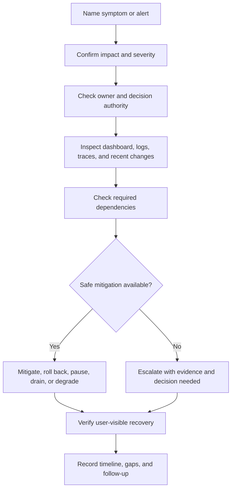

# Runbooks

Runbooks are short operational guides that tell a responder how to confirm,
mitigate, repair, and verify a known class of problem. They turn "someone should
know what to do" into explicit steps, owners, evidence, and decision points.

A good runbook does not try to explain the whole system. It helps a responder
make the next correct move under pressure.

Use [Alerting](alerting.md) to decide when a runbook should be attached to a
page. Use [Dashboards](dashboards.md), [Logs](logs.md), and
[Tracing](tracing.md) to provide the evidence a runbook points to.

## Purpose

Use runbook design to answer:

- What symptom or alert starts this procedure?
- Who owns the first response and who can make risky decisions?
- Which checks confirm user impact, data risk, security risk, or cost risk?
- Which dependency checks separate local failures from provider, database,
  queue, cache, network, or quota problems?
- Which mitigation is safest for the first 10 minutes?
- How can the responder roll back, disable, pause, drain, retry, or degrade the
  workflow?
- What proves recovery?
- What should be recorded for follow-up after the incident?

The goal is repeatable response. A rare manual step can be acceptable in
version 1 if ownership, auditability, rollback, and verification are clear.

## When This Matters

Runbooks matter when:

- an alert pages a human and timely action is expected;
- a workflow can lose data, double-process work, delay users, or violate a
  reliability expectation;
- rollback, feature disablement, provider failover, queue replay, or manual
  repair requires judgment;
- a dependency can fail in ways that look like local application failure;
- responders must coordinate with product, support, security, data, or an
  external provider;
- the same incident pattern has already happened once;
- launch readiness depends on proving the team can operate version 1.

They matter less for low-impact experiments with manual observation. Even then,
write down the trigger that would make a runbook necessary later.

## Questions To Ask

Start from the responder:

- What alert, support report, audit event, or dashboard symptom sends someone
  to this runbook?
- What should the responder check first to avoid making the problem worse?
- What dashboard, log query, trace query, or admin view proves scope?
- Which dependencies are required for the workflow to recover?
- Which actions are safe for any on-call responder, and which require owner
  approval?
- What is the rollback path for code, configuration, data migration, feature
  flag, provider change, or schema change?
- What should happen if rollback is unavailable or unsafe?
- How does the responder verify recovery from the user's point of view?
- What evidence should be saved for the post-incident follow-up?

## Runbook Design Flow



The flow keeps the responder from jumping straight to a favorite fix. Confirm
impact first, then choose the least risky action that reduces user harm.

## Decision Guidance

### Define The Trigger

Every runbook should start with a clear entry point.

Good triggers:

- alert name and severity;
- user-visible symptom;
- support report pattern;
- audit or security event;
- scheduled maintenance task;
- failed verification step;
- dependency, quota, or cost threshold.

Example:

```text
Alert: reminder_queue_age_high
Trigger: oldest accepted pickup reminder is older than 10 minutes for 5 minutes
Impact: residents may miss pickup windows if reminder delivery stays delayed
```

Avoid runbooks titled only "database problem" or "worker issue." The responder
needs to know which workflow is at risk and why action is needed.

### Name Ownership And Authority

Ownership answers who responds. Authority answers who may approve risky action.
They are related but not always the same.

Define:

| Role | Responsibility |
| --- | --- |
| First responder | Acknowledge alert, confirm impact, start checks, and apply safe mitigations |
| Service owner | Decide risky rollback, capacity change, data repair, or feature disablement |
| Escalation contact | Join when mitigation is not active within the expected time |
| Support or product contact | Coordinate user communication when impact is visible |
| Security or data contact | Join when privacy, abuse, audit, or integrity risk is involved |

Write down response times and handoff expectations:

```text
First responder acknowledges within 10 minutes.
Escalate to service owner if no mitigation is active within 20 minutes.
Add support lead when active users are affected for more than 30 minutes.
Add security lead immediately for suspected credential, abuse, or data exposure.
```

Do not rely on one person's memory. If the owner is unavailable, the runbook
should say what happens next.

### Start With Incident Steps

A useful incident runbook has a predictable shape:

1. Confirm the alert or report is real.
2. Classify severity and user-visible impact.
3. Check recent deploys, migrations, configuration changes, and provider
   notices.
4. Inspect dashboards for traffic, errors, latency, saturation, queue age, SLO
   burn, and workflow health.
5. Use logs and traces to inspect representative failures.
6. Check required dependencies.
7. Apply the safest mitigation.
8. Decide whether rollback, feature disablement, degradation, retry, replay, or
   manual repair is needed.
9. Verify recovery from the user's point of view.
10. Record timeline, decisions, evidence, and follow-up work.

The first steps should be safe and fast. Destructive repair, replay, or data
mutation belongs behind explicit approval and verification.

### Include Dependency Checks

Many local symptoms come from dependencies. A runbook should help responders
distinguish local failure from upstream, downstream, and shared-resource
failure.

Common dependency checks:

| Dependency | Checks | Possible Action |
| --- | --- | --- |
| Database | connection saturation, lock waits, query latency, replication lag, disk headroom | reduce traffic, roll back query, pause batch job, add capacity |
| Queue or worker | oldest age, depth, consumer heartbeat, retry rate, dead letters | scale workers, pause producers, quarantine poison job, replay after fix |
| Cache | hit rate, eviction, stale age, source load, invalidation failures | bypass cache, flush narrow key range, reduce TTL, protect source |
| External provider | status page, timeout rate, rate limits, quota, webhook delivery, fallback use | enable fallback, reduce non-critical calls, retry later, notify provider |
| Object storage or CDN | error rate, latency, permissions, signed URL expiry, bandwidth | switch endpoint, invalidate cache, roll back permission change |
| Search or derived view | indexing lag, update failures, query latency, stale result age | pause feature, rebuild index, route to source-of-truth read |
| Auth or secrets | token expiry, key rotation, permission change, clock drift | roll back secret change, rotate key, restore previous policy |

Dependency checks should include the dashboard or query name, not only the idea.
If exact tool links do not exist yet, leave placeholders in the template so the
owner must fill them before launch.

### Choose Mitigation Before Repair

Mitigation reduces current harm. Repair removes the cause. They are not always
the same.

Common mitigations:

- roll back the last deploy or configuration change;
- disable a risky feature flag;
- pause a producer so a queue stops growing;
- shed low-priority traffic;
- route around a failing dependency;
- serve a degraded but honest response;
- increase worker count or capacity for a known saturation issue;
- stop retries that are amplifying provider failure;
- communicate delay when recovery is slower than user expectations.

Common repairs:

- fix the code path that created bad requests;
- replay safe jobs after idempotency is confirmed;
- reconcile data and mark missing records;
- rebuild an index or derived view;
- rotate a broken secret;
- adjust alert thresholds or dashboard context after learning.

Do not mix mitigation and repair in one vague step. A responder should know
which action is intended to reduce impact now and which action can wait until
the system is stable.

### Define Rollback Paths

Rollback is a design requirement for risky changes. It should be written before
the incident.

Rollback guidance should cover:

- code deploy rollback;
- feature flag or configuration rollback;
- database migration rollback or forward fix;
- schema compatibility with old and new application versions;
- worker, cron, or queue-consumer rollback;
- provider credential, webhook, or endpoint rollback;
- cache, search index, or derived-data rollback;
- manual approval required before destructive or irreversible action.

Example rollback decision:

```text
If reservation submissions fail after a deploy and no migration is involved,
roll back the API release first.

If a schema migration is involved, do not roll back application code until the
service owner confirms the old version can read and write the current schema.
If compatibility is unclear, disable reservation submission and keep reads
available while the owner chooses rollback or forward fix.
```

Rollback should include verification. A rollback that stops errors but leaves
jobs stuck, data inconsistent, or users unable to complete the workflow is only
partial recovery.

### Verify Recovery

Recovery is not "the graph looks lower." Verification should match the original
user-visible promise.

Useful verification steps:

- alert condition has cleared for the required recovery window;
- valid user workflow succeeds through the affected path;
- error rate, latency, queue age, stale data age, or SLO burn returns to an
  acceptable range;
- representative logs show successful completion with expected reason codes;
- traces show dependency calls within expected timeouts;
- delayed jobs drain and no new dead letters appear;
- data reconciliation or audit check confirms no missing or duplicated work;
- support or product confirms affected users can retry or have been notified;
- temporary mitigations, suppressions, or manual overrides are removed or
  tracked.

Verification should include one negative check: what would prove the incident
is not actually over?

### Keep Runbooks Current

Runbooks age quickly when systems change.

Review a runbook when:

- a new alert is added;
- a dependency, queue, data store, provider, or ownership boundary changes;
- a deploy or rollback process changes;
- an incident exposed missing checks or wrong assumptions;
- a dashboard, log query, trace query, or admin tool is renamed;
- a manual repair step becomes common enough to automate.

The owner should treat a stale runbook as operational debt. A wrong runbook can
be worse than no runbook because it gives responders false confidence.

## Runbook Template

Copy this template when creating a workflow or incident runbook:

```markdown
# <Workflow Or Alert Name> Runbook

## Trigger

- Alert or report:
- Severity:
- User-visible symptom:
- SLO or expectation affected:
- When to use this runbook:
- When not to use this runbook:

## Ownership

- First responder:
- Service owner:
- Escalation contact:
- Support or product contact:
- Security or data contact, if applicable:
- Decision authority for rollback or destructive repair:

## First Checks

- Confirm alert/report:
- Current user impact:
- Affected workflow, tenant, region, or dependency:
- Recent deploys, migrations, config changes, or provider notices:
- Dashboard link:
- Log query:
- Trace query:
- Runbook version or last reviewed date:

## Dependency Checks

- Database:
- Queue or worker:
- Cache or derived view:
- External provider:
- Object storage, CDN, or network:
- Auth, secrets, certificates, or permissions:
- Quota, rate limit, or cost limit:

## Mitigation

- Safe first mitigation:
- Feature flag or config disable path:
- Degraded mode:
- Traffic shed or pause path:
- Communication needed:
- Escalate if mitigation is not active by:

## Rollback

- Code rollback command or process:
- Config or feature flag rollback:
- Migration compatibility notes:
- Worker, queue, or cron rollback:
- Provider credential or endpoint rollback:
- Approval required before rollback:
- Conditions where rollback is unsafe:

## Repair

- Data repair or reconciliation:
- Queue replay or retry:
- Cache/index rebuild:
- Provider reconciliation:
- Manual action audit requirements:
- Follow-up ticket criteria:

## Verification

- User-visible success check:
- Metrics recovery window:
- Queue, freshness, or backlog check:
- Log or trace confirmation:
- Data integrity or audit check:
- Support/product confirmation:
- Temporary mitigations removed or tracked:
- What would prove recovery is incomplete:

## Timeline And Notes

- Start time:
- Acknowledged by:
- Mitigation started:
- Recovery verified:
- Decisions made:
- Evidence links:
- Follow-up owners:
```

Keep the template short enough to use during an incident. Put detailed
background, diagrams, and architecture explanation in the design docs; link to
them from the runbook only when they help response.

## Trade-Offs

| Decision | Benefit | Cost Or Risk |
| --- | --- | --- |
| Detailed runbook | More repeatable response | Can become stale and hard to scan |
| Compact runbook | Faster during incidents | May omit rare but important decision points |
| Manual mitigation | Simple version 1 | Depends on ownership and rehearsal |
| Automated mitigation | Faster and consistent | Can amplify mistakes if triggers are wrong |
| Broad dependency checks | Separates local and external causes | Longer first response if not prioritized |
| Narrow dependency checks | Faster for known failures | Can miss shared-resource or provider issues |
| Rollback-first response | Reduces impact quickly | Unsafe if migrations or data changes are incompatible |
| Forward-fix response | Handles irreversible changes | Slower and riskier under pressure |

## Common Mistakes

- Writing a runbook after the incident but never attaching it to an alert.
- Naming an owner without naming escalation and decision authority.
- Starting with repair before confirming user impact.
- Treating dependency checks as "check provider" without saying which signal
  matters.
- Assuming rollback is safe when migrations, queues, or data format changes are
  involved.
- Forgetting verification after mitigation.
- Leaving temporary suppressions, feature disables, or manual overrides in
  place.
- Writing steps that require one person's local knowledge or private tool.
- Mixing audit-sensitive manual actions with ordinary debug notes.
- Letting runbooks drift after dashboards, logs, traces, or ownership change.

## Example

A neighborhood equipment library sends pickup reminders after staff approve a
reservation. Residents can still pick up tools without a reminder, but repeated
delays create support calls and missed pickup windows.

Runbook summary:

| Section | Decision |
| --- | --- |
| Trigger | `reminder_queue_age_high`: oldest accepted reminder is older than 10 minutes for 5 minutes |
| Owner | Reservation on-call responds; service owner approves replay or provider failover |
| First checks | Reservation dashboard, worker queue age, provider timeout rate, recent deploys, and branch-hours traffic |
| Dependency checks | Database connections, queue consumer heartbeat, provider quota, provider webhook status, secret expiry |
| Mitigation | Pause non-critical reminder types, scale worker pool if workers are saturated, or enable fallback provider if quota is exhausted |
| Rollback | Roll back worker deploy if delay started after code change and job payload format is compatible |
| Repair | Replay delayed reminders only after idempotency key check confirms duplicates are suppressed |
| Verification | Oldest reminder age below 5 minutes for 15 minutes, provider success normal, no new dead letters, sample reservation receives reminder |

Responder notes:

- Do not replay all failed reminders until duplicate-send protection is
  confirmed.
- Do not count invalid phone-number failures as provider outage.
- If provider quota is exhausted, reduce lower-priority notifications before
  retrying the critical pickup reminders.
- If reminders remain delayed after mitigation, support should tell branches to
  check the pending pickup list manually.

This runbook is intentionally small. It gives the first responder enough
structure to reduce current harm while keeping risky replay and failover behind
explicit ownership.

## Checklist

Before accepting a runbook, confirm:

- The trigger, symptom, and expected user impact are clear.
- First responder, owner, escalation, and decision authority are named.
- First checks cover dashboards, logs, traces, recent changes, and severity.
- Dependency checks cover the data stores, queues, caches, providers, auth,
  quota, and network paths the workflow needs.
- Mitigation steps are separated from repair steps.
- Rollback paths include code, config, data migration, worker, provider, and
  compatibility risks where relevant.
- Destructive or irreversible actions require explicit approval.
- Verification proves user-visible recovery, not only component quietness.
- Temporary mitigations and suppressions are tracked.
- Evidence, timeline, and follow-up owners are captured.
- The runbook links to the relevant alert, dashboard, logs, traces, and design
  context.
- The owner and review cadence are defined.

## Related Pages

- [Operations overview](./)
- [Alerting](alerting.md)
- [Dashboards](dashboards.md)
- [Metrics](metrics.md)
- [Logs](logs.md)
- [Tracing](tracing.md)
- [SLOs](slos.md)
- [Audit logs](../security/audit-logs.md)
- [Third-party integrations](../security/third-party-integrations.md)
- [Retries](../reliability/retries.md)
- [Graceful degradation](../reliability/graceful-degradation.md)
- [Failure-mode analysis](../reliability/failure-mode-analysis.md)
