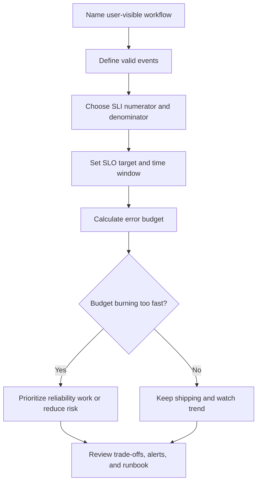

# SLOs

Service level objectives, or SLOs, state how reliable a user-visible behavior
should be over a time window. They help a team decide when reliability is good
enough, when to invest in repair, and when extra complexity is not justified.

An SLO is not a wish that a service is always up. It is a measurable promise
about a workflow that users, operators, or the business care about.

Use [Metrics](metrics.md) to choose measurable signals. Use
[Alerting](alerting.md) to decide when SLO burn or user impact should interrupt
a human.

## Purpose

Use SLO design to answer:

- Which workflow deserves an explicit reliability target?
- Which service level indicator, or SLI, measures that workflow?
- What SLO target is good enough for the product and operating model?
- How much failure is acceptable before reliability work should take priority?
- Which reliability trade-offs are worth the cost, complexity, and slower
  delivery?
- What happens when the team is burning the error budget too quickly?

The goal is to align reliability decisions with user impact instead of arguing
from vague phrases like "highly available" or "production ready."

## When This Matters

SLOs matter when:

- a workflow has enough users, business impact, or support load to justify an
  explicit reliability target;
- teams debate whether to ship features or spend time on reliability work;
- incidents are frequent enough that "best effort" is no longer clear;
- a system has several workflows with different reliability needs;
- alerts need thresholds tied to user expectations;
- a dependency, queue, cache, replica, or background job can degrade the user
  experience without a total outage;
- leadership needs a clear way to discuss risk without pretending all failures
  are equally bad.

They matter less when a prototype is still searching for product value and a
short operational checklist is enough. Even then, naming the future SLO trigger
can keep version 1 honest.

## Questions To Ask

Start with the workflow:

- What user-visible behavior should be reliable?
- What counts as a valid attempt?
- What counts as success, failure, degraded success, or excluded traffic?
- Which measurement best reflects user experience: availability, latency,
  freshness, correctness, durability, or job completion?
- What time window matters: hour, day, week, 28 days, or calendar month?
- What target is valuable enough to pay for?
- What operational action should happen when the error budget burns too fast?
- Which reliability improvement would add cost or complexity that the workflow
  does not justify?

## SLO Design Flow



The flow starts from the workflow because a component SLO can look healthy while
the user journey is broken.

## Decision Guidance

### Choose SLIs First

An SLI is the measurement used to evaluate the objective. A good SLI is close
to user experience, measurable, and hard to game accidentally.

Useful SLI shapes:

| Reliability Concern | SLI Shape | Example |
| --- | --- | --- |
| Availability | successful valid requests / total valid requests | valid reservation submissions that return success |
| Latency | requests under target / total valid requests | search responses under 500 ms |
| Freshness | items updated within target / total expected items | reminders sent within 10 minutes |
| Correctness | correct outcomes / total checked outcomes | bookings without double assignment |
| Durability | recoverable writes / total committed writes | confirmed reservations present after restore check |
| Dependency behavior | successful dependency calls / total required calls | provider callbacks accepted without retry exhaustion |

Define the denominator carefully. Exclude traffic that should not count, such as
invalid user input, intentional rate-limit rejections, health checks, synthetic
tests, or test tenants, only when that exclusion is explicit and defensible.

### Set Workflow SLOs

An SLO is the target for an SLI over a time window.

Examples:

```text
99.5% of valid reservation submissions complete successfully over 28 days.
95% of program search responses return within 500 ms during branch hours.
99% of accepted reminder jobs are sent within 10 minutes over 7 days.
```

Prefer workflow SLOs over component uptime statements:

- "residents can submit reservations" is better than "API is up";
- "reminders leave the queue within 10 minutes" is better than "worker process
  is running";
- "booking conflicts stay below a defined rate" is better than "database is
  healthy."

Different workflows can have different targets. A payment authorization may
need a stricter target than a weekly report export. A reminder may tolerate
delay if the UI shows pending status honestly.

### Use Error Budgets

An error budget is the amount of failure the SLO allows during the time window.
It turns reliability into a trade-off instead of a moral argument.

Simple formula:

```text
error budget = 1 - SLO target
allowed bad events = total valid events * error budget
```

Example:

```text
Valid reservation submissions in 28 days: 100,000
SLO target: 99.5%
Error budget: 0.5%
Allowed bad submissions: 500
```

If 450 bad submissions happen in the first week, the team has not merely seen
"some errors." It has burned most of the reliability budget and should reduce
risk, fix the top causes, or slow risky changes until the trend improves.

### Use Burn Rate To Decide Urgency

Burn rate compares how quickly the system is consuming its error budget.

Use burn rate to separate:

- a small number of isolated failures;
- a slow trend that needs planned reliability work;
- a fast incident that needs paging and mitigation.

Example actions:

| Burn Shape | Meaning | Response |
| --- | --- | --- |
| Low burn | SLO is healthy | Continue feature work and monitor |
| Moderate burn | Reliability risk is growing | Create reliability ticket and inspect top causes |
| Fast burn | Users are actively affected or budget will exhaust soon | Page, mitigate, and pause risky deploys |
| Repeated burn by same cause | Systemic weakness | Prioritize design change or runbook automation |

Burn-rate alerts should still include symptom context. A budget can burn because
of user-visible errors, latency, stale data, or delayed jobs; the responder
needs to know which.

### Make Reliability Trade-Offs Explicit

SLOs help decide how much reliability is worth buying.

Common trade-offs:

| Choice | Reliability Benefit | Cost |
| --- | --- | --- |
| Higher target | Fewer user-visible failures | More redundancy, testing, operational work, and slower changes |
| Lower target | Simpler and cheaper version 1 | More accepted user pain or support load |
| Strict latency SLO | Clear performance expectation | More caching, capacity, and tuning discipline |
| Freshness SLO for async work | Honest background job expectation | More queue monitoring and escalation |
| Per-tenant SLO | Protects smaller affected groups | More dimensions, cost, and routing complexity |
| Component SLO | Helps platform owners manage internals | Can distract from user-visible workflow health |

A stricter SLO should change behavior. If the team claims 99.99% reliability but
does not add redundancy, testing, alerting, rollback, dependency protection, or
operational ownership, the number is only decoration.

### Decide What Happens When The Budget Burns

An SLO is useful only if it changes decisions.

Define budget policy:

- who reviews burn rate;
- which alert fires for fast burn;
- when risky deploys pause;
- which reliability work jumps ahead of feature work;
- how dependency or abuse-related failures are handled;
- when the target should be revised because it is too strict or too loose;
- how exceptions are documented.

Budget policy should be pragmatic. Do not stop all product work for one
low-impact blip. Do not ignore repeated budget burn because every individual
incident felt small.

## Trade-Offs

| Decision | Benefit | Cost |
| --- | --- | --- |
| Workflow SLO | Matches user impact | Harder to measure than component uptime |
| Component SLO | Clear internal ownership | May miss broken user journeys |
| High target | Builds trust for critical workflows | Expensive and operationally demanding |
| Lower target | Keeps version 1 simple | Accepts more visible failure |
| Short window | Detects problems quickly | Noisier for bursty traffic |
| Long window | Smooths normal variance | Can hide fast budget burn |
| Strict budget policy | Forces reliability investment | Can slow feature delivery |
| Flexible budget policy | Keeps pragmatism | Can become meaningless if no one acts |

Choose targets that a team is willing to operate, not targets that only sound
impressive.

## Common Mistakes

- Setting an SLO for a host, process, or database before naming the workflow.
- Calling every user mistake or validation error an SLO failure.
- Excluding inconvenient failures without writing the rule down.
- Using average latency instead of a user-visible percentile or threshold.
- Setting a target that no alert, runbook, staffing model, or architecture can
  support.
- Treating error budget burn as a report instead of a decision input.
- Giving every workflow the same reliability target.
- Ignoring delayed or stale async work because the original request succeeded.
- Raising SLO targets before measuring current behavior.
- Letting business-critical small tenants disappear inside aggregate success
  rates.

## Example

A neighborhood equipment library lets residents reserve tools and receive pickup
reminders.

Workflow SLOs:

| Workflow | SLI | SLO | Why |
| --- | --- | --- | --- |
| Submit reservation | Valid submissions that complete successfully / valid submissions | 99.5% over 28 days | Residents need confidence that booking works |
| Search availability | Searches under 500 ms / valid searches | 95% during branch hours | Slow search is frustrating but not as damaging as failed booking |
| Reminder delivery | Accepted reminders sent within 10 minutes / accepted reminders | 99% over 7 days | Reminders may be delayed briefly, but stale reminders create missed pickups |

Reservation error budget:

```text
Valid submissions in 28 days: 100,000
SLO: 99.5%
Allowed failed valid submissions: 500
```

Operational response:

- if reservation failures burn 25% of the monthly budget in one day, page the
  reservation owner and inspect recent deploys, dependency errors, and database
  conflicts;
- if search latency misses its target during one peak hour but bookings still
  succeed, create a performance follow-up rather than blocking all releases;
- if reminders miss the freshness SLO because provider quota is exhausted,
  reduce non-critical notifications and review provider quota or batching;
- if invalid submissions rise because users enter bad dates, do not count them
  against availability SLO; fix the product validation if support load rises.

Reliability trade-off:

- version 1 keeps one database and one reminder worker pool because current
  error budget burn is low;
- the team adds alerting for fast reservation budget burn because booking is the
  critical workflow;
- the team defers multi-region failover until measured user impact or business
  requirements justify its complexity.

This SLO set does not promise perfection. It states which failures matter most,
how much failure is acceptable, and what the team will do when reliability gets
too close to the line.

## Checklist

Before accepting an SLO design, confirm:

- Each SLO names a user-visible workflow or operator-visible outcome.
- The SLI has a clear numerator, denominator, and time window.
- Valid events, excluded events, degraded results, and failed events are
  defined.
- The target is realistic for the product stage, architecture, and on-call
  model.
- Error budget math is written down.
- Burn-rate actions are defined for slow burn and fast burn.
- Alerts are tied to user impact or fast budget burn.
- Logs, traces, and dashboards can explain representative bad events.
- Async freshness, queue age, stale data, and dependency failures are included
  when they affect the user promise.
- Reliability trade-offs are explicit, including cost, complexity, staffing,
  and feature-delivery impact.
- Small but important segments, tenants, or regions are not hidden by aggregate
  success rates.
- The design says when the SLO should be revised.

## Related Pages

- [Operations overview](./)
- [Metrics](metrics.md)
- [Alerting](alerting.md)
- [Logs](logs.md)
- [Tracing](tracing.md)
- [Observability basics](observability-basics.md)
- [Failure-mode analysis](../reliability/failure-mode-analysis.md)
- [Graceful degradation](../reliability/graceful-degradation.md)
- [Bottleneck analysis](../scalability/bottleneck-analysis.md)
